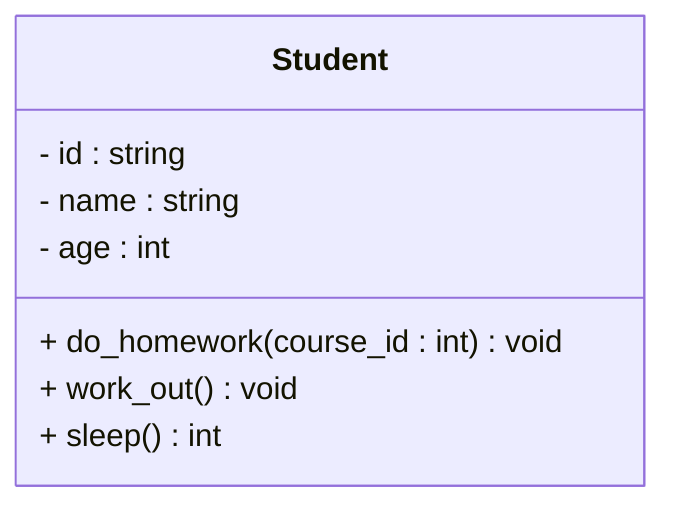
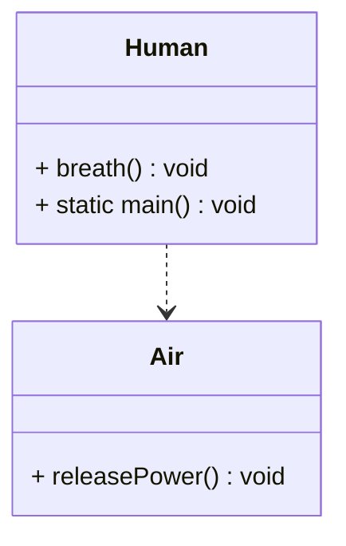
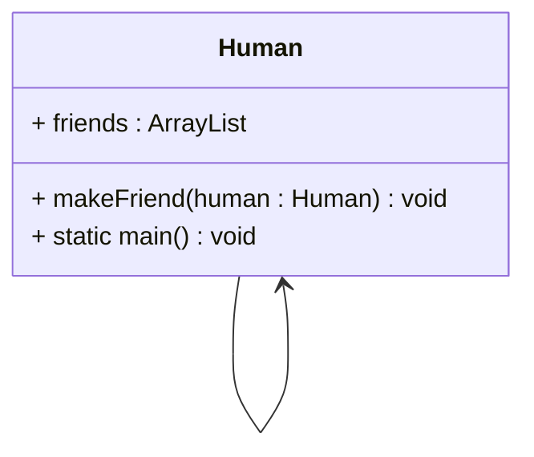
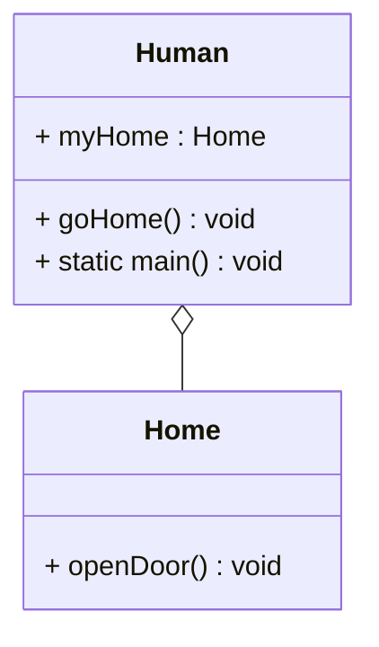
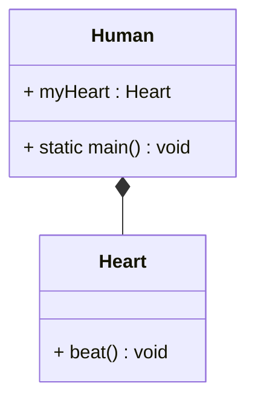
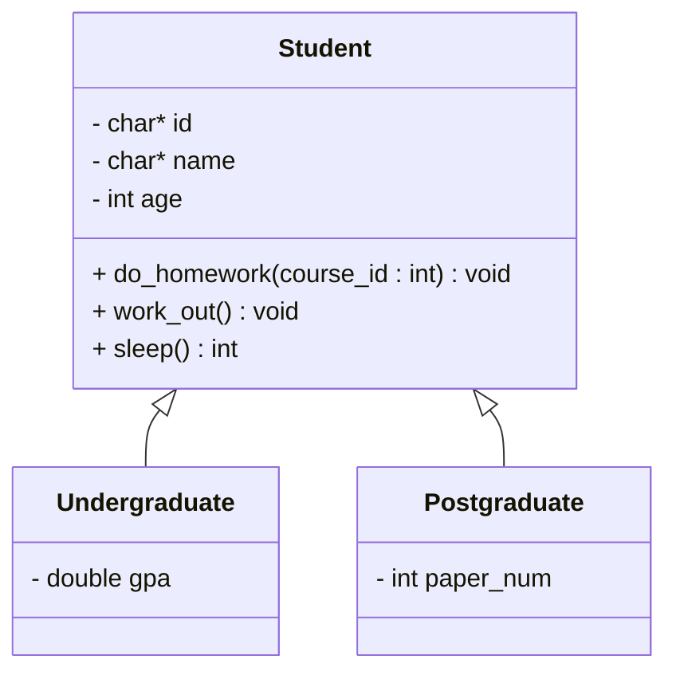
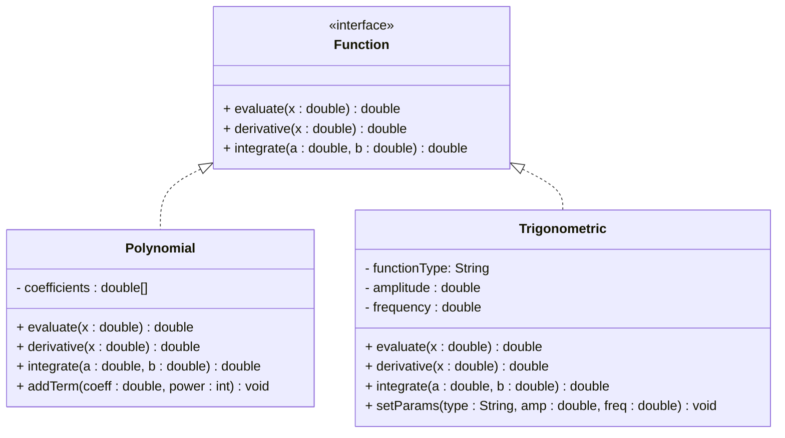

## 2.UML与类图

为后文面向对象编程三大思想、设计模式等内容的阐述不依赖于具体编程语言，这里介绍一个纯软件工程领域的知识：UML，及其一个子分支：类图。

> 本部分主要参考自《软件工程与计算（卷一）软件开发的编程基础》
>
> 本文所有类图使用Mermaid语言绘制，可参考[Class diagrams | Mermaid](https://mermaid.js.org/syntax/classDiagram.html)

### UML

> 统一建模语言（Unified Modeling Language，UML）是一组用于描述和设计软件的图形表示法，通常用于面向对象设计领域。1995年，Grady Booch、Jim Rumbaugh、Ivar Jacobson将当时主要的面向对象建模方法进行了统一，于1996年发布了UML，UML从此成为软件产业的标准建模语言。虽然UML成为了标准的建模语言，但是对于如何使用UML仍然有很大的争议。
>
> 本书建议~~（我也建议）~~将UML当作草稿使用，这也是最常见的一种用法。这种用法中，我们用UML来帮助交流和讨论设计意图。程序员粗略画出软件中的某个部分，用来和团队成员共同讨论。在这种用法中，我们不用画出软件中的所有部分，而只是画出重要的部分，可以忽略掉程序设计中的细节部分。因为将UML视为草稿，UML图可以用非正式的表示方法，我们可以使用白板或白纸快速地绘制UML图，而不一定需要遵循严格的UML文档规范。画图的目的是为了交流和沟通，而不是为了完整性。
>
> UML中包含了众多的图来表示面向对象的分析与设计。其中常见的9种图有：
>
> - 用例图：描述系统的功能
> - 类图：描述系统的静态结构（类及其相互关系）
> - 对象图：描述系统在某个时刻的静态结构（对象及其相互关系）
> - 顺序图：按时间顺序描述系统元素间的交互
> - 协作图：按照时间和空间的顺序描述系统元素间的交互和它们之间的关系
> - 状态图：描述系统元素的状态条件和响应
> - 活动图：描述系统元素的活动
> - 构件图：描述系统元素的组织
> - 部署图：描述环境元素的配置并把实现系统的元素映射到配置上
>

### 类图

我们重点介绍类图（涉及到的软件系统无需设计用例，规模也无需使用后续UML）。

> 类图表示不同的实体（人、事物和数据）如何彼此相关；换句话说，它显示了**系统的静态结构**。

#### 类内结构

> 类图可以表示类职责的设计。在UML中，类用长方形表示，长方形分成上、中、下三个区域，每个区域用不同的名字标识，用以代表类的各个特征。上方的区域内标识类的名字，中间的区域内标识类的属性，下方的区域内标识类的操作，这三部分作为一个整体描述某个类。
>
> 类图中的特性（property）表示类的结构特征，可以类似理解为程序设计语言的类中的成员变量。
>
> 属性表示法用类图矩形中的一行文字来表示类的一个属性，其语法如下
>
> 可见性名称：类型多重性 = 默认值 { 属性字符串 }
>
> `visibility name: type multiplicity=default {property-string}`
>
> 举例如下：
>
> `-name: string [1] = "Untitled" {readonly}`
>
> 在整个表示法中，“名称”是必需的，其他内容可以根据使用情况省略。
>
> 1. 可见性(visibility)可以使用 public(+)、private(-)、protected (#)。
> 2. 名称通常为类定义中的属性名称。
> 3. 类型限制在属性中放入的数据类型，通常为类定义中的属性类型。
> 4. 多重性表示可能会有多少个对象存在。
> 	- 1：必须是1（一次续借的发起者只能是一个用户）。
> 	- 0..1：0或1（某本图书当前可能有借阅者，也可能没有）。
> 	- *：任意值（某本书可能没有在馆图书，也可能有很多，没有上限）。
> 5. 默认值表明的系统创建对象时，如果没有特别指明，我们就将此值指定给该属性。
> 6. { 属性字符串 }允许使用者指明一些额外属性，例子中指明用户不能修改该属性值。
>
> 类图中的操作（operation）指类可以完成的动作，通常相当于类定义当中的方法。通常开发者在类图中忽略getter、setter等方法（构造函数、析构函数一般也省略）。
>
> 在UML中，其表示语法为：
>
> 可见性名称（参数列表）：返回值类型 { 属性字符串 }
>
> `visibility name {parameter-list}: return-type {property-string}`
>
> - 可见性可以是public（+）、private（-）、protected（#）。
> - 名称是一个字符串。
> - 参数列表是方法的参数列表。
> - 返回值类型是方法返回值的类型。
> - 属性字符串代表可以使用的一些性质（比如可以使用{query}表示仅读取值，不会修改）。

以第1节的Student类为例，我们给他添加一些具体的动作`do_homework`、`work_out`、`sleep`

```c++
class Student {
public:
    // deleted default constructor
    Student() = delete;
    
    // parameterized constructor
    Student(const string _id, const string _name, int _age) {...}
    
    // copy constructor
    Student(const Student& _student) {...}
    
    // destructor
    ~Student() {...}
    
    // do something
    void do_homework(const int course_id) {...} // 写course_id课的作业
    void work_out() {...} // 锻炼
    int sleep() {...} // 睡觉，返回睡觉小时数
    
    // getter
    string get_id() {...}
    
    string get_name() {...}
    
    int get_age() {...}
    
    // setter
    void set_id(const string _id) {...}
    
    void set_name(const string _name) {...}
    
    void set_age(int _age) {...}
    
private:
    string id;
    string name;
    int age;
};
```

它的类图为



> 类图的画法大体一致但可能存在细微的差异。例如，使用PlantUML语言生成的Student类图如下所示
>
> ```mermaid
> classDiagram
>    class Student{
>        - string id
>        - string name
>        - int age
>        + do_homework(course_id)
>        + work_out()
>        + sleep()
>    }
> ```
>
> 后文均采用《软件工程与计算（卷一）软件开发的编程基础》中的画法，即第一种。

#### 类间关系

> 几乎没有类可以单独存在，大部分类都以某种方式相互协作，理解类与类之间的关系至关重要。

##### 依赖（dependency）关系

> 一种使用关系，表现为一样事物的改变会影响到使用它的其他事物。在编程实践中，依赖关系经常表现为局部变量、方法参数或者对静态方法的调用等。
>
> 依赖就是某个对象的功能依赖于另外的某个对象，而被依赖的对象只是作为⼀种工具在使用，而并不持有对它的引用，即“A uses a B“。

> 在UML中使用带小箭头的虚线。

例如人类Human和空气类Air，人的呼吸需要空气，但是呼吸过程并不需要人“拥有”空气。

```java
class Human {
	public void breath() {
		Air freshAir = new Air();
		freshAir.releasePower();
	}
	public static void main() {
		Human me = new Human();
    	while (true) {
			me.breath();
        }
	}
}

class Air {
	public void releasePower() {
		// do something
	}
}
```

上述Human与Air的类图如下



##### 关联（association）关系

>关联就是某个对象会长期的持有另⼀个对象的引用，而二者的关联往往也是相互的，即" ... has a ..."
>
>关联的两个对象彼此间没有任何强制性的约束，只要⼆者同意，可以随时解除关系或是进行关联，它们在生命期问题上没有任何约定。被关联的对象还可以再被别的对象关联，所以关联是可以共享的。

> 在UML中使用带小箭头的实线。

```java
class Human {
	ArrayList<Human> friends = new ArrayList<>();
	public void makeFriend(Human human) {
		friends.add(human);
    }
	public static void main() {
		Human me = new Human();
		while (true) {
			me.makeFriend(mySchool.getstudent());
    	}
    }
}
```

上述Human的类图如下



##### 聚合（aggregation）关系

>聚合是强版本的关联。它暗含着⼀种所属关系以及生命期关系，即"... owns a ..."。
>
>被聚合的对象还可以再被别的对象关联，所以被聚合对象是可以共享的。虽然是共享的，聚合代表的是⼀种更亲密的关系。

> 在UML中使用带空心菱形的实线。

```java
class Human {
    Home myHome;
	public void goHome() {
    	// 在回家的路上
		myHome.openDoor()
		// 看电视
    }
    
	public static void main() {
        Human me = new Human();
        while (true) {
			// 上学
			// 吃饭
			me.goHome();
		}
    }
}
```

上述Human与Home的类图如下



##### 组合（composition）关系

> 组合是关系当中的最强版本，它直接要求包含对象对被包含对象的拥有以及包含对象与被包含对象生命期的关系。
>
> 被包含的对象还可以再被别的对象关联，所以被包含对象是可以共享的，然而绝不存在两个包含对象对同⼀个被包含对象的共享。

> 在UML中使用带实心菱形的实线。

```java
class Human {
    Heart myHeart = new Heart();
    public static void main() {
        Human me = new Human();
        while (true) {
            myHeart.beat();
        }
    }
}
```

上述Human与Heart的类图如下



##### 泛化（generalization）关系

> 某些类之间存在一般元素和特殊元素间的关系，特殊元素是一般元素的一个子类型，描述了一种“is-a-kind-of”的关系。泛化关系在编程中一般体现为继承关系，子类继承父类的所有特性。子类会将父类所有的接口和实现都继承回来。但是，也可以覆盖父类的实现。

> 在UML中使用带大箭头的实线。

例如，在Ch1中的案例

```c++
class Student {
public:
    // deleted default constructor
    Student() = delete;
    
    // parameterized constructor
    Student(const char* _id, const char* _name, int _age) {
        set_id(_id);
        set_name(_name);
        set_age(_age);
    }
    
    // copy constructor
    Student(const Student& _student) {
        set_id(_student.get_id());
        set_name(_student.get_name());
        set_age(_student.get_age());
    }
    
    // destructor
    ~Student() {...}
    
    // do something
    void do_homework(const int course_id) {...} // 写course_id课的作业
    void work_out() {...} // 锻炼
    int sleep() {...} // 睡觉，返回睡觉小时数
    
    // getter
    char* get_id() {...}
    
    char* get_name() {...}
    
    int get_age() {...}
    
    // setter
    void set_id(const char* _id) {...}
    
    void set_name(const char* _name) {...}
    
    void set_age(int _age) {...}
    
private:
    char* id;
    char* name;
    int age;
};

class Undergraduate : public Student {
public:
    // deleted default constructor
    // Undergraduate() = delete;
    
    // parameterized constructor
    Undergraduate(const char* _id, const char* _name, int _age, double _gpa): Student(_id, _name, _age), gpa(_gpa) {}
    
    // copy constructor
    Undergraduate(const Undergraduate& _undergraduate): Student(_undergraduate), gpa(_undergraduate.gpa) {}
    
    // destructor
    // ~Undergraduate() {...}
    
    // getter
    double get_gpa() {...}
    
    // setter
    void set_gpa(double _gpa) {...}
    
private:
    double gpa;
};

class Postgraduate : public Student {
public:
    // deleted default constructor
    // Postgraduate() = delete;
    
    // parameterized constructor
    Postgraduate(const char* _id, const char* _name, int _age, int _paper_num): Student(_id, _name, _age), paper_num(_paper_num) {}
    
    // copy constructor
    Postgraduate(const Postgraduate& _postgraduate): Student(_postgraduate), paper_num(_postgraduate.paper_num) {}
    
    // destructor
    // ~Postgraduate() {...}
    
    // getter
    int get_paper_num() {...}
    
    // setter
    void set_paper_num(int _paper_num) {...}
    
private:
    int paper_num;
};
```

上述代码的类图如下



##### 实现（realization）关系

> 类实现接口，必须实现接口中的所有方法。
>
> 接口可以看作是完全抽象的类。在接口的声明中，不允许提供任何成员方法的具体实现。

>在UML中使用带大箭头的虚线。

例如，多项式函数Polynomial和三角函数Trigonometric实现接口Function

```java
interface Function {
    double evaluate(double x);      // 计算函数值
    double derivative(double x);    // 计算导数
    double integrate(double a, double b);  // 计算定积分
}

// 多项式函数
class Polynomial implements Function {
    private double[] coefficients;  // 多项式系数数组
    
    public Polynomial(double[] coeff) {
        this.coefficients = coeff.clone();
    }
    
    @Override
    public double evaluate(double x) {
        double result = 0;
        for (int i = 0; i < coefficients.length; i++) {
            result += coefficients[i] * Math.pow(x, i);
        }
        return result;
    }
    
    @Override
    public double derivative(double x) {
        double result = 0;
        for (int i = 1; i < coefficients.length; i++) {
            result += i * coefficients[i] * Math.pow(x, i-1);
        }
        return result;
    }
    
    @Override
    public double integrate(double a, double b) {
        double resultA = 0, resultB = 0;
        for (int i = 0; i < coefficients.length; i++) {
            double termA = coefficients[i] * Math.pow(a, i+1) / (i+1);
            double termB = coefficients[i] * Math.pow(b, i+1) / (i+1);
            resultA += termA;
            resultB += termB;
        }
        return resultB - resultA;
    }
    
    public void addTerm(double coeff, int power) {
        if (power >= coefficients.length) {
            double[] newCoeff = new double[power + 1];
            System.arraycopy(coefficients, 0, newCoeff, 0, coefficients.length);
            coefficients = newCoeff;
        }
        coefficients[power] = coeff;
    }
}

// 三角函数
class Trigonometric implements Function {
    private String functionType;  // "sin", "cos", "tan"
    private double amplitude;
    private double frequency;
    
    public Trigonometric(String type, double amp, double freq) {
        functionType = type;
        amplitude = amp;
        frequency = freq;
    }
    
    @Override
    public double evaluate(double x) {
        switch (functionType) {
            case "sin":
                return amplitude * Math.sin(frequency * x);
            case "cos":
                return amplitude * Math.cos(frequency * x);
            case "tan":
                return amplitude * Math.tan(frequency * x);
            default:
                return 0;
        }
    }
    
    @Override
    public double derivative(double x) {
        switch (functionType) {
            case "sin":
                return amplitude * frequency * Math.cos(frequency * x);
            case "cos":
                return -amplitude * frequency * Math.sin(frequency * x);
            case "tan":
                return amplitude * frequency / Math.pow(Math.cos(frequency * x), 2);
            default:
                return 0;
        }
    }
    
    @Override
    public double integrate(double a, double b) {
        switch (functionType) {
            case "sin":
                return amplitude * (Math.cos(frequency * a) - Math.cos(frequency * b)) / frequency;
            case "cos":
                return amplitude * (Math.sin(frequency * b) - Math.sin(frequency * a)) / frequency;
            case "tan":
                return amplitude * (Math.log(Math.abs(Math.cos(frequency * a))) - 
                                   Math.log(Math.abs(Math.cos(frequency * b)))) / frequency;
            default:
                return 0;
        }
    }
    
    public void setParams(String type, double amp, double freq) {
        functionType = type;
        amplitude = amp;
        frequency = freq;
    }
}
```

上述代码的类图如下



