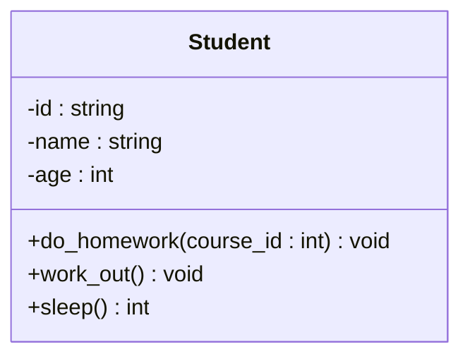
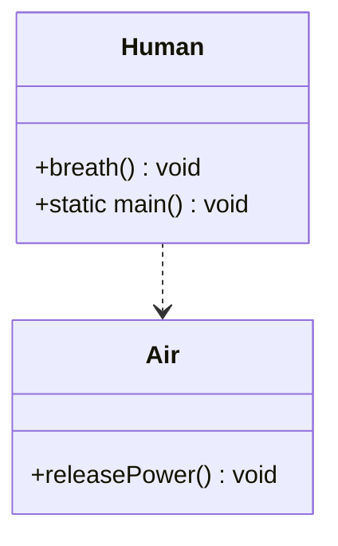

## 2.UML与类图

为后文面向对象编程三大思想、设计模式等内容的阐述不依赖于具体编程语言，这里介绍一个纯软件工程领域的知识：UML，及其一个子分支：类图。

> 本部分主要参考自《软件工程与计算（卷一）软件开发的编程基础》

### UML

> 统一建模语言（Unified Modeling Language，UML）是一组用于描述和设计软件的图形表示法，通常用于面向对象设计领域。1995年，Grady Booch、Jim Rumbaugh、Ivar Jacobson将当时主要的面向对象建模方法进行了统一，于1996年发布了UML，UML从此成为软件产业的标准建模语言。虽然UML成为了标准的建模语言，但是对于如何使用UML仍然有很大的争议。
>
> 本书建议~~（我也建议）~~将UML当作草稿使用，这也是最常见的一种用法。这种用法中，我们用UML来帮助交流和讨论设计意图。程序员粗略画出软件中的某个部分，用来和团队成员共同讨论。在这种用法中，我们不用画出软件中的所有部分，而只是画出重要的部分，可以忽略掉程序设计中的细节部分。因为将UML视为草稿，UML图可以用非正式的表示方法，我们可以使用白板或白纸快速地绘制UML图，而不一定需要遵循严格的UML文档规范。画图的目的是为了交流和沟通，而不是为了完整性。
>
> UML中包含了众多的图来表示面向对象的分析与设计。其中常见的9种图有：
>
> - 用例图：描述系统的功能
> - 类图：描述系统的静态结构（类及其相互关系）
> - 对象图：描述系统在某个时刻的静态结构（对象及其相互关系）
> - 顺序图：按时间顺序描述系统元素间的交互
> - 协作图：按照时间和空间的顺序描述系统元素间的交互和它们之间的关系
> - 状态图：描述系统元素的状态条件和响应
> - 活动图：描述系统元素的活动
> - 构件图：描述系统元素的组织
> - 部署图：描述环境元素的配置并把实现系统的元素映射到配置上
>

### 类图

我们重点介绍类图（涉及到的软件系统无需设计用例，规模也无需使用后续UML）。

> 类图表示不同的实体（人、事物和数据）如何彼此相关；换句话说，它显示了**系统的静态结构**。

#### 类内结构

> 类图可以表示类职责的设计。在UML中，类用长方形表示，长方形分成上、中、下三个区域，每个区域用不同的名字标识，用以代表类的各个特征。上方的区域内标识类的名字，中间的区域内标识类的属性，下方的区域内标识类的操作，这三部分作为一个整体描述某个类。
>
> 类图中的特性（property）表示类的结构特征，可以类似理解为程序设计语言的类中的成员变量。
>
> 属性表示法用类图矩形中的一行文字来表示类的一个属性，其语法如下
>
> 可见性名称：类型多重性 = 默认值 { 属性字符串 }
>
> `visibility name: type multiplicity=default {property-string}`
>
> 举例如下：
>
> `-name: string [1] = "Untitled" {readonly}`
>
> 在整个表示法中，“名称”是必需的，其他内容可以根据使用情况省略。
>
> 1. 可见性(visibility)可以使用 public(+)、private(-)、protected (#)。
> 2. 名称通常为类定义中的属性名称。
> 3. 类型限制在属性中放入的数据类型，通常为类定义中的属性类型。
> 4. 多重性表示可能会有多少个对象存在。
> 	- 1：必须是1（一次续借的发起者只能是一个用户）。
> 	- 0..1：0或1（某本图书当前可能有借阅者，也可能没有）。
> 	- *：任意值（某本书可能没有在馆图书，也可能有很多，没有上限）。
> 5. 默认值表明的系统创建对象时，如果没有特别指明，我们就将此值指定给该属性。
> 6. { 属性字符串 }允许使用者指明一些额外属性，例子中指明用户不能修改该属性值。
>
> 类图中的操作（operation）指类可以完成的动作，通常相当于类定义当中的方法。通常开发者在类图中忽略getter、setter等方法（构造函数、析构函数一般也省略）。
>
> 在UML中，其表示语法为：
>
> 可见性名称（参数列表）：返回值类型 { 属性字符串 }
>
> `visibility name {parameter-list}: return-type {property-string}`
>
> - 可见性可以是public（+）、private（-）、protected（#）。
> - 名称是一个字符串。
> - 参数列表是方法的参数列表。
> - 返回值类型是方法返回值的类型。
> - 属性字符串代表可以使用的一些性质（比如可以使用{query}表示仅读取值，不会修改）。

以第1节的Student类为例，我们给他添加一些具体的动作`do_homework`、`work_out`、`sleep`

```c++
class Student {
public:
    // deleted default constructor
    Student() = delete;
    
    // parameterized constructor
    Student(const string _id, const string _name, int _age) {...}
    
    // copy constructor
    Student(const Student& _student) {...}
    
    // destructor
    ~Student() {...}
    
    // do something
    void do_homework(const int course_id) {...} // 写course_id课的作业
    void work_out() {...} // 锻炼
    int sleep() {...} // 睡觉，返回睡觉小时数
    
    // getter
    string get_id() {...}
    
    string get_name() {...}
    
    int get_age() {...}
    
    // setter
    void set_id(const string _id) {...}
    
    void set_name(const string _name) {...}
    
    void set_age(int _age) {...}
    
private:
    string id;
    string name;
    int age;
};
```

它的类图为



> 类图的画法大体一致但可能存在细微的差异。例如，使用PlantUML语言生成的Student类图如下所示
>
> ```mermaid
> classDiagram
>     class Student{
>         -string id
>     	-string name 
>     	-int age 
>         +do_homework(course_id) 
>         +work_out()
>         +sleep()
>     }
> ```
>
> 后文均采用《软件工程与计算（卷一）软件开发的编程基础》中的画法，即第一种。

#### 类间关系

> 几乎没有类可以单独存在，大部分类都以某种方式相互协作，理解类与类之间的关系至关重要。

##### 依赖关系

> 一种使用关系，表现为一样事物的改变会影响到使用它的其他事物。在编程实践中，依赖关系经常表现为局部变量、方法参数或者对静态方法的调用等。

依赖就是某个对象的功能依赖于另外的某个对象，而被依赖的对象只是作为⼀种工具在使用，而并不持有对它的引用，即“A uses a B“。例如人类Human和空气类Air，人的呼吸需要空气，但是呼吸过程并不需要人“拥有”空气。

```java
class Human {
	public void breath() {
		Air freshAir = new Air();
		freshAir.releasePower();
	}
	public static void main() {
		Human me = new Human();
    	while(true) {
			me.breath();
        }
	}
}

class Air {
	public void releasePower() {
		// do something
	}
}
```

> 在UML中使用带箭头的虚线指向被使用者。

上述Human与Air的类图如下



##### 关联关系


##### 聚合关系


##### 组合关系


##### 泛化关系


##### 实现关系

