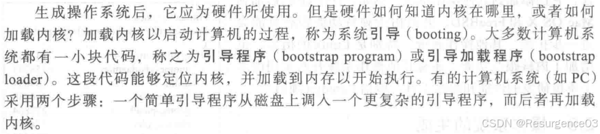
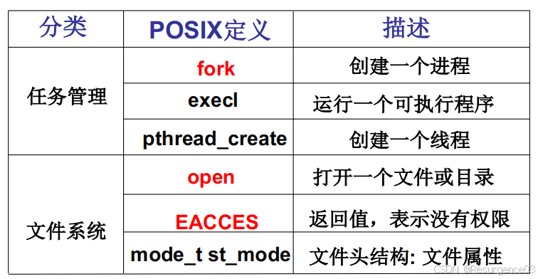
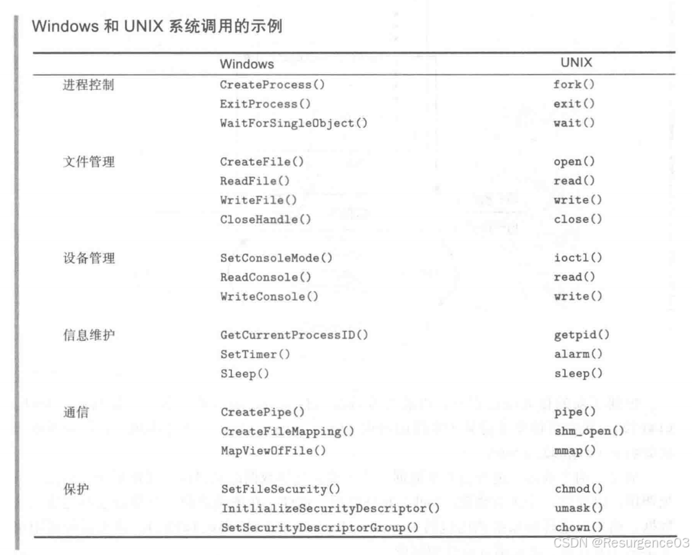
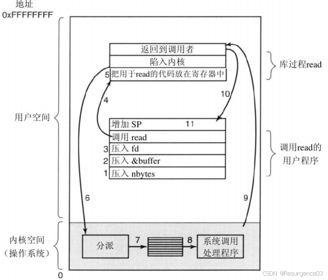
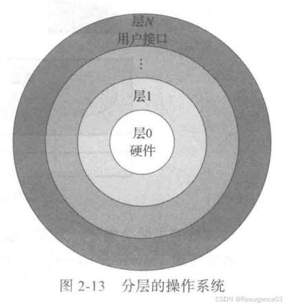
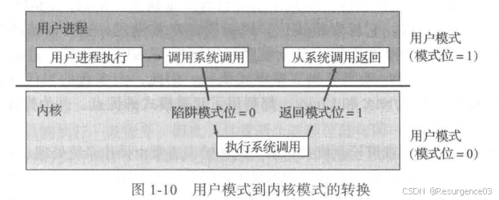
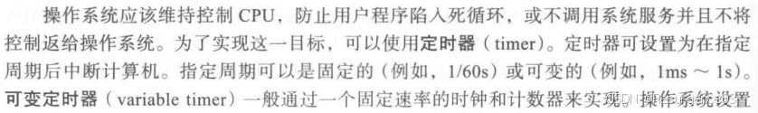
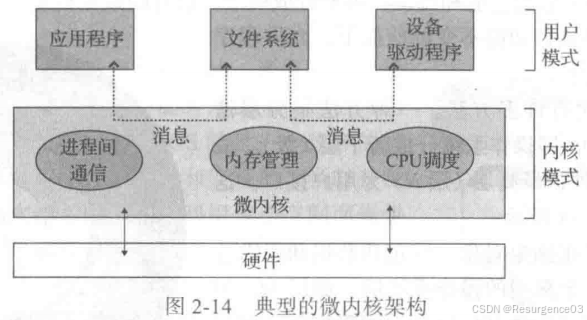
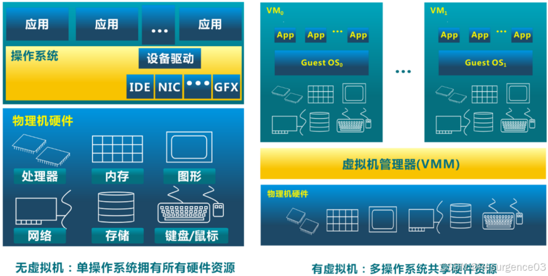

# 操作系统框架

操作系统内核特征

- 并发
- 共享
- 虚拟
- 异步

## 操作系统引导



使用ROM或EPROM

大型操作系统一般设置引导扇区（系统磁盘的第0块扇区）

## 操作系统接口

如同软件的interface一样，封装实现，屏蔽细节，提供服务，成为一个黑盒

### 系统调用

操作系统提供的具有函数形式的接口API

POSIX：Portable Operating System Interface of Unix（IEEE制定的一个标准族）





同步系统调用：程序读文件请求，调用`read()`，除非系统调用返回，否则程序进入阻塞

异步系统调用：Linux的`aio_read()`调用



- <font color=#1C7331>执行很快</font>
- <font color=#1C7331>灵活</font>
  - 易于传递和返回复杂数据类型
- <font color=#1C7331>使用API，程序员熟悉</font>
- <font color=#BE191C>有使用风险</font>

### shell

操作系统的对外接口

```c
int main(int argc, char* argv[]) {
    char cmd[20];
    while(1) {
        scanf(“%s”, cmd);
        if(!fork()) {
            exec(cmd);
        }
        else {
            wait();
        }
    }
}
```

## 分层隔离



### 内核态与用户态

当前程序在哪一层环里



内核态可以执行用户态不能执行的特权动作

- 访问外设
- 配置地址空间
- 读写系统级寄存器

### 内核段与用户段

<font color=#956FE7>**DPL**</font>（Destination Priority Level）：CS的最低两位（PC = CS : IP）

- 对于内核态，DPL=0（00）
- 对于用户态，DPL=3（11）

<font color=#956FE7>**CPL**</font>（Current Priority Level）

<font color=#956FE7>如果CPL ≤ DPL，当前程序可以访问目标段</font>

## 中断

其他模块（I/O，存储器等）打断CPU正常处理

<font color=#956FE7>中断可能在主程序的**任何位置**发生，而非某条指令，因为发起中断的根本不是当前程序</font>

其与程序执行是<font color=#956FE7>**异步**</font>的
<font color=#956FE7>所有的用户程序（无论是被打断的还是发起打断的）都不知道中断的发生，中断**全部由处理器和操作系统负责**</font>

硬件（处理器）层级：中断阶段

- 【计组笔记】CPU

- 【计组笔记】I/O

软件（操作系统）层级：中断处理程序

### 中断处理程序

内核处理中断时调用的函数

- 每种中断对应一种中断处理程序
- 是操作系统的一部分
- 其执行时不是进程

### 中断上下文

该上下文中的代码不可被阻塞

### 定时器中断

操作系统稳定地给CPU发送中断信号

- 防止用户程序一直占用CPU，抢占操作系统对CPU的控制
- 让操作系统能周期性地进行内存管理




## 异常

程序自身执行出现问题

<font color=#956FE7>异常是由当前执行程序的**某一条指令**</font>（除以0错误，地址访问错误）<font color=#956FE7>引发的</font>

- 其与程序执行是<font color=#956FE7>**同步**</font>的（在指令执行过程中发生）

### 异常处理程序

是操作系统的一部分

先保存现场，kill异常程序或重试，恢复现场

- kill：除以0错误
- 重试：缺页异常

|          |      中断      |     异常     |  系统调用  |
| :------: | :------------: | :----------: | :--------: |
|   来源   |  外设、定时器  |   应用程序   |  应用程序  |
| 响应方式 |      异步      |     同步     | 异步或同步 |
| 触发机制 |      被动      |   执行异常   |  主动请求  |
| 处理机制 | 持续；用户透明 | kill或remake |  持续等待  |

## 操作系统分类

- 简单结构（MS-DOS）
  - 没有模块拆分
  - 没有保护
- 单体多层结构
  - 最低层为硬件驱动
  - 每一层仅使用更高一层的服务
- 微内核结构
  - <font color=#956FE7>尽可能的**把内核功能**（设备管理、文件管理、内存管理、I/O管理、网络协议栈）**放到用户空间**</font>
  - <font color=#1C7331>灵活、安全</font>
  - <font color=#BE191C>性能有损失</font>
- 宏内核结构
  - 将操作系统的主要功能模块（如进程管理、内存管理、文件系统等）都集成在一个内核空间中运行
  - Linux、Android
- 外核结构
  - 内核分配给用户程序物理资源
  - 实现了操作系统抽象
  - 保护和控制分离
- 虚拟机结构