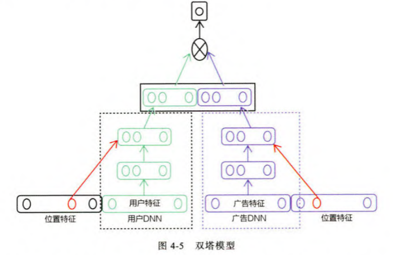

## Ch1

- 数据部分
- 模型部分
	- 召回层：对候选集的粗选
	- **排序层**
	- 补充策略与算法层

## Ch2

协同过滤CF

共现矩阵中向量相似度

- 按行向量：UserCF
- 按列向量：ItemCF

矩阵分解过滤MF

- 奇异值分解： 取前k个奇异值分量
- 给定隐向量维数，变为矩阵空间上优化问题$\displaystyle \min_{q^*,p^*} \sum_{(u,i)}(r_{ui} - q_i^\mathrm{T} p_u)^2$，可进一步正则化

逻辑回归LR

学习 用户-物品信息 的特征向量到是否点击二分类（点击率CTR预估）问题的Logistics函数

> 辛普森悖论
>
> 在对样本集合进行分组研究时，在分组比较中都占优势的一方，在总评中有时反而是失势的一方
>
> - 最好不要对特征进行合并
> - LR对各特征向量分量的加权处理不合理

GBDT+LR

关键在于引入梯度提升决策树GBDT做模块化特征工程

重要思想：**特征工程作为单独模块**，模型的输人可以是原始的特征向量

LS-PLM

softmax函数聚类预处理，类内用LR模型

$f(x) = \sum_{i=1}^m \pi_i(x) \eta_i(x),\eta_i(x) = \dfrac{1}{1+e^{-w_ix}}$

## Ch3

- 改变神经网络的复杂程度
- 改变特征交叉方式
- 组合模型
- FM模型的深度学习演化版本
- 注意力机制与推荐模型的结合注意力机制与推荐模型的结合
- 序列模型与推荐模型的结合
- 强化学习与推荐模型的结合

AutoRec

使用单自编码器填写共现矩阵缺省处

- I-AutoRec：输入向量是物品的评分向量
- U-AutoRec：输入向量是用户的评分向量

Deep Crossing

微软特征分类

- 类别型特征：one-hot或multi-hot编码为特征向量
- 数值型特征：直接拼接进特征向量中

网络结构

- Embedding层：特征工程模块
- Stacking层（concatenate层）：把不同的Embedding特征和数值型特征拼接在一起，形成新的包含全部特征的特征向量
- Multiple Residual Units层：多层残差网络
- Scoring层：输出层

NeuralCF

（广义的矩阵分解模型）视矩阵分解为两侧embedding，内积运算替换为其他向量交互操作

PNN

将Deep Crossing的Stacking层替换为Product层

Wide&Deep

Deep&Cross

DIEN

序列模型+推荐系统

DRN

## Ch4

word2vec

item2vec

双塔模型（广义item2vec）

graph embedding

物品关系图

DeepWalk

物品关系图上的随机游走生成物品序列

node2vec

控制跳转概率，使得随机游走偏向于BFS或DFS

- BFS：网络的 “结构性”，分析节点结构特点
- DFS：网络的 “同质性”，分析节点图上距离

EGES

使用知识图谱生成的embedding改善冷启动

局部敏感哈希LSH

embedding快速检索

- 按余弦相似度：$O(kn)$，$k$为embedding维度，$n$为物品总数
- kd树最近邻搜索：$O(\log_2 n)$
- 局部敏感哈希：$O(1)$

对于随机生成的embedding空间内向量$x$，诱导哈希函数$h_x(v)= \left\lfloor \dfrac{\langle v,x \rangle + b}{w} \right\rfloor,b \sim U(0,w)$，$w$为分桶宽度