# 应用层

| **应用层服务** | **传输层协议** | **端口号** |
| :------------: | :------------: | :--------: |
|      DNS       |    TCP或UDP    |     53     |
|      FTP       |      TCP       |   20或21   |
|     TELNET     |      TCP       |     23     |
|      HTTP      |      TCP       |     80     |
|     HTTPS      |      TCP       |    443     |
|      SMTP      |      TCP       |     25     |
|      POP3      |      TCP       |    110     |
|      IMAP      |      TCP       |    143     |
|      MIME      |       /        |     /      |
|      DHCP      |    **UDP**     |     67     |
|      SNMP      |    **UDP**     |    161     |

## 域名系统DNS

使用具有一定语义的域名来助记IP地址

- 一个域名可能有多个IP地址
  - 服务器农场
    - 前端调配请求去不同的服务器
    - 不同服务器均连接到后端数据库
  - 在南京和北京访问http://www.bilibili.com不是一个服务器
- 一个IP地址可能有多个域名
  - [www.baidu.com](http://www.baidu.com)和[www.baidu.cn](http://www.baidu.cn)

### 域名结构

- 不超过4个标号，标号之间用.间隔
  - 每个标号不超过63个字符
    - 域名不超过4×63+3=255个字符
- 大小写无关
- 从右到左为顶级域名、二级域名、三级域名......

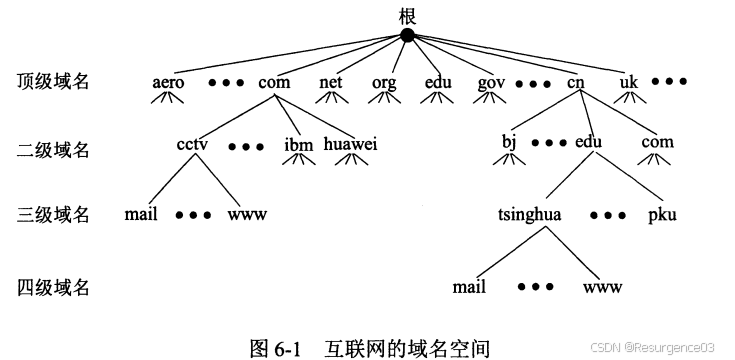

### 域名服务器

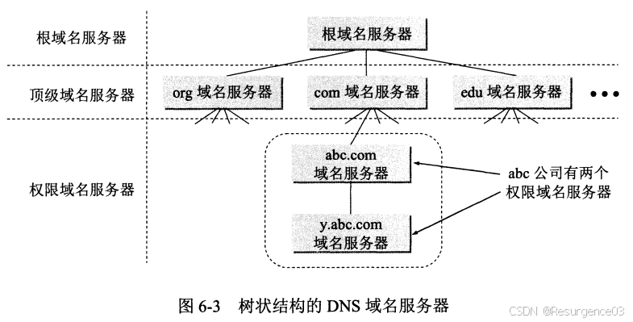

- 根域名服务器 
  - 全球13个IP（不计镜像）
  - 知道所有的顶级域名服务器的域名和IP地址
- 顶级域名服务器TLD 
  - 管理对应一号域名下的所有二级域名
- 权限域名服务器 
  - 保存一个区域的域名-IP地址映射
- 本地域名服务器（默认域名服务器）

### 域名数据库

分布式数据库

记录为五元组<Domain_name, Time_to_live, Class, Type, Value>

- Domain_name：域名
- Time_to_live：生存期，用于**DNS缓存**
- Class：类别，Internet消息为IN
- Type：类型
- Value：值

### 域名解析过程

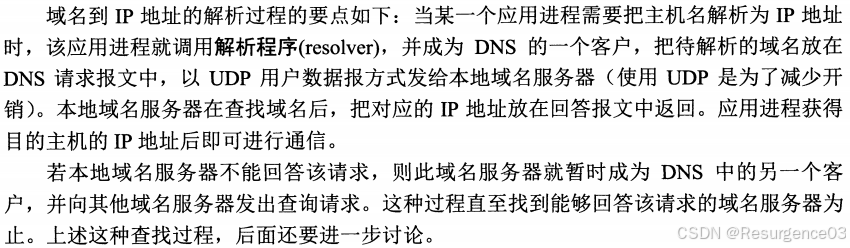

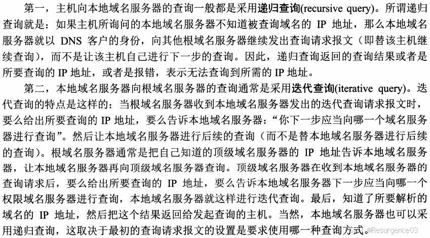

- 迭代：本地域名服务器从根域名服务器开始问起，自高向低按标号问一遍
- 递归：本地域名服务器替代主机，从根域名服务器开始递归查询IP地址

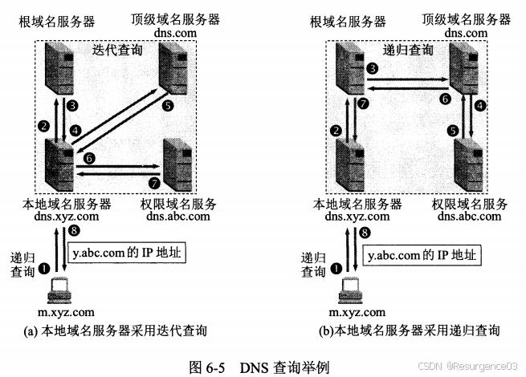

- 主机向本地域名服务器查询总是迭代查询的
- 本地域名服务器向更高级域名服务器查询，迭代和递归皆可

## FTP协议

- 客户-服务器模式
  - 一个服务器主进程，用于接收请求
  - 若干个服务器从属进程，用于处理单个请求
- 两个TCP连接
  - 控制连接与控制进程
    - 仅发送请求，不用来传输数据
    - 在会话期间全程打开
    - 客户端通过控制连接告知服务器数据连接所用端口
    - 服务器一旦收到请求就创建数据连接和数据传送进程
    - **服务器进程**使用**21**端口
  - 数据连接与数据传送进程
    - 实际用于传输数据
    - 仅在传输数据时打开，完成文件传送后即关闭
    - **服务器进程**使用**20**端口
  - 使用两个端口，两个连接互不干扰

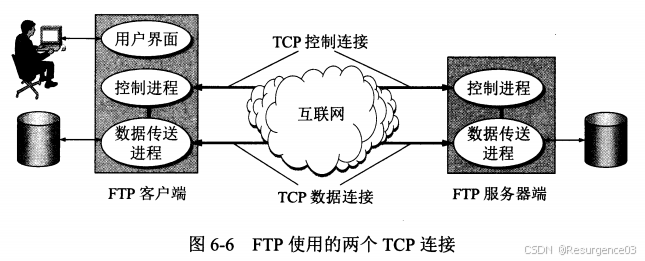

## 万维网

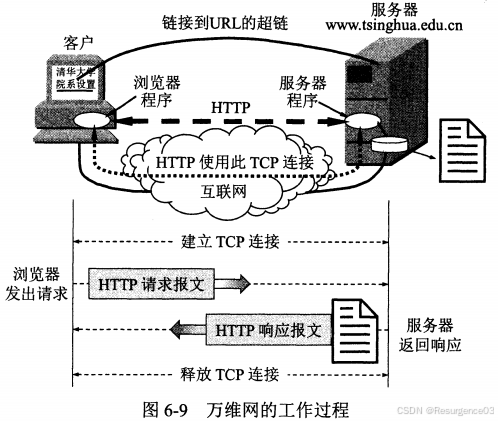

### 统一资源定位符URL

<协议>**://**<主机>**:**<端口>**/**<路径>

- 不区分大小写
- 协议 
  - ftp
  - http
  - News
- 主机：DNS

### 超文本传输协议HTTP

- 面向事务
- 客户-服务器协议
- 无状态协议
- **无连接**协议

#### HTTP报文

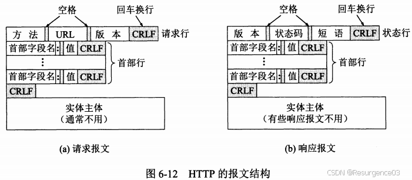

#### HTTP传输万维网文档过程

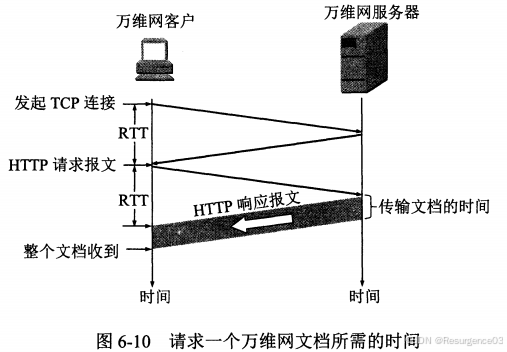

- 建立TCP连接的第三个报文即为HTTP请求报文
- HTTP请求报文只完成最基本的HTTP请求，**不能完成后续的流水线请求**

#### 持续连接

HTTP/1.1对HTTP/1.0的改良

- 非流水线方式 
  - 客户在收到前一个响应后才能发出下一个请求
  - 比非持续连接的两倍RTT的开销节省了建立TCP连接所需的第一个RTT时间
  - 服务器在发送完一个对象后，其TCP连接就处于空闲状态，浪费了服务器资源
- 流水线方式 
  - 客户在收到 HTTP 的响应报文之前就能够接着发送新的请求报文
  - 一个接一个的请求报文到达服务器后，服务器就可连续发回响应报文
  - 使用流水线方式时，客户访问所有的对象只需花费一个RTT时间
  - 使TCP连接中的空闲时间减少，提高了下载文档效率

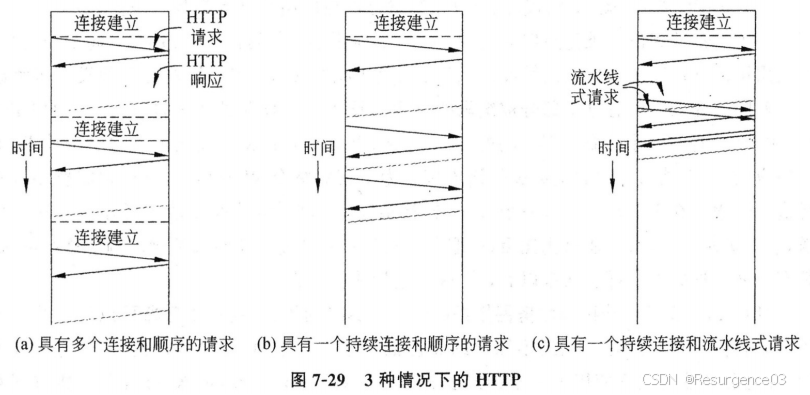

#### HTTP/2

- 服务器推送机制
- 流水线机制
- 多路复用处理 
  - HTTP/1采用并行TCP连接解决队首阻塞HOL问题
  - HTTP/2多路复用处理减少套接字数量
- HTTP/2成帧子层 
  - HTTP/1的响应和请求有相同的相对顺序
  - HTTP/2的响应和请求不一定相同的相对顺序

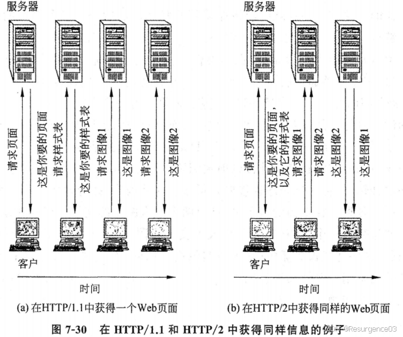

#### HTTP/3

不再使用TCP，换用**QUIC**作为传输层协议

## 电子邮件

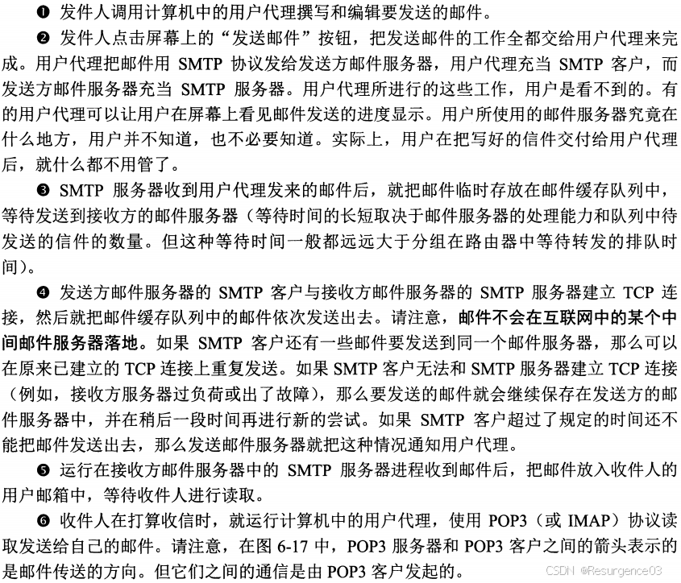

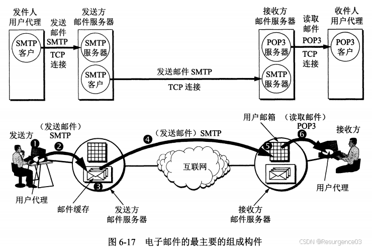

### 简单邮件传输协议SMTP

用于**发邮件**（用户代理到发送方邮件服务器，发送方邮件服务器到接收方邮件服务器）

- 客户-服务器模式
  - 发邮件的是客户
    - 发邮件的不一定是用户
  - 收邮件的是服务器
    - 收邮件的一定是服务器
- 任何时候都不会有中间服务器
  - 如果接收方不接受邮件，发送方只能等待
- 只能传送7位ASCII码文件
  - ASCII码从0~127的字符组成
  - 二进制文件、非英文文件都不能传
- 邮件有长度限制
- 有些实现并不完全按照SMTP标准来

### 邮局协议POP3

用于**读邮件**（接收方邮件服务器到用户代理）

- 客户-服务器模式
  - 读邮件的是客户
  - 发邮件的是服务器
- 客户**一旦读取了邮件**，服务器就把该邮件**删除**

### 网际报文存取协议IMAP

用于**读邮件**（接收方邮件服务器到用户代理）

- 客户-服务器模式
  - 读邮件的是客户
  - 发邮件的是服务器
- 用户在自己主机上可直接操作邮件服务器的邮箱
- 服务器**不会删除邮件**，除非用户指定了删除操作
- 允许收件人只读取一部分邮件
- 必须上网才能使用

### 通用互联网邮件扩充MIME

用户与SMTP间的非ASCII码文件转换接口

- **对SMTP无改动**
- 增加邮件主体结构，支持更多类型文件

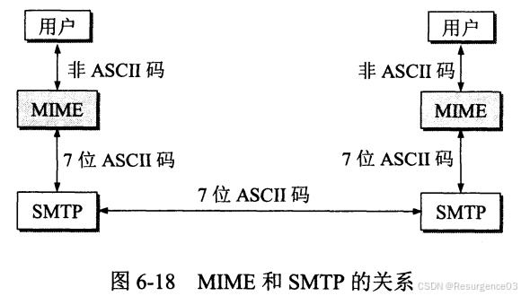

## 简单网络管理协议SNMP

管理员的管理程序调控被管设备中的代理程序执行本地动作

- 被管节点：运行SNMP代理程序
  - 维护本地数据库
  - 描述本地的状态历史
  - 执行本地动作
- 管理信息：描述每个站点状态的变量
- 管理站：管理员运行管理程序
  - 查询或修改被管站点的管理信息

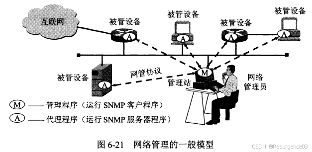