# 数据链路层

-  向上提供透明接口
- 向下将比特流拆分为若干个帧，为每个帧计算校验和 
  - 接收端基于校验和检查帧内的比特差错

## 向上网络层接口

- 无确认的无连接服务 
  - **以太网**
  - 无需逻辑连接
  - 双方无需确认
- 有确认的无连接服务 
  - **IEEE 802.11（WiFi）**
  - 无需逻辑连接
  - 接收方确认收到帧
  - 发送方如果超时未确认，就重新发送帧
- 有确认的面向连接服务 
  - 需逻辑连接
  - 每一帧都被编号
  - 每个帧确认收到，只被收到一次，所有帧按顺序收到

## 向下物理层接口

### 封装成帧

#### 字节计数法

帧头放入该帧（包括帧头）的**字节长度**

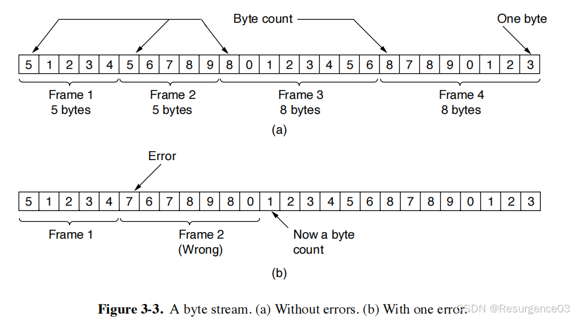

稳定性差，很少使用

#### 字节填充的标志字节法

用一些**特殊字符**FLAG表示帧的开始和结束

- 如果特殊字符在数据中出现 
  - 发送方的数据链路层在来自网络层的数据前面插入转义字符ESC
  - 接收方的数据链路层删除转义字符再交给网络层
- 如果转义字符在数据中出现，就转义转义字符

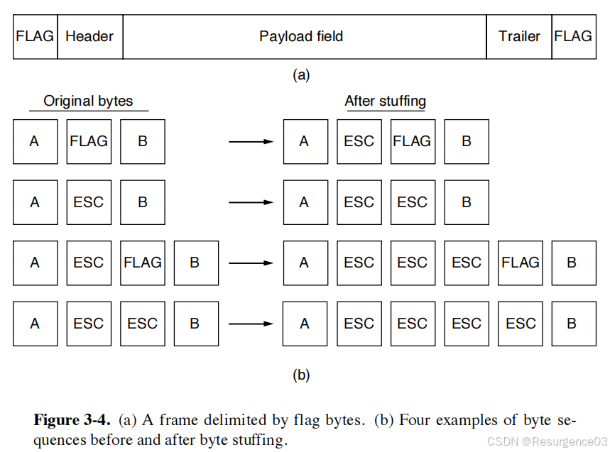

- 帧长取决于数据字段内容 
  - 最好情况下增加2字节
  - 最坏情况下翻倍

**PPP使用**

#### 比特填充的标志比特法

开始和结束都用**约定的比特模式**标记：01111110（0x7E）

如果在数据字段识别到了连续的5个1，就立刻插入一个0

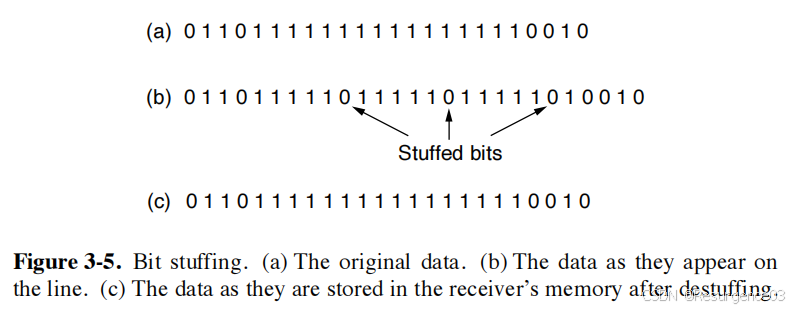

- 帧长取决于数据字段内容 
  - 最好情况下增加2字节
  - 最坏情况下增加约12.5%（每个字节+1bit）

**USB使用**

#### 物理层编码例外法

利用物理层编码准备的标记信号来标识帧的开始和结束

- 4B/5B码的16个信号标识

**以太网和WiFi使用**

- 在帧前插入一个**前导码**
  - 这个码不会在物理层编码的数据字段中出现
  - 标识帧的开始
- 前导码后是**帧长度字段**
  - 计算帧的结束处

### 差错检测

- 纠错码：Hamming码
- 检错码：循环冗余校验CRC

## 逻辑链路控制LLC子层

### 链路利用率

$$
utilization\ rate = \dfrac{nT_s}{T_s+2BD+T_a}
$$

- n为窗口大小

  - 即为**发出的数据帧数量**

- Ts为**数据帧处理时间 = 数据帧位数 / 信道带宽**

- Ta为**确认帧处理时间 = 确认帧位数 / 信道带宽**

- BD为**传播时延**Broadcasting Delay 

  - 数据帧去途需要1BD，确认帧返途需要1BD，**共2BD = RTT**
- 只有整个帧都被收到了才会发出确认帧，有1帧的延迟

### 最大数据传输速率

最大在途帧数由**带宽-延迟乘积**决定

- **带宽-延迟乘积 = 带宽 × 传播时延**

$$
max\ data\ transfer\ rate = \min\left\{\dfrac{bits\ in \ the\ window}{T_s+2BD+T_a},bandwidth\right\}
$$

窗口内位数 = 单帧位数 × 窗口大小

- 要调节窗口大小使数据传输速率最大，令两项相等即可
- 当最大数据传输速率与带宽无关时，**最大数据传输速率 = 链路利用率 × 带宽**

### 停-等式协议

- 信道不出错
- 单向数据流量
  - 信道在每个时刻都是单向的
  - 帧仍然是可以双向传输的
    - 确认帧不算数据帧

发送方每发送一帧都需要等待接收方发送的确认帧，**确认后才发下一帧**

- 发送方只会收到确认帧
  - 因假设信道不出错

### 自动重传ARQ协议/带重传机制的肯定确认PAR协议

- 信道可能出错 
  - 帧内比特出错
  - 整个帧丢失
- 单向数据流量

把帧加上0-1记号

- 发送方把帧按发送次序轮流标记为0或1
- 接收方接收到标记位符合的（正确）帧才收下并发送确认帧，否则丢弃帧并等待 
  - 如果标记为0的帧传输中丢失，发送方超时重传
  - 如果标记为0的帧抵达接收方并被接收，上传给网络层 	
    - 接收方下一个期望收到标记为1的帧
    - 确认帧丢失
    - 发送方超时重传标记为0的帧
    - 标记为0的帧到达接收方，接收方拒绝该帧，并再次发送对标记为0的帧的确认

### 双向传输的捎带确认

接收方在接收帧的不久后就要发给发送方数据，对上一个帧的确认可以搭载在发过去的数据帧上

- 设置计时器 
  - 时间结束前有网络层请求就捎带确认
  - 时间结束就发送单独的确认帧

### 滑动窗口协议

- 信道可能出错
- 全双工通信

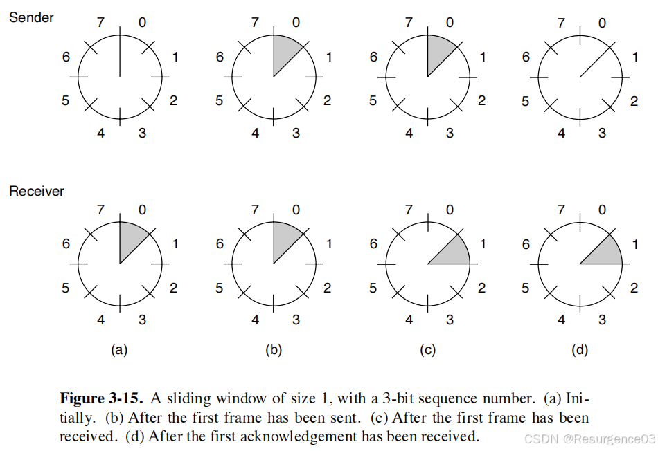

- 帧序号0~MAX_SEQ
  - MAX_SEQ一般形如$2^n-1$（用$n$位存）
- 窗口上/下边界：应该被最后/先发送的帧 
  - 换言之，窗口是**自下而上**移动的
  - 一旦从网络层收到新帧，上边界上移
  - 一旦从接收方收到确认帧，下边界上移

#### 1位滑动窗口协议

与ARQ类似

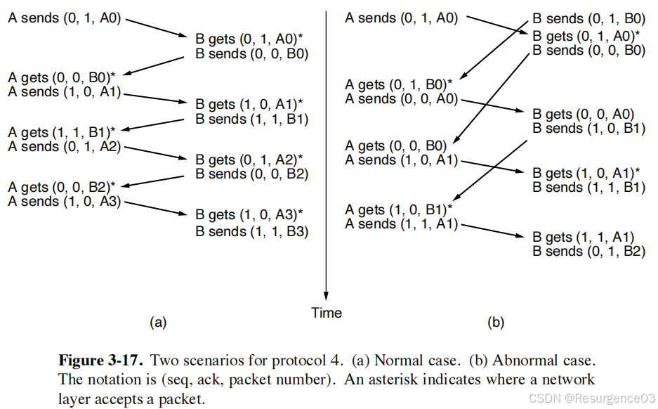

#### 回退N帧GBN协议

- 发送窗口尺寸为w>1 
  - w=1时退化为停-等协议
  - 利用管道化实现帧连续发送
- 接收窗口尺寸为1

发送方在窗口填满前如果收到确认帧，就可以前移窗口，达到多帧在途

- 如果接收到的帧是预期的帧且没出错，就收下并交给网络层，发送对这个帧的确认帧ACK，接收窗口向上移动

- 如果接收到的帧不是预期的帧或出错，与没收到帧处理相同，不发送确认帧

  - 接收方的出错帧将超时重传，出错帧的后续帧即使顺利送到，但也因无确认帧而**超时重传**

  - **累计确认**：当第n号帧的确认到达时，第n号帧及其之前的帧都会被确认 	
- 此时发送窗口的下边界变为n+1

##### 发送窗口长度选择

发送窗口的长度和最大在途数据帧数相同（超时计时器不太短）

发送窗口的长度必须不超过MAX_SEQ

- 否则由于标号的循环性，会不知道接收到的确认帧是来自当前循环的标号还是上个循环的标号
- 发送窗口的长度 + 1 <= $2^n$，n是序号位数

#### 选择重传SR协议

- 发送窗口尺寸为w > 1
- 接收窗口尺寸为v > 1 
  - v = 1时退化为GBN
  - 接收窗口是缓存区，大小始终不变

接收方**缓存丢失帧后续收到的几个帧**，避免大量回退

- 如果接收到的帧标号在接收窗口下边界，就收下并交给网络层，发送对这个帧的确认帧ACK，接收窗口向上移动

- 如果接收到的帧标号在接收窗口内但不是下边界，就收下并缓存

  - 此时意味着接收窗口下边界的帧丢失了

  - 接收方发送一个针对**接收窗口下边界的否定确认帧**NAK

    - 或者发送一个**接收窗口下边界前一个编号的确认帧**

  - 发送方针对NAK重发帧或超时重传

- 如果接收到的帧出错，就丢弃

  - 接收方发送一个针对**该错误帧的否定确认帧**NAK

- 发送方的发送窗口下边界如果被确认，下边界上移

- **累计确认**

##### 发送与接收窗口长度选择

一般**发送窗口与接收窗口大小相同**

- 发送窗口可以比接收窗口大
- 发送窗口比接收窗口小时，接收窗口存在浪费

发送窗口和接收窗口的**长度和必须小于等于MAX_SEQ + 1 = 标号总数**，即最多装一个循环

- 否则由于标号的循环性，会不知道接收到的数据帧是来自当前循环的标号还是上个循环的标号
  - 当前循环的标号：新数据帧
  - 上个循环的标号：之前的确认帧全部丢失，接收方重传旧数据帧
- 如果两窗口尺寸相同，两窗口的长度 * 2 <= $2^n$，n是序号位数

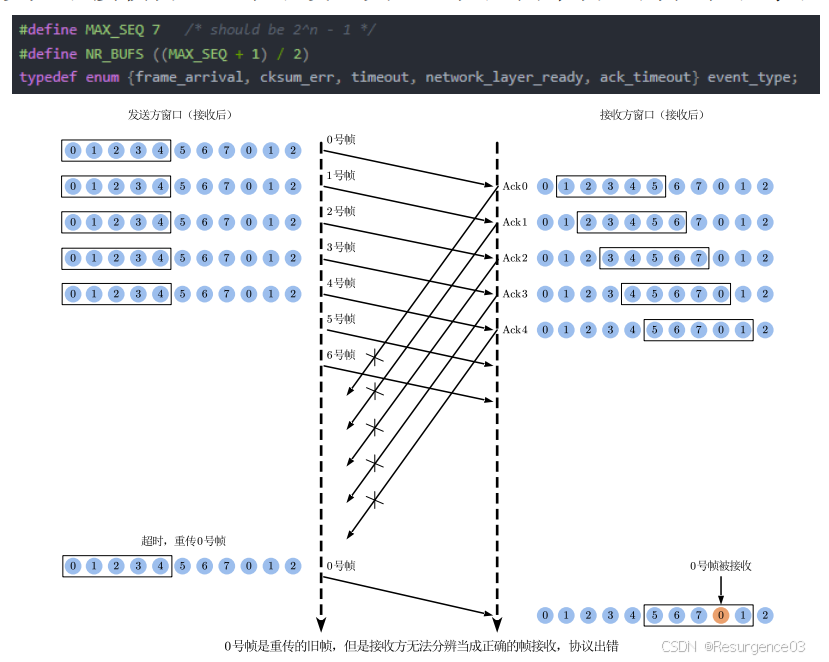

## 介质访问控制MAC子层

### 信道分配

#### 静态信道分配

信道复用

- 不适合突发性流量

#### 动态信道分配

竞争系统：多个用户在共享一个信道的过程中可能发生冲突的系统

##### 多路访问协议

总线拓扑下

###### ALOHA

**纯ALOHA**

- 有数据**立刻**发送

- 如果帧没有传过去（不管任何原因），等待**随机**时间后重新发送
  - 两帧冲突必然导致两帧都传不过去
  
- 站在发送帧前并**不侦听**信道

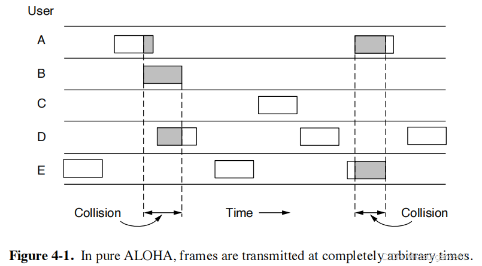

帧时：传输一个帧的时间 = 帧长度 / 比特率

- 一个帧在链路上的时间

吞吐量 = 每帧时产生帧的平均数量G × 成功传输概率P

- 当G太小时，成功传输率高，帧与帧之间有时间间隔，吞吐量有进一步上升空间
- 当G充分大时，冲突率增高，P下降 
  - 极端情况没有任何一个帧可以传过去，吞吐率为0

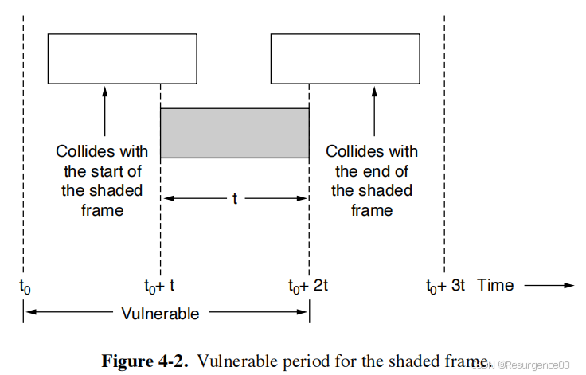

最大吞吐量$\dfrac{1}{2e}$

**分槽ALOHA**

信道**需要带时间槽**

- 时间槽长度等于帧时
- 任何帧的发送都填充一个时间槽

最大吞吐量$\dfrac{1}{e}$

###### 载波侦听多路访问CSMA协议

**1-坚持型CSMA**

- 当站想发送帧时首先**侦听信道**
- 如果**信道空闲**，**立刻**发送帧
  - 空闲时以概率1发送帧
- 如果**信道忙**，就等待**直至信道空闲**
- 如果**冲突**，就**随机等待**一段时间后再侦听信道

------

- 减少信道空闲
- 增加冲突概率
  - 传播时延越大，冲突率越高

**p-坚持型CSMA**

信道**需要带时间槽**

- 当站想发送帧时首先**侦听信道**
- 如果**信道空闲**，以**概率p**在**当前时间槽**发送帧
  - 以q=1-p的概率延迟至下一个时间槽发送
- 如果**信道忙**，就等待**一个空闲的时间槽**
- 如果**冲突**，就**随机等待**一段时间后再侦听信道

------

- 减少信道空闲
- 增加冲突概率
  - 传播时延越大，冲突率越高

**非坚持型CSMA**

- 当站想发送帧时首先**侦听信道**
- 如果**信道空闲**，**立刻**发送帧
- 如果**信道忙**或者**冲突**，就**随机等待一段时间**后再侦听信道

------

- 减小冲突概率
- 增大信道空闲
  - 可能发现忙之后短时间内信道变为空闲

###### 带冲突检测的载波侦听多路访问CSMA/CD协议

信道**需要带时间槽**

- 在CSMA基础上，如果检测到冲突，**立刻停止传输**该帧

  - **发出一个干扰信号**在信道上广播，所有站点都知道发生了冲突
- **等待一段随机时间**后重新尝试传输

竞争槽：2×BD=RRT

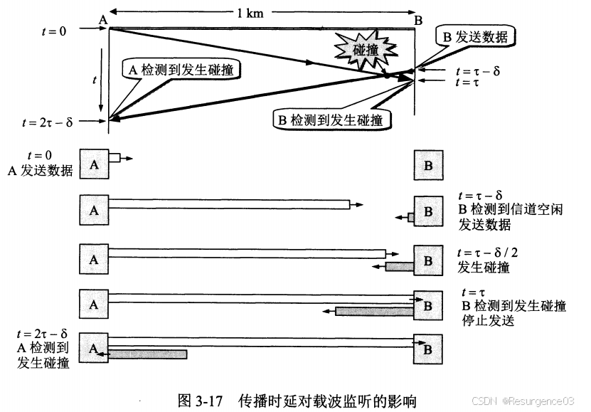

- 最好情形：两边**同时发送**，在中点处冲突，**1倍传播时延**
- 最坏情形：在一边帧**即将到达**时另一边发送，**2倍传播时延**
  - **最大发送速率 = 最小帧长度 / RTT**
    - 高于该发送速率时将不能侦听到是否碰撞
- 不能同时双向通信
  - 半双工通信

##### 无冲突协议

###### 位图协议

###### 令牌传递

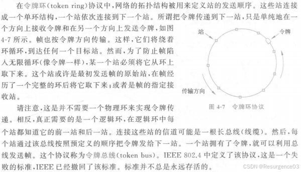

###### 二进制倒计数

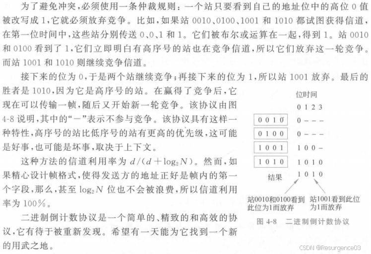

##### 有限竞争协议

结合竞争协议与无冲突协议

- 竞争协议 
  - 轻负载下发送延迟小
  - 重负载下信道利用率低
- 无冲突协议 
  - 轻负载下发送延迟大
  - 重负载下信道利用率高

###### 自适应树遍历协议

初始状态下在根节点下的叶节点（即所有叶节点）可以竞争时间槽

- 如果无冲突，按广度优先遍历分配下一时间槽 
  - 时间槽均匀分布
- 如果发生冲突，按深度优先遍历分配下一时间槽 
  - 减小组内站

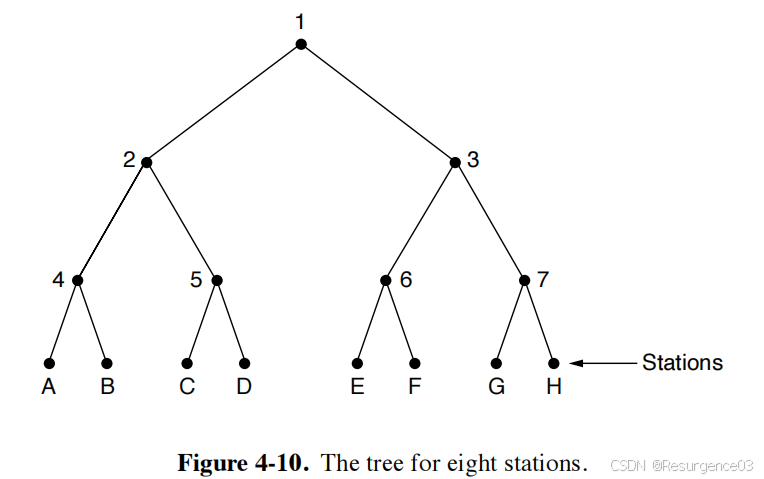

系统负载重时，从根节点开始冲突率很高，按就绪站点数决定试探层数

- 设共有均匀分布的$q$个站就绪
- 那么高度为$k$的节点上有$\dfrac{q}{2^k}$个站就绪
- 要使冲突率低且利用率高，应有$\dfrac{q}{2^k}=1$

##### 无线局域网

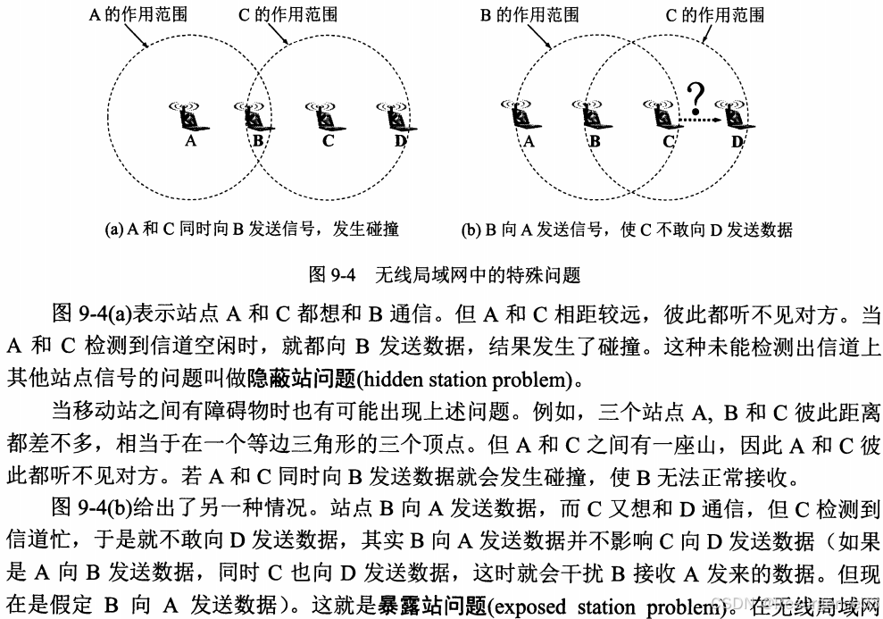

隐藏站点问题：**竞争者距离太远**，导致两个竞争者互相感知不到对方

暴露站点问题：**非竞争者距离太近**，导致非竞争者误以为信道被占用

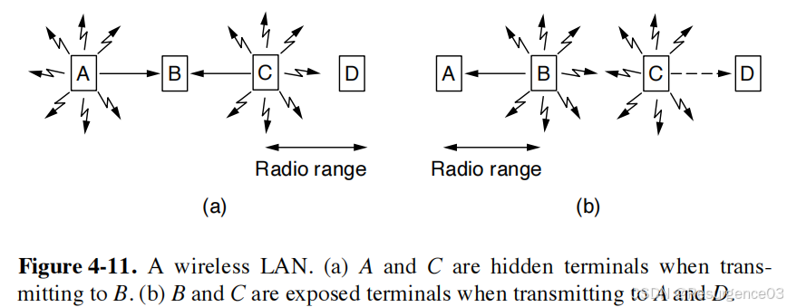

###### 冲突避免多路访问MACA协议

- 发送方发一个**请求发送帧RTS**给接收方 	
  - 发送方附近的站点一段时间内静默
  
- 接收方发一个**允许发送帧CTS**向发送方 
  - 接收方附近的站点一段时间内静默
  
- 发送方开始发送

- 如果接收方同时收到了多个RTS 

  - 这些RTS都是损坏的
  - 接收方没法回应CTS
  - 发送方一段时间内没有收到CTS，**等待随机时间**后重新尝试

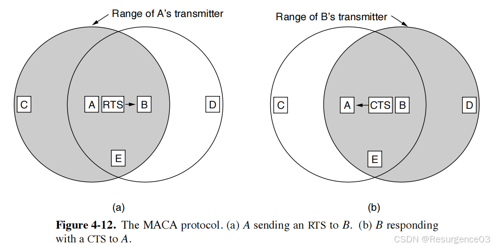

- 既可以解决隐藏站问题，也可以解决暴露站问题

**二进制指数退避**