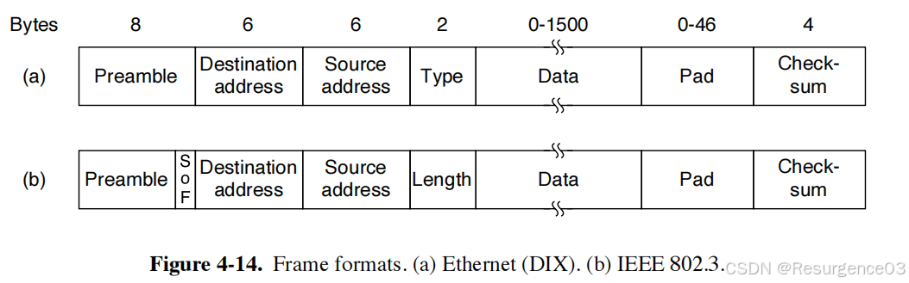

# 以太网

## 经典以太网

总线拓扑

### 物理层

Manchester编码

### 数据链路层

#### MAC子层

##### MAC帧

DIX格式与IEEE802.3格式

- IEEE802.3格式兼容DIX格式

- 前导码（+帧开始定界符SOF） 
  - 8字节 	
    - 前7字节均为0xAA
    - 第8字节为0xAB
  - 前7字节的Manchester编码将产生稳定方波，用于校准时钟周期
- 目的地址 
  - 6字节
  - 目的站的MAC地址
- 源地址 
  - 6字节
  - 发送站的MAC地址
- 类型（仅DIX）/长度（仅IEEE802.3） 
  - 2字节
  - 指定网络层协议或帧长度
  - 如果字段值小于等于0x0600（1536）时解释为IEEE的长度字段 	
    - 此时IEEE帧将在长度字段和数据字段之间加入LLC/SNAP头部用于指定类型
  - 反之解释为DIX的类型字段 	
    - 0x0800是IPv4协议
    - 0x86DD是IPv6协议
    - 此时DIX帧确定长度基于 		
      - 尾部12字节的帧间间隔IPG时间，连续传输的两帧之间亦有距离
      - Manchester编码每bit的固定跳变，无跳变则传输完成
- 数据 
  - 46~1500字节
  - 46字节：最小长度，不足用填充段补足
  - 1500字节 	
    - 以太网数据链路层的最大传输单元MTU
    - 历史原因 		
      - IEEE的长度字段基于这一上界
  - 帧长度最大为8+1518字节 	
    - 8字节前导码
    - 6字节目的地址
    - 6字节源地址
    - 2字节类型/长度
    - 1500字节数据字段
    - 0字节填充
    - 4字节校验码
- 填充 
  - 0~46字节
  - 如果数据段不足46字节，填充段补足至46字节 	
    - 换言之，数据段+填充段>=46字节
    - 避免传输时间过短，防止CSMA/CD的冲突信号还没到该站就已经传输完成
  - 帧长度最小为8+64字节 	
    - 8字节前导码
    - 6字节目的地址
    - 6字节源地址
    - 2字节类型/长度
    - 0字节数据字段
    - 46字节填充
    - 4字节校验码
- 校验和 
  - 4字节

##### MAC地址

均为6字节

指定目的地址和源地址

- 目的地址可以是一个地址组
- 源地址只能是一个站点地址

------

- 单播帧：一对一
- 广播帧：一对局域网上全体
- 多播帧：一对多

## 交换式以太网

除了经典以太网以外的包括快速以太网、千兆以太网等等的其他以太网

- **从千兆以太网开始全双工模式无需CSMA/CD，半双工仍需CSMA/CD**
- **从万兆以太网开始只支持全双工，无需CSMA/CD**

### 设备

#### 集线器

逻辑上和普通电缆无区别

集线器内站在**同一冲突域**内

- 集线器内站**共用带宽**
- 集线器内使用**CSMA/CD**控制

#### 交换机

- 以前叫网桥

连接LAN，**划分冲突域**

- 交换机端口**独占带宽**

------

- 直通式交换：交换机一旦**看到帧的目的地址**就开始转发，**不看校验和**
- 存储转发式交换 ：交换机**完整收下**帧后**检查校验和**，正确时才发送

### 泛洪算法

交换机维护一个记录MAC地址、端口号和时间戳的交换表，**下电即清空**

- 交换机收到帧后，查看源地址，把源MAC地址和接收端口号存进表

  - 后向学习算法
  - 一次传输只会学到**源主机**的映射关系
  
- 交换机在表中寻找目的地址，进而得出端口号 

  - 在表中找到了目的地址 	

    - 对应发送端口号不是接收端口号，转发帧
    - 对应发送端口号**是**接收端口号，**丢弃帧**

  - 在表中没有找到目的地址，**除收到帧的端口以外**的所有端口都转发帧

    - 一旦有站点收到了信号，就把对应的MAC地址和端口号写进表

- 表维护表项更新的时间戳 

  - 定期删除过期表项

### 生成树网桥

网络拓扑结构可能成环，导致泛洪算法不停空转

- 所有交换机统一一个交换机作为生成树树根
- 以根为起点，生成最小生成树
- 所有网桥关闭不属于最小生成树的链路

## VLAN

交换机可以将一个LAN划分为多个VLAN

- **VLAN内**可通过交换机广播
  - 广播不能跨VLAN
- **VLAN间**用路由器转发

### 基于端口划分VLAN

交换机维护配置表，记录端口及对应的VLAN

- 换言之，VLAN通过交换机端口划分
- 一个端口可能划分到多个VLAN中

### 基于MAC地址划分VLAN

站点的所属子网不随端口甚至交换机的改变而改变

按MAC地址划分为一些子网

### 基于IP地址

交换机可以访问到网络层的数据

可跨路由器和局域网扩展VLAN