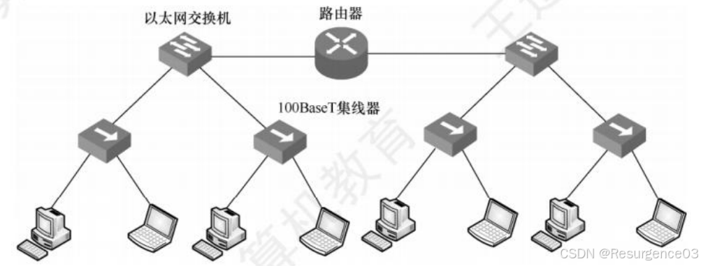

# 习题

##  物理层

> 不属于物理层接口规范定义范畴的是（C） 
>
> A. 接口形状
>
> B. 引脚功能
>
> C. 物理地址
>
> D. 信号电平

> 【2023-912】光网络只能通过导向型介质传播。（×）

> 【2017-408】若信道在无噪声情况下的极限数据传输速率不小于信噪比为30dB条件下的极限数据传输速率，则信号状态数至少是（D）
>
> A. 4
>
> B. 8
>
> C. 16
>
> D. 32
>
> S/N=1000dB，由Nyquist定理和Shannon公式，$2B\log_2V \ge B\log_2(1+S/N)=10B$，V=32

> 用PCM对语音进行数字化，如果将声音分为128个量化级，采样频率为8000次/秒，那么需要的数据传输率为（A）
>
> A. 56kbps
>
> B. 64kbps
>
> C. 128kbps
>
> D. 1024kbps
>
> $2B\log_2V=56kbps$

> 10BaseT以太网中使用Manchester编码传输
>
> 100BaseTX快速以太网中使用4B5B+NRZI编码传输

> 【2013-408】若下图为10BaseT网卡接收到的信号波形，则该网卡收到的比特串是（A）
>
> 
>
> A. 0011 0110
>
> B. 1010 1101
>
> C. 0101 0010
>
> D. 1100 0101

> 【2015-408】使用两种编码方案对比特流01100111进行编码的结果如下图所示，编码1和编码2分别是（A）
>
> 
> A. NRZ和曼彻斯特编码
>
> B. NRZ和差分曼彻斯特编码
>
> C. NRZI和曼彻斯特编码
>
> D. NRZI和差分曼彻斯特编码

> 【2009-408】在无噪声情况下，若某通信链路的带宽为3kHz，采用4个相位，每个相位具有4种振幅的QAM调制技术，则该通信链路的最大数据传输速率是（B）
>
> A. 12kbps
>
> B. 24kbps
>
> C. 48kbps
>
> D. 96kbps
>
> 由Nyquist定理，B=3kHz，V=16，数字带宽=$2B\log_2V$=24kbps

> 【2011-408】若某通信链路的数据传输速率为2400bps，采用四相位调制，则该链路的波特率是（B）
>
> A. 600波特
>
> B. 1200波特
>
> C. 4800波特
>
> D. 9600波特
>
> V=4，波特率=比特率/$\log_2V$=1200Baud

> 【2020-912】数字数据在模拟信号中传播需要的设备是（A）
>
> A. 调制解调器 
>
> B. 编码解码器

> 【2014-408】站点A、B、C通过CDMA共享链路，A、B、C的码片序列分别是(1,1,1,1)、(1,-1,1,-1)和(1,1,-1,-1)。若C从链路上收到的序列是(2,0,2,0,0,-2,0,-2,0,2,0,2)，则C收到A发送的数据是（B）。
>
> A. 000
>
> B. 101
>
> C. 110
>
> D. 111

> 【2023-912】下列不属于信道复用技术的是（D）
>
> A. 频分复用
>
> B. 时分复用
>
> C. 码分复用
>
> D. 统计复用

> 【2010-408】在右图所示的采用“存储-转发”方式的分组交换网络中，所有链路的数据传输速率为100Mbps，分组大小为1000B，其中分组头大小为20B。若主机H1向主机H2发送一个大小为 980000B的文件，则在不考虑分组拆装时间和传播延迟的情况下，从 H1发送开始到 H2 接收完为止，需要的时间至少是（）
>
> 
>
> A. 80ms
>
> B. 80.08ms
>
> C. 80.16ms
>
> D. 80.24ms

> 【《计算机网络》第2章习题50，2019-912】在一个六角形蜂窝的典型移动电话系统中，不允许相邻蜂窝重复使用频率。如果总共有840个频率可用，对于一个给定的蜂窝最多可以使用多少个频率？
>
> 7个正六边形的相邻不同染色至少需要3种颜色，840/3=240

## 数据链路层

> 【2022-912】链路层成帧的方法不包括（A）
>
> A. 偏移量法
>
> B. 物理层编码违例法
>
> C. 带位填充首尾字节标记法
>
> D. 字符计数法

> 【2021-912】对于CRC产生式G(x)=x^2+x+1，下面信息正确的是（C）
>
> A. 11101010
>
> B. 11001111
>
> C. 10001011
>
> D. 11100011 

> 【《计算机网络》第3章习题46】考虑在一个无错的64kb/s卫星信道上单向发送512字节长的数据帧，来自另一个方向反馈的确认非常短。对于窗口大小为1、7、15和127的情形，最大的吞吐量分别是多少？从地球到卫星的传播时间为270ms。

> 【2017-912】太空站到地球带宽为128kbps的无错信道上单向发送512字节的数据帧端到端的传播延迟300ms，确认帧长度忽略不计，接收窗口足够大，问发送窗口分别为1、15、27时，吞吐率（数据发送速率）是多少？若要使信道利用率达到最大，则帧序号至少为多少位？
>
> 4096b/128kbps=0.032s
>
> 窗口为1时，数据发送速率=min{4kb/(0.032s+0.6s),128kbps}=6.481kbps
>
> 窗口为15时，数据发送速率=min{60kb/(0.032s+0.6s),128kbps}=97.215kbps
>
> 窗口为27时，数据发送速率=min{108kb/(0.032s+0.6s),128kbps}=128kbps
>
> 信道利用率<=1，反解得到窗口大小n>=19.75
>
> 接收窗口足够大，认为是SR协议，那么序号空间的一半需要不小于20，需6位序号

> 【2018-408】主机甲采用停止-等待协议向主机乙发送数据，数据传输速率是3kb/s，单向传播时延是 200ms，忽略确认帧的传输时延。当信道利用率等于40%时，数据帧的长度为（）。
>
> A. 240比特
>
> B. 400比特
>
> C: 480比特
>
> D. 800比特

> 【2020-408】假设主机甲采用停-等协议向主机乙发送数据帧，数据帧长与确认帧长均为1000B，数据传输速率是10kb/s，单项传播延时是200ms，则甲的最大信道利用率为（）。
>
> A. 80%
>
> B. 66.7%
>
> C. 44.4%
>
> D. 40%

> 【2014-408】主机甲与主机乙之间使用后退N帧协议（GBN）传输数据，甲的发送窗口尺寸为1000，数据帧长为1000字节，信道带宽为100Mb/s，乙每收到一个数据帧立即利用一个短帧（忽略其传输延迟）进行确认，若甲、乙之间的单向传播时延是50ms，则甲可以达到的最大平均数据传输速率约为（C）。
>
> A. 10Mb/s
>
> B. 20Mb/s
>
> C. 80Mb/s
>
> D. 100Mb/s
>
> $\displaystyle \frac{8000b \times 1000}{\frac{8000b}{100\times 10^6 b/s}+2\times 50ms} \simeq 80Mb/s$

> 【2017-408】
>
> 
>
> 

> 【2018-912】两地相距3000公里（传播速度6us/公里）最大帧64字节，采用GBN协议，带宽为1.536Mbps，则若要最大限度发挥网络带宽，至少需要（D）比特的序号。
>
> A. 4
>
> B. 5
>
> C. 6
>
> D. 7
>
> $\displaystyle \frac{512sb}{\frac{512b}{1.536\times 10^6 b/s}+2\times 18ms} = 1.536\times 10^6 b/s, s=109$
>
> 采用GBN协议，$2^n \ge 110，n \ge 7$

>  【2015-408】主机甲通过128kb/s卫星链路，采用滑动窗口协议向主机乙发送数据，链路单向传播时延为250ms，帧长为1000字节，不考虑确认帧的开销，为使链路利用率不小于 80%，帧序号的比特数至少是（B）。
>
> A. 3
>
> B. 4
>
> C. 7
>
> D. 8
>
> 8000b/128kb/s=1/16s
>
> 利用率=(1/16s)n/(1/16s+0.5s)>=80%，n>=7.2，换言之，需要至少8帧在途，即发送窗口不小于8，那么需要16的序号空间，即4位。

> 【2013-408】下列介质访问控制方法中，可能发生冲突的是（B）
>
> A. CDMA
>
> B. CSMA
>
> C. TDMA
>
> D. FDMA

>  【2015-408】下列关于CSMA/CD协议的叙述中，错误的是（B）
>
>  A. 边发送数据帧，边检测是否发生冲突
>
>  B. 适用于无线网络，以实现无线链路共享
>
>  C. 需要根据网络跨距和数据传输速率限定最小帧长
>
>  D. 当信号传播延迟趋近0时，信道利用率趋近100%

> 【2019-408】假设一个采用CSMA/CD协议的100Mb/s局域网，最小帧长是128B，则在一个冲突域内两个站点之间的单向传播延时最多是（B）
>
> A. 2.56μs
>
> B. 5.12μs
>
> C. 10.24μs
>
> D. 20.48μs

> 【2019-912】以太网中最短帧长1000bit，最远两点相距离100m，数据在光纤中的传播速率为$2×10^8m/s$，最大发送速率为（A）
>
> A. 1Gb/s
>
> B. 2Gb/s
>
> C. 100Mb/s
>
> D. 200Mb/s
>
> 传播时延$5×10^{-7}s$，竞争槽$10^{-6}s$，最大发送速率$10^{9}b/s=1Gb/s$

> 【2023-912】无线局域网面对暴露站问题可采用RTS/CTS解决。（√）

## 以太网

> 【2013-408】对于100Mbps的以太网交换机，当输出端口无排队，以直通交换（cut-through switching）方式转发一个以太网帧（不包括前导码）时，引入的转发延迟至少是（B）
>
> A. 0us
>
> B. 0.48us
>
> C. 5.12us
>
> D. 121.44us
>
> 不含前导码，只需看6字节目的地址，即48bits

> 【2014-408】某以太网拓扑及交换机当前转发表如下图所示，主机00-e1-d5-00-23-a1向主机00-e1-d5-00-23-c1发送1个数据帧，主机00-e1-d5-00-23-c1收到该帧后，向主机00-e1-d5-00-23-a1发送1个确认帧，交换机对这两个帧的转发端口分别是（B）
>
> 
>
> A. {3}和{1}
>
> B. {2,3}和{1}
>
> C. {2,3}和{1,2}
>
> D. {1,2,3}和{1}

> 【2015-408】下列关于交换机的叙述中，正确的是（A）
>
> A. 以太网交换机本质上是一种多端口网桥
>
> B. 通过交换机互连的一组工作站构成一个冲突域
>
> C. 交换机每个端口所连网络构成一个独立的广播域
>
> D. 以太网交换机可实现采用不同网络层协议的网络互联

> 【2016-408】若主机H2向主机H4发送1个数据帧，主机H4向主机H2立即发送一个确认帧，则除H4外，从物理层上能够收到该确认帧的主机还有（D）。
>
> 
>
> A. 仅H2
>
> B. 仅H3
>
> C. 仅H1、H2
>
> D. 仅H2、H3

> 【2020-408】下图所示的网络中，冲突域和广播域的个数分别是（C）
>
> 
>
> A. 2，2
>
> B. 2，4
>
> C. 4，2
>
> D. 4，4

> 【2023-912】下列哪种不是VLAN划分方式（C）
>
> A. 基于端口
>
> B. 基于MAC
>
> C. 基于端口号
>
> D. 网络地址

## WiFi

> 【2020-408】某IEEE 802.11无线局域网中，主机H与AP之间发送或接收CSMA/CA帧的过程如下图所示。在H或AP发送帧前所等待的帧间间隔时间（IFS）中，最长的是（）
>
> 
>
> A. IFS1
>
> B. IFS2
>
> C. IFS3
>
> D. IFS4

> 【2023-912】无线局域网面对暴露站问题可采用RTS/CTS解决。（√）

> 【2024-912】关于无线局域网，下列说法正确的是（D）
>
> A. 为了减少冲突发生，无线局域网在发送信号时需要进行冲突检测
>
> B. 无线局域网可采用CSMA/CD来进行冲突检测
>
> C. 采用RTS/CTS方式，如果某一站点监听到CTS信号，但没有监听到对应RTS，那么该站点不需要为了避免冲突而静默
>
> D. SIFS、DIFS、PIFS的帧间间隔，主要是用于控制站点消息的优先级 

## 应用层

> 【2010-408】如果本地域名服务器无缓存，当采用递归方法解析另一网络某主机域名时，用户主机、本地域名服务器发送的域名请求消息数分别为（A）
>
> A. 一条、一条
>
> B. 一条、多条
>
> C. 多条、一条
>
> D. 多条、多条 

> 【2020-912】以下正确的选项是（A）
>
> A. 双十一淘宝购物，不同地方的人得到的IP地址可能不同
>
> B. DNS资源记录是通过二元组的形式
>
> C. DNS通过集中式数据库提供服务
>
> D. 访问WWW.TSINGHUA.EDU.CN和www.tsinghua.edu.cn不一样 

> 【2021-912】关于DNS，正确的是（D）
>
> I. 一个域名对应多个IP
>
> II.一个IP对应多个域名
>
> A. I
>
> B. II
>
> C. I和II都不对
>
> D. I和II都对

> 【2017-408】下列关于 FTP 协议的叙述中，错误的是（C）
>
> A. 数据连接在每次数据传输完毕后就关闭
>
> B. 控制连接在整个会话期间保持打开状态
>
> C. 服务器与客户端的TCP 20端口建立数据连接
>
> D. 客户端与服务器的TCP 21端口建立控制连接

> 【2012-408】若用户1与用户2之间发送和接收电子邮件的过程如下图所示，则图中①、②、③阶段分别使用的应用层协议可以是（D）
>
> 
>
> A. SMTP、SMTP、SMTP
>
> B. POP3、SMTP、POP3
>
> C. POP3、SMTP、SMTP
>
> D. SMTP、SMTP、POP3

> 【2013-408】下列关于SMTP协议的叙述中，正确的是（A）
>
> I. 只支持传输7比特ASCII码内容
>
> II. 支持在邮件服务器之间发送邮件
>
> III. 支持从用户代理向邮件服务器发送邮件
>
> IV. 支持从邮件服务器向用户代理发送邮件
>
> A.仅I、II和III
>
> B.仅I、II和IV
>
> C.仅I、III和IV
>
> D.仅II、III和IV 

> 【2015-408】通过POP3协议接收邮件时，使用的传输层服务类型是（D）
>
> A. 无连接不可靠的数据传输服务
>
> B. 无连接可靠的数据传输服务
>
> C. 有连接不可靠的数据传输服务
>
> D. 有连接可靠的数据传输服务 

> 【2018-408】无须转换即可由SMTP协议直接传输的内容是（D）
>
> A. JPEG图像
>
> B. MPEG视频
>
> C. EXE文件
>
> D. ASCII文本 

> 【2016-912】关于SMTP协议正确的是（A）
> A. 服务器不能给客户发送邮件
>
> B. 客户不能接收服务器数据
>
> C. 一个TCP通道不能发送多封邮件
>
> D. 服务器之间不能互相传送邮件 

> 【2023-912】客户端代理发送邮件所采用的协议是（A）
>
> A. SMTP
>
> B. POP3
>
> C. IMAP
>
> D. SNMP 