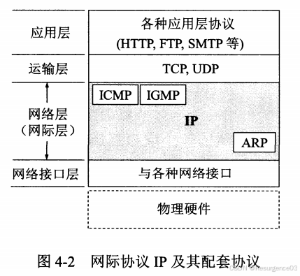
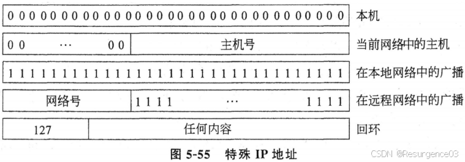

# 【计网笔记】网络层

# 向上传输层服务

无连接服务，即数据报服务

有连接服务，即虚电路服务

编辑

# IP协议

编辑

## IP地址

### IPv4

#### 分类IP地址

编辑

- A类地址：网络号1字节，主机号3字节 
  - 网络号全0：本网络
  - 网络号后7位全1：本地软件环回测试IP数据报
- B类地址：网络号2字节，主机号2字节 
  - 网络号后15位全0：不指派
- C类地址：网络号3字节，主机号1字节 
  - 网络号后22位全0：不指派
- D类地址：前4位为1110，后28位为多播组标识 
  - **后28位全0为本地网络多播**

------

特殊地址编辑

- 特殊网络号 
  - 网络号全0
    - 本网络
  - IP地址全1
    - **本网络广播**
  - A类地址 	
    - 网络号全0：本网络
    - 网络号后7位全1：本地软件环回测试IP数据报
  - B类地址 	
    - 网络号后15位全0：不指派
  - C类地址 	
    - 网络号后22位全0：不指派
- 特殊主机号 
  - 主机号全0：本机地址
    - 网络号仍为所在网络的网络号
  - 主机号全1：该网络上的所有主机
    - **远程网络广播**

编辑

编辑

#### 子网划分

XX.YY.ZZ.WW/UU UU为网络号+子网号的位数

子网掩码：对应仅在网络号+子网号部分为1，其他为0的IP地址

#### 无类域间路由CIDR

使用子网掩码（地址掩码）的两级编址

- 缓解IPv4地址耗尽问题的治标不治本策略

不规定明确的网络号位数，而通过每个地址块的子网掩码长度确定网络号位数

CIDR地址块：网络前缀相同的连续IP地址

- 比A-B-C分类更灵活 
  - A-B-C两类间差距过大
- 以*替代CIDR地址块地址末尾的连续0

##### 路由聚合（构成超网）

由于采用CIDR，路由表间信息交换减少

##### 最长前缀匹配

查找路由时选择具有最长前缀匹配的网络号发送

编辑

### IPv6

- 128位地址
- 地址层次结构

## IP数据报

### IPv4数据报

编辑

- 版本 

  - 4位
  - IPv4为4
  - 决定路由器如何解读IP数据报

- 首部长度 

  - 4位
  - 单位为**4字节**
    - 首部的长度必须是**4字节的整数倍**
    - 不足用填充部分补足
  - 最小为5（20字节，仅首部固定部分）
  - 最大为15（60字节）

- 区分服务 

  - 8位
  - 一般不用

- 总长度 

  - 16位
  - 单位为1字节
  - 一个IP数据报的最大长度为65535字节
  - 不能超过使用的数据链路层的MTU 	
    - 超过时需要分片

- 标识 

  - 16位
  - 标识相同的数据报来自同一个数据报分片组

- 标志位 

  - 3位
  - DF 	
    - 从左到右第2位
    - Don't Fragment 		
      - DF = 0（false）时可分片
  - MF 	
    - 从左到右第3位
    - More Fragment 		
      - MF = 0（false）时是最后一个分片

- 片偏移 

  - 13位
  - 单位为**8字节**
  - 存放该数据包的数据部分起点与分片前的数据部分起点的偏移量 = 该数据包的数据部分起点在分片前的位置编辑编辑

- 生存时间TTL 

  - 8位
  - 还能再被多少次转发（跳数） 	
    - TTL = 0时丢弃该数据报

- 协议 

  - 8位
  - 该数据报的上层协议
  - TCP = 6，UDP = 17

- 首部检验和 

  - 16位

  - **只检验首部部分**

  - 为节省计算量，

    **不使用CRC**

    - 发送方 		
      - 先把首部检验和置全0
      - 将数据报以16位为步长划分
      - 所有16位字相加，结果取反码，置于首部检验和
    - 接收方 		
      - 将数据报以16位为步长划分
      - 所有16位字相加
      - 结果为0则收下，不为0则丢弃

- 源地址 

  - 32位

- 目的地址 

  - 32位

### IPv6数据报

编辑

编辑

- 基本首部**固定为40字节**
- 版本 
  - 4位
  - IPv6为6
- 通信量类 
  - 8位
  - 区分不同数据报的种类和优先级
- 流标号 
  - 20位
  - 用于实时数据传送
- 有效载荷长度 
  - 16位
  - 单位为1字节
  - 该数据报**除去基本首部以外**的长度
- 下一个首部 
  - 8位
  - 如果数据报没有扩展首部 	
    - 指明该数据报的上层协议
    - TCP=6，UDP=17
  - 如果数据报有扩展首部 	
    - 指明第一个扩展首部的类型 		
      - 逐跳选项
      - 路由选择
      - 分片
      - 鉴别
      - 封装安全有效载荷
      - 目的站选项
- 跳数限制 
  - 8位
  - 同TTL
- 源地址 
  - 128位
- 目的地址 
  - 128位

## IPv4过渡为IPv6

### 双协议栈

有双协议栈的主机或路由器完成IPv4和IPv6**地址间转换**

- 双协议栈机器分别持有IPv4地址和IPv6地址
- 使用**DNS**确定是否需要转换
- IPv6转换为IPv4存在信息损失

编辑

### 隧道技术

有双协议栈的主机或路由器完成IPv4和IPv6**数据报间转换**

- 双协议栈发送方将IPv6数据报作为IPv4数据报的数据部分封装 
  - IPv4数据报的源地址是该发送方
  - **置协议字段为41**，通知接收方拆解
- 双协议栈接收方将IPv6数据报从IPv4数据报的数据部分中提取 
  - IPv4数据报的目的地址是该接收方

编辑

# IP多播

- 使用D类IP地址 

  - 1110+28位多播地址

- 尽力地

  把数据报投递给组成员 

  - 不保证投递成功

- 在本地局域网上多播无需路由协议 

  - 路由器不转发该数据报

## 网际组管理协议IGMP

让多播路由器知道在**本地局域网**上的**多播组**中主机进程情况

# 地址解析协议ARP

- 网络层向数据链路层的向下协议编辑

- 将**本局域网内**目标主机或路由器的MAC地址写入ARP缓存，**建立IP地址到MAC地址的映射**

  - 跨局域网，由路由器完成后续地址转换工作编辑
  - ARP缓存中条目有生存时间限制，超时即删除

- 映射建立过程 

  - 请求阶段 	

    - 请求方主机

      在本局域网内**广播**ARP请求

      编辑

      - 为节省通信量，请求方会把自己IP地址与MAC地址间映射也发出去

  - 响应阶段 	

    - 响应方主机收到ARP请求 		
      - 为节省通信量，响应方把请求方的IP地址与MAC地址间映射写入自己的ARP缓存
    - 响应方主机在本局域网内**单播**ARP响应（因为已经知道了目的地址）编辑
    - 请求方把响应方的IP地址与MAC地址间映射写入自己的ARP缓存

# 动态主机配置协议DHCP

- 使用**UDP**传输
- 部署DHCP服务器，用于分配IP地址
- 主机（通过路由器）向DHCP服务器发送DHCPDISCOVER数据报，申请分配IP地址 
  - 通过数据链路层地址标识该主机
- DHCP（通过路由器）向本机发送DHCPOFFER数据报，将分配给主机的IP地址发送给主机

# 网络地址转换NAT

提供从内部网络IP地址到全球IP地址的转换

- 违反IP架构模型 
  - 可能有多台主机共用一个IP地址
- 不是端到端的连接
- 从无连接网络变为有连接网络
- 网络层依赖传输层
  - 传输层、应用层大量协议受限

# 网际控制报文协议ICMP

编辑

- 用**IP数据报**封装

- 差错报告报文

  - 终点不可达：数据报无法到达目的地
  - 超时：数据报超过TTL
  - 参数问题：收到的数据报有错误或无法识别的协议参数
  - 源点抑制：通知发送方减慢数据传输速度，用于**网络拥塞**
  - 重定向：路由器告诉主机将由另一个路由器发送数据报

- **询问报文**

  - 回送请求和回答：发送方发送ICMP回送请求报文

    测试可达性

    ，接收方必须发送ICMP回送回答报文 	

    - Internet包探索器ping

  - 时间戳请求和回答：用于时钟同步和时间测量

# 路由选择协议

- 静态路由：非自适应性算法
- 动态路由：自适应性算法

## 泛洪算法

无论目标地址如何，都把数据报在除了**到达接口以外**的所有接口转发出去

- **产生大量重复数据报**
- **适用于广播**
- **健壮性极好**
- **总能获得全局最短路径**

## RIP协议

- **距离向量DV协议**

- 路由表条目维护到达每个目标的

  **最短距离**

  及

  对应链路

  - 距离有多种度量 	
    - 跳数
    - 时延
  - 不一定是明确的指定路径，可能是模糊的从某个路由器到另一个路由器

- 路由器更新路由表 

  - 距离向量算法
    - 相邻路由器间**交换信息**，按**动态规划**更新路由表
    - 相邻路由器间距离为1
    - **好消息传播快**
      - 编辑
    - **坏消息传播慢（无穷计数问题）**
      - 编辑
      - 路由器无法知道邻居给出的路由是否通过自身
  - **水平分裂算法**
    - 相邻路由器间交换信息，按动态规划思想更新路由表
    - 从某个接口收到的路由信息**不允许**从这个接口**发回**，从源节点到目标节点路径上的节点不会收到该路由信息
      - 编辑
        - C的2是通过B得到的，不再给B发送路由信息
      - **改善了坏消息传的慢的问题**
      - **有时候也不能解决**（连通分量内存在环路，而坏消息出现于连通分量间的桥边）

- 算法收敛后得到路由表

------

- **实现简单，开销小**
- **适合小规模网络**

## 开放最短路径优先OSPF协议

- **链路状态LS协议**

- 直接使用IP数据报，不依赖传输层协议

  编辑

  - 首部固定为

    24字节

    - 首部长度字段固定为6

  - 协议字段89

- 实现负载平衡

  - 将负载分配给所有代价相同的链路

- 支持层次结构

  - 进一步将自治系统按层次划分
  - 中大规模网络

编辑

- 发现邻居：路由器向**每个相连的路由器**发送HELLO消息，要求应答者回复标识符

- 设计链路成本

  ：路由器

  测试到每个相连的路由器的**距离**

  - 链路带宽反比
  - 与ICMP类似的ECHO消息

- 构建链路状态数据包

  - 每个路由器

    **本地存储**与其相连的所有路由器**标识符**及**链路成本**

    - 本地数据包更新 		
      - 定时更新
      - 等待事件更新

  - 所有条目对应一对**相连**的路由器间路径

- 分发链路状态数据包

  - 每个路由器

    泛洪

    ，

    将本地的链路状态数据包与自治系统内其他路由器共享

    - 泛洪重复处理 		

      - 每个数据包维护一个（递增）标号

      - 每个路由器维护一个(源路由器，已收到的最大数据包号)对

      - 每个路由器根据(源路由器，数据包号)对决定是否泛洪转发 			

        - 如果该源路由器的

          已收到的最大数据包号 < 当前数据包号

          - 更新本地链路状态数据包，并泛洪转发

        - 如果该源路由器的

          已收到的最大数据包号 >= 当前数据包号

          - 丢弃，不做任何事情

      - 可能的问题 			

        - 序号溢出
        - 健壮性差 				
          - 路由器一旦崩溃序号归0，数据包会反复被丢弃
          - 数据包内序号位发生比特差错

    - 实际上此时每个路由器已经知道了本自治系统内的所有路由拓扑，构造了存储所有路由器顶点和路由器间链路边权重的图数据库

- 计算最短路径：本地对本自治系统的网络拓扑图执行Dijkstra算法，得到路由表

## 边界网关协议BGP

- **路径向量PV协议**
- 每个路由表条目包含到达每个目标（路由器）的成本和可用路径
- BGP路由器间建立**TCP连接**

# 软件定义网络SDN

- 控制平面：路由选择对应的软件和逻辑
- 数据平面：基于硬件的对数据包的操作