# 物理层

##  接口特性

## 传输媒体

### 导引型媒体

#### 双绞线

- 减少对相邻导线的电磁干扰
- 应用于电话系统
- 可模拟传输
  - 延长通信距离需要**放大器**
- 可数字传输
  - 延长通信距离需要**中继器**
- 带宽依赖于**导线类型**和**距离**

##### UTP

非屏蔽双绞线（Unshielded Twisted Pair）

##### STP

屏蔽双绞线（Shielded Twisted Pair）

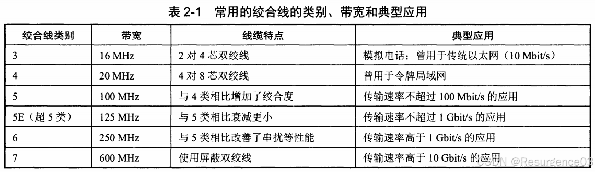

- 仅**7类线**为STP

#### 同轴电缆

- 基带同轴电缆
  - 50Ω
  - **数字传输**
- 宽带同轴电缆
  - 75Ω
  - **模拟传输**和**有线电视传输**

#### 光纤

- 多模光纤
  - 允许多条光线在光纤内全反射传播
  - 存在长距离失真，一般用于**短距离传输**
  - 便宜
  - 对光源要求低
    - LED即可
- 单模光纤 
  - 光纤直径与光的波长相近，光只能直线传输而不能折射
  - 传输距离长
  - 贵
  - 对光源要求高
    - 必须使用半导体激光器
  - 接收端采用光电二极管

光纤相较于传统铜导线

- 带宽高
- 衰减小
- 轻
- 安装要求高
- 弯折易损坏
- 单光纤不能双工通信
- 成本高

### 非导引型媒体

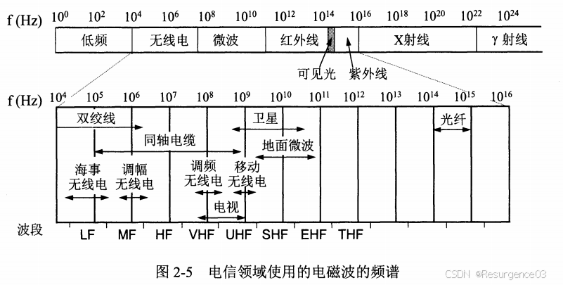

- 无线电传输
  - 低频全方向传播，穿透性好
  - 高频直线传播，穿透性差
- 微波传输
  - 直线传播，穿透性差
- 红外传输
  - 距离短，不能穿越固体
- 光通信
  - 距离和稳定性受大气条件影响

## 设备

- 中继器：延长信号传播长度
- 集线器：RJ45接口，无碰撞检测

## 数据通信理论

- 模拟信号：连续信号，参数取值是连续的
- 数字信号：离散信号，参数取值是离散的

------

- 单向通信：单工通信
- 双向交替通信：半双工通信
- 双向同时通信：全双工通信

------

- 信源编码器/解码器：信息数字化及逆过程
- 加密器/解密器：信息传输前加密，收到后解密
- 信道编码器/解码器：检测纠正错误

------

Fourier变换：将时域信号和分解为频域信号

------

### 信道极限容量

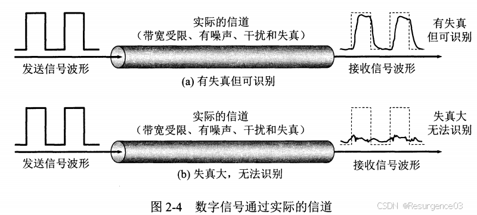

（模拟）带宽：信道能够通过的**频率范围**，单位Hz

- 频率在带宽内的波振幅不会**显著**衰减 	

  - 高频显著衰减磨平了数字信号的上下沿，出现码间串扰
  - 即使频率在带宽内，多少也有损耗
  
- 约定0到能量衰减50%的频率为带宽

比特率（数字带宽）：信道的**最大传输速率**，单位bit/s

波特率：每秒传输的**信号数**，单位Baud

- 记信号等级数为$L$，那么一个信号需要$\log_2L$位编码
- $比特率=波特率 \times \log_2L$

基带信号：频率从0到带宽的信号

通带信号：频率在基带信号的基础上作一次偏移

#### Nyquist定理

采样频率问题：对于通过了**带宽为B**的低通滤波器的复合信号，**还原信号**需要采样达到多少频率

- 理想**无噪声**
- 适用于**所有传输介质**

$$
frequency\ of\ sample = 2B
$$

$$
digital\ bandwidth = 2B \log_2V
$$

- V为离散等级数

#### Shannon定理

##### 信噪比SNR

- S：信号平均功率
- N：噪声平均功率

$$
SNR = 10 \log_{10} \dfrac{S}{N}
$$

- 单位dB

##### Shannon公式

$$
digital\ bandwidth = B \log_2\left(1+\dfrac{S}{N}\right)
$$

### 数字调制技术

将数字信号变为模拟信号

设备：调制器/解调器

- 低频和直流分量的处理 
  - 大多数信道承载的是**模拟信号**

#### 基带传输

数字数据的数字传输，直接用数字信号传输

- 信号将占据0到带宽的所有频率（Fourier变换结果）

##### 基带调制

把数字信号变成当前信道可用的数字信号，又称编码

###### 提高数据传输率方法

- 增大**离散等级数**
- 增大**信号时钟频率**
  - 时钟同步：接收器必须能够分清两个符号的分界

###### 常见基带调制方式

- **不归零编码NRZ**：正电平为1，负电平为0

  - 不能自同步，除非同时传时钟信号（效率低）

- **归零编码RZ**：正电平为1，负电平为0，**每个bit周期结束前都归零**

  - 可自同步

- **不归零逆转编码NRZI**：信号**有无跳变**决定0或1

  - 要避免发送多个连续的无跳变位

- **Manchester编码**：每个bit周期**中心**的**跳变方向**决定0或1

  - 可自同步
  - 编码效率低
  
- **差分Manchester编码**：每个bit周期**中心**都有用于**同步**的跳变，**周期开始时**有跳变为0，无跳变为1

  - 可自同步
- 检测比Manchester编码容易
  - 信号被反转，bit信息保持不变

- **双极编码AMI**：相邻的1用不同的正负电平表示，0均为零电平

  - 不能自同步
- 是平衡码：短时间内正负电压时间相等
    - **无直流分量**

- **4B/5B编码**：**用5位码唯一指定一个4位码**，多出来的16种5位码可用于控制信号

  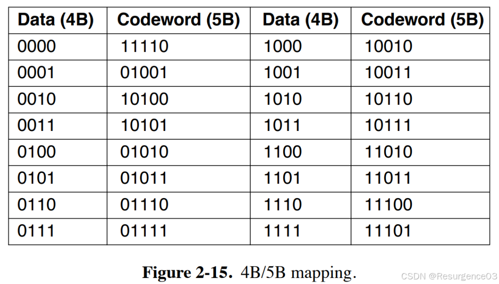

  - 25%的低额外开销
- 最多只有连续3个0

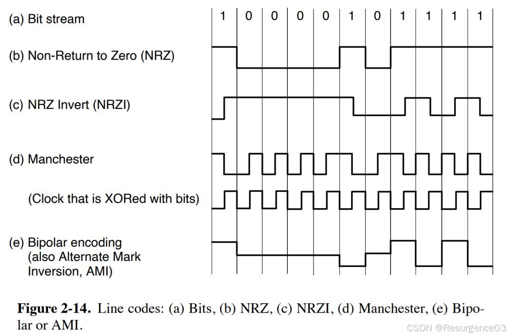

#### 通带传输

数字数据的模拟传输

##### 通带调制

分别调制波的振幅，频率，相位

- 振幅，频率，相位可结合调制
- 但是**频率，相位一般不结合**（频率会影响相位）

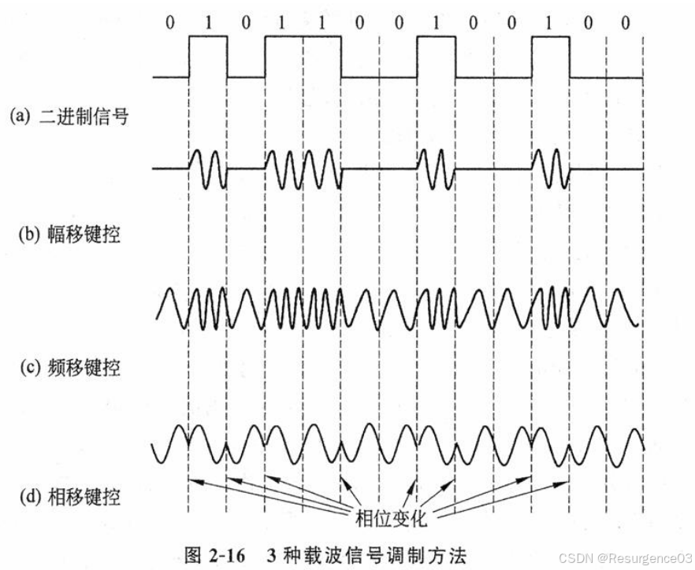

###### 幅移键控ASK

不同振幅表示不同位

###### 频移键控FSK

不同频率表示不同位

###### 相移键控PSK

不同初相位表示不同位

- 二进制相移键控BPSK：初相位分别选为0和$\dfrac{\pi}{2}$
  - 每个符号可表示0或1
- 正交相移键控QPSK：初相位分别选为0、$\dfrac{\pi}{4}$、$\dfrac{2\pi}{4}$、$\dfrac{3\pi}{4}$
  - 每个符号可表示2bits

###### 正交调幅QAM

混合调制：ASK+PSK

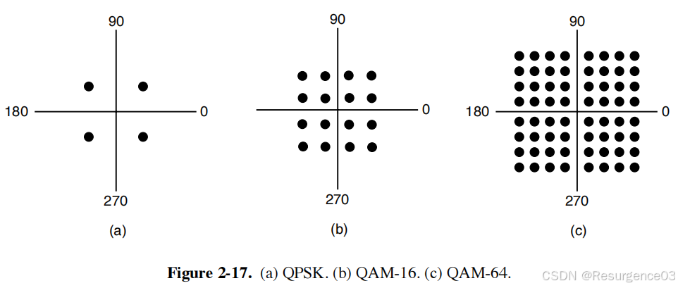

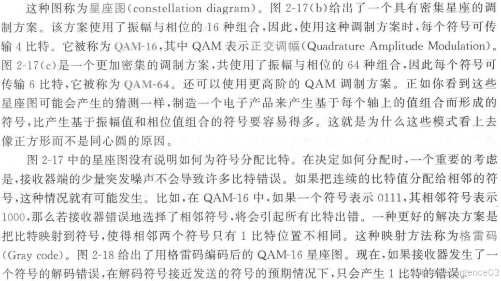

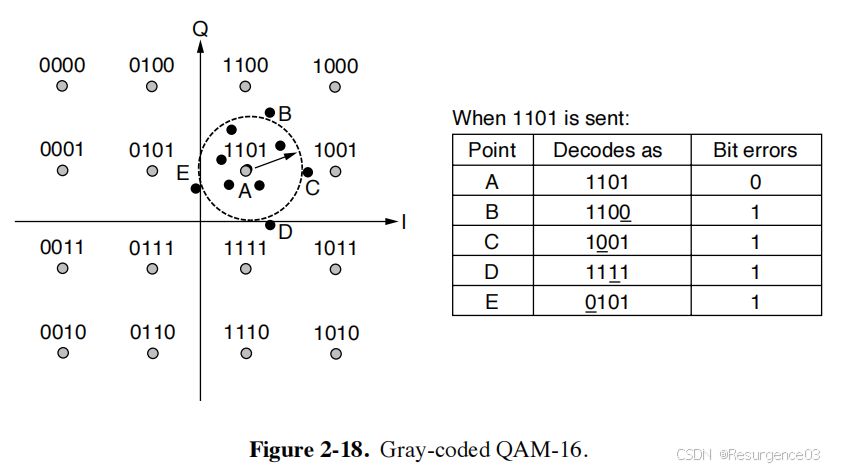

### 多路复用技术

设备：多路复用器/解复用器

#### 频分复用FDM

复用的所有用户同时占用**不同的模拟带宽**资源

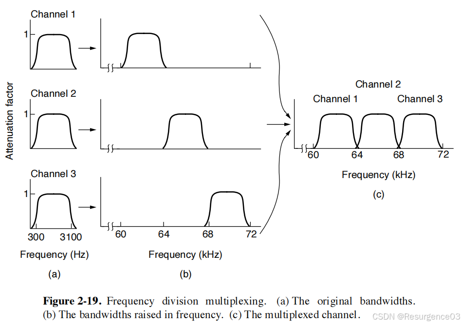

#### 时分复用TDM

用户以循环方式轮转，周期性地获得**等长**的时间片

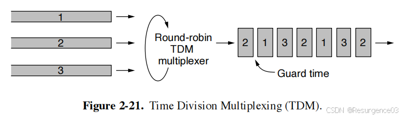

- 统计时分复用STDM不是时分复用，不属于物理层，是包交换

#### 码分复用CDM

又称码分多址CDMA

1bit用m个码片发送，每个CDMA站点固定自身长为m的码片序列

- 如果站点**发送1**，就发送自身码片**序列**
- 如果站点**发送0**，就发送自身码片**序列的反码**

------

- 不同站点的码片序列**正交**
- 码片序列的规格化内积为1（**内积为m**）

------

- 如果X想从信道中接受Y的信号 
  - X必须先知道Y的码片序列
- 用Y的码片序列与信道中信号做**规格化内积**（除以m）
- 由于Y与其他码片序列正交，与对应序列反码也正交
- 规格化内积结果只剩下Y的信号 
  - 如果结果为1，表明发送的是1
  - 如果结果为-1，表明发送的是0

------

用户间无干扰，抗干扰能力强

#### 波分复用WDM

利用光的不同波长在光纤上实现频分复用

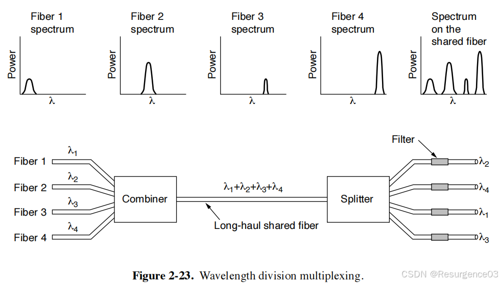

## 交换

消息的物理途径

- 电路交换
- 报文交换
- 分组交换

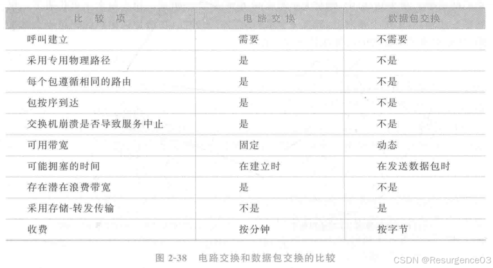

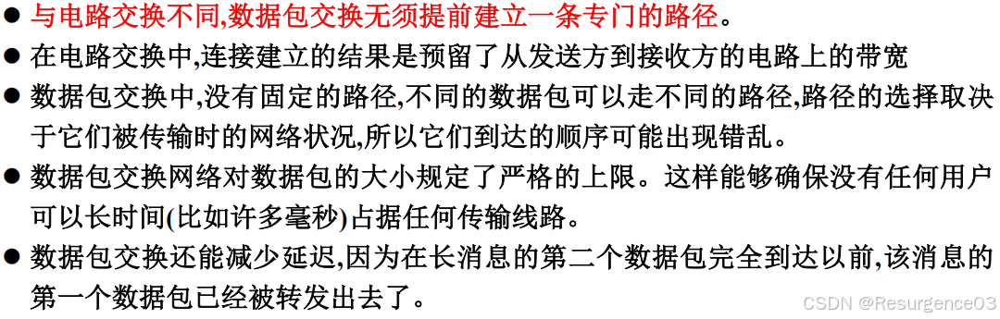

## 时延

- 处理时延：检查分组首部，决定将该分组导向何处所需要的时间
- 排队时延：分组在链路上的队列中等待传输所需要的时间
- 传输时延：将所有分组的比特推向链路所需要的时间
- 传播时延：从该链路的起点到终点所需要的时间

## 蜂窝网络

相邻的蜂窝频率不能相同

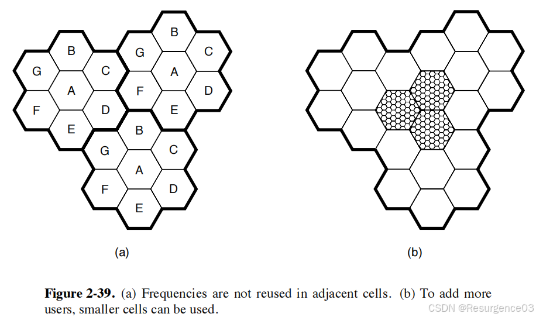