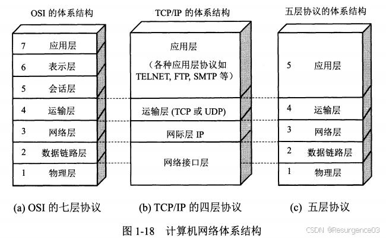
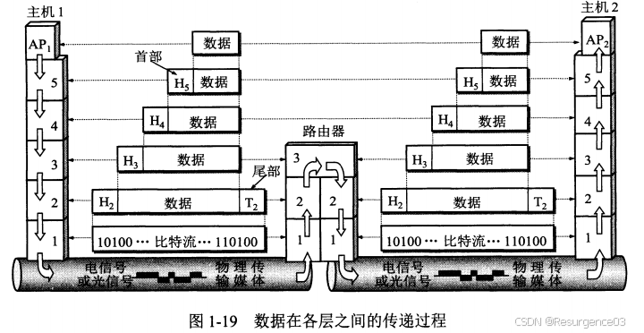
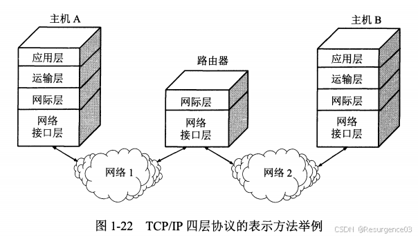
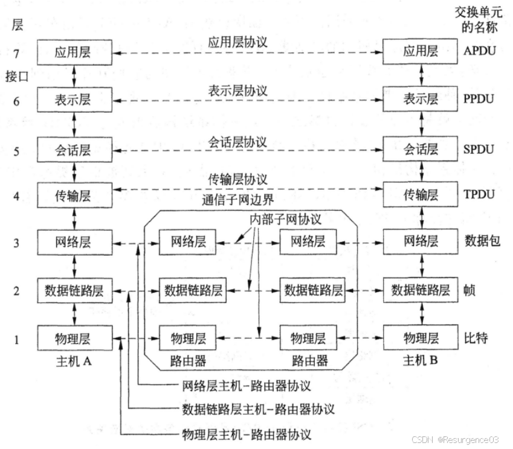

# 网络参考模型

## 五层体系结构

- 物理层
  - 传输二进制比特
- 数据链路层
  - **无差错**数据传输
- 网络层
  - 异构网络互联
- 传输层
  - 端到端的数据传输服务
- 应用层
  - 部署Internet管理和应用服务

## TCP/IP参考模型

4层模型

- 网络接口层 = 物理层 + 数据链路层
- 网际层 = 网络层
  - 仅支持无连接通信
- 传输层
  - 支持无连接和有连接通信
- 应用层

## OSI参考模型

7层模型

- 物理层
- 数据链路层
- 网络层
  - 支持无连接和有连接通信
- 传输层
  - 仅支持有连接通信
- 应用层 + 表示层 + 会话层 = 应用层

会话层：管理和控制两个通信系统之间的对话（会话），确保数据交换按照预定的会话流程进行会话的建立、维护和终止

- 数据的同步和排序
- 会话数据的分割和管理
- 多个同时进行的会话的管理

表示层：处理两个通信系统中信息交换的表示问题

- 数据的**格式化**，确保一个系统的数据可以被另一个系统理解
- 数据加密和压缩，以保证数据的安全性和有效性
- 数据转换，包括数据格式的转换、数据编码的转换等
- **异常处理**，确保数据的完整性和正确性