# 【计网笔记】传输层

#  向上应用层服务

- 向进程分发交付数据报
- 服务原语 
  - 提供给应用层的网络层接口
  - 对应用层隐藏下层网络实现

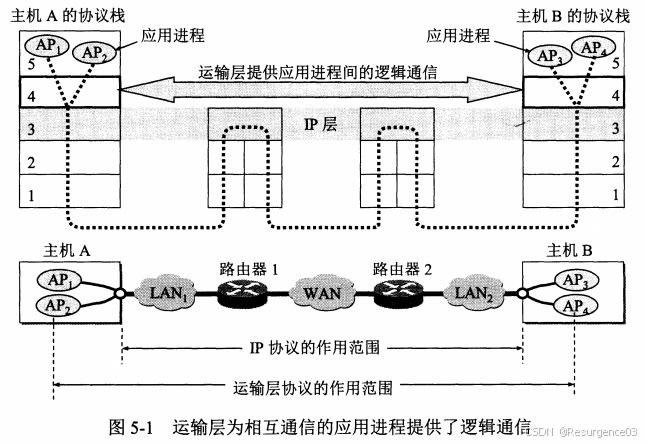编辑

## 端口

对进程的标识符

- 传输层根据端口号决定将来自网络层的报文交付给哪个进程
- 是协议栈层间的**抽象**接口
- TSAP：传输服务接入点
  - 套接字socket = {IP: 端口号}
- NSAP：网络服务接入点
  - IP地址
- 知名端口号：0~2^10-1
- 其他端口号：2^10~2^16-1

# 用户数据报协议UDP

- 无连接服务 
  - 无需socket
- 尽最大努力交付 
  - 不可靠传输
  - 无拥塞控制
- 面向消息流传输
- 支持m对n的交互通信 
  - **支持多播**

## UDP首部

共**8字节**

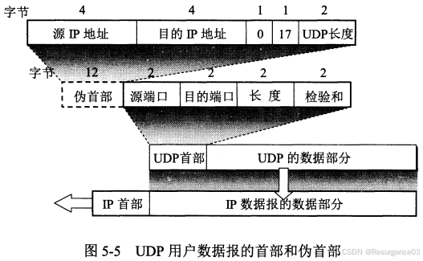编辑

- 伪首部 
  - 12字节
  - 用于计算检验和，计算完即丢弃
- 源端口 
  - 2字节
  - 选用
- 目的端口 
  - 2字节
  - 必须使用
- 长度 
  - 2字节
  - 包括首部8字节的**总**长度
- 检验和 
  - 2字节
  - 计算方法同IP数据报
  - **首部**和**数据部分**都要检验
    - 传输层职责
    - IPv4首部检验和**只检验首部**

## UDP消息传输

- UDP收到来自应用层的报文，添加UDP首部后即交付网络层 
  - UDP只添加首部，不做其他任何事情
  - 应用层只能自己选择合适的报文长度
- 一次发送一个报文

------

- UDP收到来自网络的报文，去除UDP首部后即交付应用层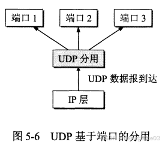编辑
- 一次交付一个报文

## 快速UDP互联网连接QUIC

多个Web对象复用**同一个UDP流**

- 减小一台主机连接到同一个服务器上的多个Web对象的UDP连接开销
- 复用的Web对象间彼此不会干扰

# 传输控制协议TCP

- **可靠**传输
- 有连接服务
  - 需要socket
    - TCP连接 = {socket1, socket2} = {(IP1: port1), (IP2: port2)}
  - 全双工点到点 	
    - **不支持多播/广播**
- 面向字节流传输 
  - TCP流内信息无消息边界
  - TCP给字节流中每个字节编号
- 发送时控制发送速率
- 接收时按序装配数据报

## TCP首部

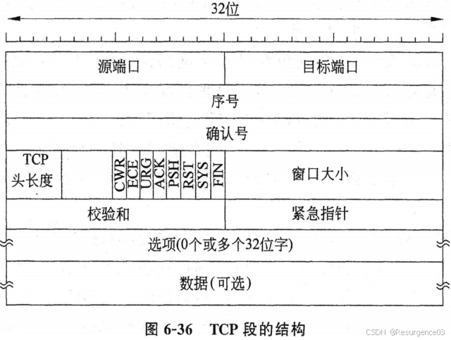编辑

- 源端口 

  - 2字节

- 目的端口 

  - 2字节

- 序号seq 

  - 4字节
  - 该TCP报文的第一个字节的序号

- 确认号ack 

  - 4字节
  - 期望收到**下一个报文段的第一个字节**的序号
  - 累计确认机制

- 数据偏移 

  - 4字节
  - 单位为4字节
  - TCP报文段的数据起点到TCP报文段的起点距离 = TCP首部长度

- 保留

- 标志位 

  - CWR
  - ECE
  - URG
  - ACK 	
    - 确认号字段有效，表示该报文是对上面某条报文的确认
    - 在TCP连接建立后ACK必须置1
  - PSH 	
    - 推送数据
    - 传输层收到后立刻交付应用层，不缓冲
  - RST 	
    - 重置连接
  - SYN 	
    - 标识连接请求或接受连接报文 		
      - SYN = 1 && ACK = 0：连接请求报文段
      - SYN = 1 && ACK = 1：连接接受报文段
    - SYN = 1的报文不携带数据
  - FIN 	
    - 释放连接 		
      - FIN = 1：该报文发送方请求释放连接

- 窗口 

  - 2字节

  - 发送该报文方的

    接收窗口

    大小 = 现在允许对方发送的数据量 	

    - 无窗口扩大选项时，窗口大小为2^16 - 1 = 65535

- 检验和 

  - 2字节
  - 同UDP

- 紧急指针 

  - 2字节
  - 单位为1字节
  - 紧急数据长度 	
    - 普通数据紧跟在紧急数据后

- 选项 

  - 0~40字节 	
    - TCP首部最短20字节
    - TCP首部最长60字节
  - 最大报文段长度MSS
    - 过短会导致利用率低
    - 过长会导致IP协议分片
    - TCP连接建立时，双方把自己能支持的MSS写入该字段
  - 窗口扩大选项 	
    - 3字节
    - 窗口字段左移多少位（最多14位）
  - 时间戳选项 	
    - 10字节
  - 选择确认SACK选项

- 填充

## 连接管理

### 最长报文段寿命MSL

TCP报文最多在网络中存在的时间

### 建立连接-三报文握手法

编辑

- 客户端，服务器分别在本地创建传输控制块TCB
- 服务器进入LISTEN状态
- 客户端向服务器发送**连接请求报文**
  - SYN = 1
  - ACK = 0
  - 序号段记为x 	
    - **消耗一个序号**
    - **随机指定初始序号**，防止与上个TCP连接中的TCP报文混淆
  - 客户端进入SYN-SENT状态
- 服务器向客户端发送**连接接受报文**
  - SYN = 1
  - ACK = 1
  - 确认号段为x + 1
  - 序号段记为y 	
    - **消耗一个序号**
  - 服务器进入SYN-RCVD状态
- 客户端收到连接接受报文
  - 客户端进入ESTABLISHED状态
- 客户端发送**对连接接受报文的确认**
  - SYN = 0
  - ACK = 1
  - 确认号段为y + 1
  - 序号段为x + 1 	
    - **如果不携带数据，这个序号不消耗**
- 服务器收到客户端的确认报文
  - 服务器进入ESTABLISHED状态

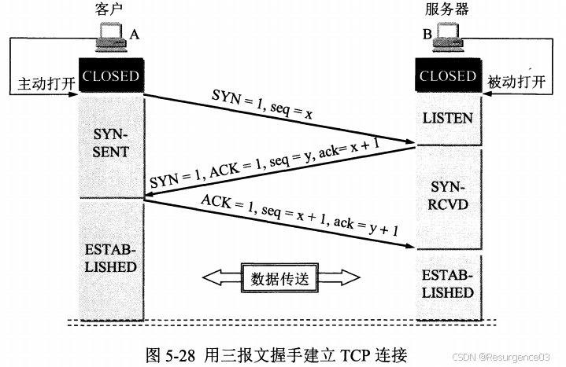编辑

### 释放连接-四报文握手法

- 客户端向服务器发送**释放请求报文**
  - FIN = 1
  - 此时序号段记为u
  - 客户端进入FIN-WAIT-1状态
- 服务器收到释放请求报文
  - 应用进程通知TCP释放连接
  - 应用进程发送**对释放请求报文的确认**
    - 各字段、标志正常设置
  - 服务器进入CLOSE-WAIT状态
- 客户端收到服务器对释放请求报文的确认，进入FIN-WAIT-2状态
- 服务器发送**连接释放报文**
  - 服务器进入LAST-ACK状态
- 客户端收到连接释放报文，发送**对连接释放报文的确认**
  - 客户端进入TIME-WAIT状态，持续2MSL 	
    - 防止连接释放报文的确认丢失导致服务器不能进入CLOSED态 		
      - 服务器端没有收到对连接释放报文的确认，超时重传连接释放报文
      - 客户端收到重传的连接释放报文，重启2MSL计时器
    - 确保该连接的报文段全部消失，不会影响下一个连接
  - 客户端关闭本地TCB，进入CLOSED态
- 服务器收到对连接释放报文的确认
  - 服务器关闭本地TCB，进入CLOSED态

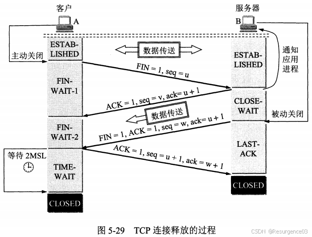编辑

### TCP连接有限状态机

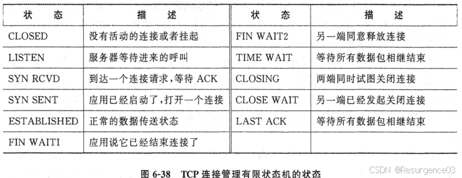编辑

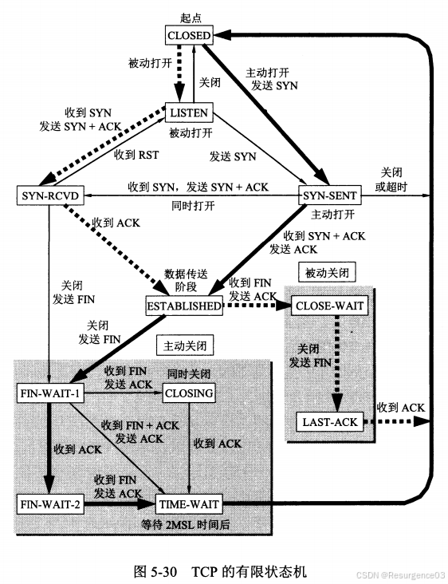编辑

## 可靠传输

### 滑动窗口策略

- 发送方按接收方在建立连接阶段给出的窗口值构造发送窗口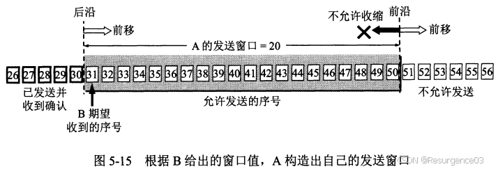编辑

- 可用窗口：发送窗口内还未发送的标号

  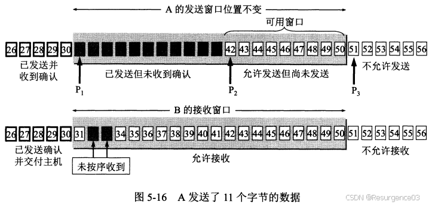编辑

  - 可用窗口为0时停止发送，等待确认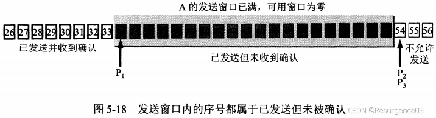编辑

- 发送方收到确认号即可向前滑动发送窗口

  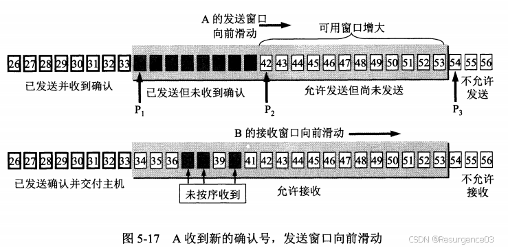编辑

  - 确认号是累计确认的

- 接收方只有收到接收窗口的连续最小号才发送确认 

  - 未按序收到的数据先缓存

### 超时重传时间选择

核心：估计**报文段往返时间RTT**

#### 线性内插预测

### 选择确认SACK

接收方通知发送方缺失区间，重传区间内报文

- 双方建立TCP连接时约定启用SACK选项
- SACK选项声明 
  - 1字节
- SACK选项长度 
  - 1字节
- 给出数据报缺失标号区间集合{[left, right)} 
  - 至多指定4个区间（8个位置，占32字节）

## 流量控制

点对点的通信量控制

### 滑动窗口控制

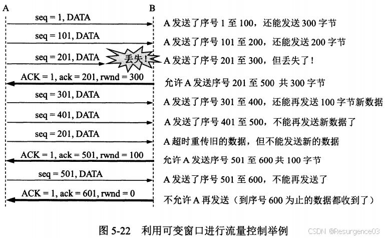编辑

- 可能出现死锁 
  - 对于零窗口通知，设置**持续计时器**
  - 计时到，发送**零窗口探测报文**

### 逐字节交互控制

#### Nagle算法 

解决因**发送方**TCP逐字节下发，数据太少（1字节）导致数据报包装（40字节）不划算问题

- 发送方先发包含**1个数据字节**的数据报，**缓存后续**数据字节
- 当且仅当发送方**收到确认**，发送方把缓存的所有数据字节**组装为一个数据报**发出

#### Clark算法

解决**低能窗口综合征**：因**接收方**TCP逐字节交付，窗口太小导致不划算问题

- 接收方**等待**接收窗口满足
  - **可用空间过半**
  - 或**可用空间超过MSS**
- 接收方**发送确认**

## 拥塞控制

整体网络通信量控制

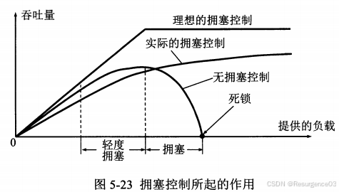编辑

### 基于窗口的拥塞控制

 发送方维护拥塞窗口cwnd，发送窗口 = 拥塞窗口

- 只要网络没有拥塞，就扩大拥塞窗口
- 只要网络出现拥塞，就缩小拥塞窗口 
  - 判断依据：出现超时

传输轮次：将拥塞窗口cwnd内的连续报文段都发送出去，并全部收到确认所需要的时间

- 数值上等于往返时间RTT

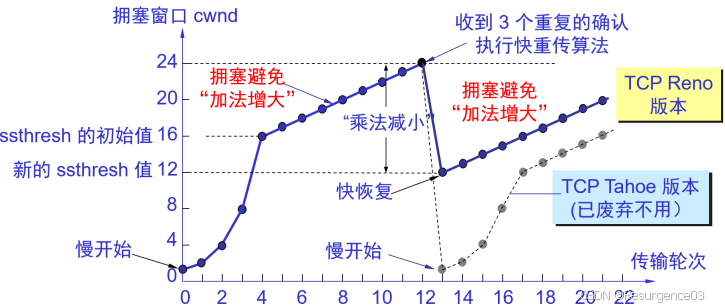编辑

#### Tahoe算法

##### 慢开始

- 初始设置cwnd为较小的值（1~4倍MSS的字节数）
- 每收到一个报文段确认，就把拥塞窗口增加最多1倍MSS的字节数

发送方在确认都收到的情况下，每经过一个传输轮次，**cwnd翻倍**

- 网络不拥塞时，cwnd将指数增长
- 实际上只要收到确认就会cwnd++

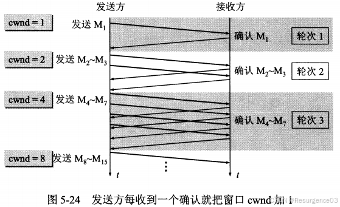编辑

**慢开始门限ssthresh**：换用拥塞避免方法阈值

出现超时：**cwnd = 1**

##### 拥塞避免-加法增大AI

- 并非可以避免拥塞
- 不容易出现拥塞

发送方在确认都收到的情况下，每经过一个传输轮次，**cwnd += 1**

##### 快重传

- 对于确认策略的修改 
  - 接收方每收到一个报文都发送确认，确认的是按序收到的最大报文号
  - 3-ACK：发送方收到连续3条对某号报文的确认 	
    - 表明下一条报文已经丢失，需要重传
    - 重传下一条报文

##### ssthresh更新策略-乘法减小MD

一旦出现**超时**或**3-ACK**

- ssthresh = 0.5 * **cwnd**
  - **并非ssthresh折半**

#### Reno算法

对Tahoe算法慢开始的改进，出现3-ACK后直接进入拥塞避免阶段

##### 快恢复

##### 出现3-ACK：**cwnd = ssthresh**

- **cwnd折半**
- 随后直接进入拥塞避免阶段
- 超时时仍**cwnd = 1**

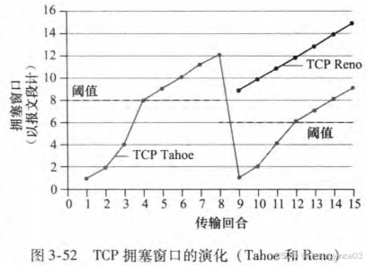编辑

#### CUBIC算法

对Reno算法拥塞避免前期线性增长速度的改进

执行快恢复后，cwnd以**立方函数**速度快速**上升至原丢包值附近**，并缓慢向上试探

- 如果网络性能有改善，立方函数突破原丢包值后快速上升，而后快速拥塞，达到新的平衡位置

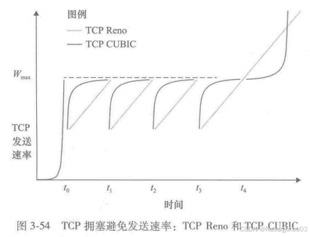编辑

### 基于瓶颈带宽的拥塞控制

中介设备的大缓冲区导致延迟高和丢包

- 发得快超时也快，一旦超时就会重发

#### BBR

- 测量瓶颈带宽和往返时间，得到带宽-延迟乘积
  - 不断增加在途数据包数量
  - 一旦发生传递速率不再上升，且往返时间上升的现象，表明找到了带宽-延迟乘积临界点
- BBR控制发送速率，使得**在途数据包大小 = 带宽-延迟乘积**

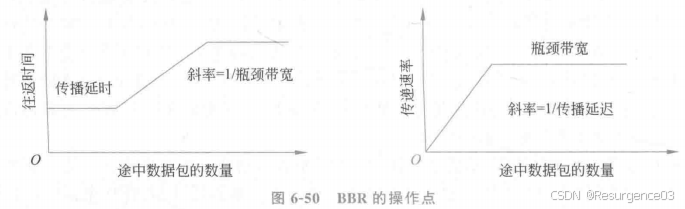编辑