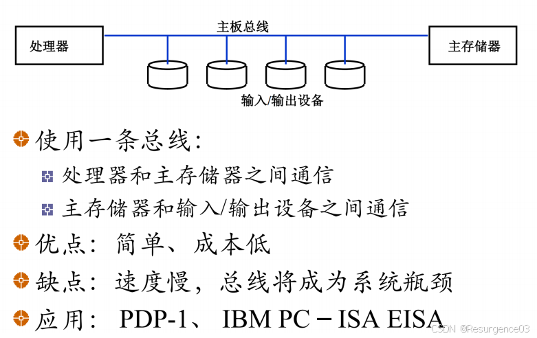
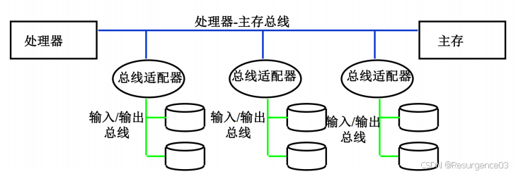
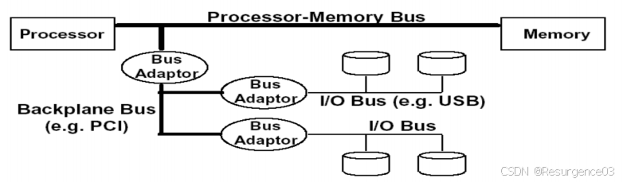
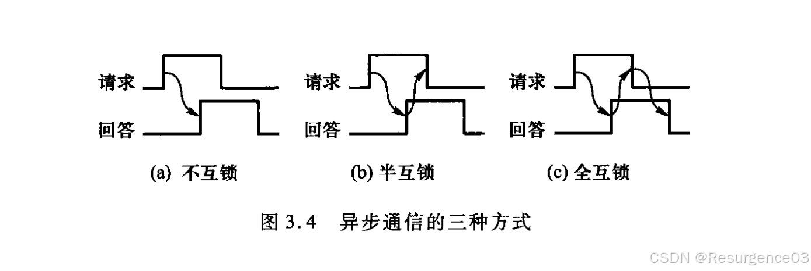
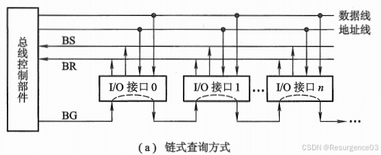
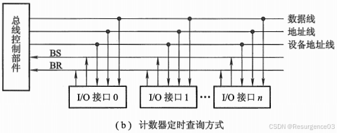
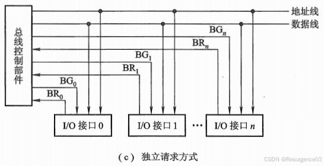
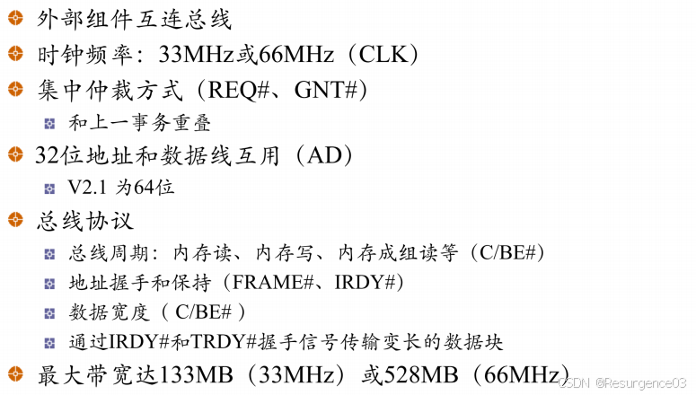
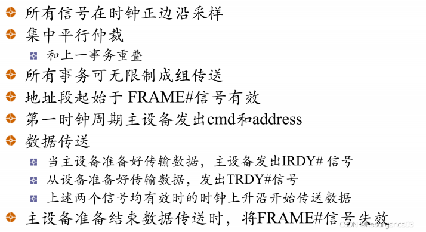

# 总线

##  总线分类

单总线

双总线

三总线

现代PC采用**三总线**结构

- **处理器-主存总线**
- **I/O总线**
- **主板总线**

## 总线组成

- 控制线
- 数据线 
  - 可以与地址线复用
- 地址线

## 总线事务

从请求总线到完成总线使用的操作序列称为总线事务，它是在一个总线周期中发生的一系列活动。

- 对于一个主模块的系统 
  - 发起命令（和地址）
    - 主设备发起事务
  - 传输数据
    - 从设备按主设备的读写要求发送或接收数据
- 一般地 
  - 申请分配阶段
  - 寻址阶段
  - 传数阶段
  - 结束阶段

## 性能指标

- 总线周期：完成一次**总线操作**的时间
- 总线宽度：总线中数据线条数，即单次同时传输信息的位数
- 总线工作频率：单位时间内可以传送数据的次数，一般是时钟周期的倍数
- 总线带宽：即最大传输率，不考虑地址传送、总线仲裁等所花费的时间，总线在进行数据传输时单位时间内最多可传输的数据量
  - $B = W \times \dfrac{F}{N}$
    - B为总线带宽，常用MB/s
    - F/N是总线工作频率
      - F为总线时钟频率
      - N为完成一次传送需要的时钟周期数
  - 增加带宽办法
    - 增加总线宽度
    - 分别设置数据总线和地址总线
    - 采用成组传送（突发）方式
- 总线定时方式 
  - 同步总线
    - 必须按最慢速度的部件设计时钟周期
      - 适合存取时间相差不大的功能部件间通信
    - 传输协议根据时钟信号制定
      - 例如主设备提出总线请求后5个时钟周期，可以获得是否使用总线的信号
    - 简单
    - 效率较低，总线长度较长时传送波形会变形，导致最快位与最慢位的时间差较大
  - 异步总线
    - 使用握手（应答）协议
    - 总线周期不固定
    - 
  - 半同步通信
- 总线传送方式
  - 非突发方式 	
    - 每个传送周期内都先传送地址，再传送数据
  - 突发方式
    - 先给出数据块在存储器中的**首地址**，然后**连续传送**数据块的后续数据
    - 后续数据地址默认为前面数据地址递推得到
    - 复杂度提高，延长后续总线请求的等待时间（自私）

## 总线仲裁

- 集中仲裁：控制逻辑集中设置（如CPU）
  - 链式查询
    - 
    - 离控制部件最近的部件有最高的优先级
    - 可能导致饥饿
  - 计数器定时查询
    - 
    - 设备地址与计时器相同时可以占用
  - 独立请求（集中平行仲裁）
    - 
- 分布仲裁
  - 自我选择
  - 碰撞检测
    - 以太网

## PCI总线

