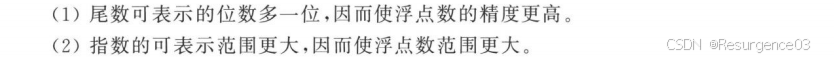
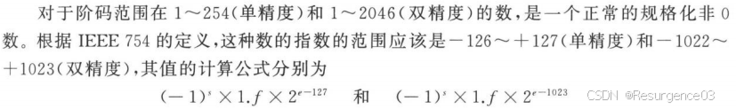
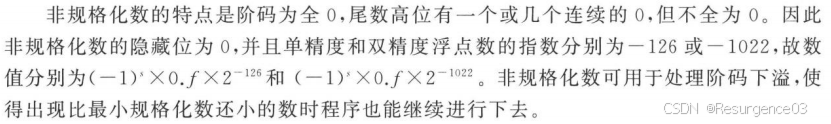
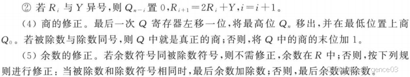

# 【计组笔记】机器数表示及运算

# 机器数表示

## 整数表示

### 原码表示

### 补码表示

### 反码表示

### 8421码（NBCD码）

## IEEE754标准浮点数表示

对于单精度浮点数，加入隐藏位后，尾数第k位代表2^{-k}

### 规格化非0数

阶码非全0非全1

对于单精度规格化浮点数，阶最低为-126，最高为127

- 若无偏置常数修正，阶最低为-127，最高为126

规格化浮点数的最小绝对值为1.0×2^{-126}，最大为1.0×2^{127}-2^{-24}

### 非规格化非0数

阶码全0，但尾数不全为0

规格化浮点数的下溢

单精度非规格化浮点数的阶固定为-126

非规格化浮点数的最小绝对值为2^{-24}×2^{-126}，最大为(1-2^{-24})×2^{126}

### 0

阶码尾数全0，符号位无所谓

虽然有+0和-0，但也无所谓

### +Inf/-Inf

全1阶码全0尾数

牺牲了阶为127的浮点数以表示无穷大，并以此作为浮点数的上/下界

比Inf绝对值更大的约定为NaN

### NaN

全1阶码非0尾数

# 机器数运算

## 整数运算

### 补码除法

## 浮点数运算

# 非数值数据编码

## ASCII

- 使用7位，共128个字符
- 存储时使用1个字节，最高位可存奇偶校验位

## Unicode

- 使用16位，共65536个字符

## UTF-8

- 变长字符

  编码 	

  - 可扩展性强

- 首字节给出当前字符占用的字节数 

  - 1字节以0开头 	

    - 兼容ASCII码

  - 多字节

    以**字节数**的1和0开头

    - 2字节字符以110开头，5字节字符以111110开头

- 除首字节以外的字节均以10两位开头，可自同步