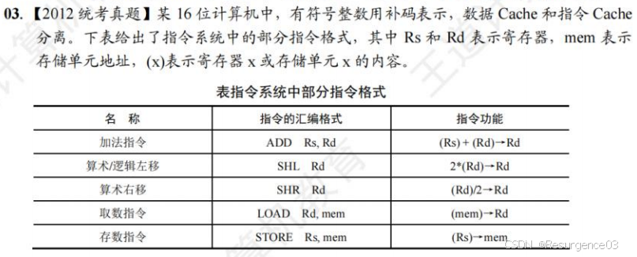
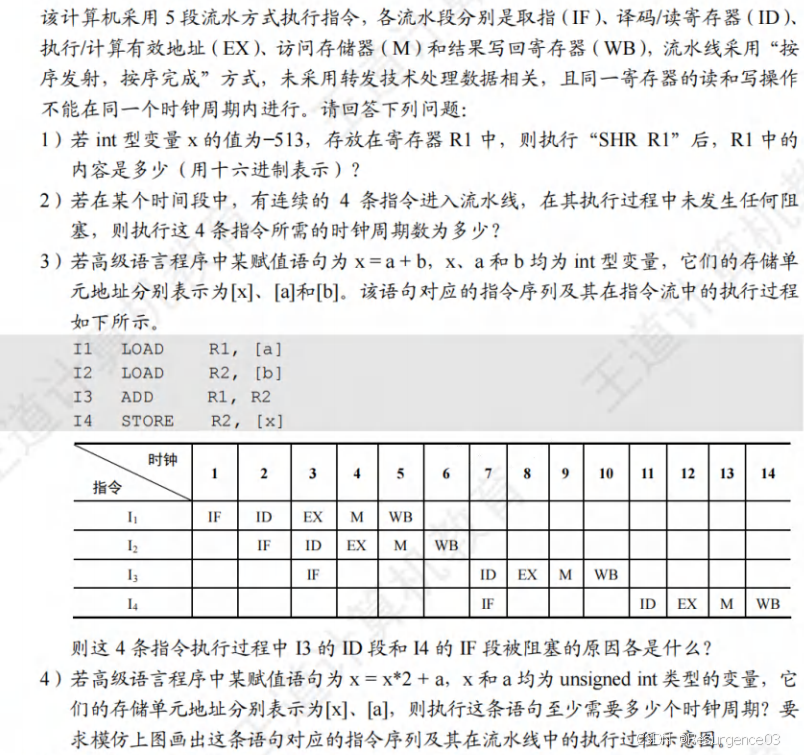
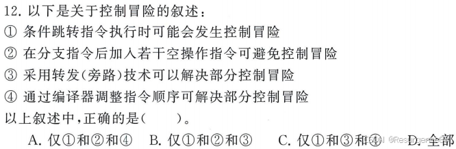
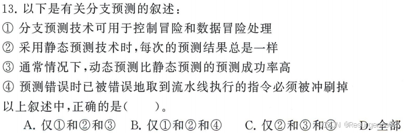
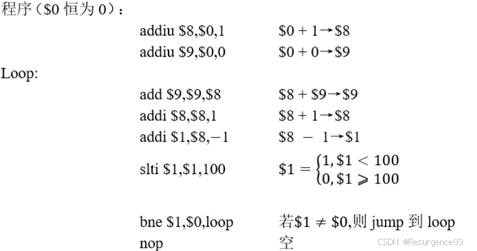
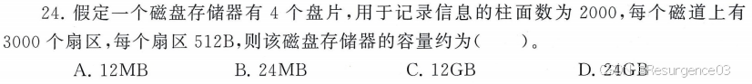
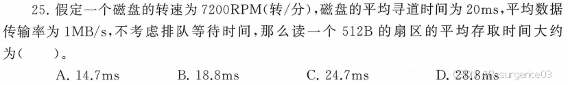
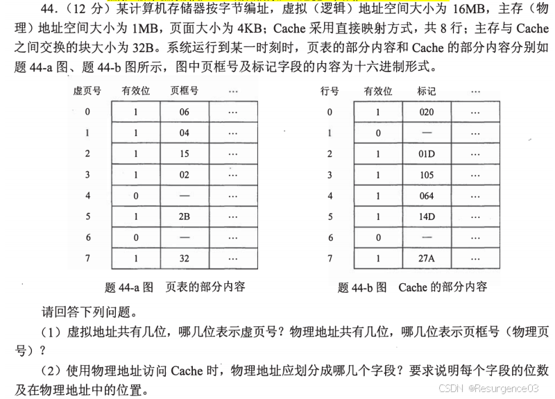
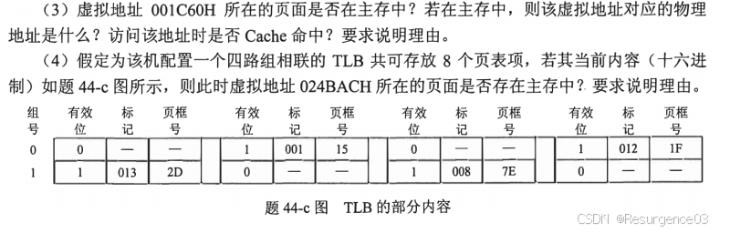

# 习题

##  指令系统

## CPU

>  【2012-408】
>
> 
>
> 
>
> 1) [R1] = 1111 1101 1111 1111
>
> SHR R1 → [R1] = 1111 1110 1111 1111 = 0xFEFF
>
> 2) 8
> 3) 未转发，I3的源寄存器在I2写回寄存器后才能获取，插入了3个气泡，I4的IF段随之阻塞
> 4) 需要17个时钟周期
>
> |               | 1    | 2    | 3    | 4    | 5    | 6    | 7    | 8    | 9    | 10   | 11   | 12   | 13   | 14   | 15   | 16   | 17   |
> | ------------- | ---- | ---- | ---- | ---- | ---- | ---- | ---- | ---- | ---- | ---- | ---- | ---- | ---- | ---- | ---- | ---- | ---- |
> | LOAD R1, [x]  | IF   | ID   | EX   | M    | WB   |      |      |      |      |      |      |      |      |      |      |      |      |
> | LOAD R2, [a]  |      | IF   | ID   | EX   | M    | WB   |      |      |      |      |      |      |      |      |      |      |      |
> | SHL R1        |      |      | IF   |      |      | ID   | EX   | M    | WB   |      |      |      |      |      |      |      |      |
> | ADD R2, R1    |      |      |      |      |      |      | IF   |      |      | ID   | EX   | M    | WB   |      |      |      |      |
> | STORE R1, [x] |      |      |      |      |      |      |      |      |      | IF   |      |      |      | ID   | EX   | M    | WB   |

> 【2018-912】指令可以分为5个阶段完成，流水线模块延迟10ns，流水线寄存器延迟5ns，执行下面一组指令所需时间至少是多少？分别采用旁路技术和不采用旁路技术两种情况分析。
>
> Iw R1, 0(R2)
>  sub R3, R1, R4
>  add R5, R1, R6
>  or R7, R1, R8
>  add R9, R1, R10
>
> - 采用旁路技术 
>
>   - load-use冲突，插入1个气泡 	
>
>     - load指令MEM/WB送数据给sub指令EXE段
>
>   - 其他指令间无冲突
>
>   - |                 | CC1  | CC2  | CC3  | CC4  | CC5  | CC6  | CC7  | CC8  | CC9  | CC10 |
>     | --------------- | ---- | ---- | ---- | ---- | ---- | ---- | ---- | ---- | ---- | ---- |
>     | Iw R1, 0(R2)    | IF   | ID   | EXE  | MEM  | WB   |      |      |      |      |      |
>     | sub R3, R1, R4  |      | IF   | ID   |      | EXE  | MEM  | WB   |      |      |      |
>     | add R5, R1, R6  |      |      | IF   |      | ID   | EXE  | MEM  | WB   |      |      |
>     | or R7, R1, R8   |      |      |      |      | IF   | ID   | EXE  | MEM  | WB   |      |
>     | add R9, R1, R10 |      |      |      |      |      | IF   | ID   | EXE  | MEM  | WB   |
>
>   - 需要10个时钟周期：10×15=150ns
>
> - 不采用旁路技术 
>
>   - load-use冲突，插入2个气泡 	
>
>     - load指令WB前半段写入，sub指令ID后半段读出
>
>   - 其他指令间无冲突
>
>   - |                 | CC1  | CC2  | CC3  | CC4  | CC5  | CC6  | CC7  | CC8  | CC9  | CC10 | CC11 |
>     | --------------- | ---- | ---- | ---- | ---- | ---- | ---- | ---- | ---- | ---- | ---- | ---- |
>     | Iw R1, 0(R2)    | IF   | ID   | EXE  | MEM  | WB   |      |      |      |      |      |      |
>     | sub R3, R1, R4  |      | IF   |      |      | ID   | EXE  | MEM  | WB   |      |      |      |
>     | add R5, R1, R6  |      |      |      |      | IF   | ID   | EXE  | MEM  | WB   |      |      |
>     | or R7, R1, R8   |      |      |      |      |      | IF   | ID   | EXE  | MEM  | WB   |      |
>     | add R9, R1, R10 |      |      |      |      |      |      | IF   | ID   | EXE  | MEM  | WB   |
>
>   - 需要11个时钟周期：11×15=165ns

> 【2020-912】提高流水线的段数可提高CPU的频率，并提高单位时间内执行指令的速度。（×）

> 【2020-912】MIPS 中断中不是由硬件负责的是（B）
>
> A.保存断点
>
> B.保存寄存器
>  C.关中断
>  D.保存异常原因

> 【2023-912】5级流水线处理器实现中，指令流经各个功能段的时间分别为60ns、50ns、40ns、60ns、30ns，忽略流水线寄存器的延迟，则该处理器的时钟周期至少是（A）
>
> A. 60ns
>
> B. 50ns
>
> C. 40ns
>
> D. 30ns

> 【2023-912】应用程序执行的过程中发生了中断或者异常，假设在指令A处发生了中断或者异常，以下描述正确的是（D）
>  A.如果返回到该应用程序，则开始执行A的下一条指令
>
> B.如果返回到该应用程序，则从指令A处开始执行（A 被再一次执行）
>
> C.不会返回到该应用程序执行
>  D.以上都有可能

> 
>
> A

> 
>
> C

> 【2023-912】分支预测包含了静态预测以及动态预测，在下面的MIPS程序中，计算不同预测方法下的预测准确率：
>
> 
>  （1）采用静态预测，预测转移发生；
>  （2）采用1位预测位，初始预测转移不发生；
>
> （3）采用2位预测位，初始预测转移不发生。
>
> $9对$1的值没有影响。每执行一次Loop，$1 += 1，初始$1 = 1，总共100次执行bne指令，99次跳转，1次不跳转。
>
> （1）99%
>
> （2）98%
>
> （3）97%

## 存储器

> 
>
> 2×4×2000×3000×512B=24GB
>
> - 2：1个盘片有2面

> 
>
> 1转1/7200分=1/120秒
>
> $\dfrac{1}{120}s\times 0.5 + 20ms + 0.5ms = 24.7ms$

> 【2020-912】存储100MB的数据，RAID1的磁盘的大小为_____，RAID5的磁盘的大小为_____。
>
> RAID1：直接复制备份，200MB
>
> RAID5：4+1备份，125MB
>
> （不说默认N=4，4+1备份）

> 【2022-912】一个4+1的RAID5磁盘组织，同一个地址在前四个磁盘中的数据分别为0x11、0x22、0x33、0x44，此时第五个磁盘出错，新磁盘替换后，新磁盘中该地址上的数据初始化为_____。
>
> 0x11=00010001
>
> 0x22=00100010
>
> 0x33=00110011
>
> 0x44=01000100
>
> 做异或操作得01000100=0x44

> 【2020-912】最短寻道时间算法在SSD存储设备中无效。（√）

> 【2023-912】下列关于闪存及FTL（Flash Translation Layer）的说法，错误的是（B）
>
> A.闪存的写入端粒度和擦除端粒度不同
>
> B.闪存每单元能编码的比特数越多，闪存的寿命越长
>
> C.FTL提供逻辑块地址到物理块地址的映射
>
> D.闪存物理页在更新之前要进行擦除

> 【2017-912】若海明码P1P2D1P3D2D3P4为0101100，则该海明码有__位错误（0位，1位，2位），正确的D1D2D3为______。
>
> （海明码要是能纠错，只能错1位）
>
> P1：D1，D2
>
> P2：D1，D3
>
> P3：D2，D3
>
> P4：D1，D2，D3
>
> S1=P1⊕D1⊕D2=1
>
> S2=P2⊕D1⊕D3=1
>
> S3=P3⊕D2⊕D3=0
>
> S4=P4⊕P3⊕P2⊕P1⊕D3⊕D2⊕D1=1
>
> 错了1位，S4S3S2S1=1011，在只错1位的情形下错误在S1S2交集中，是D1，D1D2D3=110
>
> （也可011B=3，是数据第3位D1）

> 【2018-912】以下说法正确的是（C）
>  A 缓存越大程序执行速度越快
>
> B TLB也是一种缓存数据和指令的缓存器
>
> C 指令和数据采用不同的缓存可以提高流水线速度
>
> D 缓存可以提高主存容量

> 【2021-912】某按字节编址的计算机层次存储系统，地址位数为32位，缓存的大小为1024字节，缓存行大小为8字节，采用2路组相联的方式，索引的位数为____位，标记位为____位。
>
> cache有128行，64组，索引位有6位，块内地址位有3位（因为按字节编址），标记位有23位

> 【2024-912】已知Cache命中的访问时间为2ns，Cache缺失访问时间为50ns，CPU执行一段程序时，CPU访问内存系统共10000次，其中缺失次数为500次，那么CPU平均访存时间为_______。
>
> (9500×2ns+500×50ns)/10000=4.4ns

> 【2010-408】下列命中组合情况中，一次访存过程中不可能发生的是
>
> A. TLB 未命中，Cache 未命中，Page 未命中
>
> B. TLB 未命中，Cache 命中，Page 命中
>  C. TLB 命中，Cache 未命中，Page 命中
>
> D. TLB 命中，Cache命中，Page 未命中 

>  【2011-408】
>
> 
>
> 

##  I/O

## 总线

> 【2022-912】一个32位的总线系统，时钟频率200MHz，2个时钟周期传完一次，总线的带宽是（B）
>
> A 200MB/s
>
> B 400MB/s
>
> C 600MB/s
>  D 800MB/s
>
> 总线频率100MHz，1s传3200Mbit=400MB

> 【2023-912】某系统总线可在一个总线周期内并行传输16B的数据，一个总线周期占用3个时钟周期总线的时钟频率为66MHz，则总线带宽是（）。
>
> 总线频率为22MHz，总线带宽为22×16=352MB/s