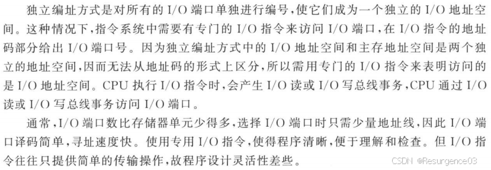
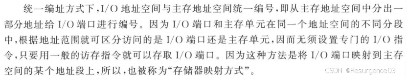
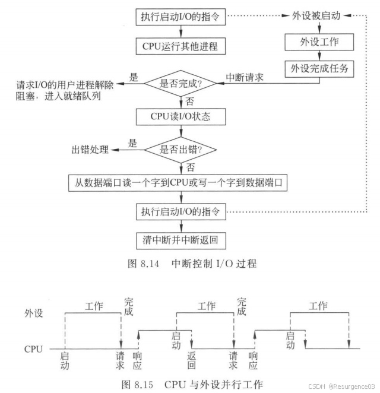
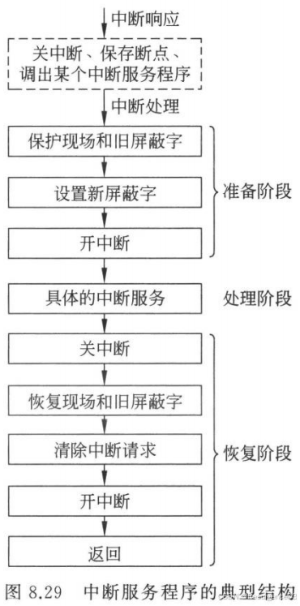
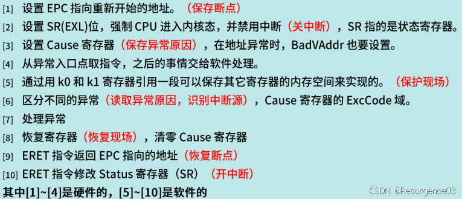
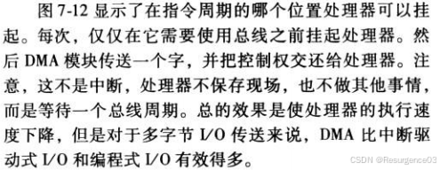
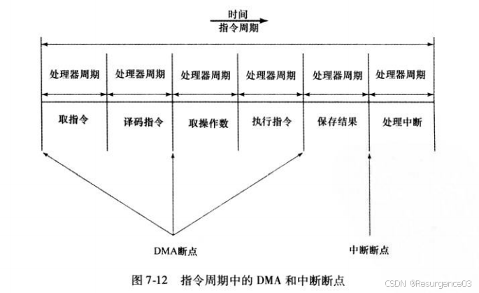
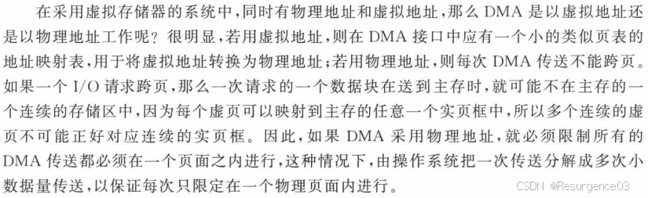
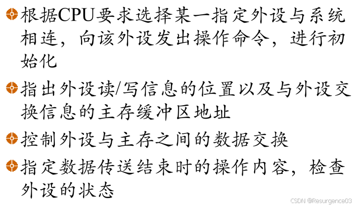

# I/O

##  I/O端口

I/O接口中的寄存器

### 独立编址

### 统一编址

- 编程灵活
- 大多数RISC架构都是用统一编址 
  - 通过操作数地址范围确定是否为I/O操作
- **非映射地址**：地址转换无需MMU
- **非cache缓存地址**

## I/O数据传送控制方式

### 程序直接控制

CPU直接控制I/O

- 简单，成本低
- 效率低下，严重影响CPU
- 早期使用

### 程序中断

- 中断请求：外设给CPU发信号

- 中断响应：**硬件**完成

  - 关中断
  - 设所有可屏蔽中断的允许标志为禁止
    
- 保护断点和程序状态
    - 保存PC和PSWR
    - EPC ← PC
    
- 识别中断源（可能由软件实现），**转中断服务程序**
    - 获得优先级最高的中断源对应的中断处理程序的首地址和初始程序状态
    - 送PC和PSWR

- 中断处理：CPU执行中断服务程序（**软件完成**）

  - 准备阶段
    - 保护现场
      - 用户可见通用寄存器的值压栈
    - 设置新屏蔽字
    - 开中断
  - 处理阶段 	
    - 执行具体中断服务
      - CPU可以响应新的中断请求
  - 恢复阶段 	
    - 关中断
    - 恢复现场和旧屏蔽字
    - 清除中断请求
    - 开中断
    - 返回

- 适用于传输速度不大，传输量不大的场合
- 较大CPU干扰

### DMA

- 专设硬件

- I/O和主存间的直接数据通路

- 成组传送

- 工作方式 

  - 独占总线
    - CPU暂停占用总线
    - DMA传完数据还给CPU
  - 周期窃取
    - CPU给DMA一个总线周期
  - 交替分时访问
    - 每个存储周期分为CPU时间片和DMA时间片

- 

- DMA地址问题

  

- DMA导致的cache与主存一致性问题

  - DMA写主存，cache留着新值
  - cache用延迟写策略，DMA看了主存的旧值
  - 解决方法
    - I/O通过cache
      - I/O可以更新cache
        - 降低命中率
    - 软件层面控制
      - I/O**读时**操作系统使部分cache无效
      - I/O**写时**强制cache写回
    - 硬件层面控制
  
- 特点 

  - 与设备一对一服务
  - 适中的CPU干扰
  - 不能用于大量高速设备

## I/O通道

- 类型
  - 字节多路通道
    - 通道时分复用
  - 选择通道
    - 选择一台设备独占通道
    - 成组传送数据
    - 高速
  - 数组多路通道
- 特点 
  - 与设备一对多服务
  - 适中的CPU干扰
  - 不能用于大量高速设备

## 输入输出处理机

### I/O处理机IOP

与主机共享内存

### 外围处理机

- 是通用计算机
- 独立的I/O
- 与主机通过通道交互

## I/O处理流程

