# 存储器

## 层次结构

- 寄存器
- cache
- 主存
- 外存
- 一致性原则：不同层次存储器中，相同信息保持一致
- 包含性原则：内层信息含于外层信息

## 主存

### 按存储元件分类

半导体

磁性材料

光介质

### 按存取方式分类

#### 随机存取存储器RAM

- 半导体存储器

- 是否破坏性读取 

  - 动态存储器DRAM 	

    - 用电容存bit信息 		
      - 破坏性读取 			
        - 读出时电荷释放，原信息丢失
      - 电荷会自然流失，需要定时刷新补充电荷 			
        - 集中刷新 				
          - 停止读写，逐行刷新
        - 分散刷新 				
          - 定时周期刷新
        - 异步刷新 				
          - 集中+分散
    - 快速分页组织
    - 一般用于低速大容量半导体存储器 		
      - 主存

  - 静态存储器SRAM 	

    - 用触发器存bit信息 		
      - 无需读后再生
      - 无需刷新
    - 一般用于高速小容量半导体存储器 		
      - cache

  - |            |   DRAM   |  SRAM  |
    | :--------: | :------: | :----: |
    |  存储信息  |   电容   | 触发器 |
    | 破坏性读出 |    是    |   否   |
    |  需要刷新  |    是    |   否   |
    | 送行列地址 | 分两次送 | 同时送 |
    |  访问速度  |    慢    |   快   |
    |   集成度   |    高    |   低   |
    |   发热量   |    小    |   大   |
    |  存储成本  |    低    |   高   |

#### 顺序存取存储器SAM

- 磁带

#### 直接存取存储器DAM

- 磁盘

#### 按内容存取存储器CAM

- 相联存储器AM 
  - 按位标识逐位比对

### 按可更改性分类

#### 可读可写存储器RAM

均是易失的

#### 只读存储器ROM

随机存取

均是非易失的

### 按易失性分类

#### 非易失（不挥发）存储器

- **ROM**
- 磁表面存储器
- 光存储器

#### 易失存储器

- **所有的RAM**
- cache

## 外部辅助存储

### 磁盘

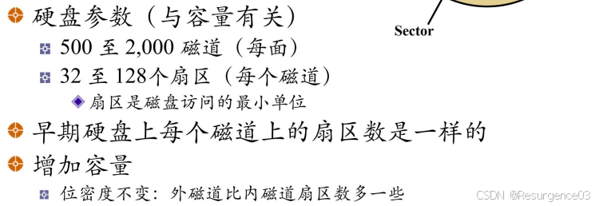

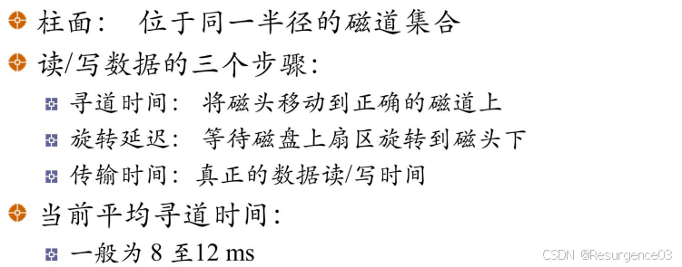

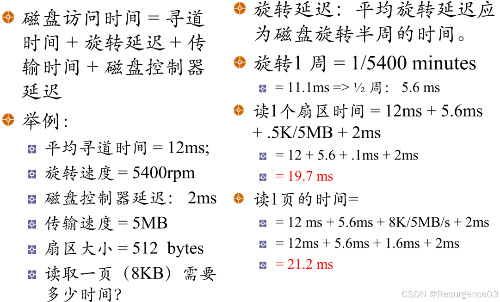

访问耗时主要来自**寻道时间**

写入数据同时计算校验码一起写入

> 
>
> 2×4×2000×3000×512B=24GB
>
> - 2：1个盘片有2面

> 
>
> 1转1/7200分=1/120秒
>
> $\dfrac{1}{120}s\times 0.5 + 20ms + 0.5ms = 24.7ms$

#### 磁盘调度算法

使平均寻道距离最短

##### FCFS

先请求访问磁盘的进程先处理

进程足够多时和随机调度性能相近

##### SSTF

Shortest-Seek-Time-First

选择从当前磁臂位置最近的访问请求位置

不一定有最短的平均寻道距离

##### SCAN

磁臂先向一个方向处理，移动到头后调头，再向另一个方向处理移动到头

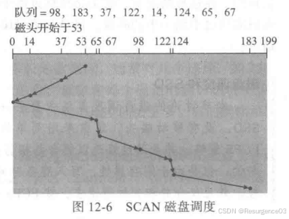

##### C-SCAN

磁臂向**一个方向**处理，移动到头后调头回到起点，如此往复

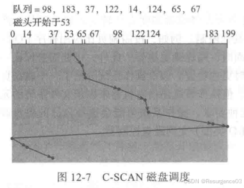

##### LOOK

只移动到最远一个请求的SCAN修正

##### C-LOOK

只移动到最远一个请求的C-SCAN修正

##### N步SCAN

**磁头黏着现象**：SSTF、SCAN、CSCAN由于新的密集I/O请求导致磁头在某处停住不动

- 将磁盘请求队列分为长度为N的子队列
- 子队列间按FCFS算法处理
- 子队列内按SCAN算法处理

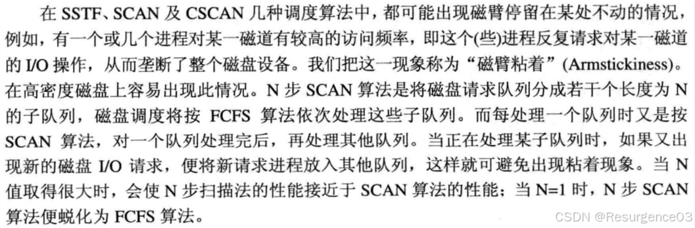

##### FSCAN

- 将磁盘请求分成两个队列

- **交替**使用SCAN处理其中一个队列 
  - 在处理一个队列时新出现的请求均归入另一队列中，下次扫描处理
  
- N = 2的N步SCAN

### 磁盘冗余阵列RAID

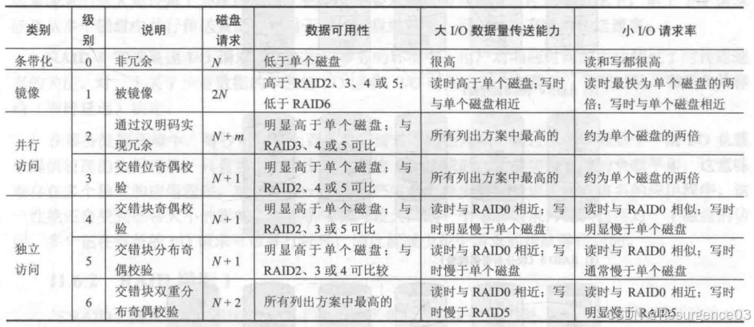

- 数据安全性 
  - 6最高
  - 1其次
  - 2,3,4,5一个层次
  - 0最差
- I/O速率 
  - 1,2,3快于单个磁盘
  - 4,5,6慢于或近似单个磁盘

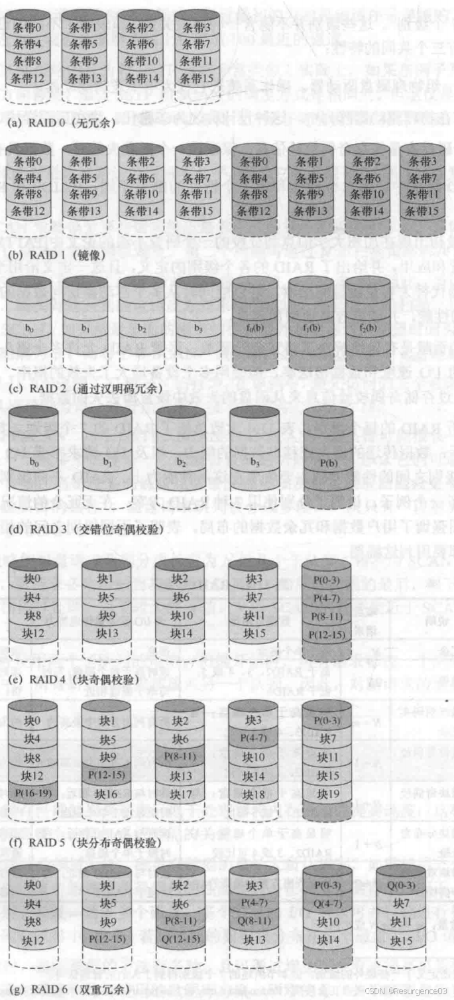

#### RAID0

- 没有冗余
- 条带化
- 容量大速度高，可靠性低

#### RAID1

- 冗余备份，复制所有信息 
  - 无校验
- 读性能翻倍 
  - 读请求可由含数据的任何一个磁盘提供
- 写性能下降 
  - 并不是折半，可并行执行，由慢者决定
- 成本高，很可靠

#### RAID2

- 并行访问 
  - 驱动器间同步
- 工作单位为字（字节）
- 小条带分布交叉
- 使用海明校验冗余 
  - 校验盘与数据盘成正比
- 数据传输率高 
  - 大I/O快
- I/O响应慢 
  - 小I/O快
- 开销过大，不再使用

#### RAID3

- 并行访问
- 小条带分布交叉
- 每个字计算1个校验位
- 只使用一个冗余盘
- 重构 
  
  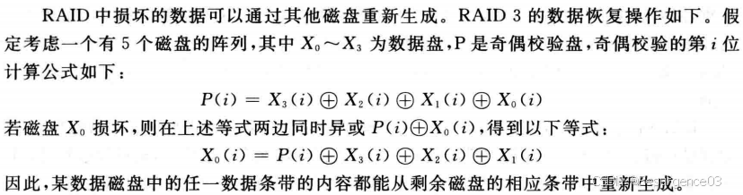
- 数据传输率高 
  - 大I/O快
- I/O响应慢 
  - 小I/O快

#### RAID4

- 独立访问 
  - 无需驱动器间同步
- 大数据块交叉
- 只使用一个冗余盘
- 重构 
  
  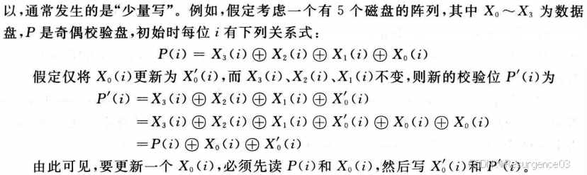
- 小I/O有写损失

#### RAID5

- 独立访问
- 大数据块交叉
- 将校验位循环均匀分布在所有驱动器上
- I/O快 
  - 被广泛使用

#### RAID6

- 独立访问
- 大数据块交叉
- 将校验位循环均匀分布在所有驱动器上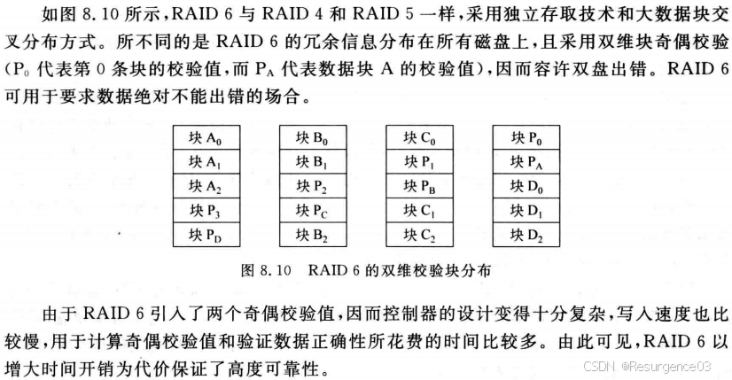
- 双维块奇偶校验 
  - 允许双盘出错
  - 高度可靠

#### RAID7

- 带cache的RAID

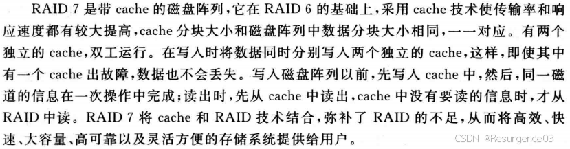

### Flash闪存

- 高密度非易失性读写存储器
- 电擦除可编程ROM替代品，可存储BIOS 
  - 编程：充电
  - 擦除：放电
  - 读取
- 存储元件为MOS管

### SSD固态硬盘

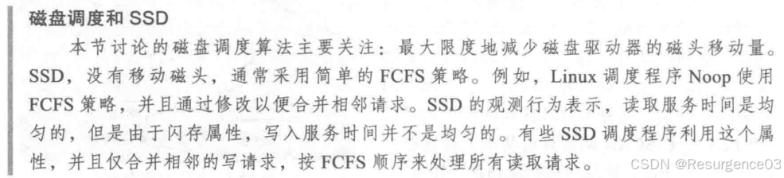

- 存储介质为闪存颗粒
- 数据按页进行读取 
  - 闪存芯片-区块-页
- 对某页写前，必须擦除该页所属的整个区块 
  - 写入时按顺序写入
- 只有有限的读写次数
- 闪存翻译层FTL 
  - 将逻辑磁盘块映射为物理存储块
  - 均化磨损电路 	
    - 将擦除操作平均分布，延长使用寿命

## 数据校验

码距：两个合法二进制码之间最少不同位数量

- 码距为1，即任何两个二进制码间最少有1位不同，平凡情况，无校验能力，检错位数为0

- 码距为2，检错位数为1

- **纠错理论：**$L - 1 = D + C, D \ge C$
- L为码距
  - D为检错位数
- C为纠错位数

### 奇偶校验

用于**并行传输**

在数据位以外增加1位校验位，使得**总共1的数量**为奇数或偶数

- 码距为2
- 检错位数为1
- 纠错位数为0

### 海明Hamming校验

用于**并行传输**

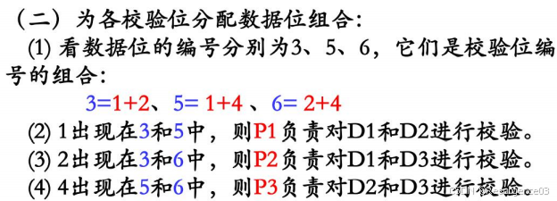

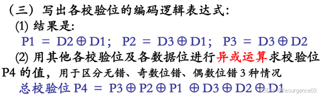

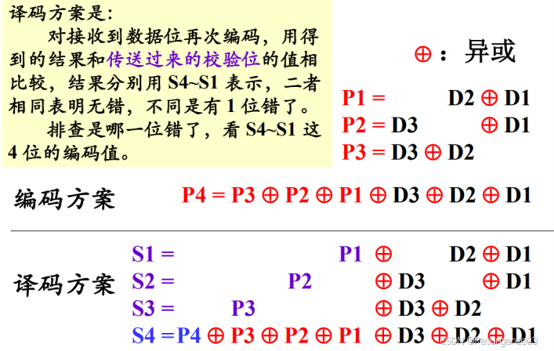

若无错，**S1 = S2 = S3 = S4 = 0**

- 含总校验位 
  - 码距为4
  - 检错位数为2
  - 纠错位数为1
- 不含总校验位 
  - 码距为3
  - 检错位数为1
  - 纠错位数为1

- 对于能检测d位错误的海明码，码距不小于d+1
- 对于能纠正d位错误的海明码，码距不小于2d+1

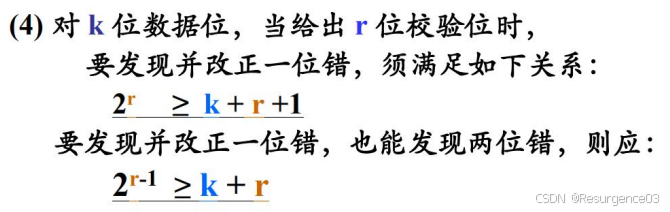

> 利用排列组合直接计算即可。

### 循环冗余校验CRC

用于**串行传输**

将$m$位的bit串看作一个$m-1$多项式的系数，从左到右从高到低

- 换言之，m位的bit串到系数域为0-1域的多项式的双射

0-1域上的多项式运算

- $f(x) + g(x) = f(x) \oplus g(x)$
- $f(x) - g(x) = f(x) \oplus g(x)$
- 除法同多项式大除法
  - 抓住最高位

双方约定$r$次生成多项式$G(x)$，对于$m+1$位位串对应的多项式$M(x)$，设$M(x)$诱导的带CRC校验码多项式为$r+m$次多项式$M_1(x)=x^rM(x)$

由多项式带余除法，存在唯一的$r(x)$，$q(x)$，使得$M_1(x) = q(x) G(x) + r(x)$，且$r(x)$的次数不高于$r-1$

换言之，$r(x)$将可对应于一个$r$位位串，$M_1(x) - r(x)$可被$G(x)$整除

由于$M_1(x)$的最低$r$次项系数均为0，$M_1(x) - r(x) = M_1(x) \oplus r(x) = M_1(x) + r(x) = $ 在$M(x)$对应的$m+1$位位串后拼接上$r(x)$对应的$r$位位串

- 接收方收到带CRC的位串后**除以$G(x)$**
- **能除尽**表明（在CRC检测范围内）**没有错误**
- **去掉位串最后$G(x)$次数位**即得原位串

## Cache

CPU<----------->主存

程序的局部性原理

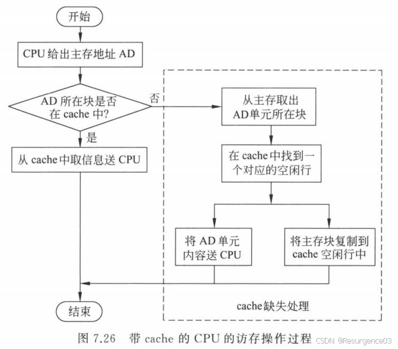

- 行
- 块 
  - 一行有多长
- 有效位：标记该行是否被占用中
- 命中 
  - 命中率Hit Rate 	
    - HR=命中次数/访问次数
    - 影响因素 		
      - 容量 			
        - 命中率-容量为不足对数函数
        - cache超过32kB后，整体性能不会显著提高
      - cache块大小 			
        - cache块太小，容易局部性受限
        - cache块太大 				
          - cache总行数会变小
          - 单次装填成本增大
  - 命中时间=访问cache块时间
- 缺失 
  - 缺失率Miss Rate 	
    - MR=1-HR
  - 缺失损失=替换cache块时间+传输给CPU的时间
  - 原因 	
    - 必然缺失 		
      - 第一次访问或刚开机
    - 容量缺失 		
      - cache容量不够
    - 冲突缺失 		
      - 两块不同的内存块映射到相同的cache块
      - 直接映射最明显（利用率低）
    - 无效缺失
- 平均访问时间=HR×命中时间+MR×缺失损失 
  - 缺失率低未必平均访问更低 	
    - 块更大意味着需要更多时间去装填数据块
    - 应当追求使得平均访问时间最低的块大小，而非缺失率最低

### 映射方式

- 直接映射：守序
- 全相联映射：混乱
- 组相联映射：中立

#### 直接映射

亦称为模映射

cache行号 = 主存块号 % cache行数

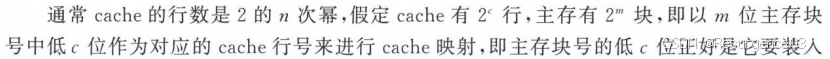

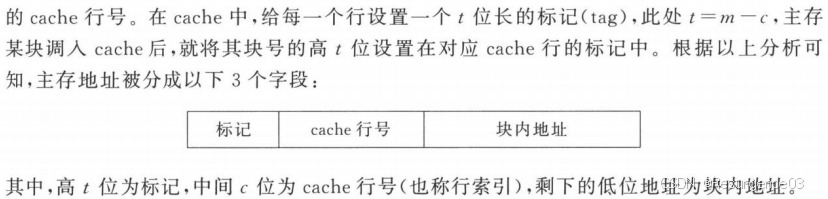

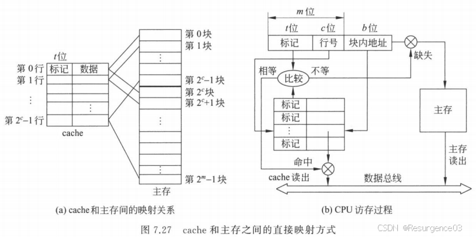

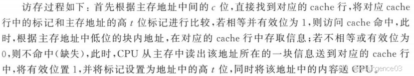

- 简单，命中时间短
- 利用率低、命中率低

#### 全相联映射

- 相联存储器：按内容访问 
  - 全相联：比对要遍历全cache

主存块可装入任何一个cache行中

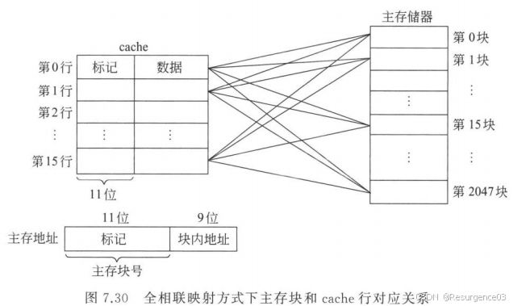

- 利用率高，冲突率低
- 使用成本太高 
  - 每次比对都要遍历cache

#### 组相联映射

x路组相连

- cache一个组有x行
- 主存每组有cache行总数块
- cache一组内可以存放x组主存块
- 组间模映射，组内全映射

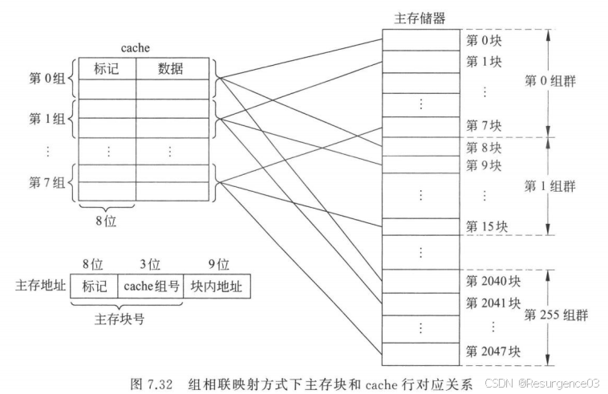

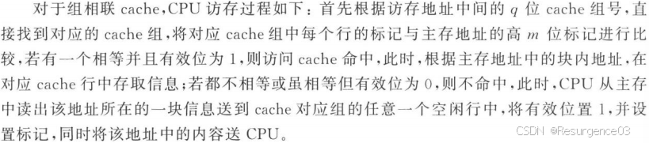

> 命中率比较
>
> - 在cache大小不变的前提下 
>   - 2路显著优于直接
>   - 4路优于2路，但远没有上者显著
> - 大小为N，采用直接映射的命中率与大小为N/2、采用2路组相联命中率相当

### 替换策略

- 直接映射没有选择
- 全/组相联映射 
  - 最近最少使用LRU
  - 先进先出FIFO
  - 随机RAND

### 一致性保持

#### 写直达

一旦cache更新，立刻更新主存

#### 拖后写

cache被替换时再写回主存

### 多级Cache

- 多级Cache
- 指令Cache+数据Cache 
  - 流水线考虑

### Cache接入体系结构

- 侧接法：如同普通IO 
  - 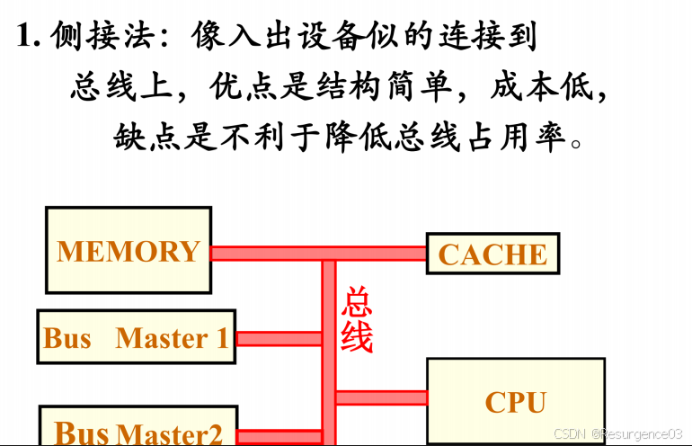
- 隔断法：插入原总线 
  - 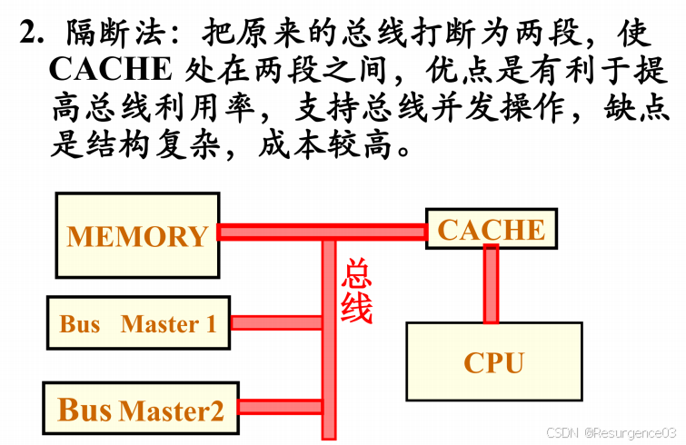

## 虚拟存储器

主存<----------->外存

### MMU

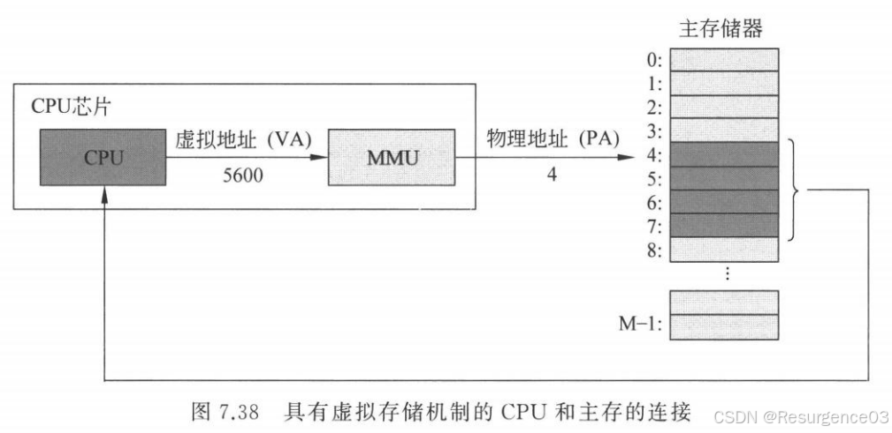

- 硬件完成从VA到PA的转换

### 分页式虚存

#### 页表

存储由页-页框号的全相联映射产生的页号转换关系

- **存放在主存中**
- 读取可用TLB加速

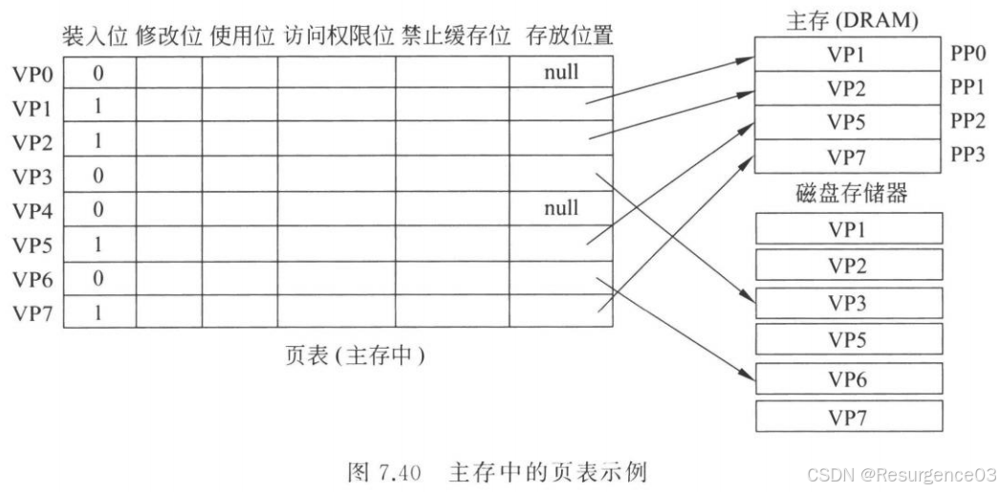

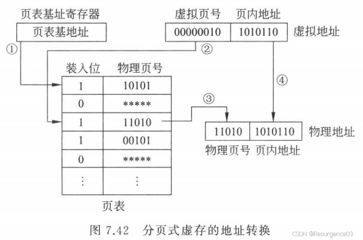

- 页表(虚拟页号) = 物理页号 
  - 虚拟页号位数决定页表大小
- 虚拟页内偏移 = 物理页内偏移

#### 快表TLB

**存放在Cache中**的**页表的一部分**

- 虚拟页号 = tag || cache组索引

### 分段式虚存

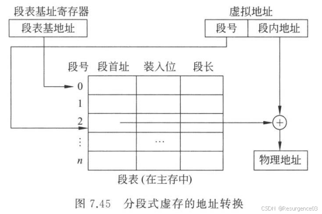

## 基于Cache和虚拟存储技术的CPU访存过程

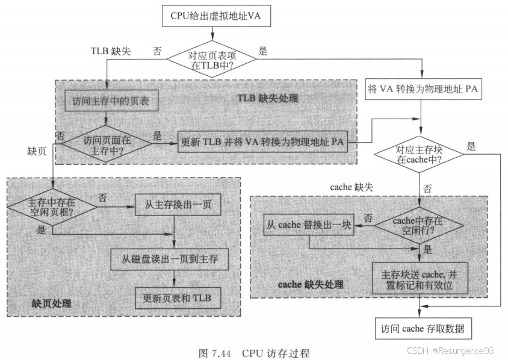

- cache缺失：硬件处理
- 页表缺页：缺页处理，OS
- TLB缺失：硬软件均可