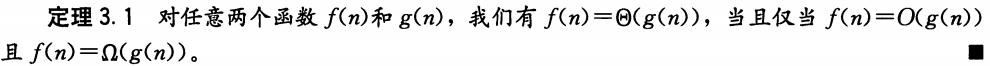
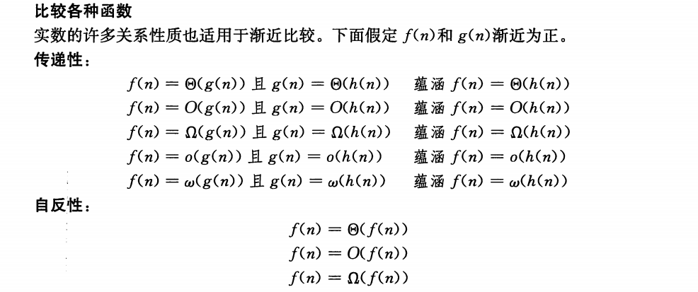
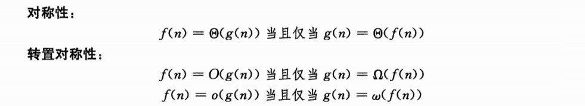
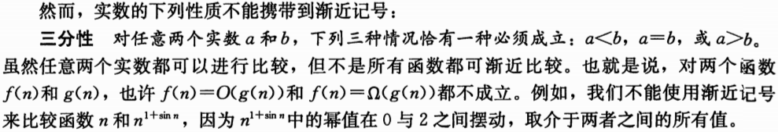
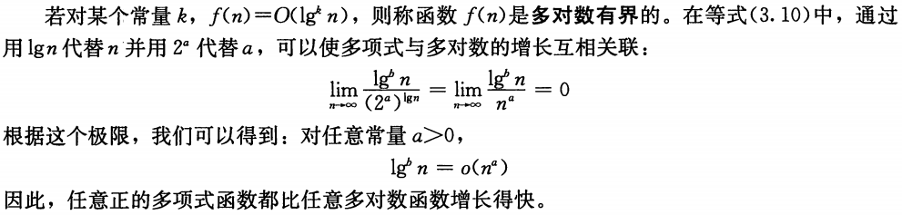
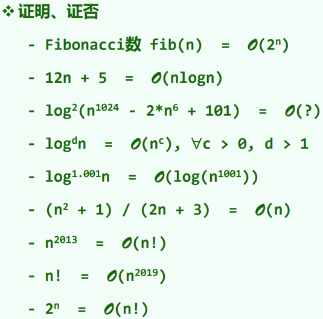
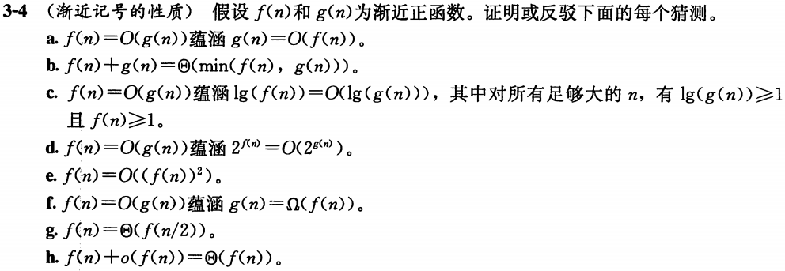

# 渐进分析

## 渐进记号

> 使用渐近记号的函数通常刻画算法的运行时间。但是渐近记号也可以适用于刻画算法的某个其他方面（例如，算法使用的空间数量）的函数，甚至可以适用于和算法没有任何关系的函数。

换言之，渐进符号是完全形式的：与考察对象无关。

- 渐进紧确界：$\Theta (g(n)) = \{ f(n) : \exists c_1, c_2, n_0>0, \forall n \ge n_0, 0 \le c_1g(n) \le f(n) \le c_2 g(n) \}$
- 渐进紧确上界：$O (g(n)) = \{ f(n) : \exists c, n_0>0, \forall n \ge n_0, 0 \le f(n) \le c g(n) \}$
- 渐进紧确下界：$\Omega (g(n)) = \{ f(n) : \exists c, n_0>0, \forall n \ge n_0, 0 \le c g(n) \le f(n) \}$
- 非渐进紧确上界：$o (g(n)) = \{ f(n) : \exists c, n_0>0, \forall n \ge n_0, 0 \le f(n) < c g(n) \}$
- 非渐进紧确下界：$\omega (g(n)) = \{ f(n) : \exists c, n_0>0, \forall n \ge n_0, 0 \le c g(n) < f(n) \}$

## 函数实例

### 重要极限

$$
\displaystyle \lim_{n \rightarrow \infty}\left(1+\dfrac{x}{n} \right)^n=e^x,\forall x\in \mathbb{R}
$$

### Stirling公式

$$
n! = \sqrt{2\pi n}\left( \dfrac{n}{e} \right)^n e^{\delta_n}, \delta_n \in (\dfrac{1}{12n+1}, \dfrac{1}{12n})
$$

- $n! = \sqrt{2\pi n}\left( \dfrac{n}{e} \right)^n \left( 1+ \Theta(\dfrac{1}{n}) \right)$
- $\displaystyle \lim_{n\rightarrow \infty} \frac{\sqrt[n]{n!}}{n} = \frac{1}{e}$
- $\ln(n!) = \Theta (n \ln n)$

### 多重函数

$$
f^{(k)}(n)=
\begin{cases}
	f(n)&,k=1 \\\\
	f \circ f^{(k-1)}(n)&,k \ge 2
\end{cases}
$$

#### 多重对数函数

$$
\ln^*n=\min\{k\ge0:\ln^{(k)}n\le 1\}
$$

- 看作是良定义下正则表达式的最大长度
- $\ln^*(\ln n) = \ln^* n - 1$
- $\ln 2 = 1,\ln 2^2 = \ln 4 = 2,\ln 2^{2^2} = \ln 16 = 3,\ln 2^{2^{2^2}} = \ln 65536 = 4,\ln 2^{2^{2^{2^2}}} = 5$

### Fibonacci数

初值条件为$F_0=0,F_1=1$
$$
F_n=\left\lfloor \dfrac{\phi^n}{\sqrt{5}}+\dfrac{1}{2}\right\rfloor = \dfrac{\phi^n-\hat\phi^n}{\sqrt{5}}
$$
其中$\phi=\dfrac{1+\sqrt{5}}{2},\hat\phi=\dfrac{1-\sqrt{5}}{2}$

> 

> 证明：$\displaystyle \binom{2n}{n} = \Omega(2^n)$
>
> 考虑从一个长为$2n$的序列中选$n$个元素，前$n$个按是否被选对应一个0-1序列，易见选法到长度为$n$的0-1序列是满射。

> （《算法导论》思考题3-4）
>
> 
>
> a. 错
>
> b. 错
>
> c. $\lg f(n) \le \lg c + \lg g(n)$，对
>
> d. $2^{f(n)} \le 2^{cg(n)}=(2^{g(n)})^c$，错
>
> e. $f(n)=\dfrac{1}{n}$，错
>
> f. 转置对称性，对
>
> g. $f(n)=2^n$，错
>
> h. 对

## 级数分析

- $\displaystyle \sum_{k=1}^n k^d=O(n^{d+1})$

- $\displaystyle \sum_{k=1}^n a^k=O(a^n)$

- $\displaystyle \sum_{k=1}^\infty \dfrac{1}{k^2} = \dfrac{\pi^2}{6} =O(1)$

- $\displaystyle \sum_{k=1}^n \dfrac{1}{k} = \Theta(\ln n)$

- $\displaystyle \sum_{k=1}^n \ln k = \ln(n!) = \Theta(n\ln n)$

	> $\displaystyle \int_{1}^{n}\ln x \mathrm{d}x = n\ln n - n$
	>
	> 考虑右矩形公式$\displaystyle \int_{1}^{n}\ln x \mathrm{d}x > \sum_{k=1}^{n-1} \ln k$，这表明$\displaystyle \sum_{k=1}^n \ln k = O(n\ln n)$
	>
	> 同理考虑左矩形公式$\displaystyle \int_{1}^{n}\ln x \mathrm{d}x < \sum_{k=2}^n \ln k$，这表明$\displaystyle \sum_{k=1}^n \ln k = \Omega(n\ln n)$

- $\displaystyle \sum_{k=1}^n k\ln k = \Theta(n^2\ln n)$

- $\displaystyle \sum_{k=1}^n 2^kk = \Theta(2^nn)$