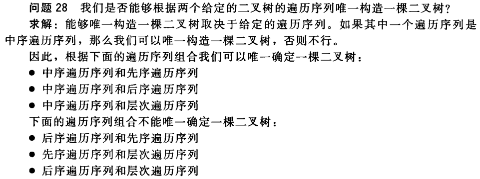
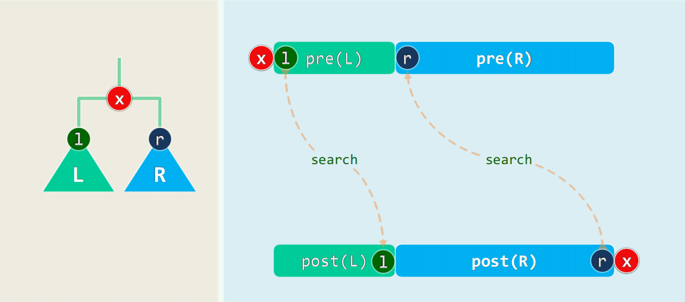

# 二叉树BinTree

## 基本概念

根节点、叶节点、内部节点；（真）祖先、（真）后代、父亲、孩子；度、深度、高度

- 根节点深度为0
- 单节点数高度为0，空树高度为-1
- 设二叉树有$n$个节点，$n_i$个度为$i$的节点，$e$条边
	- 除去根节点，每个节点和其父节点间有一条边：$e = n - 1$
	- 按度的定义：$e=0n_0+1n_1+2n_2=n_1+2n_2$
	- $n_0+n_1+n_2=n=e+1=n_1+2n_2+1,\quad n_0 = n_2 + 1$
		- <font color=#956FE7>**度为0比度为2的节点恰好多1个**</font>
- <font color=#956FE7>**含n个节点的二叉树有Catalan(n)种**</font>

真二叉树、完全二叉树、满二叉树

- 深度为k的节点至多$2^k$个
- 高度为h的树节点树介于$h+1$到$2^{h+1}-1$间
- 含n个节点的二叉树的最小高度为$\left\lfloor \log_2 n \right\rfloor$，该高度恰好取得时二叉树为完全二叉树
- <font color=#956FE7>**含n个叶节点的真二叉树有Catalan(n-1)种**</font>

多叉树转换为二叉树：长子-兄弟表示法

- 每个节点维护指向第一个孩子（长子）和右兄弟的指针

## 基本动作

### 插入子树，删除子树

同List，记得更新高度

### 遍历

#### 深度优先遍历

##### 先序遍历

```cpp
template<typename T, typename VST> // 元素类型、操作器
void travPre_R(BinNodePosi(T) x, VST& visit) { // 二叉树先序遍历算法（递归版）
	if(!x) {
        return;
    }
	visit(x->data);
	travPre_R(x->lc, visit);
    travPre_R(x->rc, visit);
}
```

```cpp
// 从当前节点出发，沿左分支不断深入，直至没有左分支的节点；沿途节点遇到后立即访问
template <typename T, typename VST> // 元素类型、操作器
static void visitAlongLeftBranch(BinNodePosi(T) x, VST& visit, Stack<BinNodePosi(T)>& S) {
    while (x) {
        visit(x->data); // 访问当前节点
        // 可优化：通过判断，避免空的右孩子入栈（多一次判断，少一次push一次pop）
        S.push(x->rc); // 右孩子入栈暂存
        x = x->lc; // 沿左分支深入一层
    }
}
 
template <typename T, typename VST> // 元素类型、操作器
void travPre_I2 (BinNodePosi(T) x, VST& visit) {
    Stack<BinNodePosi(T)> S; // 辅助栈
    while (true) {
        visitAlongLeftBranch(x, visit, S); // 从当前节点出发，逐批访问
        if (S.empty()) { // 直到S空
            break;
        }
        x = S.pop(); // 弹出下一批的起点
    }
}
```

##### 中序遍历

###### 递归遍历

```cpp
template<typename T, typename VST> // 元素类型、操作器
void travIn_R(BinNodePosi(T) x, VST& visit) { // 二叉树中序遍历算法（递归版）
	if(!x) {
        return;
    }
	travIn_R(x->lc, visit);
    visit(x->data);
    travIn_R(x->rc, visit);
}
```

###### 用栈实现的迭代

```cpp
template <typename T〉// 从当前节点出发,沿左分支不断深入，直至没有左分支的节点
static void goAlongLeftBranch(BinNodePosi(T) x, Stack<BinNodePosi(T)>& S) {
    while(x) {
        s.push(x);
        x= x->lc;
    } // 当前节点入栈后随即向左侧分支深入,迭代直到无左孩子
}
                                                                        
template <typename T, typename VST> // 元素类型、操作器
void travIn_I1(BinNodePosi(T) x, VST& visit) { // 二叉树中序遍历算法(迭代版#1）
	Stack<BinNodePosi(T)> S; // 辅助栈
	while(true) {
		goAlongLeftBranch(x, s); // 从当前节点出发，逐批入栈
        if(s.empty()) {
            break; // 直至所有节点处理完毕
        }
		x = s.pop();
        visit(x->data); // 弹出栈顶节点并访问之
    	x = x->rc; // 转向右子树
    }
}
```

```cpp
template<typename T, typename VST> // 元素类型、操作器
void travIn_I2(BinNodePosi(T) x, VST& visit) { // 二叉树中序遍历算法（迭代版#2）
    Stack<BinNodePosi(T)> S; // 辅助桟
	while(true) {
		if(x){
			S.push(x); // 根节点进栈
    		x = x->lc; // 深入遍历左子树
		} else if(!s.empty()){
            x = s.pop(); // 尚未访问的最低祖先节点退栈
            visit(x->data); // 访问该祖先节点
            x = x->rc; // 遍历祖先的右子树
		} else {
            break; // 遍历完成
        }
    }
}
```

栈存放**还没来得及访问的子树根节点**

###### 用直接后继实现的迭代

直接后继：某节点在中序遍历序列中的下一位

- 若有右孩子，那么直接后继是右子树中最靠左下的节点
- 否则，直接后继是将当前节点包含于其左子树中的最低祖先

```cpp
template <typename T>
BinNodePosi(T) BinNode<T>::succ() { // 定位节点v的直接后继
    BinNodePosi(T) s = this; // 记录后继的临时变量
    if(rc) { // 若有右孩子，则直接后继必在右子树中，具体地就是
		s = rc; // 右子树中
		while(HasLchild(*s)) {
            s = s->lc; // 最靠左（最小）的节点
    } else { //否则，直接后继应是“将当前节点包含于其左子树中的最低祖先”，具体地就是
        while(IsRchild(*s)) {
            s = s->parent; // 逆向地沿右向分支，不断朝左上方移动
        }
        s = s->parent; // 最后再朝右上方移动一步，即抵达直接后继（如果存在）
    }
	return s;
}
```

如果返回NULL，表明代码中倒数第二步的s为根节点，这表明节点v是最靠右下的节点，无直接后继。

###### 记录回溯状态的就地迭代

```cpp
template<typename T, typename VST> // 元素类型、操作器
void travIn_I3(BinNodePosi(T) x, VST& visit) { // 二叉树中序遍历算法（迭代版#3,无需辅助栈）
    boo1 backtrack = false; // 前一步是否刚从右子树回溯--省去栈，仅0(1)辅助空间
    while(true)
	if(!backtrack && HasLchild(*x)) { // 若有左子树且不是刚刚回溯,则
		x = x->lc; // 深入遍历左子树
    }
    else { // 否则--无左子树或刚刚回溯（相当于无左子树）
		visit(x->data);// 访问该节点
		if(HasRchild(*x)){ // 若其右子树非空，则
			x = x->rc;// 深入右子树继续遍历
			backtrack = false;// 并关闭回溯标志
		} else { // 若右子树空，则
			if(!(x = x->succ())) {
                break; // 回溯（含抵达未节点时的退出返回）
            }
            backtrack = true; // 并设置回溯标志
        }
    }
}
```

##### 后序遍历

```cpp
template<typename T, typename VST> // 元素类型、操作器
void travPost_R(BinNodePosi(T)x, VST& visit){ //二叉树后序遍历算法（递归版）
    if(!x) {
        return;
    }
	travPost_R(x->lc, visit);
	travPost_R(x->rc, visit);
	visit(x->data);
}
```

```cpp
template<typename T> // 在以S栈顶节点为根的子树中，找到最高左侧可见叶节点
static void gotoHLVFL(stack<BinNodePosi(T)>& S) { // 沿途所遇节点依次入栈
    while(BinNodePosi(T)x = s.top()) { // 自顶而下，反复检査当前节点（即栈顶）
        if(HasLchild(*x)) { // 尽可能向左
			if(HasRchild(*x)){
                s.push(x->rc); // 若有右孩子，优先入栈
                s.push(x->lc); // 然后才转至左孩子
            } else { // 实不得已
                S.push(x->rc); // 才向右
            }
        }
    }
    S.pop(); // 返回之前，弹出栈顶的空节点
}
        
template <typename T, typename VST>
void travPost_I(BinNodePosi(T) x, VST& visit) { // 二叉树的后序遍历（迭代版）
    Stack<BinNodePosi(T)> s; // 辅助桟
    if(x) {
        s.push(x); // 根节点入栈
    }
    while(!s.empty()){
		if(s.top()!= x->parent) { // 若栈顶非当前节点之父（则必为其右兄），此时需
    		gotoHLVFL(S); // 在以其右兄为根之子树中，找到HLVFL（相当于递归深入其中）
    	}
        x = s.pop();
        visit(x->data); // 弹出栈顶(即前一节点之后继)，并访问之
    }
}
```

##### 增强序列

将NULL节点换为外部节点，<font color=#956FE7>视二叉树为**真二叉树**</font>

<font color=#956FE7>遇到NULL节点输出固定字符</font>（比如^）

视NULL节点为哨兵节点，由二叉树节点结论$n_0=n_2+1$有：NULL节点恰比非NULL节点多一个

#### 广度优先遍历（层次遍历）

先上后下、先左后右

```cpp
template <typename T, typename VST>// 元素类型、操作器
void BinNode<T>::travLevel(VST& visit) { // 二叉树层次遍历算法
    Queue<BinNodePosi(T)> Q; // 辅助队列
    Q.enqueue(this); // 根节点入队
    while(!q.empty()) { //在队列再次变空之前，反复迭代
        BinNodePosi(T) x = Q.dequeue();
        visit(x->data); // 取出队首节点并访问之
        if(HasLchild(*x)) {
            Q.enqueue(x->lc); // 左孩子入队
        }
        if(HasRchild(*x)) {
            Q.enqueue(x->rc); // 右孩子入队
        }
    }
}
```

- <font color=#956FE7>辅助队列最大规模为$\left\lceil \dfrac{n}{2} \right\rceil$</font>
	- 当二叉树有奇数个节点时
		- 此时是真二叉树
		- 层次遍历进行到任何非叶节点都会发生出1入2
		- 最大规模出现在<font color=#956FE7>最后一个2度节点访问完成</font>时
			- 此时队列中<font color=#956FE7>有且仅有所有的叶节点</font>
		- 最大规模只会出现1次
	- 当二叉树有偶数个节点时
		- 此时不是真二叉树，有一个1度节点
		- 层次遍历进行到该1度节点队列会发生出1入1
		- 最大规模会出现2次

<font color=#956FE7>**先序遍历序列+后序遍历序列可以确定广度优先遍历序列**</font>

> 易见先序遍历序列第一个节点和后序遍历序列倒数第一个节点均为根节点A
>
> - 如果先序遍历序列第二个节点B和后序遍历序列倒数第二个节点C不同，这表明根节点A有两个孩子B、C，且B是A的左孩子，C是A的右孩子
> 	- 以B、C剖分两序列，即得以B为根的子树和以C为根的子树的遍历序列
> - 如果先序遍历序列第二个节点和后序遍历序列倒数第二个节点相同（均为B），这表明根节点只有一个孩子B（但不知道是左孩子还是右孩子）
> 	- 两序列剩下的部分即为以B为根的子树的遍历序列
> - 总之，确定了根节点A、下一层节点和下一层节点各自的先序、后序遍历序列
> - 如此反复即得广度优先遍历序列

> Ex. 某二叉树先序遍历序列是124536，后序遍历序列是452631，求广度优先遍历序列。
>
> - 显然1是根节点
> - 在1前后的深度均为1，2、3深度都是1
> - 根据先序序列，4、6的深度是3，并且4在6左边
> - 根据后序序列，5的深度是3，并且5在4,6中间
>
> 广度优先遍历序列为123456

<font color=#956FE7>**后序遍历序列+广度优先遍历序列可以确定先序遍历序列**</font>

**<font color=#956FE7>先序遍历序列+广度优先遍历序列*不能*确定后序遍历序列</font>**（广度和先序的顺序有重合，信息损失）

#### 遍历序列重构二叉树



- <font color=#956FE7>**真二叉树的先序和后序遍历序列能唯一重构原树**</font>
	- 可以确定节点x的左右子树的根节点l、r，采用分治法解。
- <font color=#956FE7>**增强先序或后序遍历序列均能唯一重构原树**</font>
- <font color=#956FE7>**增强中序遍历序列不能唯一重构原树**</font>

## 前缀无歧义编码PFC

- 不同字符的编码互不为前缀
- 字符编码不一定等长

### 最优编码树

使得<font color=#956FE7>（带权）平均编码深度</font>最小

最优编码树**必存在**，但不一定唯一

- <font color=#956FE7>双子性</font>：最优二叉编码树必为真二叉树
	- 如果有1度节点，表明编码空间存在浪费，直接删除即更短
- <font color=#956FE7>层次性</font>：叶节点深度之差不超过1，即只能出现在倒数两层以内
	- 参考AVL的调整

#### Huffman编码

策略：<font color=#4DA8EE>Greedy</font>

1. 找到<font color=#4DA8EE>权重最低</font>的两个（超）字符
2. <font color=#4DA8EE>合并，权重取权重之和</font>
3. <font color=#4DA8EE>迭代</font>

- <font color=#1C7331>Huffman树一定是最优编码树</font>
- <font color=#BE191C>最优编码树不一定都能通过Huffman树构造出来</font>
	- 考虑一个**满**的Huffman树，底层节点的任何全排列都可给出一棵最优PFC