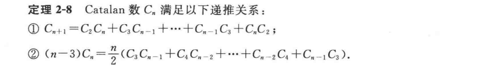
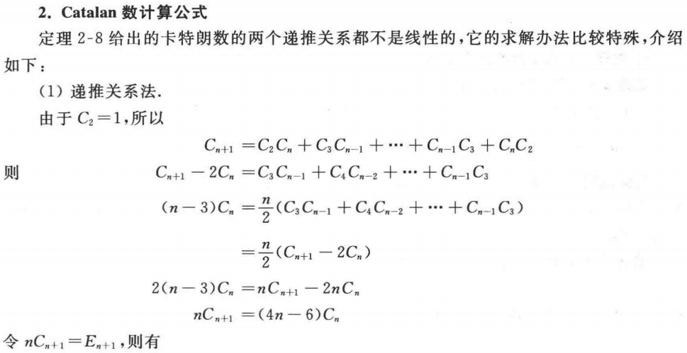
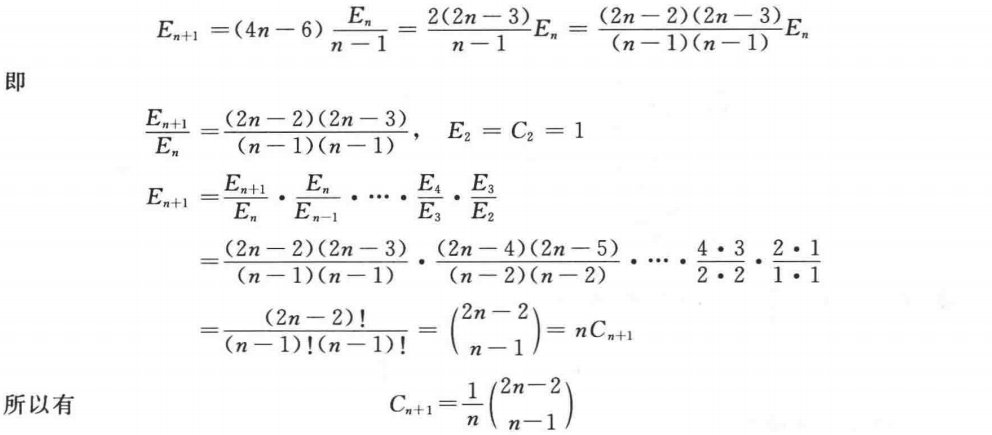

# Catalan数

> 

按上述定义得到的Catalan序列满足$C_2=C_3=1$

下将初值条件换为$C_0=C_1=1$，无本质区别，此时$\displaystyle C_n = \frac{(2n)!}{n!(n+1)!}=\dfrac{1}{n+1}\binom{2n}{n}$

- 具有n个互异关键码节点的二叉搜索树有$C_n$种
	- 设节点编号1~n
	- 取编号为i的节点作为根节点
		- 根据二叉搜索树的单调性
			- 编号为1~i-1的节点组成左子树
			- 编号为i+1~n的节点组成右子树
		- 在这一情形下有$C_{i-1}C_{n-i}$种可能
	- 从而总共有$\displaystyle \sum_{i=1}^nC_{i-1}C_{n-i}$种可能，是Catalan数递推公式
- 具有n个节点的二叉树有$C_n$种
	- 看作n个互不相同键码节点的二叉搜索树
- n对括号匹配序列有$C_n$种
- 计算n个元素作结合性运算结果的顺序有$C_{n-1}$种
	- 看作n-1对括号匹配序列
- 具有n个叶节点的真二叉树有$C_{n-1}$种
	- 看作n个元素作结合性运算