# 分治与减治分析

## 分治分析

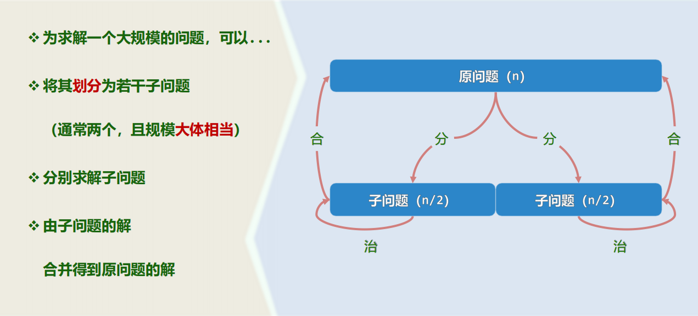

### Master Theorem

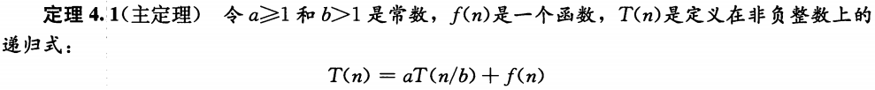

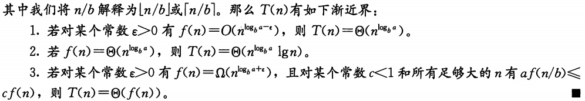

更好用的形式：

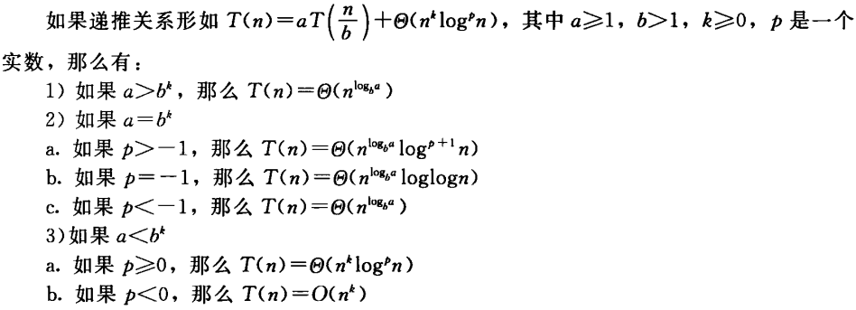

由于$k=\log_ba$，上述的2)分支还可以改写成更直观的形式$n^k$

根据渐进符号的意义，递推式中没有负函数，否则不适用

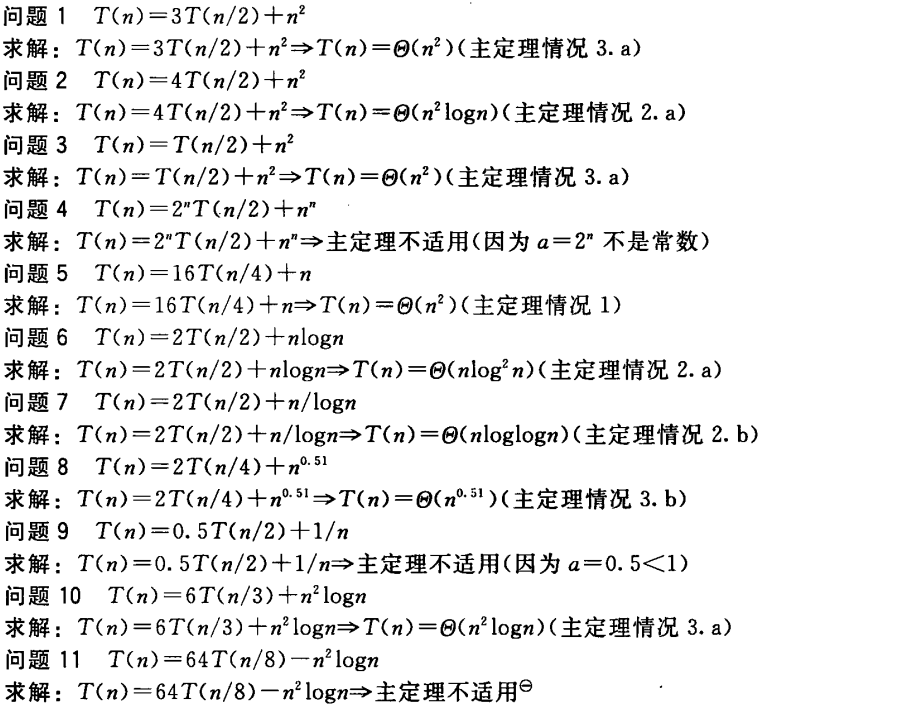

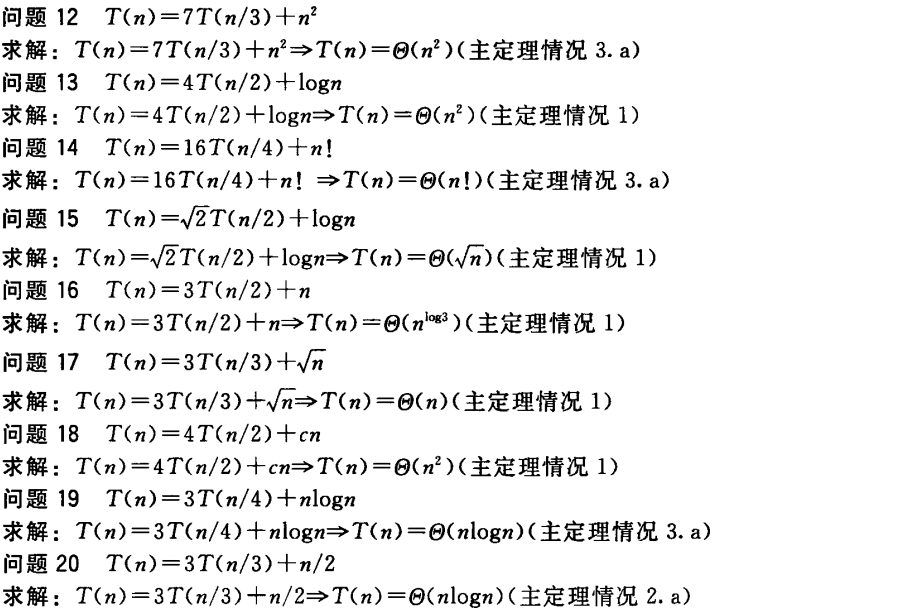

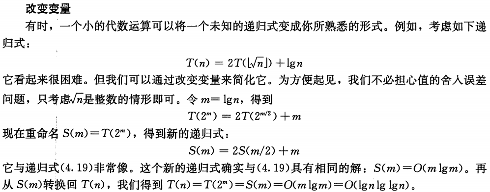

> （《算法导论》练习4.5-1）
>
> 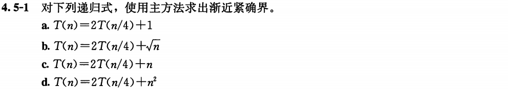
>
> a. 1) $T(n)=\Theta (\sqrt{n})$
>
> b. 2)a. $T(n)=\Theta (\sqrt{n}\log n)$
>
> c. 3)a. $T(n)=\Theta (n)$
>
> d. 3)a. $T(n)=\Theta (n)$

## 减治分析

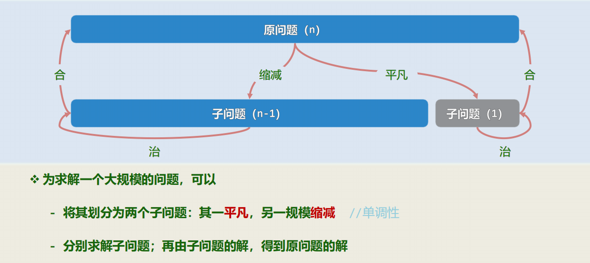

### Master Theorem

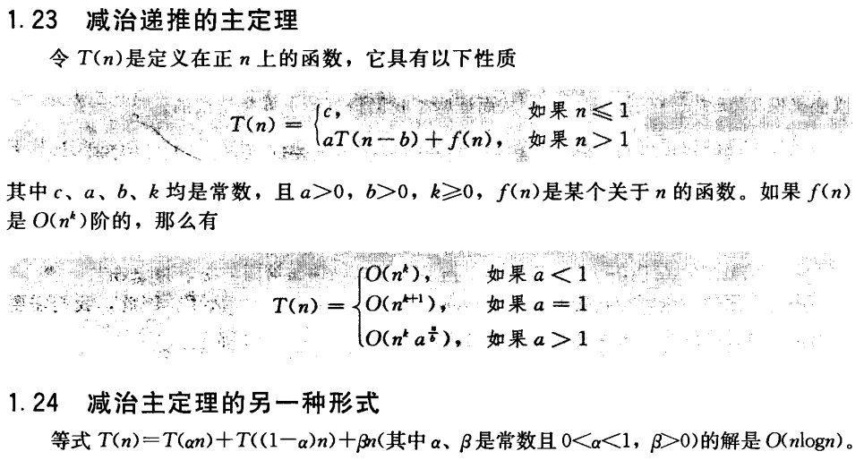

即如果规模为$n$的问题可以分解为两个子问题的和，其组合代价是线性的，那么复杂度有上界$n\log n$。

------

> （《算法导论》思考题4-1）
>
> 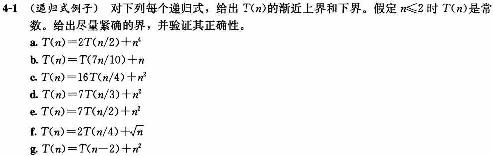
>
> a. 分治MT3)a. $T(n)=\Theta (n^4)$
>
> b. 分治MT3)a. $T(n)=\Theta (n)$
>
> c. 分治MT2)a. $T(n)=\Theta (n^2\lg n)$
>
> d. 分治MT3)a. $T(n)=\Theta (n^2)$
>
> e. 分治MT1) $T(n)=\Theta (n^{\lg 7})$
>
> f. 分治MT2)a. $T(n)=\Theta (\sqrt{n}\lg n)$
>
> g. 减治MT $T(n)=\Theta (n^3)$

> （《算法导论》思考题4-3）
>
> 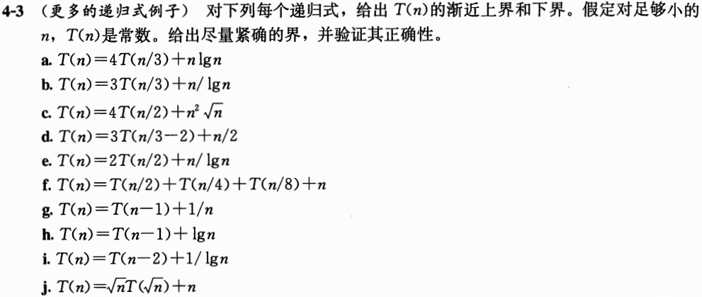
>
> a. 分治MT1) $T(n)=\Theta (n^{\log_34})$
>
> b. 分治MT2)b. $T(n)=\Theta (n\lg\lg n)$
>
> c. 分治MT3)a. $T(n)=\Theta (n^2\sqrt{n})$
>
> d. 分治MT2)a. $T(n)=\Theta (n\lg n)$
>
> e. 分治MT3)b. $T(n)=O (n)$，归纳有$T(n)=\omega (n)$，$T(n)=\Theta (n)$
>
> g. $\displaystyle T(n) = T(1) + \sum_{k=2}^n \frac{1}{k} = \Theta(\lg n)$
>
> h. $\displaystyle T(n) = T(1) + \sum_{k=2}^n \lg k = \Theta(n\lg n)$