# 习题

## 渐进分析

> 【2010-THU-Mid】f(n) = O(g(n))，当且仅当g(n) = Ω(f(n))。（√）

> 【2010-THU-Mid】若f(n) = O(n^2)且g(n) = O(n)，则以下结论正确的是（AD）
>  A. f(n) + g(n) = O(n^2)
>
> B. f(n) / g(n) = O(n)
>
> C. g(n) = O(f(n))
>
> D. f(n) * g(n) = O(n^3)
>
> 考虑f(n) = 1，g(n) = 1/n，BC错

> 【2010-THU-Mid】算法g(n)的复杂度为Θ(n)。若算法f(n)中有 5 条调用g(n)的指令，则f(n)的复杂度为（D）
>  A. Θ(n)
>
> B. O(n)
>
> C. Ω(n)
>
> D. 不确定

> 【2010-THU-Mid】给出函数F(n)复杂度的紧界（假定int字长无限，移位属基本操作，且递归不会溢出）
>
> ```cpp
> void F(int n)           //O(        )
> { for(int i = 0, j = 0; i < n; i += j, j++); }
> /*---------------------------------------------------------------------*/
> void F(int n)           //O(        )
> { for (int i = 1; i < n; i = 1 << i); }
> /*---------------------------------------------------------------------*/
> int F(int n)           //O(        )
> { return (n < 4) ? n : F(n >> 1) + F(n >> 2); }
> /*---------------------------------------------------------------------*/
> int F(int n)           //O(        )
> { return (n == 0) ? 1 : G(2, F(n ‐ 1)); }
> /*---------------------------------------------------------------------*/
> int G(int n, int m)
> { return (m == 0) ? 0 : n + G(n, m ‐ 1); }
> /*---------------------------------------------------------------------*/
> int F(int n)           //O(        )
> { return G(G(n ‐ 1)); }
> /*---------------------------------------------------------------------*/
> int G(int n)
> { return (n == 0) ? 0 : G(n ‐ 1) + 2 * n ‐ 1; }
> /*---------------------------------------------------------------------*/
> void F(int n) {         //O(        )
>     for (int i = 1; i < n; i++)
>         for (int j = 0; j < n; j += i);
> }
> /*---------------------------------------------------------------------*/
> void F(int n) {     //expected‐O(        )
>    for (int i = n; 0 < i; i‐‐)
>       if (0 == rand() % i)
>          for (int j = 0; j < n; j++);
> }
> ```
>


## 向量

> 【2010-THU-Mid】对有序向量做Fibonacci查找，就最坏情况而言，成功查找所需的比较次数与失败查找相等。（√）

> 【2010-THU-Mid】对于同一有序向量，每次折半查找绝不会慢于顺序查找。（×）

> 【2010-THU-Mid】对长度为Fib(12) ‐ 1 = 143的有序向量做Fibonacci查找，比较操作的次数至多为（）
>  A.12
>  B.11
>  C.10
>  D.9 

>  【2010-THU-Mid】对长度为n = Fib(k) ‐ 1 的有序向量做Fibonacci查找。若各元素的数值等概率独立均匀分布，且平均成功查找长度为L，则平均失败查找长度为（）
>
> A.n(L‐1)/(n‐1)
>
> B.n(L+1)/(n+1)
>
> C.(n‐1)L/n
>
> D.(n+1)L/n

> 【2010-THU-Mid】现有长度为 15 的有序向量A[0..14]，各元素被成功查找的概率如下：
>
> 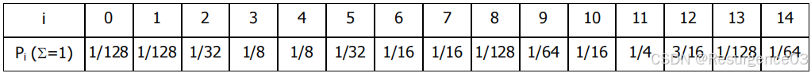
>
> 若采用二分查找算法，试计算该结构的平均成功查找长度。

## 列表

> 【2010-THU-Mid】无论有序向量或有序列表，最坏情况下均可在O(logn)时间内完成一次查找。（√）

## 跳表

> 【2013-THU-Fin】n个节点的跳转表期望高度为O(logn)。（√）

> 【2013-THU-Fin】跳转表若变成投掷骰子上面为六才上升一层，则纵向移动变大。（×）

> 【2014-THU-Fin】跳转表若变成投掷骰子上面为六才上升一层，对于同样存放n个元素的跳转表而言，（A）的期望值将有所增长，但仍保持O(1)。
>  A. 查找过程中，在同一高度连续跳转的次数
>  B. 查找过程中，由“向右”到“向下”转折的次数
>  C. 查找过程中，沿同一座塔连续下行的层数
>  D. （在查找定位之后）为创建一座新塔所需的时间

> 【2016，2018-THU-Fin】在n个节点的跳转表中，塔高的期望值为Θ(logn)。（√） 

## 栈与队列

> 【2010-THU-Mid】对不含括号的中缀表达式求值时，操作符栈的容量可以固定为某一常数。（√）
>
> 操作符栈里最多2个元素

> 【2010-THU-Mid】RPN中各操作数的相对次序，与原中缀表达式完全一致。（√）
>
> 语法分析树的中序遍历序列和后序遍历序列

> 【2010-THU-Mid】共有（C）种栈混洗方案，可使字符序列{'x', 'o', 'o', 'o', 'x'}的输出保持原样。
>  A. 12
>
> B. 10
>
> C. 6
>
> D. 5
>
> 1. push pop | push pop push pop push pop | push pop
> 2. push pop | push push pop pop push pop | push pop
> 3. push pop | push pop push push pop pop | push pop
> 4. push pop | push push push pop pop pop | push pop
> 5. push pop | push push pop push pop pop | push pop
> 6. push push push push push pop pop pop pop pop

> 【2010-THU-Mid】考查表达式求值算法。算法执行过程中的某时刻，若操作符栈中的括号多达 2010 个，则此时栈的规模（含栈底的'\0'）至多可能多大？试说明理由，并示意性地画出当时栈中的内容。
>
> 至多6033个
>
> [ \0, +, *, (, +, *, (, +, *, ... >

> 【2018-912】非法表达式(12)3+!4*+5执行evaluate算法后的结果为（89）。
>
> | 输入缓冲     | 操作数栈 | 操作符栈 | 动作                                         |
> | ------------ | -------- | -------- | -------------------------------------------- |
> | (12)3+!4*+5$ |          | $        | 识别到开始符                                 |
> | 12)3+!4*+5$  |          | $ (      | 识别到(，栈顶为$，栈顶<当前，(入栈           |
> | )3+!4*+5$    | 12       | $        | 12入栈（readNumber函数识别最长操作数字符串） |
> | 3+!4*+5$     | 12       | $        | 识别到)，栈顶为(，脱括号，推进一个字符       |
> | +!4*+5$      | 12 3     | $        | 3入栈                                        |
> | !4*+5$       | 12 3     | $ +      | +入栈                                        |
> | 4*+5$        | 12 3     | $ + !    | 识别到!，栈顶为+，栈顶<当前，!入栈           |
> | *+5$         | 12 3 4   | $ + !    | 4入栈                                        |
> | *+5$         | 12 3 24  | $ +      | 识别到*，栈顶为!，栈顶>当前，执行!           |
> | +5$          | 12 3 24  | $ + *    | 识别到*，栈顶为+，栈顶<当前，*入栈           |
> | +5$          | 12 72    | $ +      | 识别到+，栈顶为*，栈顶>当前，执行*           |
> | +5$          | 84       | $        | 识别到+，栈顶为+，栈顶>当前，执行+           |
> | 5$           | 84       | $ +      | +入栈                                        |
> | $            | 84 5     | $ +      | 5入栈                                        |
> | $            | 89       | $        | 识别到$，栈顶为+，栈顶>当前，执行+           |
> | $            | 89       |          | 识别到$，栈顶为$，栈顶=当前，$出栈           |
> | $            | 89       |          | 操作符栈为空，while循环退出，得89            |

> 【2019-THU-Mid】共有（B）种栈混洗方案，可使序列<MAMAMIA]=A转换为[MAMAMIA>=B。
>
> A. 6
>
> B. 7
>
> C. 8
>
> D. 9
>
> 以下操作均为辅助栈C操作
>
> 只考虑MAMAM的栈混洗序列，因为IA只有一种可能
>
> 画决策树
>
> 1. push pop push pop push pop push pop push pop
> 2. push pop push push push pop pop pop push pop
> 3. push pop push push push pop push pop pop pop
> 4. push push push pop push pop push pop pop pop
> 5. push push push pop pop push push pop pop pop
> 6. push push push pop pop pop push push pop pop
> 7. push push push push push pop pop pop pop pop

> 【2019-THU-Mid】试将常规表达式“(0!+1)*2^(3!+4)+5!/6*(7-8)-9”转化为逆波兰表达式。
>
> 0 ! 1 + 2 3 ! 4 ! ^ * 5 ! 6 / 7 8 - * 9 -

> 【2020-THU-Mid】试将常规表达式“(0!+1)*2^(3!+4)-(5!/6+(7-(8-9)))”转化为逆波兰表达式。

## 散列表

> 【2010-THU-Fin】设散列表H[]容量M=7，采用除留余数法（H(key) = key % M）确定地址，采用单向平方探测法解决冲突，即 H1 = (H(key) + 1^2) % M，H2 = (H(key) + 2^2) % M，……，Hk = (H(key) + k^2) % M，……。现从空表开始依次插入关键码{2010, 7, 4, 0}，试给出生成的散列表。
>
> | H[]  | 0    | 1    | 2    | 3    | 4    | 5    | 6    |
> | ---- | ---- | ---- | ---- | ---- | ---- | ---- | ---- |
> | key  | 7    | 2010 | 0    |      | 4    |      |      |

> 【2012-THU-Fin】

> 【2014，2016-THU-Fin】相对于除余法，MAD法在（BC）方面有所改进。
>  A. 计算速度
>  B. 高阶均匀性
>  C. 不动点
>  D. 满射性
>  E. 以上皆非

> 【2014-THU-Fin】（BEF）属于针对闭散列策略的冲突排解方法。
>  A. mutiple slots
>  B. linear probing
>  C. overflow area
>  D. separate chaining
>  E. quadratic probing
>  F. double hashing

> 【2014，2016-THU-Fin】采用双向平方试探策略时，将散列表长度取作素数𝑀 = 4𝑘 + 3，可以极大地降低查找链前𝑀个位置冲突的概率，但仍不能杜绝。（×） 

> 【2016，2017-THU-Fin】若元素理想随机，则用除余法作为散列函数时，即使区间长度不是素数，也不会影响数据的均匀性。（×）

> 【2017-THU-Fin】长为2017的哈希表，使用单向平方试探，若在某次插入时无法找到空桶而必须扩容，此时哈希表中可能的数据个数有（不考虑正在插入的元素）（CD）
>  A.1005
>  B.1008
>  C.1013
>  D.1018

> 【2016，2018-THU-Fin】对闭散列 [0, 𝑀), 𝑀 = 2^𝑆 , 采用如下冲突排列解决方法:
>
> • 初始时，𝑐 = 𝑑 = 0
>  • 探查key冲突时，𝑐 ← 𝑐 + 1，𝑑 ← 𝑑 + 𝑐，探查 H[(key + 𝑑)%𝑀]
>  则这种算法是否可以保证空间能被 100% 利用？若是，请给出证明；若不是，请举出反例。
>
> 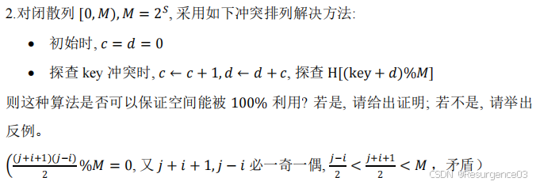

> 【2018-THU-Fin】采用单向平方策略的散列表，只要长度M不是素数，则每一组同义词在表中都不会超过⌊M/2⌋个。（√）
>  M不是素数时，完全平方数关于M的同余类数量不大于⌊M/2⌋ 

> 【2018-THU-Fin】将n个词条逐个插入一个容量为M、采用线性试探策略、初始为空的散列表，n<M，则无论它们的插入次序如何，最终的平均成功查找长度都必然一样。（√）
>  **平方试探为错**，M=11,1234512和1212345 

> 【2020-THU-Fin】
>
> 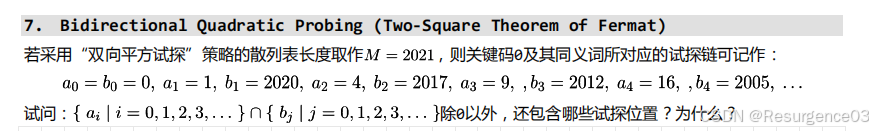

## 字符串匹配

> 【2010-THU-Mid】在对二进制串做匹配时，采用next[]表比采用BC[]表通常效率更高。（√）

>  【2010-THU-Mid】分别计算以下模式串的next[]表、改进的next[]表以及BC[]表。
>
> | j            | 0    | 1    | 2    | 3    | 4    | 5    | 6    |
> | ------------ | ---- | ---- | ---- | ---- | ---- | ---- | ---- |
> | P[]          | B    | A    | R    | B    | A    | R    | A    |
> | next[]       | -1   | 0    | 0    | 0    | 1    | 2    | 3    |
> | 改进的next[] | -1   | 0    | 0    | -1   | 0    | 0    | 3    |
> | BC[]         |      |      |      | B    |      | R    | A    |
>
> | j            | 0    | 1    | 2    | 3    | 4    | 5    | 6    | 7    | 8    | 9    | 10   | 11   | 12   | 13   | 14   | 15   |
> | ------------ | ---- | ---- | ---- | ---- | ---- | ---- | ---- | ---- | ---- | ---- | ---- | ---- | ---- | ---- | ---- | ---- |
> | P[]          | T    | A    | R    | S    | O    | M    | E    | _    | T    | A    | T    | A    | R    | S    | U    | S    |
> | next[]       | -1   | 0    | 0    | 0    | 0    | 0    | 0    | 0    | 0    | 1    | 2    | 1    | 2    | 3    | 4    | 0    |
> | 改进的next[] | -1   | 0    | 0    | 0    | 0    | 0    | 0    | 0    | -1   | 0    | 2    | 0    | 0    | 0    | 4    | 0    |
> | BC[]         |      |      |      |      | O    | M    | E    | _    |      |      | T    | A    | R    |      | U    | S    |
>
> 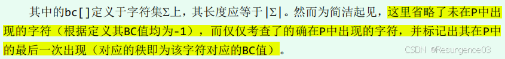

> 【2012-THU-Fin】字符集规模越大的时候，next表比BC表效果越好。（×） 

>  【2012-THU-Fin】在KMP匹配的过程中，当主程序运行到i, j的状态时，意味着之前至少做过i次成功匹配以及i-j次失败匹配。（×）
>
> 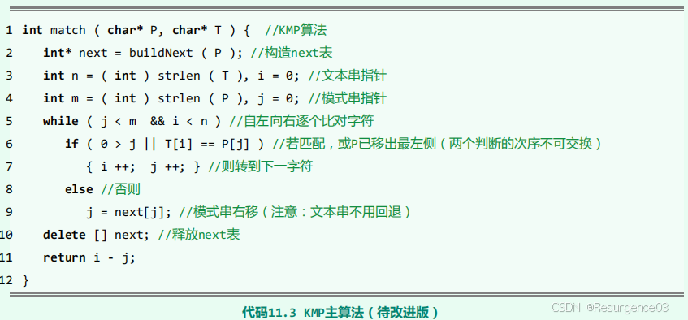
>
> 可能一直失败，从来没有成功过

> 【2013-THU-Fin】写出mamammi的改进后next表。 
>
> | j            | 0    | 1    | 2    | 3    | 4    | 5    | 6    |
> | ------------ | ---- | ---- | ---- | ---- | ---- | ---- | ---- |
> | 改进的next[] | -1   | 0    | 0    | 0    | 0    | 3    | 1    |

> 【2013-THU-Fin】写出ladygaga的GS表。 
>
> | j    | 0    | 1    | 2    | 3    | 4    | 5    | 6    | 7    |
> | ---- | ---- | ---- | ---- | ---- | ---- | ---- | ---- | ---- |
> | GS[] | 8    | 8    | 8    | 8    | 8    | 2    | 2    | 1    |

> 【2013-THU-Fin】字符集变大，各字符等概率分布，则bc表比next表好。（√）

> 【2014-THU-Fin】在BM算法中，对于任意模式串P，0<gs[j]≤j对每个0≤j<|P|都成立。（×） 

>  【2016-THU-Fin】若KMP算法不使用改进版的next表，最坏情况下时间复杂度可能达到𝑂(𝑚𝑛)。（×）

> 【2016-THU-Fin】对小写字母集的串匹配，KMP 算法与蛮力算法在（A）情况下渐进的时间复杂度相同。
>  A. 最好
>  B. 最坏
>  C. 平均
>  D. 以上皆非 

> 【2016-THU-Fin】对随机生成的m位二进制串，gs 表中 gs[0] = 1 的概率为（）。
>
> 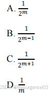

> 【2017-THU-Fin】红鲤鱼与路鲤鱼与路的拼音（HongLiYuYuLuLiYuYuLu）的gs表中有（）项互异项。
>  (A)3
>  (B)5
>  (C)7
>  (D)以上都不对

> 【2017，2018-THU-Fin】BM 算法仅仅使用 bc 表或者 gs 表，能够在最好情况下达到 O(n/m) 。（√） 

> 【2018-THU-Fin】相对KMP算法而言，BM算法更适合于大字符集的应用场合。（√） 

> 【2020-THU-Fin】试分别给出如下模式串对应的next[]表和改进后的next[]表。
>
> | j               | 0    | 1    | 2    | 3    | 4    | 5    | 6    | 7    | 8    | 9    | 10   | 11   | 12   |
> | --------------- | ---- | ---- | ---- | ---- | ---- | ---- | ---- | ---- | ---- | ---- | ---- | ---- | ---- |
> | P[j]            | C    | B    | C    | B    | A    | C    | D    | C    | B    | F    | B    | E    | A    |
> | next[j]         |      |      |      |      |      |      |      |      |      |      |      |      |      |
> | improvedNext[j] |      |      |      |      |      |      |      |      |      |      |      |      |      |

## 二叉树

> 【2010-THU-Mid】所有叶节点深度一致的有根二叉树，必为满树。（×）

> 【2010-THU-Mid】完全二叉树的子树，也一定是完全二叉树。（√）

> 【2010-THU-Mid】由合法的先序遍历序列和中序遍历序列，可以唯一确定一棵二叉树。（√）

> 【2010-THU-Mid】在Huffman算法过程中，权重小的内部节点必然早于权重大的内部节点被创建。（√）

> 【2010-THU-Mid】由6个节点组成的二叉树，若中序遍历序列为ABCDEF，则不可能的后序遍历序列是（）
>  A. CBEADF
>
> B. ADFECB
>
> C. ABDECF
>
> D. BDACFE
>
> E. 以上皆非

> 【2010-THU-Mid】由2010个节点组成的完全二叉树，共有（）个叶节点。
>
> 2010 = 1023 + 987，倒数第一层987个叶节点用掉了494个叶节点，倒数第二层还剩529个叶节点，共987 + 529 = 1516个叶节点

> 【2010-THU-Mid】在由2010个节点组成的二叉树中，若单分支节点不超过10个，则对其做迭代式中序遍历时辅助栈的容量为（）即足够。 
>
> 辅助栈内最大元素数量 = 到达某节点的左下路径数 + 1
>
> 最差情况：根节点连续只能向左，而后接上一个真二叉树，这个二叉树每个节点的右孩子都是叶节点，此时树高为1011，最大元素数量为1011

> 【2010-THU-Mid】某二叉树有 A~G 共 7 个节点，其先序遍历、后序遍历序列的部分内容如下，试将其补全。
>
> | 先序遍历 | **E** | **C** |      | **B** | **D** |       | **F** |
> | -------- | ----- | ----- | ---- | ----- | ----- | ----- | ----- |
> | 后序遍历 | **B** | **A** |      |       |       | **G** |       |

> 【2019-THU-Mid】由2019个无差别节点构成的真二叉树，与由1009对括号构成的合法表达式一样多。（×） 
>
> 含2019个叶节点的真二叉树与由1009对括号构成的合法表达式一样多

> 【2019-THU-Mid】在最优PFC树中交换深度不同的两棵子树，得到的必然不再是最优PFC树。（×）
>
> 考虑有三个最低权重的Huffman树

> 【2019-THU-Mid】同一棵二叉树的前序、中序、后序遍历序列中，叶子节点的相对次序必然完全一致。（√）

>  【2019-THU-Mid】使用容量为1009的辅助队列，足以对任一由2019个节点构成的二叉树做层次遍历。（）

> 【2019-THU-Mid】所有内部节点均满足“左子树比右子树高一层”的二叉树，称作Fibonacci树。
>
> 1) 试画出其中高度为4者，并从0开始按中序遍历次序对各节点编号；
> 2) 试给出该树的层次遍历序列。

> 【2024-912】将以x为根的子树节点个数记为x.size，如果将二叉树中满足x.size * 2 <= x.parent.size的非根节点x称作“轻节点”，那么在包含2024个节点的二叉树中，一个节点至多可能有（）个轻的真祖先。
>
> 显然满二叉树每个节点都是轻节点。高度为10的满二叉树有1023个节点，高度为11的满二叉树有2047个节点。考虑对应的2024个节点的完全二叉树，那么根节点左子树的所有节点都是轻节点，左子树的叶节点有9个真祖先是轻节点。
>
> 如果某个叶节点有10个真祖先是轻节点，那么这个节点深度至少是11。
>  如果深度是11，其所在根节点的子树是高度为10的满二叉树，与所在根节点子树的根节点是轻节点矛盾。
>  其他深度同理可证

> 【2024-912】出现频率为{1,2,3,3}的一组字符共有（）种PFC编码方案。
>
> 频率无用。4个字符需要2位0-1码，共4×3×2×1=24种方案。

## 搜索树

### 二叉搜索树

> 【2010-THU-Mid】由同一组互异关键码，按不同次序逐个插入而生成的 BST 必互异。（×）
>
> 213和231

> 【2010-THU-Mid】BST中新插入的节点，必是叶节点。（√）

> 【2010-THU-Mid】 由5个互异节点组成、先序遍历序列与层次遍历序列相同的BST，共有（）棵。

> 【2014-THU-Fin】由同一组共n个词条构成的任意两棵BST，经O(logn)次zig和zag旋转之后，必可相互转换。（×）

> 【2016-THU-Fin】在BST中删除两个节点(7B3)，则无论先删除哪个节点，最终BST的拓扑结构均相同。（×） 

> 【2016-THU-Fin】在BST中查找365，以下查找序列中不可能出现的是（）
>  A. 912,204,911,265,344,380,365
>  B. 89,768,456,372,326,378,365
>  C. 48,260,570,302,340,380,361,365
>  D. 726,521,201,328,384,319,365

> 【2016-THU-Fin】在不改变 BST 和 BinNode 定义的前提下（BinNode 仅存储 parent, data, lc, rc), 设计算法, 使得从节点 𝑥 出发, 查找值为 𝑌 的节点 𝑦 的时间复杂度为 𝑜(𝑑), 𝑑 为节点 𝑥与 𝑦 的距离。要求利用树的局部性, 复杂度与总树高无关, 否则将不能按满分起评。
>  函数定义式: 参量为 BinNode 𝑥, 𝑦, 𝑇, 返回值为 BinNode 类型, 函数名 fingerSearch
>  (a) 说明算法思路
>  (b) 写出伪代码
>  (c) 在图中画出由值为 6 的点查找值为 17 的点的查找路径
>  (d) 说明算法时间复杂度为 𝑂(𝑑) （若无法达到, 说明困难在哪）
>
> 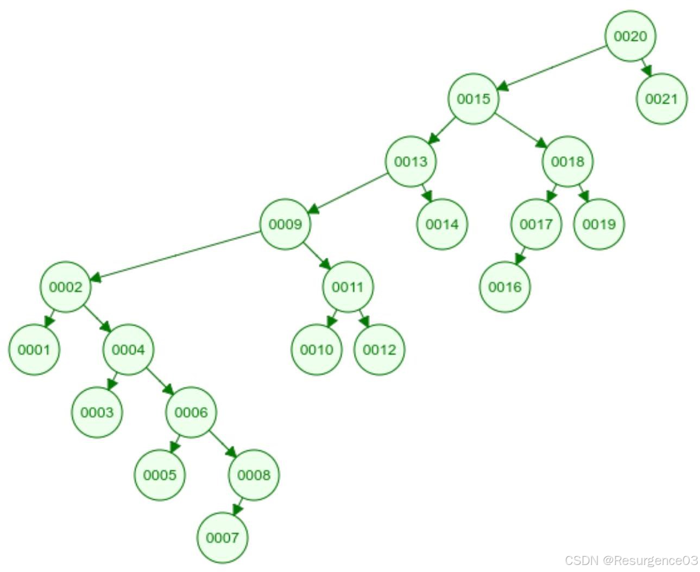

> 【2016，2017-THU-Fin】由5个互异节点构成的不同的BST共有（D）个。
>  A. 24
>  B. 30
>  C. 36
>  D. 42
>  E. 120
>
> Catalan(5) = 42

> 【2018-THU-Fin】若调用BST::remove(e)将节点x从常规BST中删除，则所需的时间为被删除之前x的深度。（×）

### 平衡二叉搜索树

> 【2013-THU-Fin】两棵key值顺序一样的BBST经过O(logn)次zig、zag就能互相转化。（×）
>
> 无论是BST还是BBST，都需要O(n)次旋转
>
> 考虑倒数第二层满且节点均不相同，倒数第一层仅一个节点的两棵BBST，倒数第二层有O(n)个互异节点，而一次旋转最多调整O(1)个节点

### AVL树

> 【2010-THU-Mid】在AVL树中删除节点之后若树高降低，则必然做过旋转调整。（×）

> 【2010-THU-Mid】在包含 2010 个节点的 AVL 树中，最高与最低叶节点之间的深度差最大可达（）。
>  A. 8
>
> B. 9
>
> C. 10
>
> D. 11
>
> E. 以上皆非

> 【2010-THU-Mid】右图有可能是一棵刚做过BST的（）操作，但尚未旋转调整的AVL树。
>
> 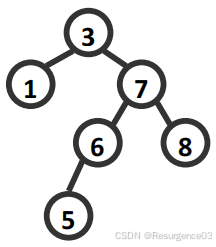
>  A. delete(2)
>
> B. insert(3)
>
> C. detele(4)
>
> D. insert(5)
>
> E. insert(8) 

> 【2010-THU-Mid】由2010节点组成的AVL树，最大高度可达（）

> 【2010-THU-Mid】在高度为2010的AVL树中删除一节点，至多可能造成（）个节点失衡，至多需做（）次旋转调整。 

> 【2010-THU-Mid】在（）中，越深的节点必然越多。
>  A. 二叉树
>
> B. AVL树
>
> C. 满二叉树
>
> D. 完全二叉树
>
> E. 以上皆非

> 【2010-THU-Mid】节点x的父节点和祖父节点分别记作p和g。试在下图中补充尽可能少的节点以构造一棵AVL树，使得：
>
> 1) 在摘除x之后，p失衡；
> 2) 经局部双旋调整之后，g 因失衡需再次实施双旋调整。
>
>  请同时在右侧画出最终恢复平衡的树形。 
>
> 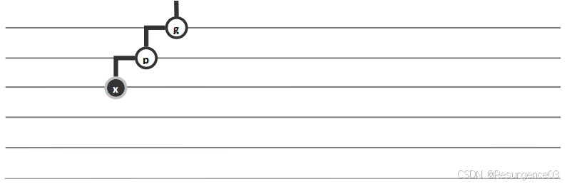

> 【2012-THU-Fin】将[1481,1992]区间内的整数逐一插入到空AVL树中，最后该AVL树的高度是（CD）
>  A. 7 
>  B. 8 
>  C. 9 
>  D. 10 
>  E. 以上都不对
>  共512=2^9个元素，至少为9。fib(13)-1=232，也可能是10。

> 【2013-THU-Fin】依次将 0, ..., 2^d−1插入到初始为空的AVL一定高度为d。（）

> 【2014-THU-Fin】设在某新节点插入AVL树后（尚待平衡化时），最低失衡节点为g。若此时g的左、右孩子的平衡因子分别为-1和0，则应通过（C）旋转使之重新恢复平衡。 
>  A. zig
>  B. zig+zag
>  C. zag+zig
>  D. zag
>  E. 不确定

> 【2016-THU-Fin】若AVL树插入元素的过程中发生了旋转操作，则树高必不变。（√）

> 【2016-THU-Fin】如果元素理想随机，那么对二叉搜索树做平衡化处理，对改进其渐进时间复杂度并没有什么实质的作用。（×）
>
> 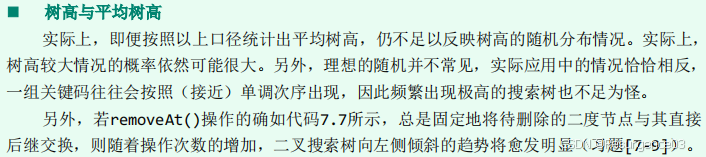
>
> 

> 【2018-THU-Fin】在某节点被删除后AVL树的高度即便下降了，这次操作期间也未必做过旋转调整。（√）

> 【2018-THU-Fin】对规模为n的AVL树做一次插入操作，最坏情况下可能引发\omega(logn)次局部重构。（×）
>
> 时间复杂度为O(logn)，但只有不多于1次局部重构

### 伸展树

> 【2010-THU-Mid】设x为某伸展树中的最大关键码，则在find(x)过程中不可能实施（ABC）调整。
>  A. zig‐zig
>
> B. zig‐zag
>
> C. zag‐zig
>
> D. zag‐zag
>
> E. 以上皆非

> 【2013-THU-Fin】将2014个数插入splay，第一次访问经过2013次旋转，则是单调插入的。（×） 

> 【2014-THU-Fin】即便访问序列不满足局部性（比如完全理想的随机），伸展树依然能保证分摊O(logn)的性能。（√）

> 【2016-THU-Fin】在任何情况下，伸展树总能保持每次操作O(log n)的平均复杂度。（×） 

> 【2018-THU-Fin】只有在访问序列具有较强的局部性时，伸展树才能保证分摊O(logn)的性能。（×）

> 【2018-THU-Fin】将{0,1,...,2018}插入一棵空的伸展树后，若树高为2018，则上述词条必是按单调次序插入的。（×）
>
> **对于插入序列1,0,2，3，...，仍然是单链**

> 【2018-THU-Fin】最底层的叶节点一旦被访问（并做过splay调整）之后，伸展树的高度必然随即下降。（×）

### 红黑树

> 【2012-THU-Fin】对红黑树进行插入操作时，进行双红修正，黑高度增加，则（）发生重染色，（）发生结构调整。
>  A. 必然，必然
>  B. 必然，可能
>  C. 必然，必然不
>  D. 可能，必然
>  E. 可能，可能
>  F. 可能，必然不
>
> 黑高度增加意味着出现了RR-2，且一直传播到树根
>
> RR-2：p为红，s为红，翻转p层与g层的颜色，无重构，选C

> 【2013-THU-Fin】在初始为空的红黑树中依次插入关键码[0, N)
>  （1）写出N = 9的红黑树
>  （2）写出树高H和N的通项公式

> 【2016-THU-Fin】若红黑树插入一个元素后，黑高度增加，则双红修正过程中没有拓扑结构变换，只有重染色操作。（√）
>
> 仅RR-2执行到根节点才会导致黑高度增加；RR-2只会重染色

> 【2018-THU-Fin】红黑树的插入或删除操作，都有可能导致Ω(logn)个节点的颜色反转。（√）
>
> 插入：一直RR-2到根节点
>
> 删除：一直BB-2B到根节点

> 【2018-THU-Fin】在插入操作后若红黑树黑高度增加，则在双红修复过程中仅做过重染色，而无任何结构调整。（√）

### B-树

> 【2010-THU-Mid】高度为3的5阶B‐树，至多可存放（）个关键码，至少需存放（）个。
>
> 外部节点占一层，仅有最高两层有关键码
>
> - 5阶B树的一个节点最多4个关键码，5个引用 
>   - 共4+5×4=24个关键码
> - 5阶B树的一个节点最少2个关键码，3个引用 
>   - 共2+3×2=8个关键码

> 【2012-THU-Fin】将[23,1481)区间内的整数组成一个2-3-B树，且根节点只有一个关键码，则最终该B树的高度至少是（）
>  A. 7
>  B. 8
>  C. 9
>  D. 以上都不对

> 【2014-THU-Fin】Btree::solveOverflow()和 Btree::solveUnderflow()在最坏情况下均需Ω(logn)时间。然而在B-树任一足够长的生命期内，就分摊意义而言二者都仅需O(1)时间。（√）

> 【2016-THU-Fin】将N个关键码按随机次序插入B树，则期望的分裂次数为O(log^2N)。（）

> 【2016-THU-Fin】以下数据结构，在插入元素后可能导致O(logn)次局部结构调整的是（）
>  A. AVL
>  B. B-树
>  C. 红黑树
>  D. 伸展树
>  E. 以上皆非

> 【2016-THU-Fin】人类拥有的数字化数据数量，在2010年已达到ZB (2^70 = 10^21) 量级。若每个字节自成一个关键码，用一棵16阶B-树存放，则可能的高度为（）
>  A. 10
>  B. 20
>  C. 40
>  D. 80
>  E. 大于80

> 【2017-THU-Fin】B树非叶节点的元素都有后继元素，且都在叶子节点中。（√）

> 【2012，2017-THU-Fin】对以下各种搜索树进行删除操作，哪些树可能会经过Ω(logn)次局部调整，其中n为关键码的数量。（A）
>  A. AVL
>  B. 伸展树
>  C. 红黑树
>  D. B-树
>  E. 都不会

> 【2017-THU-Fin】一个初始时只有一个内部节点的10阶B树，经过9900次分裂和7888次合并，节点数可能在（）附近。
>  A. 2013
>  B. 2015
>  C. 2017
>  D. 2018

> 【2018-THU-Fin】考查包含2018个关键码的16阶B-树，约定根节点常驻内存，且在各节点内部采用顺序查找。
>
> a) 在单次成功查找的过程中，至多可能需要读多少次磁盘？
>
> b) 在单次成功查找的过程中，至多可能有多少个关键码需要不目标关键码做比较？

> 【2018-THU-Fin】B-树的任一非叶节点内，每个关键码都存在直接后继，且必然来自某个叶节点。（√）

> 【2020-THU-Fin】如何从B-树中删除一个属于内部节点而非叶节点的关键码？

### kd树

> 【2016-THU-Fin】在 kd-search中，查找区间𝑅与任一节点的 4个孙节点（假设存在）对应区域最多有 2 个相交。（）

> 【2014，2016-THU-Fin】以下数据结构中，空间复杂度不超过线性的有（）
>  (A)2d-tree
>  (B)3d-tree
>  (C)2D range tree
>  (D)interval tree
>  (E)segment tree
>  (F)priority search tree

## 优先级队列

> 【2013-THU-Fin】多叉堆比二叉堆插入慢，删除快。（×） 
>
> 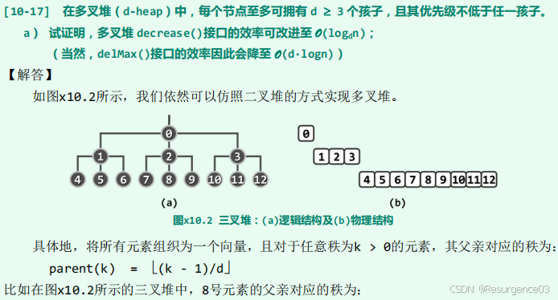
>
> 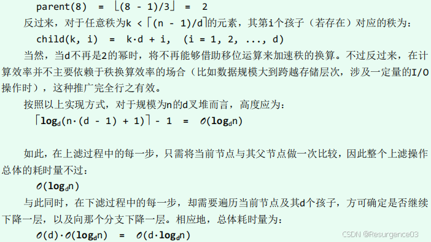

> 【2013-THU-Fin】对于关键码为0,1,…,2014的左式堆。
>
> 1. 左子堆至少有几个节点（不包括外部节点）,右子树最高多高？
> 2. 画出示意图。
> 3. 按什么顺序插入0..2014，能成为2中图的样子？

> 【2014-THU-Fin】对于二叉堆，尽管多叉堆的高度更低，但无论是下滤一层还是整个下滤过程，时间成本反而都会增加。（×）

> 【2014-THU-Fin】对于任何一棵二叉树T，其右、左子树的规模之比称为右偏率。对于（常规）高度同为h的AVL树（A），红黑树（R），左式堆（L），若分别考查其右偏率所能达到的最大值，则在h足够大之后，三者按此指标的排列次序应是（C）
>  A. L<R<A
>  B. L<A<R
>  C. R<A<L
>  D. A<R<L
>  E. 以上皆非 

> 【2016-THU-Fin】与二叉堆相比，多叉堆delMax()操作时间复杂度更高。 （×）

> 【2016-THU-Fin】完全二叉堆删除元素在最坏情况下时间复杂度为O(logn)，但平均情况下仅为O(1)。（×）

> 【2013，2016-THU-Fin】在使用Heapify批量建堆的过程中，改变同层节点的下滤次序对算法的正确性和时间效率都无影响。（√）
>
> 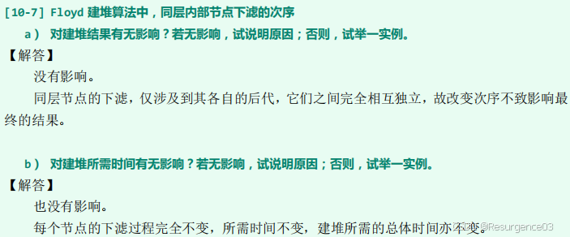

> 【2016-THU-Fin】二叉堆中某个节点秩为𝑘, 则其兄弟节点（假设存在）的秩为（AB）
>
> A. 𝑘 + 1
>  B. 𝑘 − 1
>  C. 𝑘 + (−1)^𝑘
>  D. 𝑘 − (−1)^𝑘
>  E. 以上皆非

>  【2016-THU-Fin】有2015个节点的左式堆，左子堆最小规模为（E）（不计外部节点）
>  A. 10
>  B. 11
>  C. 1007
>  D. 1008
>  E. 以上皆非
>
> 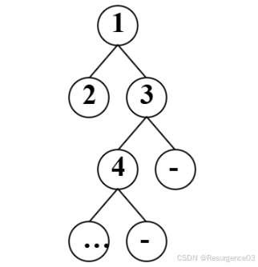

> 【2017-THU-Fin】当输入是理想随机的时候堆的delMax的平均复杂度是O(1)，尽管最坏是 O(logn)。（×）

> 【2016，2017-THU-Fin】对于左式堆A和B，合并后所得二叉堆的右侧链元素一定来自A和B的右侧链。（×） 

> 【2017-THU-Fin】给了一种数据结构 DEPQ（双端优先队列），空间上是线性，能够 O(1)的时间获得序列的最大值最小值，O(logn)的时间 delMin、delMax、insert
>  (1)如果序列的长度超过了内存，请利用这种数据结构借鉴快速划分策略给出一种排序算法
>  (2)如果总序列长度是 1TB，内存是 2GB，IO 页面是 4KB，单次比较操作、内存读取的时间是 t，IO 延时是 2^17t，请估计你的算法在最好最坏的情况下的时间
>  (3)请给出一些改进平均性能的策略

> 【2018-THU-Fin】相对于同样规模的完全二叉堆，多叉堆delMax()操作的时间成本更低。（×）

> 【2018-THU-Fin】左式堆中每一对兄弟节点的高度尽管未必“左大右小”，但左兄弟至少不低于右兄弟的一半。（×）

> 【2018-THU-Fin】采用Crane算法将左式堆A与B合并为左式堆H，右侧链上的节点未必都来自A或B的右侧链。（√）

## 图

>  【2010-THU-Fin】某有向图的邻接矩阵如下，现从顶点1出发做DFS遍历，遇多顶点歧义时编号小者优先。试在表标出各边的分类结果（树边T，前向边F，后向边B，跨边C）
>
> 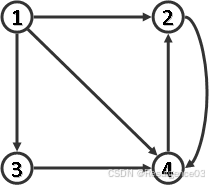(data:image/gif;base64,R0lGODlhAQABAPABAP///wAAACH5BAEKAAAALAAAAAABAAEAAAICRAEAOw==)编辑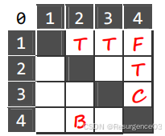
>
> |      | 1    | 2    | 3    | 4    |
> | ---- | ---- | ---- | ---- | ---- |
> | 1    |      |      |      |      |
> | 2    |      |      |      |      |
> | 3    |      |      |      |      |
> | 4    |      |      |      |      |

>  【2010-THU-Fin】某无向网络及其邻接矩阵的上三角部分如下，现从顶点 A 出发采用 Prim 算法构造最小生成树，试在下三角区域标出树边及其被选用的次序。遇多边歧义时，按边端点合成数的字典序小者优先。 
>
> 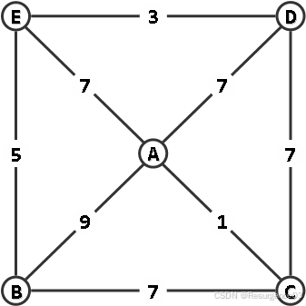
> 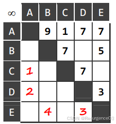

>  【2010-THU-Fin】某无向网络及其邻接矩阵的上三角部分如下。现从顶点 A 出发采用 Dijkstra 算法构造最短路径生成树，试在下三角区域标出树边及其被选用的次序。遇多边歧义时，按边端点合成数的字典序小者优先。 
>
> 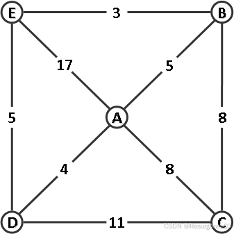
> 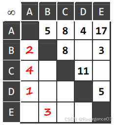

> 【2012-THU-Fin】对于正权值有向图，如果把所有的边权都平方之后，Dijkstra算法得到的最短路径树不变。（√） 

> 【2012-THU-Fin】对于7节点的有向图，节点标号为1 ∼ 7，指定当存在歧义性的时候优先考虑标号小的节点。一共有多少条树边，跨边，前向边和后向边？
>
> 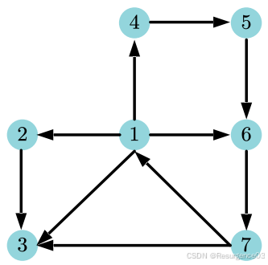

> 【2013-THU-Fin】BFS，DFS的复杂度可能不是O(N + E)。（）

> 【2013-THU-Fin】PFS每次调用priorUpdata()，总复杂度O(n)。（） 

> 【2014-THU-Fin】我们知道，因同一顶点的邻居被枚举的次序不同，同一有向图 G 所对应的 DFS 森林未必唯一。然而只要起始于 G 中某顶点 s 的某次 DFS 所生成的是一棵树，则起始于 s 的任何一次 DFS 都将生成一棵树。（）

> 【2014-THU-Fin】在无向连通图G中选定一个顶点 s，并将各顶点v到s的距离记作dist(v)（特别地，dist(s)=0）。于是在G.BFS(s)过程中，若辅助队列为Q，则dist(Q.front()) + 1 ≥ dist(Q.rear())始终成立。（√） 

> 【2014-THU-Fin】有向图的DFS不仅起点任意，而且每一步迭代往往都会有多个顶点可供选择，故所生成的DFS森林并不唯一确定，且其中所含（）的数量也可能不同。
>  A. 树边
>  B. 前向边
>  C. 后向边
>  D. 跨越边
>  E. 以上皆非

> 【2016-THU-Fin】如果把朋友圈视为一无向图，那么即使A君看不到你给B点的赞，你们仍可能属于同一个双联通分量。（√）

> 【2014，2016-THU-Fin】在有向图G中，存在一条自顶点v通向u的路径，且在某次DFS中有dTime[v]<dTime[u]，则在这次DFS所生成的DFS森林中，v必是u的祖先。（×） 

> 【2017-THU-Fin】用堆实现 PFS 时元素的深度只会减少不会增加。（）

> 【2017-THU-Fin】PFS 时调用 priorityUpdater 至多 O(e)次。（）

> 【2018-THU-Fin】在图DFS()算法中的default分支，将dTime(v) < dTime(u)改为dTime(v) < fTime(u)同样可行。（） 

> 【2013，2018-THU-Fin】有向图经DFS后若共有k条边被标记为BACKWARD，则它应恰有k个环路。（×） 

> 【2018-THU-Fin】对于同一无向图，起始于顶点s的DFS尽管可能得到结构不同的DFS树，但s在树中的度数必然固定。（）

> 【2016，2018-THU-Fin】在图的优先级搜索过程中，每次可能调用多次prioUpdater，但累计调用次数仍为O(e)。（）

> 【2018-THU-Fin】若用完全二叉堆来实现PFS，则各顶点在出堆之前，深度只可能逐步减少（或保持）而不致增加。（）

## 排序

> 【2010-THU-Mid】只要是采用基于比较的排序算法，对任何输入序列都至少需要运行O(nlogn)时间。（√） 

> 【2010-THU-Mid】若借助二分查找确定每个元素的插入位置，向量的插入排序只需O(nlogn)时间。（） 

> 【2010-THU-Mid】考查如下问题：任给12个互异的整数，且其中10个已组织为一个有序序列，现需要插入剩余的两个以完成整体排序。若采用基于比较的算法（CBA），最坏情况下至少需做几次比较？为什么？

> 【2010-THU-Mid】向量的插入排序由n次迭代完成，逐次插入各元素。为插入第k个元素，最坏情况需做k次移动，最好时则无需移动。从期望的角度来看，无需移动操作的迭代平均有多少次？为什么？假定各元素是等概率独立均匀分布的。

>  【2010-THU-Fin】对整型向量[16,2011,6]做就地堆排序，试给出堆初始化（Robert Floyds 算法）以及各次迭代之后向量的内容。
>
> | Rank   | 0     | 1      | 2        |
> | ------ | ----- | ------ | -------- |
> | Vector | 16    | 2011   | 6        |
> | Heap   | 2011  | 16     | 6        |
> | 1      | 16    | 6      | **2011** |
> | 2      | 6     | **16** | **2011** |
> | 3      | **6** | **16** | **2011** |
>
> 加粗为Sorted部分

> 【2013-THU-Fin】shell排序若将（底层的排序从）插入排序改成归并排序，效率会变快。（）

> 【2013-THU-Fin】radix排序将桶排序改成quick排序，仍然正确。（×） 

> 【2013-THU-Fin】因为取（步长序列为）1,2,4,8, … , 2^𝑛会产生最坏情况
>  1、（步长序列变成）1,3,7, … , 2^𝑛 − 1会如何？
>  2、（步长序列变成）1,5,9,17, … , 2^𝑛 + 1会如何？ 

> 【2014-THU-Mid】 不存在CBA式算法，能够经过少于2n-3次比较操作，即从n个整数中找出最大和次大者。（） 

>  【2014-THU-Mid】存在CBA式算法，能够在O(n)时间内从n个无序整数中找出最大的10%。 （）

> 【2014-THU-Fin】无论 g 和 h 互素与否，已知 h-有序的序列再经过 g-排序之后，必然继续保持 h-有序。（√）

> 【2014-THU-Mid】 起泡排序的每一趟扫描交换中若有元素发生交换，则相邻的逆序对必然减少。（×） 
>
> 考虑231，一趟排序后变为213

> 【2016-THU-Fin】既然可以在𝑂(𝑛)时间内找出𝑛个数的中位数，快速排序算法（12-A1）即可优化至𝑂(𝑛log 𝑛)。（）

> 【2016-THU-Fin】若序列中逆序对个数为𝑂(𝑛2),则使用快速排序（12-A1）须进行的交换次数为𝑂(𝑛log 𝑛)。（）

> 【2016-THU-Fin】与胜者树相比，败者树在重赛过程中，需反复将节点与其兄弟进行比较。（×） 

> 【2017-THU-Fin】底层排序的稳定性保证了radixsort的正确性和稳定性。（√） 

> 【2017-THU-Fin】当待排序列的长度超过内存的时候，（）序列的shell排序速度最慢。
>
> A. Shell
>  B. PS
>  C. Pratt
>  D. Sedgewick

> 【2017-THU-Fin】ℋshell = {1,2,4,8,16,32,64, … , 2^𝑘, … },设以下两种步长序列分别为ℋshell-改进 1 ={1,3,5,9,17, … , 2^𝑘 + 1, … }和ℋshell-改进 2 = {1,3,7,15,31, … , 2^𝑘 − 1,… }，哪种能必然避免O(n²)的最坏情况。（C）
>  A. 只有ℋshell-改进 1能避免
>  B. 只有ℋshell-改进 2能避免
>  C. ℋshell-改进 1和ℋshell-改进 2都能避免
>  D. ℋshell-改进 1和ℋshell-改进 2都不能避免 

> 【2018-THU-Fin】若输入序列包含Ω(n^2)个逆序对，则快速排序算法（LUG版）至少需要执行O(nlogn)元素交换操作。（） 

> 【2018-THU-Fin】经快速划分（LGU版）之后，后缀中的雷同元素可能调换相对次序，但其余部分的雷同元素绝不会。（）

>  【2018-THU-Fin】只要底层的排序算法是正确且稳定的，则RadixSort也必然是正确且稳定的。（√） 

> 【2018-THU-Fin】采用任何一种增量序列， Shell排序最后的1-sorting都只需要O(n)时间。（√）
>
> 已经控制了所有逆序对的间隔

> 【2018-THU-Fin】Shell排序每按照某个增量做过逐列排序，序列中逆序对的总数都会减少（或持平），但绝不致增加。（√）

> 【2018-THU-Fin】胜者树的根节点即是冠军，而败者树的根节点即是亚军。（√） 

> 【2019-THU-Mid】 插入排序算法的（B）特点，是选择排序算法所不具备的。
>  A. 输入敏感性
>
> B. 支持在线计算
>
> C. 就地性
>
> D. 最好情况下复杂度更低

## 选择问题

> 【2012-THU-Fin】一个向量若存在众数，则该数必然是中位数以及频繁数。（√）

> 【2012-THU-Fin】如果使用了线性复杂度的中位数选取算法，快速排序的复杂度可以保证在最坏情况下也渐进等于O(nlogn)。（√）

> 【2013-THU-Fin】在1983个数字中取前三大，最少比较多少次？

> 【2014-THU-Fin】为从 2014 个随机元素中挑选出最大的 5 个，（ ）在最坏情况下所需的比较操作次数最少。
>
> A. 构建大顶的锦标赛树，再做5次 delMax()
>  B. 用 Floyd 算法构建大顶堆，再做5次 delMax()
>  C. 采用选择排序算法，但仅执行前5次迭代
>  D. 采用起泡排序算法，但仅执行前5次迭代
>  E. 用 LinearSelect()算法找出第5大的元素，再遍历一趟找出至多4个大于它的元素