# 图Graph

$G = (V, E), \left| V \right| = n, \left|E \right| = e$

- 稀疏图：$e = O(n)$
- 稠密图：$e = O(n^2)$

有向无环图DAG：Directed Acyclic Graph

Euler环路：经过图中各边一次且恰好一次的环路

Hamilton环路：经过图中各顶点一次且恰好一次的环路

<font color=#956FE7>Euler公式：$n - e + f - c = 1$</font>，其中$n$、$e$、$f$和$c$分别为平面图的顶点、边、面和连通域的数目

- 完全图$K_5$不是平面图

## 物理结构

### 邻接矩阵

一个n阶方阵A，E中有一条边(u, v)当且仅当A[u][v] = 1

> 在包含n个顶点的用**邻接矩阵**实现的图中，顶点v有m个邻居，遍历所有m个邻居的时间复杂度为**O(n)**

$O(n^2)$空间

#### 矩阵压缩

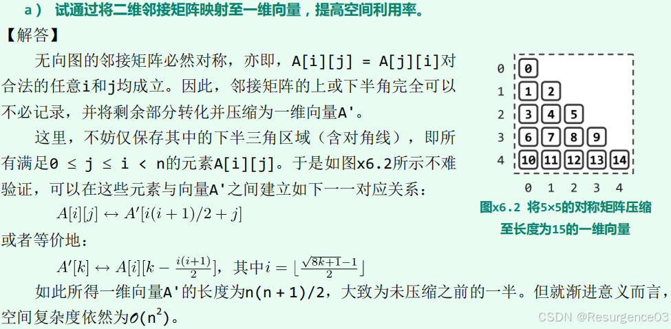

（联系数值代数中的相关压缩技巧）

### 关联矩阵

一个$n \times e$阶矩阵B，E中有一条边i从顶点u出发当且仅当$B[u][i] = -1$，E中有一条边j从顶点v进入当且仅当$B[v][j] = 1$

- 对于稠密图，邻接矩阵优
- 对于稀疏图，关联矩阵优

> （《算法导论》练习22.1-7）
>
> 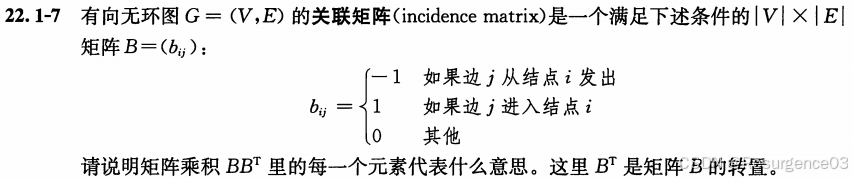
>
> 对于无向图，$BB^\mathrm{T}$的非对角元与$A$相同，对角元是对应顶点的度数
>
> 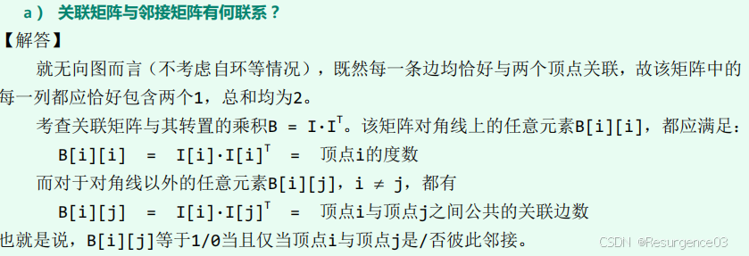
>
> 对于有向图，$BB^\mathrm{T}$表明两个顶点间有多少条有向边
>
> 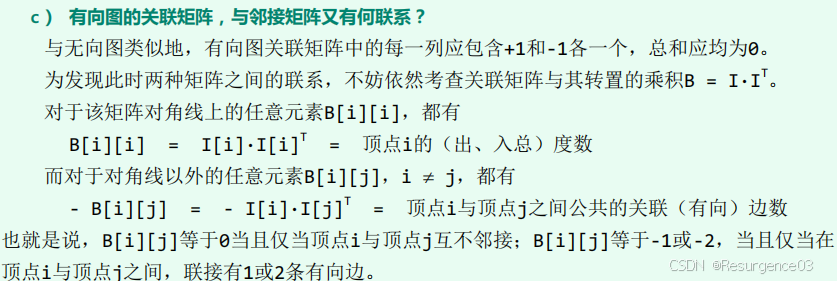

$O(ne)$空间

### 邻接表

每个顶点引出一个List，存放从自身出发的各边及权

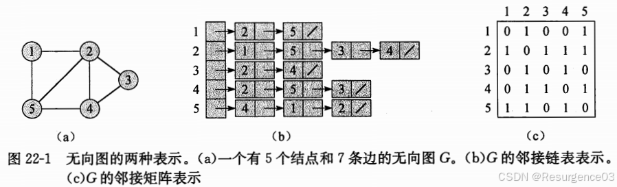

$O(n + e)$空间

以下实现均基于**邻接表**

|          |                           邻接矩阵                           |                            邻接表                            |
| :------: | :----------------------------------------------------------: | :----------------------------------------------------------: |
| 适用场合 | 经常检测边的存在<br />经常做边的插入/删除<br />图的规模固定<br />稠密图 | 经常计算顶点的度数<br />顶点数目不确定<br />经常做遍历<br />稀疏图 |

### 邻接多重表


## 图搜索

顶点的活跃期：[dTime,fTime]

- <font color=#956FE7>dTime：discovered time，顶点**被发现**的时刻</font>
- <font color=#956FE7>fTime：finished time，顶点**完成访问（访问完所有邻居）**的时刻</font>

<font color=#956FE7>前沿集：在所有**已访问到**的顶点中，仍**有邻居尚未访问**者，即status = DISCOVERED的顶点</font>

### 广度优先搜索BFS

```cpp
template<typename Tv, typename Te> void Graph<Tv, Te>::BFS(Rank v, Rank& dClock) {
    Queue<Rank> Q; 
    status(v) = DISCOVERED;
    Q.enqueue(v);
    dTime(v) = dClock++; //起点
    for (Rank fClock = 0; !Q.empty(); ) { //在Q变空之前，反复地
        if (dTime(v) < dTime(Q.front())) //dTime的增加，意味着开启新的一代，因此
        dClock++; //dTime递增
        fClock = 0; //fTime复位
        v = Q.dequeue(); //取出队首顶点v，并
        for (Rank u = firstNbr(v); -1 != u; u = nextNbr(v, u)) { //考查v的每一个邻居u
            if (UNDISCOVERED == status(u)) { //若u尚未被发现，则发现之
                status(u) = DISCOVERED; //发现该顶点
                Q.enqueue(u);
                dTime(u) = dClock;
                type(v, u) = TREE;
                parent(u) = v; //引入树边，拓展BFS树
            } else //若u已被发现（正在队列中），或者甚至已访问完毕（已出队列），则
                type(v, u) = CROSS; //将(v, u)归类于跨边
            }
            status(v) = VISITED;
            fTime(v) = fClock++; //至此，v访问完毕
        }
    }
}
```

辅助队列Q

- 从左到右到起点s的距离单调非降
- 首末顶点到起点s的距离至多差1
- 相邻顶点到起点s的距离至多差1

#### 边分类

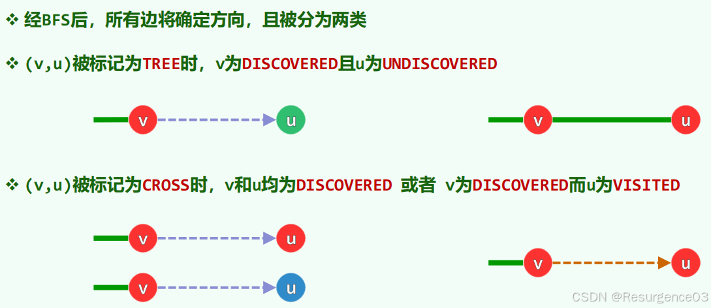

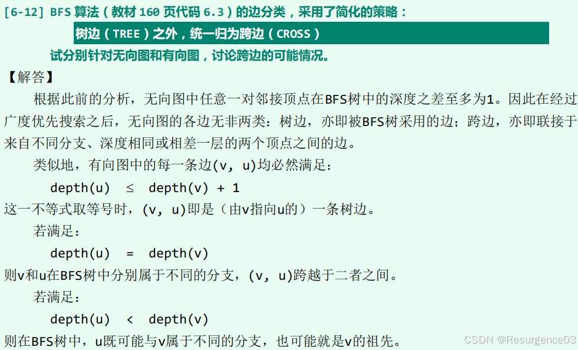

树边端点到起点s的距离差1

横向边端点到起点s的距离至多差1

<font color=#956FE7>时间复杂度$O(n + e)$</font>

- 每个点入队一次
- 每条边访问一次

<font color=#956FE7>空间复杂度$O(n + e)$</font>

- 队列长度$O(n)$
- 边和顶点的状态$O(n) + O(e)$

#### 连通域分解

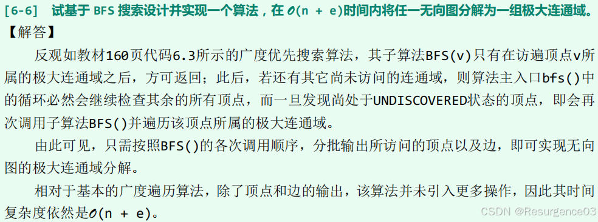

#### 无权最短路径

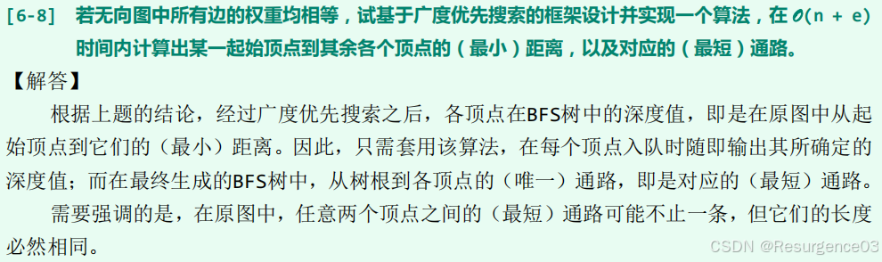

### 深度优先搜索DFS

```cpp
template<typename Tv, typename Te> void Graph<Tv, Te>::DFS(Rank v, Rank& clock) {
    dTime(v) = ++clock;
    status(v) = DISCOVERED; //发现当前顶点v
    for (Rank u = firstNbr(v); -1 != u; u = nextNbr(v, u)) {//考察v的每一邻居u
        switch (status(u)) { //并视其状态分别处理
            case UNDISCOVERED: { //u尚未发现，意味着支撑树可在此拓展
                type(v, u) = TREE;
                parent(u) = v;
                DFS(u, clock);
                break;
            } case DISCOVERED: { //u已被发现但尚未访问完毕，应属被后代指向的祖先
                type(v, u) = BACKWARD;
                break;
            } default: { //u已访问完毕（VISITED，有向图），则视承袭关系分为前向边或跨边
                type(v, u) = dTime(v) < dTime(u) ? FORWARD : CROSS;
                break;
            }
        }
    }
    status(v) = VISITED;
    fTime(v) = ++clock; //至此，当前顶点v方告访问完毕
}
```

对应迭代改写


辅助栈S

<font color=#956FE7>规模不小于DFS树的最大深度，即$O(n)$</font>

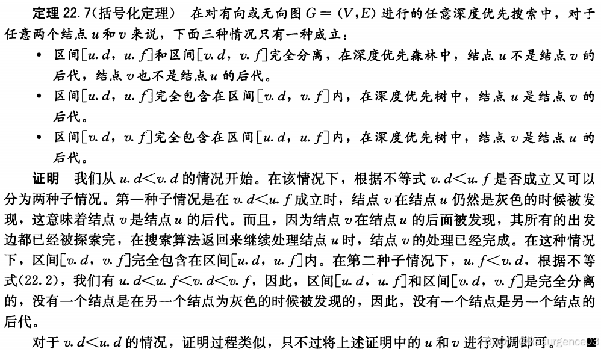

#### 边分类

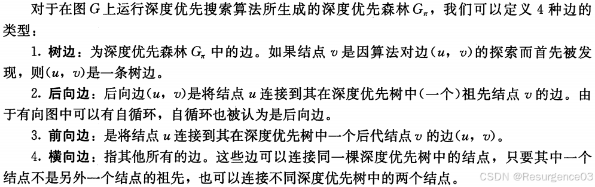

- <font color=#956FE7>树边(u，v)：status(v) = UNDISCOVERED</font>
- <font color=#956FE7>后向边(u，v)：status(v) = DISCOVERED</font>
  - <font color=#956FE7>后向边数 <= 图中回路数</font>
    - 一条后向边可能划分出多条回路
    - 多条回路可能共用一条后向边
    - 有后向边一定有回路
- <font color=#956FE7>前向边(u，v)：status(v) = VISITED，dTime(u) < dTime(v)</font>
  - <font color=#956FE7>在当前DFS树中u是v的祖先</font>
- <font color=#956FE7>横向边(u，v)：status(v) = VISITED，dTime(u) > dTime(v)</font>
  - u在v所在分支被访问完后到达，表明边已经跨分支，不在DFS树中

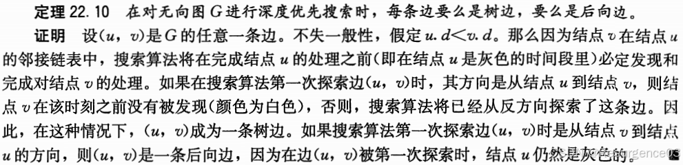

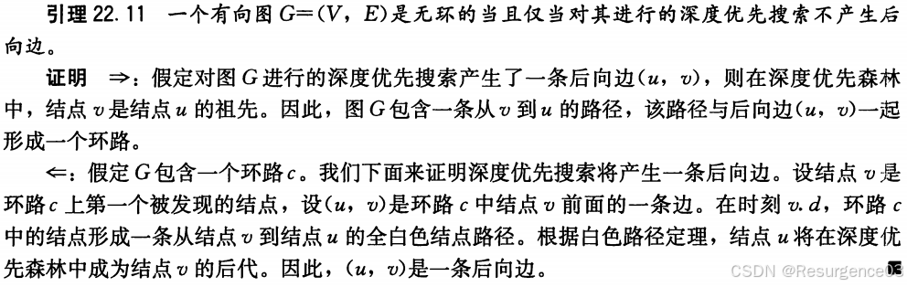

<font color=#956FE7>时间复杂度$O(n + e)$</font>

<font color=#956FE7>空间复杂度$O(n + e)$</font>

- 栈规模$O(n)$
- 边和顶点的状态$O(n) + O(e)$

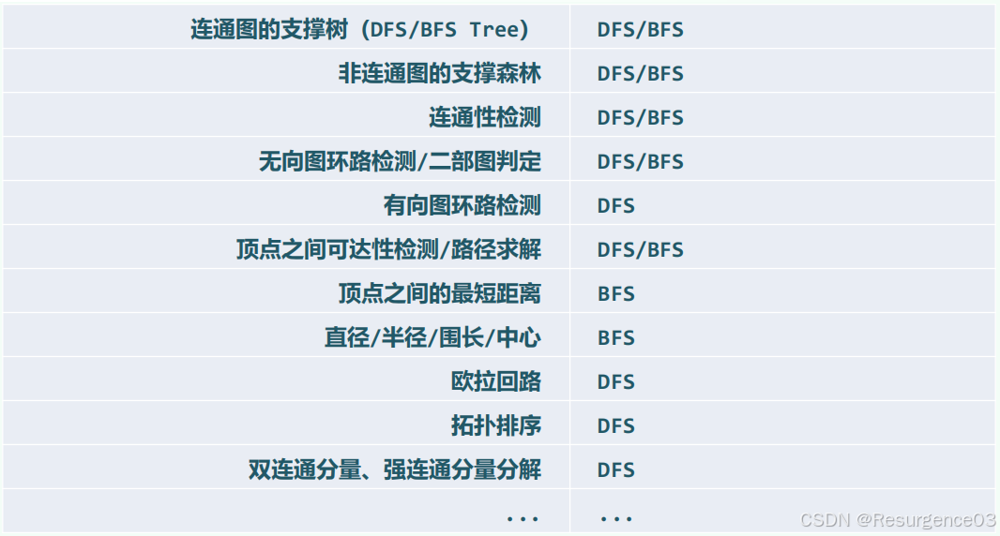

> （《算法导论》练习22.3-8）
>
> 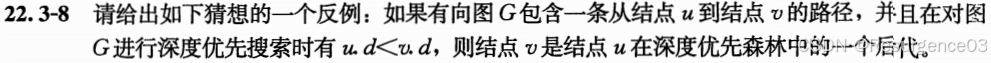

> （《算法导论》练习22.3-9）
>
> 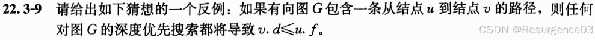

#### 双连通分量

在**无向连通图**中定义

- 衔接点：删除该顶点导致图不再是连通图
- 桥：删除该边导致图不再是连通图
- <font color=#956FE7>双连通分量：使得任意两条边处于一简单环路中的**极大**边集合</font>
  - <font color=#956FE7>**不含衔接点**</font>
    - <font color=#956FE7>删除各衔接点即得各双连通分量</font>
  - 任意两个顶点，可以通过两条完全不同的路径到达彼此的极大顶点集合
  - <font color=#956FE7>双连通分量给出**非桥边的一个分划**</font>

##### 衔接点识别

<font color=#956FE7>内部节点C是衔接点，当且仅当C的某棵真子树**不通过后向边**联接到C的真祖先</font>

- DFS过程中<font color=#4DA8EE>记录各顶点通过**后向边**能到达的最高真祖先</font>

<font color=#956FE7>时间复杂度$O(n + e)$</font>

<font color=#956FE7>空间复杂度$O(n + e)$</font>

> （《算法导论》练习22-2）
>
> 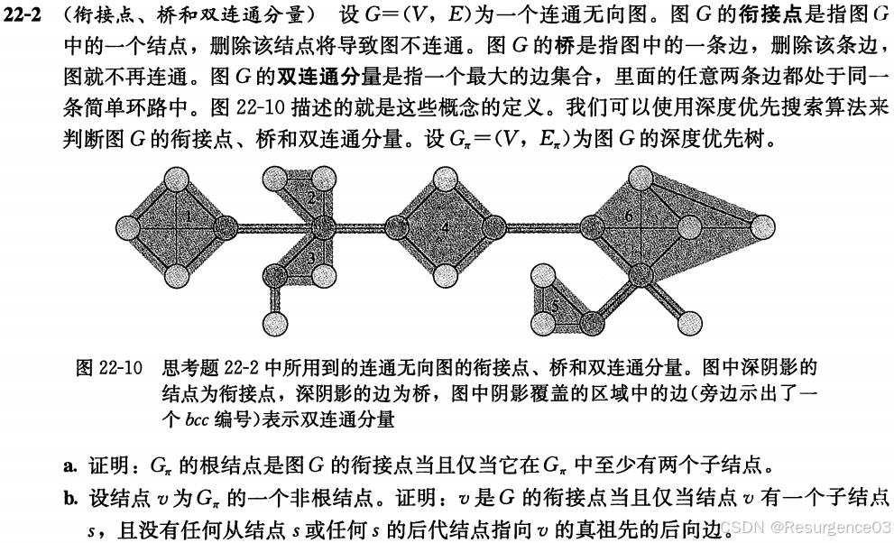
>
> 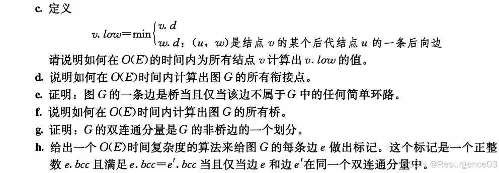

### 优先级优先搜索PFS

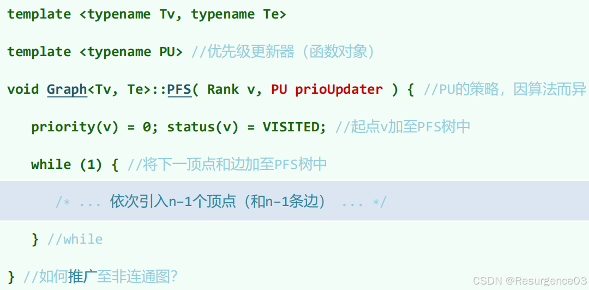

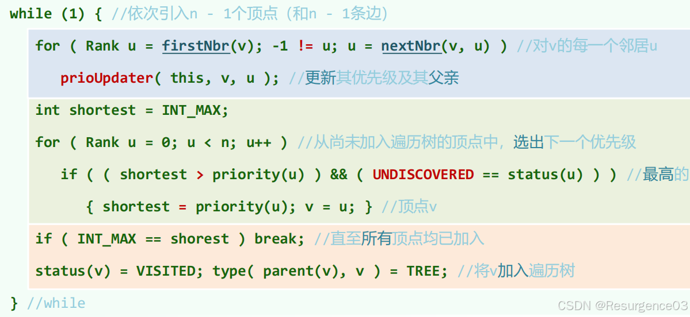


#### 歧义消除：合成数

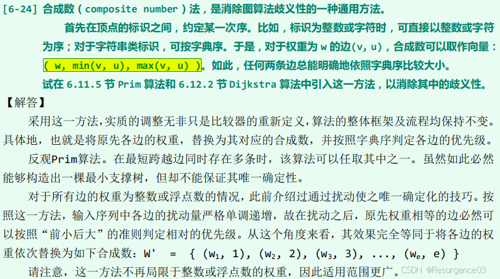

#### 使用PriorityQueue

存放源点（生成的树）到其他节点的**<font color=#956FE7>边权重</font>**

- 以prioUpdater对应指标为优先级建立最小d-堆
- 每次deleteMin()把最短路径选入生成树内
- increase() = prioUpdater()修改deleteMin()返回顶点的关联顶点的优先级，并维护堆序性

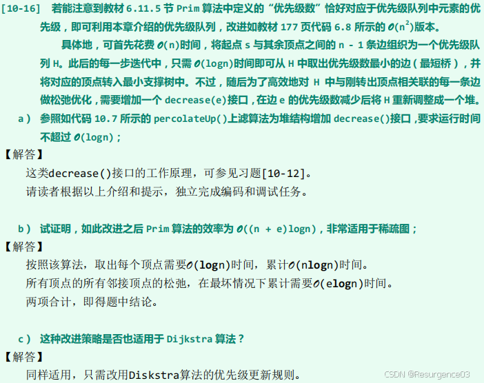

------

时间复杂度与d有关，可<font color=#1C7331>自适应最优</font>

- <font color=#956FE7>取$d = \dfrac{e}{n} + 2$时总体性能最优，时间复杂度为$O(e\log_{\frac{e}{n}+2}n) = O(e\log_dn)$</font>
  - <font color=#956FE7>稀疏图时为$O(n \log n)$</font>
  - <font color=#956FE7>稠密图时为$O(e)$</font>

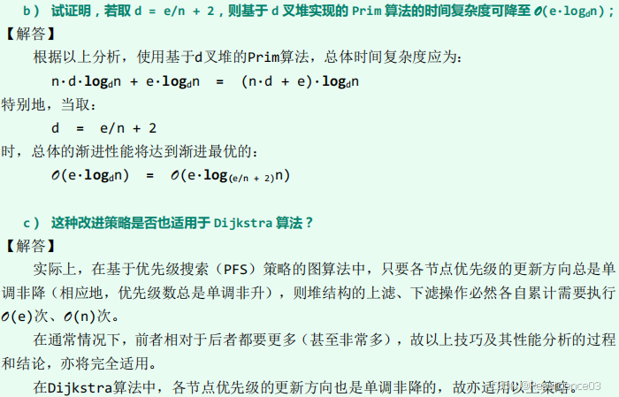

#### 单源最短路径问题

给定根节点的PFS树（**SPT**，Shortest Path Tree）

- 根节点到<font color=#956FE7>其他各个节点</font>的最短路径

<font color=#956FE7>**必须无负权回路**</font>

##### Dijkstra算法

**<font color=#BE191C>无负权边</font>**的单源最短路径问题

基于命题：<font color=#956FE7>**最优路径的前缀一定也是最优前缀**</font>

- <font color=#BE191C>若存在负权边，随着边的加入，路径长度不一定是单调递增的，局部最优不能保证全局最优</font>

> （《算法导论》练习24.3-2）
>
> 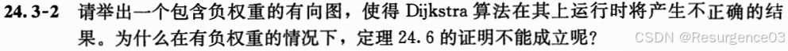
>
> 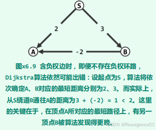

1. 选定起点$s$，记为$T_1$

2. 对于任意$T_k$，在<font color=#4DA8EE>所有与$T_k$**邻接**的顶点中</font>选择<font color=#4DA8EE>优先级最高的顶点加入顶点集，对应边加入边集</font>，记为$T_{k+1}$

   1. 优先级 = 顶点到树顶点的最小距离 + s到接应顶点的最小距离
   2. 只有邻接顶点被加入了顶点集，自身优先级才会更新
   
3. <font color=#4DA8EE>$T_n$即为PFS树</font>

##### Bellman-Ford算法

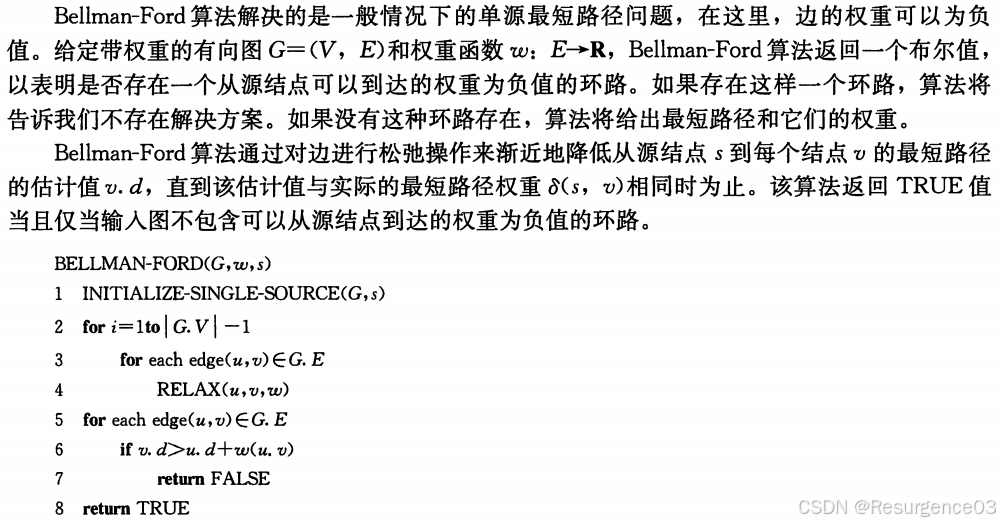

> PFS唯一性问题
>
> 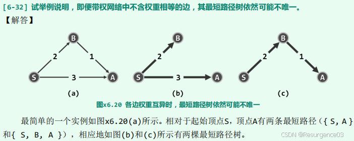

#### 所有结点对最短路径问题

##### Floyd-Warshall算法

<font color=#1C7331>**无负权边限制**</font>

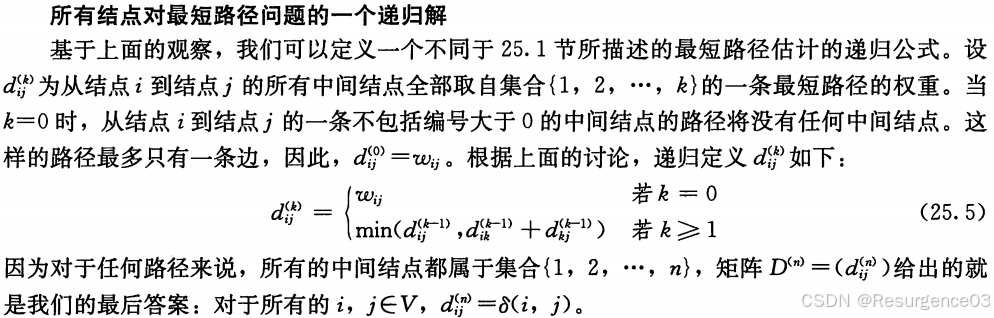

## 拓扑排序

- DAG：有极大元的偏序集
  - Zorn引理：若偏序集S的任何链都有上界，则S有极大元
- 拓扑排序：全序集

### 零入度算法

<font color=#4DA8EE>顺序输出零入度顶点，逐个去除零入度顶点</font>

```java
ArrayList<Integer> ZeroInDegreeTopoSorting(Graph g) {
    ArrayList<Integer> result = new ArrayList<>();
    while (!g.vertex.isEmpty()) {
        for (int i = 0; i < g.vertex.size; i++) {
            if (g.vertex[i].inDegree() == 0) {
                result.append(g.vertex[i]);
                g.vertex.remove(i);
                deleteAllEdge(g.vertex[i]);
                break;
            }
        }   
    }
    return result;
}
```

### 零出度算法

<font color=#4DA8EE>逆序输出零出度顶点，逐个去除零出度顶点</font>

- 执行**DFS**

  - <font color=#BE191C>**DFS不能实现零入度算法**</font>

- 一旦某节点访问完成（标记为VISITED），即入栈 

  - <font color=#956FE7>栈的最小容量为DFS树高度</font>

最终结果即为DFS回溯序列的逆序

## 并查集


## 最小生成树

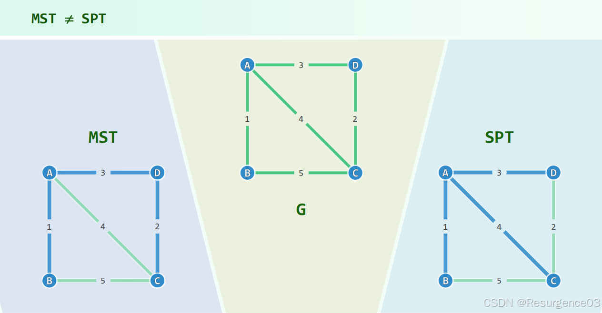

- MST是起始节点到其他节点的各最短路径组成的树 
  - 其他节点间没有关系
- SPT是以起始节点为根的最小生成树

> （《数据结构与算法分析 Java语言描述》练习9.17）
>
> 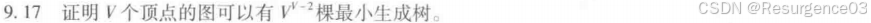
>
> [Cayley公式](https://en.wikipedia.org/wiki/Cayley's_formula)

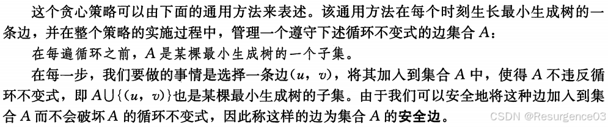

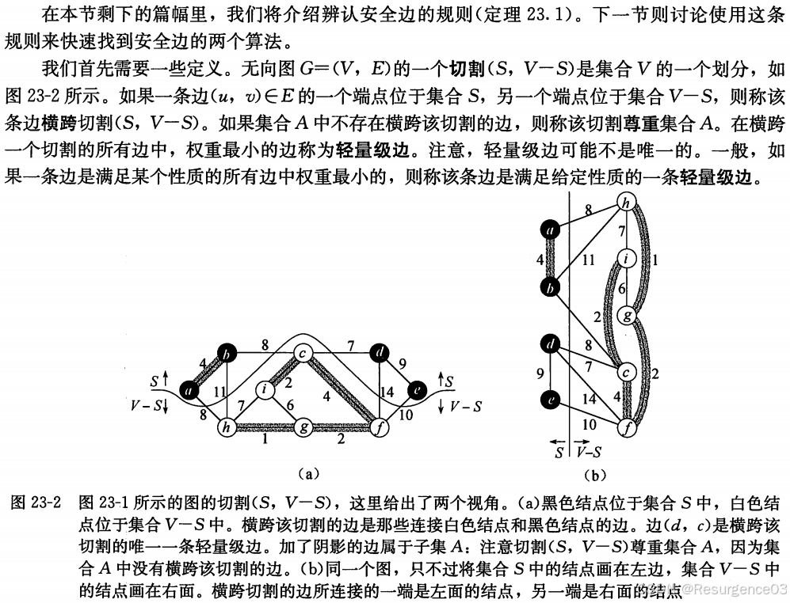

- Prim算法：顶点视角
- Kruskal算法：边视角

<font color=#1C7331>**无负权边限制**</font>

> （《算法导论》练习23.1-1）
>
> 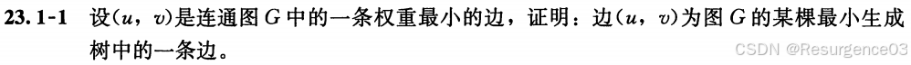

> （《算法导论》练习23.1-4）
>
> 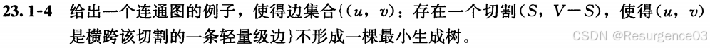
>
> 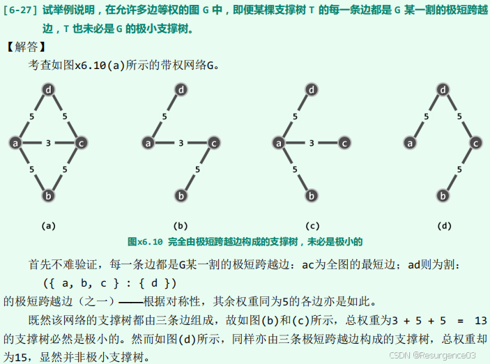
>
> 因轻量级边仅是横跨切割的所有边中的极小边而非最小

> （《算法导论》练习23.1-6）
>
> 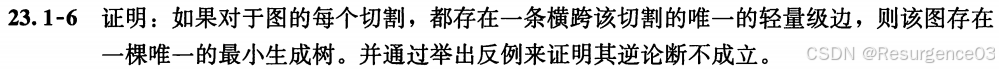

### Prim算法

<font color=#956FE7>最小支撑树总是会采用联接每一割的最短桥</font>

- <font color=#956FE7>割：对顶点集合V的任一**二分划**</font>
- <font color=#956FE7>桥：**顶点分属二分划的不同集合**的边</font>

<font color=#4DA8EE>选取当前生成树局部**邻接的权值最小的不成环边**加入生成树</font>


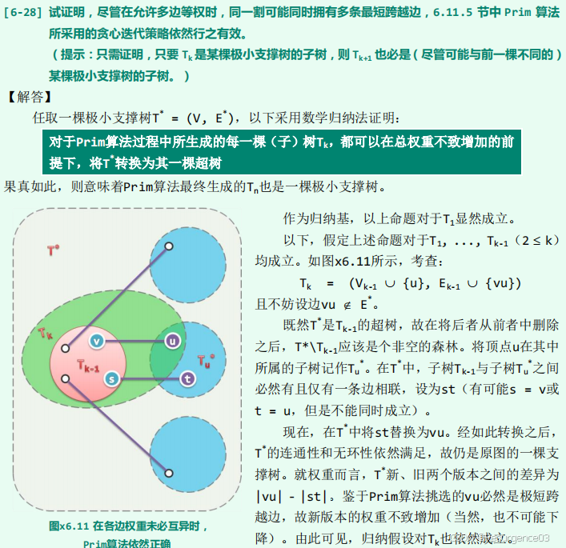

### Kruskal算法

<font color=#4DA8EE>在**整个图**中选择**权值最小的边**</font>，减少森林中树的数量

并查集的使用

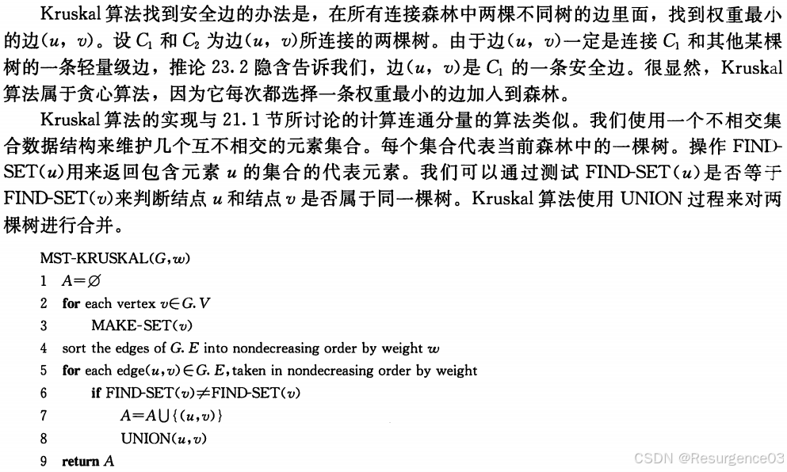

> 最小生成树唯一性问题
>
> - 由Kruskal算法正确性，如果各边权值互异，那么最小生成树是唯一的
> - 由《算法导论》练习23.1-6，如果Prim算法执行中没有选择，那么最小生成树是唯一的
> - 如果各边权值不互异，那么最小生成树可能不唯一 
>   - 两个算法执行出的结果也不唯一

- <font color=#956FE7>**Prim算法**适合**稠密图**</font>
  - <font color=#956FE7>时间复杂度$O(n^2)$</font>
- <font color=#956FE7>**Kruskal算法**适合**稀疏图**</font>
  - <font color=#956FE7>时间复杂度$O(ne)$</font>
- <font color=#1C7331>利用优先级队列改进的Prim算法较改进前更适合稀疏图</font>
  - <font color=#1C7331>时间复杂度$O((n + e) \log n)$</font>
- <font color=#1C7331>利用优先级队列改进的Kruskal算法最适合稀疏图</font>
  - <font color=#1C7331>时间复杂度$O(e \log e)$</font>