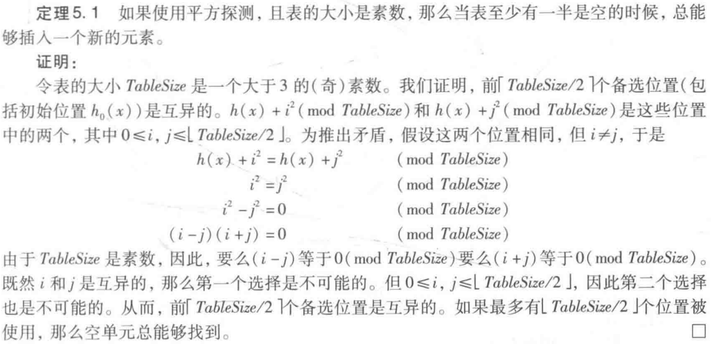

# 散列表Hashtable

合法关键码数量为$R$，散列表长为$M$

## 散列函数设计

### 除余法

**取$M$为素数**，$hash(key) = key \% M$

### MAD法

**取M为素数**，$hash(key) = (a \times key + b) \% M$，$a$，$b$皆正，$a \% M \neq 0$

相较于除余法有更好的均匀性

### 数字分析法

取$key$中的若干位

### 平方取中法

取$key^2$中的若干位

### 折叠法

将$key$分为若干段，各段之和作为$hash(hey)$

### 位异或法

将$key$分为若干段，各段之异或作为$hash(hey)$

### 伪随机数法

$hash(key) = rand(key) \% M$

- 可移植性差

## 散列冲突解决

- 开：使用**新的存储结构**
- 闭散列：不使用**新的存储结构**
- 封闭：某个散列地址**只能**由散列值匹配的关键词装入
- 开放地址：**无所谓**散列值

### 开散列（封闭地址）策略

#### 多槽位法

散列表每个桶都能装$N$个关键词

#### 独立链法

散列表每个桶都能装若干关键词，List组织

#### 公共溢出区法

另设一个溢出区，整个散列表一旦冲突就进入溢出区

### 闭散列（开放地址）策略

装填因子最好**小于50%**

#### 线性试探法

第$k$次试探的偏移量为$k$

- 每次往后找1个
- 聚集现象严重

##### 查找链与平均查找长度

查找链：查找过程中**经过**的桶（是一条查找路径）

查找长度：**尝试**匹配的桶的数量

##### 懒惰删除

直接删除导致查找链断裂

标记这个桶**曾经**有关键码来过，现在是空的

- 既然是空桶，正常插入
- 之前有关键码，查找需要再往后看

#### 平方试探法

第$k$次试探的偏移量为$k^2$

- 更好的减缓聚集现象
- **装填因子 <= 50%时必能插入**

> 对于素数$p$，所有的完全平方数模$p$同余有且只有**$\left\lceil \dfrac{p}{2} \right\rceil$个同余类**，即$\displaystyle \bar{0},\bar{1},\dots,\bar{\left\lfloor{\frac{p}{2}}\right\rfloor}$。

- TableSize一定是奇数
- 使用鸽笼原理得知：因装填因子 <= 50%，互异备选位置中一定有空桶
- 如果**$M$不是素数**，即使装填因子 < 50%也**不一定就能插入**
- 如果**装填因子 > 50%**，即使有空桶也**不一定就能插入**
	- 如果**在$\left\lceil \dfrac{p}{2} \right\rceil$次试探后**仍未插入**，**那么**不能插入**

#### 双向平方试探法

偏移量为1,-1,4,-4,9,-9，...

- 如果M是形如$4k + 3$的素数，那么前$M$次试探桶**必然互异**
	- 反之，如果M取作$4k + 1$的素数，那么**必然不能保证**前$M$次试探均互异
- 换言之，这将遍历整个散列表，只要还有空桶，**必能插入**

#### 伪随机试探法

如果第$k$次冲突，就尝试地址为$rand(k) \% M$的桶，直到找到一个空桶

#### 双散列法

第$k$次试探的偏移量为$k \times hash_2(key)$

- 每次往后找$hash_2(key)$个 

## 再散列

类比向量扩容，容量翻倍，数据搬迁