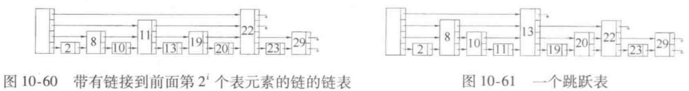
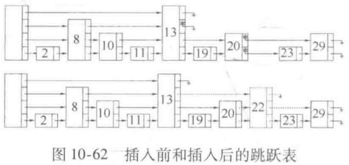

# 链表List、跳表SkipList

## 链表

头节点header，尾节点trailer为哨兵节点

插入、删除直接修改对应succ、pred指针即可

仅能顺序查找

唯一化同无序Vector

## 跳表

尝试在**有序链表**上使用二分查找

header定义为$-\infty$，trailer定义为$+\infty$

header、trailer**随最高层**一起上升，保证每层都有哨兵节点

概率平衡策略（生长概率逐层减半条件）：每层节点向上生长的概率均为1/2

- 随机数发生器：1就向上生长，0就停止生长

	- 依此定义above和below
- 共有$n$个节点，其**期望最大高度为**$O(\log n)$
- 第$k$层将多出$\dfrac{n}{2^k}-1$个指针，共多$O(n)$个指针

### 查找

- 从header最高层开始找起
- 当前值小于查找值则取succ，直至超过查找值
- 在当前位置取pred
	- 如果命中，查找结束
	- 如果未命中
		- 此时是小于查找值的最右节点
		- 下降一层继续查找

最终将停留在**不大于**查找值的所有节点中最右者

- 如果使用四联表实现

	- 命中时将停留在最终节点的最高层
	- 未命中时将停留在最终节点的最低层

时间复杂度$O(\log n)$

- 纵向跳转次数期望$O(\log n)$
	- 单个塔高期望$O(1)$
- 横向跳转次数期望$O(\log n)$
	- 同层跳转期望$O(1)$

### 插入

- 查找不大于插入值的最右节点
	- 如果命中
		- 下降到最底层
	- 如果未命中
		- 此时已在最底层
- 插入一个后继
- 随机数发生器决定高度

时间复杂度为$O(\log n)$

### 删除

查找定位后依次删除各层，修改对应指针即可

时间复杂度为$O(\log n)$