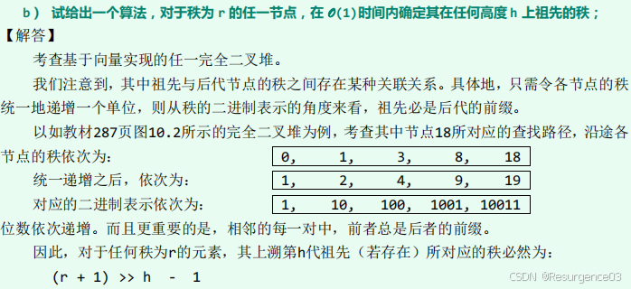
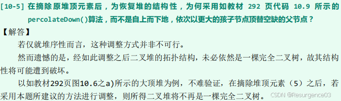
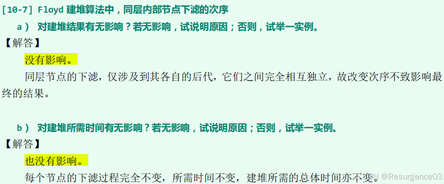

# 优先级队列PriorityQueue

堆序性质：除了根节点，其他节点都不大（小）于父节点

- 进而根节点是最大（小）堆的最大（小）元

## 完全二叉堆

物理上是Vector

逻辑上是完全二叉树

- 层次遍历序列与物理存储顺序相同
- Rank为$k$的左孩子Rank为$1+2k$
- Rank为$k$的右孩子Rank为$2+2k$
- Rank为$k$的父节点Rank为$\left\lfloor \dfrac{k-1}{2} \right\rfloor$

### 上滤插入

- 在Vector末尾插入元素e
- 计算e的父节点的Rank，找到父节点，检查二者大小 
  - 如果父节点更优，完成
  - 如果父节点更优，就交换二者数据项 	
    - e的数据项在逻辑上的完全二叉树中上升一层
  - 一层仅需比较1次
- 如此循环上滤，直到完成或升为根节点

时间复杂度

- 最好情况$O(1)$
- 最坏情况$O(\log n)$
- 平均情况$O(1)$
  - 最后两层占总节点数不少于一半，平均最多上升一层

### 下滤删除

- 把Vector末尾元素r与堆顶元素互换

- 计算r的现在所有孩子节点的Rank，找到所有孩子节点，检查大小

  - 如果无孩子节点更优，完成

  - 如果有孩子节点更优，r与更大的孩子节点交换

    - r的数据项在逻辑上的完全二叉树中下降一层

  - 一层需比较2次

- 如此循环下滤，直到完成或降为叶节点

时间复杂度

- 最好情况$O(1)$
  - 考虑全堆元素均相等情形
- 最坏情况$O(\log n)$
- 平均情况为$O(\log n)$
  - 最后两层占总节点数不少于一半

### Floyd建堆

对于规模为n的输入，组织为Vector

- $\dfrac{n}{2}$以前的节点有孩子节点

- 上述节点按Rank从高到低依次下滤

  - 每次下滤结束，以当前节点为根的完全二叉堆维持堆序性
  - 单次下滤复杂度为O(所在子堆的高度) = O(本身高度)
  - 

时间复杂度为$O(n)$

- 所有节点高度之和为$O(n)$
- 高度为h的节点有$O(\dfrac{n}{2^{h+1}})$个

------

与n次调用BinHeap::insert()建堆比较

- Floyd建堆渐进复杂度优
- n较小时Floyd建堆无优势
- Floyd建堆为离线算法，n次调用BinHeap::insert()建堆为在线算法

## min-max堆

> （《数据结构与算法分析 Java语言描述》练习6.18）
>
> 

## d-堆

物理上是Vector

逻辑上是完全$d$叉树

- 层次遍历序列与物理存储顺序相同
- Rank为$k$的第$i$个孩子Rank为$i+kd$
- Rank为$k$的父节点Rank为$\left\lfloor \dfrac{k-1}{d} \right\rfloor$

### 上滤插入

单次上滤时间复杂度不变，堆高减小

时间复杂度

- 最坏情况降为$O(\log_dn)$

### 下滤删除

单次下滤需要$d$次比较，堆高减小

- **$d = 3$时总时间复杂度减小**
- $d = 4$时总时间复杂度不变
- $d > 4$时总时间复杂度增大

## 左式堆

添加外部节点成为**真二叉树**

对任意内部节点node，有$npl(node.leftChild) >= npl(node.rightChild)$

- 零路径长Null Path Length（$npl$）：节点到孩子外部节点的**最短**路径长度

  - $npl(NULL) = 0$
  - $npl(node) = 1 + \min\{npl(node.leftChild), npl(node.rightChild)\}$
    - 对于左式堆，$npl(node) = 1 + npl(node.rightChild)$
  - $npl(node)$ = node到孩子外部节点的最短路径长度 = 以node为根的**最大满二叉树高度**
  
- 左式堆的任意子树（堆）也是左式堆

- 左式堆的**右侧链rChain**是根节点通向外部节点的最短路径
  - 右侧链：一直$node = node.rightChild$直到node = NULL
  - $npl(root) = rChain(r).length$
  - 如果$npl(root) = d$
    - 这表明其他通向外部节点的路径都不小于d
    - 左式堆截取深度d及以上部分为满二叉树

### 合并

**左式堆优势操作**

递归地

- 把更优根的右子堆与另一根堆合并

  - 过程中保持每次递归merge结束后，merge得到的根节点处都满足左式堆性质
    - 左右子堆交换
    - 因此最终合并得到的rChain可能来自于两个堆中的任何元素
  
- 更新全堆npl

时间复杂度为两堆rChain长度之和，为$O(\log m + \log n) = O(\log \max\{m, n\})$

### 插入

堆与单个节点合并

时间复杂度为$O(\log n)$

- 劣于二叉堆

> （《数据结构与算法分析 Java语言描述》练习6.21）
>
> 
>
> 同练习4.20，归纳证明。

### 删除

摘除根节点后得到的两个左式堆合并

时间复杂度为$O(\log n)$