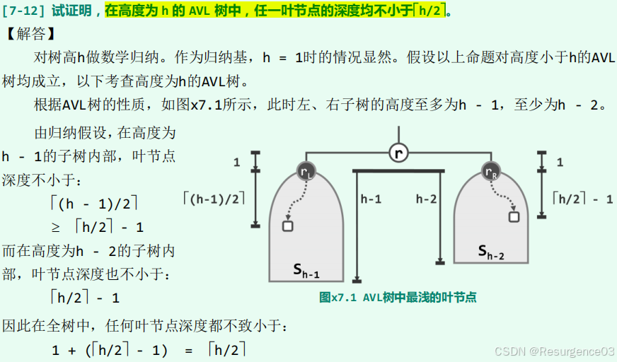

# 搜索树SearchTree

## 二叉搜索树

### 结构特征

任一节点x的左/右子树中，所有非空节点均不大于（不小于）x

- 必须是所有的非空节点，仅左右孩子不够（左孩子的右孩子可能很大）
- 一棵二叉树是二叉搜索树当且仅当中序遍历序列是单调非降序列

两棵二叉搜索树等价当且仅当他们有相同的中序遍历序列（上下可变，左右不乱）

- 换言之，构成两棵二叉搜索树的元素相同

等价变换zig、zag

- zig：右单旋转
- zag：左单旋转

变换后仍保持二叉搜索树的性质

编辑

> （《算法导论》练习13.2-2）
>
> 编辑
>
> 度为2的节点有2种转法，度为1的节点有1种转法，从而每种旋转对应一条边，共n-1条边。

> （《算法导论》练习13.2-4）
>
> 编辑
>
> 对于任何含n个结点的二叉搜索树，若某节点有左孩子，就右旋，如此会消除一个左孩子-父节点关系，而最多只有n-1个上述的左孩子-父节点关系，从而经至多n-1次旋转就能将其变为一条右链，而左右旋都是可逆的，转变只需要以该右链作为中介。

### 搜索

中序遍历操作

```cpp
template <typename T> //在以v为根的（AVL、SPLAY、rbTree等）BST子树中查找关键码e
static BinNodePosi(T)& searchIn (BinNodePosi(T)& v, const T& e, BinNodePosi(T)& hot) {
    if (!v || (e == v->data)) { //递归基：在节点v（或假想的通配节点）处命中
        return v;
    }
    hot = v; //一般情况：先记下当前节点，然后再
    return searchIn (((e < v->data) ? v->lc : v->rc), e, hot); //深入一层，递归查找
} //返回时，返回值指向命中节点（或假想的通配哨兵），hot指向其父亲（退化时为初始值NULL）
```

内部变量_hot指向搜索的终止位置的父节点

- 如果命中，就是目标节点的父节点
- 如果未命中，就是目标节点如果存在时的父节点

API返回搜索的终止位置

- 如果命中，就是目标节点
- 如果未命中，就是_hot的子哨兵节点

<font color=#956FE7>**时间复杂度$O(h)$**</font>

### 插入

先搜索，让_hot指向将增加孩子的节点，再添加子节点

从插入的节点开始，向上更新节点高度

```cpp
template <typename T> BinNodePosi(T) BST<T>::insert (const T& e) { //将关键码e插入BST树中
    BinNodePosi(T)& x = search (e);
    if (x) { //确认目标不存在（留意对_hot的设置）
        return x; 
    }
    x = new BinNode<T>(e, _hot); //创建新节点x：以e为关键码，以_hot为父
    _size++; //更新全树规模
    updateHeightAbove(x); //更新x及其历代祖先的高度
    return x; //新插入的节点，必为叶子
} //无论e是否存在于原树中，返回时总有x->data == e
```

<font color=#956FE7>**时间复杂度$O(h)$**</font>

### 删除

#### 单子节点删除

直接把删除节点换成其以唯一子节点为根的子树

删除时利用搜索接口确定节点位置的过程给出当前_hot，它是向上更新节点高度的起点

#### 双子节点删除

用在右子树中的直接后继替换删除节点，原来直接后继是度不为2的节点，化为单子节点删除

_hot设为原来直接后继的父节点，它是向上更新节点高度的起点

```cpp
/******************************************************************************************
* BST节点删除算法：初除位置x所指癿节点（全局静态模板函数，适用亍AVL、Splay、RedBlack等各种BST）
* 目标x在此前经查找定位，并确认非NULL，故必删除成功；与searchIn不同，调用之前不必将hot置空
* 返回值指向实际被删除节点的接替者，hot指向实际被删除节点的父亲——二者均有可能是NULL
******************************************************************************************/
template <typename T>
static BinNodePosi(T) removeAt (BinNodePosi(T)& x, BinNodePosi(T)& hot) {
    BinNodePosi(T) w = x; //实际被摘除的节点，初值同x
    BinNodePosi(T) succ = NULL; //实际被删除节点的接替者
    if (!HasLChild(*x)) { //若*x的左子树为空，则可
        succ = x = x->rc; //直接将*x替换为其右子树
    }
    else if (!HasRChild(*x)){ //若右子树为空，则可
        succ = x = x->lc; //对称地处理——注意：此时succ != NULL
    }
    else { //若左右子树均存在，则选择x的直接后继作为实际被摘除节点，为此需要
        w = w->succ(); //（在右子树中）找到*x的直接后继*w
        swap(x->data, w->data); //交换*x和*w的数据元素
        BinNodePosi(T) u = w->parent;
        succ = w->rc; //w一定无左孩子，化为单节点的仅有右孩子情形
        ((u == x) ? u->rc : u->lc) = succ;
        //如果u是x，即x是w的父节点，此时w在u的右子树中
        //若不然，因w是x的直接后继，此时w在u的左子树中
    }
    hot = w->parent; //记录实际被删除节点的父亲
    if (succ) {
        succ->parent = hot; //并将被删除节点的接替者与hot相联
    }
    release(w->data);
    release(w);
    return succ; //释放被摘除节点，返回接替者
} //release()负责释放复杂结构，与算法无直接关系，见代码包
```

<font color=#956FE7>**时间复杂度$O(h)$**</font>

## 平衡二叉搜索树

给定n个关键码

- 随机生成二叉搜索树：随机顺序插入二叉搜索树 
  - 得到n!种可能
  - 渐进树高为<font color=#956FE7>$\Theta(\log n)$</font>
- 随机组成二叉搜索树：满足顺序性的拓扑结构随机二叉搜索树 
  - 得到Catalan(n) < n!种可能 	
    - <font color=#956FE7>**含n个互异节点的二叉搜索树有Catalan(n)种**</font>
    - 对于n个节点的二叉树，将n个互异关键码填入
  - 渐进树高为<font color=#956FE7>$\Theta(\sqrt n)$</font>
  - <font color=#1C7331>**更可信**</font>

理想平衡树：n个节点，树高为$\left\lfloor \log n \right\rfloor$的二叉树

适度平衡：n个节点，树高为渐进$O(\log n)$的二叉树

- 经过单次修改操作，最多只有$O(\log n)$处不再满足适度平衡性条件
- 可在$O(\log n)$时间内，使这些不适度平衡处重新适度平衡

### AVL树

#### 结构特征

节点v的平衡因子$balFac(v) = height(lc(v)) - height(rc(v))$

AVL条件：AVL树中所有节点满足$\left| balFac(v) \right| <= 1$

**<font color=#956FE7>高度为$h$的AVL树至少含$fib(h + 3) - 1$个节点</font>**，进而n个节点的AVL树树高是$O(\log n)$的

- <font color=#956FE7>Fibonacci树：（最小AVL树）高度为h且含fib(h + 3) - 1个节点的AVL树</font>

> （《数据结构与算法分析 Java语言描述》练习4.18）
>
> 
>
> 
>
> 

编辑

#### 失衡与重平衡

记UT(x)是因对节点x的操作而不满足AVL条件的节点集，下假设调整前UT(x)非空

##### 插入失衡

UT(x)中的元素都是x的祖先，其不低于x的祖父节点，且可能一直失衡到根节点

重平衡自下而上逐个修正


LL失衡-右旋转zig


RR失衡-左旋转zag


LR失衡-左-右旋转zag-zig


RL失衡-右-左旋转zig-zag


- 如果节点g的X孩子的Y子树高度太高导致失衡（即在此插入） 
  - X=Y，在g做X旋转
  - X!=Y，先在X孩子做X旋转，再在g做Y旋转
- <font color=#956FE7>如果插入导致了旋转调整，那么**本次插入不改变树高**</font>

<font color=#956FE7>**时间复杂度$O(\log n)$**</font>

- AVL树树高是$O(\log n)$的，找到插入位置需要$O(\log n)$

- 需要$O(\log n)$时间判断是否失衡并找到失衡节点

- 每种旋转都是就地$O(1)$时间复杂度算法，**1次调整即可恢复平衡**

  - 因插入导致的旋转不改变树高

>  （《数据结构与算法分析 Java语言描述》练习4.20）
>
> 
>
> 直接验证当$k=1,2,3$时命题成立。
>
> 若$k=1,2,3,...,h$时命题均成立，考虑$k=h+1$的情形。
>
> 对于前$2^h-1$个关键字，由归纳假设，得到了一棵高度为h-1的理想平衡树，树根为$2^{h-1}$。
>
> 对于从$2^h$到$2^h+2^{h-1}-1$关键字，考虑从$2^{h-1}+1到2^h+2^{h-1}-1$的$2^h-1$个关键字连续插入，因其都发生在$2^{h-1}$为父节点的右子树内，由归纳假设，仍为一个理想平衡树，树根为$2^h$，高度为$h-1$。
>
> 现在$2^h+2^{h-1}$关键字插入，根节点失衡，且失衡为右-右，只需做一次左旋，调整后根节点为$2^h$，左子树为高度为$h-1$的完全二叉树，右子树为高度为$h-1$的完全二叉树外加最右侧的$2^h+2^{h-1}$关键字节点。
>
> 对于从$2^h+2^{h-1}+1$到$2^{h+1}-1$关键字，考虑从$2^h+2^{h-1}$到$2^{h+1}-1的2^{h-1}-1$个关键字连续插入，因其都发生在$2^h$为父节点的右子树内，由归纳假设，仍为一个理想平衡树，树根为$2^h$，高度为$h-1$。
>
> 故最终得到了一棵树根为$2^h$，高度为$h$的理想平衡树，结论得证。

##### 删除失衡

UT(x)只有1个节点，但可能出现节点的替换（自下而上的失衡传播）

任何进入UT(x)的节点**失衡前后**高度不变（要是失衡了，删除部分来自更低的部分，但高度取决于更高的子树）

- 如果节点g的X孩子的Y子树高度太高导致失衡 
  - X = Y，在g做X旋转
  - X != Y，先在X孩子做X旋转，再在g做Y旋转
- <font color=#956FE7>删除导致的旋转调整不保证不改变树高，**树高可能降低**</font>

<font color=#956FE7>**时间复杂度$O(\log n)$**</font>

##### “3+4”平衡重构


单次重构为<font color=#956FE7>就地$O(1)$时间复杂度</font>算法（不计更新高度）

### 伸展树

利用程序局部性加速

#### 逐层伸展

每当访问一个节点，<font color=#4DA8EE>以1层为单位（局部子树高度为1）提升目标节点</font>，最终提升为根节点

- 如果被访问节点是当前其父亲的<font color=#4DA8EE>左孩子</font>，局部子树的<font color=#4DA8EE>当前根右旋</font>
- 如果被访问节点是当前其父亲的<font color=#4DA8EE>右孩子</font>，局部子树的<font color=#4DA8EE>当前根左旋</font>

**分摊复杂度$\Omega(n)$**

#### 双层伸展

每当访问一个节点，<font color=#4DA8EE>以2层为单位（局部子树高度为2）提升目标节点</font>，最终提升为根节点

- 如果被访问节点祖先上溯为<font color=#4DA8EE>不同方向</font>（右上-左上或左上-右上）

  

  - <font color=#4DA8EE>**被访问节点的父节点作两次相反旋转**</font>：与逐层伸展相同

- 如果被访问节点祖先上溯为<font color=#4DA8EE>相同方向</font>（右上-右上或左上-左上）

  

  - **<font color=#4DA8EE>局部子树的当前根作两次相同旋转</font>**：<font color=#956FE7>**该路径深度折半**（核心）</font>

最后一次可能只有单旋转，不影响整体性能

<font color=#956FE7>**分摊复杂度$O(\log n)$**</font>

> **势能法**
>
> 当某一步计算实际所需的时间小于分摊复杂度时，则可理解为通过势能的增加将提前支出的计算成本存储起来；反之，在前者大于后者时，则可从此前积累的势能中支取相应量用于支付超出的计算成本
>
> - 需要一个高代价的计算意味着当前势能高
> - 需要一个低代价的计算意味着当前势能低 
>   - 越平衡的树，势能越小
>
> 定义势能：伸展树所有节点的后代数的$\log$之和

- 最坏情况不会持续发生，这使得分摊的复杂度优于逐层伸展树 
  - 一旦发生最坏情况，该条路径立刻折半
- 不能杜绝最坏情况 
  - <font color=#956FE7>**无论采用单层伸展还是双层伸展，连续按顺序访问节点，都能将伸展树变为一条单链**</font>
  - 此时访问最低节点即为最坏情形，但这种情形最多发生一次
- <font color=#956FE7>**如果k个访问位置高度集中，分摊复杂度为$O(\log k)$**</font>

##### 插入

- <font color=#4DA8EE>调用BST::search()，确定插入位置</font>，以_hot指示父节点
- 将_hot所指节点<font color=#4DA8EE>提升为根</font>
- 将两棵子树<font color=#4DA8EE>分裂</font>
- 按顺序性将其<font color=#4DA8EE>组织为二叉搜索树</font>，此时<font color=#956FE7>**根节点是新插入的节点**</font>


##### 删除

- 调用BST::search()，确定删除节点
- 将删除节点x<font color=#4DA8EE>提升至根并删除</font>，<font color=#4DA8EE>两棵子树分裂</font>
- <font color=#4DA8EE>**选择x的前驱或后继作为新的根节点**</font>
  - 选前驱，则在左子树中BST::search(x)
    - <font color=#956FE7>**前驱将被提升为左子树的根**</font>
    - 由二叉搜索树的顺序性，前驱没有右子树
    - <font color=#4DA8EE>将伸展树的右子树设为x前驱的右子树</font>
  - 选后驱，则在右子树中BST::search(x)

### 红黑树

#### 结构特征

视哨兵节点为**外部节点**与**叶节点**，所有带关键字的节点都是内部节点

1. 每个节点要么是红色的，要么是黑色的
2. <font color=#956FE7>**根节点是黑色的**</font>
3. <font color=#956FE7>**每个叶节点都是黑色的**</font>
4. <font color=#956FE7>**任何红节点的两个孩子都是黑节点**</font>（进而<font color=#956FE7>**红节点的父亲是黑结点**</font>）
5. <font color=#956FE7>**任一节点到其每个后代叶节点的路径上有相同数量的黑节点**</font>

<font color=#956FE7>**黑高度bh(x)**</font>：从节点x出发到其叶节点路径上**经过的黑节点数**（不含叶节点，含x）

- 任何叶节点的黑高都为0
- **红黑树的黑高等于根节点的黑高**

<font color=#956FE7>**黑深度**</font>：节点x的<font color=#956FE7>**黑真祖先节点数**</font>

对于<font color=#956FE7>**有n个内部节点**</font>的红黑树

- <font color=#956FE7>**其树高$h$满足$\log_2(n+1) \le h \le \max\{2\log_2\lfloor\frac{n+2}{2}\rfloor,\ 2\log_2\lfloor\frac{n+2}{3}\rfloor+1\}$**</font>
- <font color=#956FE7>**其黑高度$H$满足$\log_4(n+1)\le H \le \log_2 \left \lfloor\frac{n+1}{2} \right \rfloor + 1$**</font>

转换为**4阶B树**


> （《算法导论》练习13.1-4）
>
> 

> （《算法导论》练习13.1-5）
>
> 

>  （《算法导论》练习13.1-6）
>
> 

> （《算法导论》练习13.1-7）
>
> 
>
> 最大时红黑节点在任意一条路径上交替出现，亦即从黑色根节点开始颜色交替向下染色，如果该树是单链且n是偶数，此时比值最大，为1
>
> 最小时红黑树中没有红色节点，比值为0

#### 自底向上红黑树

##### 插入

假设插入节点x，<font color=#4DA8EE>**将x染为红色**</font>

可能出现一个红节点有红色子节点问题，违反性质4

执行BST::insert()

- <font color=#4DA8EE>其父节点是黑色</font>，红黑树性质保持，结束
- <font color=#4DA8EE>其父节点是红色，执行**双红修正**</font>
  - 其祖父节点必为黑色（否则插入前不是合法红黑树）
  - <font color=#4DA8EE>考虑其父节点的兄弟节点颜色</font>

###### 双红修正

**RR-1**

<font color=#4DA8EE>如果x叔节点为黑，**执行3+4重构，将局部根节点变黑**</font>

- <font color=#956FE7>**不改变任何节点的黑高**</font>


**RR-2**

<font color=#4DA8EE>如果x叔节点为红，**将x祖父节点染为红，x的父节点染为黑，x的叔节点染为黑，即将p层与g层颜色互换**</font>

- <font color=#956FE7>**x的祖父节点的黑高+1，其他所有节点均不变**</font>

- 向上传播

  - <font color=#4DA8EE>如果x的祖父节点的父节点也是红色的，**选择RR-1或RR-2继续修正**</font>，此时需修正节点上移2层
- 如果某次执行RR-1修正，则传播到此结束
    
- 如果始终执行RR-2修正
    
  - 因为黑节点可以出现在任意位置，<font color=#4DA8EE>**最终将可能被染红的根节点再染黑**</font>即可
    
    - <font color=#956FE7>**此时树黑高+1**</font>


<font color=#956FE7>**时间复杂度$O(\log n)$**</font>

- 最好情况：一次RR-1完成修正，$O(1)$
- 最差情况：一直执行RR-2直到根节点，$O(\log n)$


> （《算法导论》练习13.3-1）
>
> 
>
> 将出现一条有更多黑色节点的路径，z以上的祖先节点的性质5都会被破坏

> （《算法导论》练习13.3-6）
>
> 
>
> 在search时将x的诸祖先节点压栈，在自底向上染色中逐步出栈，或采用自顶向下的插入

##### 删除

假设删除节点x

可能出现局部子树黑高下降问题，局部子树的各祖先节点不满足性质5


BST::succ(x)获取x的直接后继r

- x与r颜色不同 
  - 直接交换数据删除物理r节点，与普通二叉树无区别
- x与r颜色相同

因二叉树删除实际上均被转化为单分支节点删除情形，实质被删除的节点均为单分支节点，**以下默认均为单节点分支**

- 双节点分支变为单节点分支情形只发生了数据交换，而无颜色改变，不影响红黑树的合法性

```cpp
template <typename T> bool RedBlack<T>::remove(const T& e) {
    BinNodePosi<T>& x = search(e); //查找定位
    if (!x) {
        return false;
    }
    BinNodePosi<T> r = removeAt(x, _hot); //删除_hot的某孩子，r指向其接替者
    if (!(--_size)) { //若删除后为空树，可直接返回
        return true;
    }
    if (!_hot) { //若被删除的是根，则
        _root->color = RB_BLACK; //将其置黑，并
        updateHeight(_root); //更新（全树）黑高度
        return true;
    } //至此，原x（现r）必非根
    // 若父亲（及祖先）依然平衡，则无需调整
    if (BlackHeightUpdated(*_hot)) {
        return true;
    }
    // 至此，必失衡
    // 若替代节点r为红，则只需简单地翻转其颜色
    if (IsRed(r)) {
        r->color = RB_BLACK;
        r->height++;
        return true; 
    }
    // 至此，r以及被其替代的x均为黑色
    solveDoubleBlack(r); //双黑调整（入口处必有r == NULL）
    return true;
}
```

按上述代码记号，记x为实际删除节点，r为其接替者（左孩子或右孩子）

- x红r红，违反性质4，不可能
- <font color=#4DA8EE>x红r黑，**直接删除**</font>
- <font color=#4DA8EE>x黑r红，**交换颜色后删除**</font>
- <font color=#4DA8EE>x黑r黑，需要**双黑修正**</font>

###### 双黑修正

记x兄弟节点为s，父节点为p

**BB-1**

<font color=#4DA8EE>s为黑，且s孩子至少有一个红孩子t，p颜色任意</font>

- <font color=#4DA8EE>**s染为p颜色**</font>
- <font color=#4DA8EE>**p染黑**</font>
- <font color=#4DA8EE>**t染黑**</font>
- <font color=#4DA8EE>**作一次s成为局部根节点的3+4重构**</font>

<font color=#956FE7>**局部子树黑高不变**</font>，修正完成


> 因x为单分支节点，由红黑树性质，**r为外部节点，子树3不存在**，p的黑高度为1，进而**t的两个孩子均为外部节点，子树0,1均不存在**

**BB-2R**

<font color=#4DA8EE>s为黑，s孩子均为黑，p为红</font>

- <font color=#4DA8EE>**s染黑**</font>
- <font color=#4DA8EE>**p染红**</font>

<font color=#956FE7>**局部子树黑高不变**</font>，修正完成


**BB-2B**

<font color=#4DA8EE>s为黑，s孩子均为黑，p为黑</font>

- <font color=#4DA8EE>**s染红**</font>

<font color=#956FE7>**局部子树黑高-1，失衡向上传播**</font>


**BB-3**

<font color=#4DA8EE>s为红，s孩子均为黑</font>，此时p必然为黑

- <font color=#4DA8EE>**作一次s成为局部根节点的3+4重构**</font>
- <font color=#4DA8EE>**s染黑**</font>
- <font color=#4DA8EE>**p染红**</font>


现在x有一个黑兄弟，以p为根节点的局部变为BB-1或BB-2R情形

<font color=#956FE7>**局部子树黑高不变**</font>，修正完成

> 判断双黑情形
>
> 1. 定位x和r
> 2. 找x的兄弟s 
>    1. if (s是红的) → return BB-3
>    2. else 	
>       1. if (s两个孩子都是黑的) 		
>          1. if(p是黑的) → return BB-2B
>          2. else → return BB-2R
>       2. else → return BB-1


- <font color=#956FE7>BB-2系列**无需旋转**</font>
- <font color=#956FE7>如果调整传播到根，必然为**全程BB-2B**</font>

#### 自顶向下红黑树

##### 插入


BST::insert()中search过程内嵌动作，对红黑树重染色

- 如果某黑节点有两个红孩子，就做一次翻转 
  - 
  - 如果X父节点是黑色，无事发生
  - 如果X父节点是红色，那么其叔节点必为黑 	
    - 如果叔节点是红色，那之前就会做一次翻转，使叔节点和父节点都会变成黑色
    - 做一次RR-1修正
- 找到插入位置 
  - 如果父节点是黑色，直接插入
  - 如果父节点是红色，那么其叔节点必为黑 	
    - 做一次RR-1修正

排除了RR-2的情形，只需要执行RR-1即可

##### 删除


## B树

m阶B树：m路平衡搜索树

<font color=#956FE7>针对I/O的数据结构</font>

- 活跃的B树根节点常驻内存中
- <font color=#956FE7>**只有一个节点能够留在内存中**</font>
  - 出去一个进来一个的替换检索

### 结构特征

每个内部节点有n-1个关键码，n个分支

- 上界限制：n不大于m
- 下界限制：n不小于$\left\lceil \dfrac{m}{2} \right\rceil$，即**分支数至少是半满的**

- m阶B树=$(\left\lceil \dfrac{m}{2} \right\rceil,m)$-树=$\left\lceil \dfrac{m}{2} \right\rceil$-$\left\lceil \dfrac{m}{2} \right\rceil$+1-...-m树 
  - <font color=#956FE7>**每个内部节点关键码数应介于$\left\lfloor \dfrac{m}{2} \right\rfloor$和m-1之间**</font>
  - 每个内部节点引用数应介于$\left\lceil \dfrac{m}{2} \right\rceil$和m之间

<font color=#956FE7>对于根节点，**没有下界限制**</font>

如果记其最小度数（最小分支数）为$t$，$t=\left\lceil \dfrac{m}{2} \right\rceil$，那么$m=2t-1$

- 叶节点：最下层的内部节点

  - <font color=#956FE7>**所有的叶节点深度相同**</font>

- 外部节点 

  - <font color=#956FE7>**其树高包含外部节点层**</font>，即外部节点高度为0

- m阶B树：树高为h，存储<font color=#956FE7>**n个关键词**</font>

  - $\log_m(n+1)\le h \le \log_{\left \lceil \frac{m}{2} \right \rceil}\left \lfloor\frac{n+1}{2} \right \rfloor + 1$
- <font color=#956FE7>$h = \Theta(\log_m n)$</font>

> （《算法导论》练习18.1-1）
>
> 
>
> 除根节点以外，每个内部节点至少有t-1个关键词，t=1时不是良定义的

> （《算法导论》练习18.1-4）
>
> 

### 查找

与BST::search()类似

节点内关键词查找采用顺序查找（无需二分）

- 查找成功，返回目标关键码所在内部节点，_hot指向其父节点
- 查找失败，返回终点处外部节点，_hot指向其父节点

<font color=#956FE7>**时间复杂度$O(\log_m N)$**</font>

### 插入

调用BTree::search()，_hot指向即为插入位置所在内部节点

在节点内再Vector::search()一次即得确切位置

#### 节点上溢

因插入关键词导致的内部节点关键码数量为m，违反m阶B树对节点内关键码数量的上界限制

- <font color=#4DA8EE>**取该节点内Rank为$\left\lfloor \dfrac{m}{2} \right\rfloor$的关键码x提升至父节点**</font>
  - 从而父节点内关键词数量+1，对应引用数要+1
  
  - **上溢向上传递**
    - 父节点也可能插入后关键码数量为m，进而上溢
    
    - 这个传播最多传播到根节点
    
    - 如果根节点也发生了上溢，由于根节点关键码数量没有下界限制，<font color=#4DA8EE>直接上溢出一个新的根节点即可</font>
    
      - 此时B树高+1
    - <font color=#956FE7>**B树增高的唯一可能**</font>
  
- <font color=#4DA8EE>**以x为界的原内部节点分裂为两个内部节点**</font>
  - 现在两个内部节点最少有$\left\lfloor \dfrac{m-1}{2} \right\rfloor$个关键码，是合法的m阶B树节点
  - x两侧的引用分别划分给两个子节点

<font color=#956FE7>**单次时间复杂度$O(h) = O(\log_mN)$**</font>

<font color=#956FE7>**分摊时间复杂度$O(1)$**</font>

------

<font color=#956FE7>按单调顺序插入所有关键码，得到的B树高度最大</font>


### 删除

调用BTree::search()，得到节点位置x后<font color=#4DA8EE>获取其直接前驱BinTree::pred(x)或直接后继</font>BinTree::succ(x)，记为y

- 如果获取直接前驱，那么y所在内部节点是外部节点的父节点，且<font color=#956FE7>y在内部节点的最高Rank位置</font>
- 如果获取直接后继，那么y所在内部节点是外部节点的父节点，且<font color=#956FE7>y在内部节点的最低Rank位置</font>
- <font color=#4DA8EE>交换数据后删除y</font>

#### 节点下溢

删除y的动作可能导致原y所在内部节点T关键码数量小于$\left\lfloor \dfrac{m}{2} \right\rfloor$

T一定有左兄弟或右兄弟（因最小度数t不能为1）

- 如果T的<font color=#4DA8EE>左兄弟L关键码富余（多于$\left\lfloor \dfrac{m}{2} \right\rfloor$个），**从其父节点P那要一个，P再找L要一个**</font>

- 如果T的<font color=#4DA8EE>右兄弟R关键码富余（多于$\left\lfloor \dfrac{m}{2} \right\rfloor$个），**从其父节点P那要一个，P再找R要一个**</font>

- 如果T的<font color=#4DA8EE>左右兄弟都即将下溢（刚好$\left\lfloor \dfrac{m}{2} \right\rfloor$个）</font>

  

  - 选择一个存在的兄弟

  - <font color=#4DA8EE>把他们**之间的父节点关键码**p拉下来和他们一辈</font>

  - <font color=#4DA8EE>保持顺序性，组装为新的内部节点</font>
  - 如果找的左兄弟，就按L-p-T顺序组装
    - 如果找的右兄弟，就按T-p-R顺序组装
  
  - 这样P的关键词-1，引用也-1
  
- **下溢向上传递**
    - P可能继续下溢，从而可能会传播至根节点 		
  
      - 如果根节点关键词数量大于1，直接分一个给内部子节点
  
      - 如果根节点关键词数量为1，把该关键词分出去 			
  
        - 原根节点里空了，<font color=#4DA8EE>删去空壳</font>
  
          - 此时B树高-1
  - <font color=#956FE7>**B树降低的唯一可能**</font>

<font color=#956FE7>**时间复杂度$O(h) = O(\log_mN)$**</font>

<font color=#956FE7>**分摊时间复杂度$O(1)$**</font>

------


## B*树

每个内部节点有$n-1$个关键码，$n$个分支

- 上界限制：$n$不大于$m$
- 下界限制：$n$不小于$\left\lceil \dfrac{2m}{3}\right\rceil$