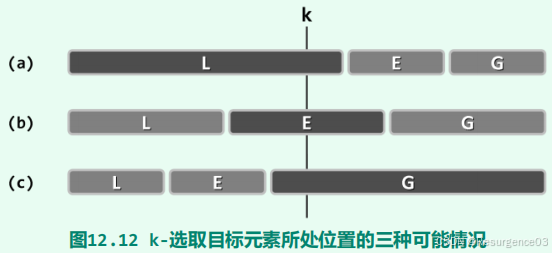

# 选择问题Selection

## 众数Majority选择

众数Majority：在序列中出现次数**超过**一半的key

- 若众数存在，则是唯一的
- 若众数存在，必为中位数

必要性条件：若P是序列S的长度为2m的前缀，x在P中有m个，则当A有众数时，A-P有众数，且x是A-P的众数

maj定出后还需要再扫描一遍检查充分性（即使A中元素两两不同，maj仍会返回最后一个偶数Rank元素）

## 中位数选择

在长度为n的序列S中寻找其中位数

- 在S中调用QuickSort::partitionLUG()给出一个轴点

- 如果轴点Rank为$\left\lfloor \dfrac{n}{2} \right\rfloor$，即找到中位数
- 如果轴点Rank不足$\left\lfloor \dfrac{n}{2} \right\rfloor$
	- 由LUG性质，此时轴点左侧部分可删除
	- 减而治之
- 如果轴点Rank超过$\left\lfloor \dfrac{n}{2} \right\rfloor$
	- 由LUG性质，此时轴点右侧部分可删除
	- 减而治之
- 在各元素独立等概率分布的条件下，平均时间复杂度为$O(n)$

### k-选择

在n个可比较大小的元素中，按从小到大排列，找到第k个元素

最坏时间复杂度为$O(n)$