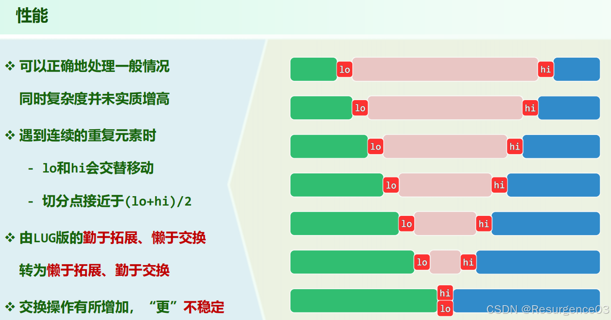
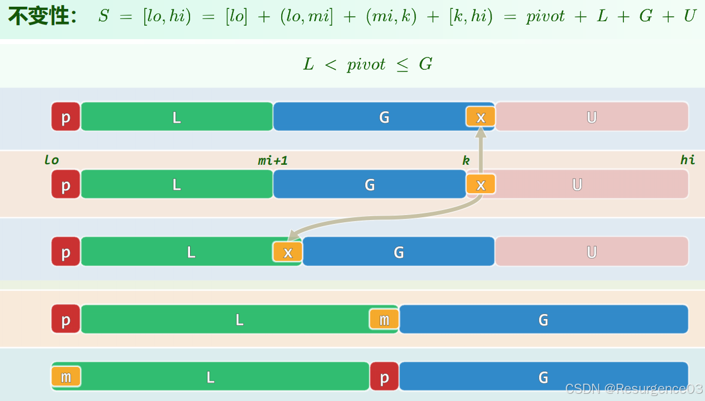
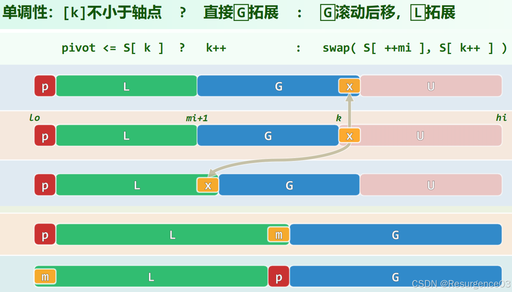

# 排序Sorting

| **排序算法** | **时间复杂度** | **空间复杂度** | **稳定性** | **备注**                     |
| ------------ | -------------- | -------------- | ---------- | ---------------------------- |
| 插入排序     | Θ(n)~Θ(n²)     | O(1)           | 稳定       |                              |
| 希尔排序     | /              | O(1)           | 不稳定     |                              |
| 冒泡排序     | Θ(n²)          | O(1)           | 稳定       |                              |
| 快速排序     | O(nlogn)~Θ(n²) | O(1)           | 不稳定     |                              |
| 选择排序     | Θ(n²)          | O(1)           | 不稳定     | 基于元素交换的选择排序不稳定 |
| 就地堆排序   | O(n)~O(nlogn)  | O(1)           | 不稳定     |                              |
| 锦标赛排序   | O(nlogn)       | O(2n)          | 稳定       |                              |
| 归并排序     | Θ(nlogn)       | O(n)           | 稳定       |                              |
| 桶排序       | O(n + m)       | O(n + m)       | 稳定       |                              |
| 基数排序     | /              | O(n)           | 稳定       |                              |
| 计数排序     | O(n)           | O(n)           | 稳定       |                              |

归位性：除了最后一趟外，之前的每一趟都至少把一个元素放到应该位置上

下设升序排序

## CBA式排序

CBA式算法：comparison-based algorithm，基于元素比较的算法


### 复杂度下界


### 插入类排序

#### 插入排序

**第p次排序**在**长度为p的前缀**中寻找**当前Rank为p的元素**的正确位置，将长度为p+1的前缀变为有序

```cpp
template <typename T>
void List<T>::insertionSort(ListNodePosi<T> p, Rank n) {
    for (Rank r = 0; r < n; r++) {
        insert(search(p->data, r, p), p->data);
        p = p->succ;
        remove(p->pred);
        // 或swap()
    }
}
```

- 时间复杂度
  - 受逆序对性质决定 	
    - **若逆序对步长最大为d，那么时间复杂度为O(dn)**
    - 若共有I个逆序对，那么时间复杂度为O(n + I)
  - 最好情况Θ(n)
    - 序列本身升序，search()一步结束
  - 最坏情况Θ(n²)
    - 序列本身降序，search()O(n)步结束
- 空间复杂度O(1)，就地算法
- 稳定算法
- 在线算法

#### 希尔排序

##### h-有序

对于序列A[0,n)，A中Rank模h同余的元素组成的子向量均有序

> （Knuth）**已经g-有序的序列，经h-排序后保持g-有序**，即得到了(g, h)-有序序列
>
> 
>
> 
>
> 对于g，h的任一线性组合mg + nh，序列也是**(mg + nh)-有序**的

> **(g, h)-有序的序列中逆序对间距小于(g - 1)(h - 1)**
>
> 由Bezout定理，大于等于gh的数均可由g，h线性表出

##### 递减增量策略

对于序列A[0,n)和增量序列{w_i}

- 从{w_i}中最大的小于n的增量开始，自大向小遍历增量序列
- 对于增量w，对A作w-排序 
  - 底层排序器可选其他

##### 增量序列

增量序列必须含1

无论任何增量序列都是不稳定的

###### Shell序列


时间复杂度

- 最坏情况Ω(n²)
  - 考虑[0, 2^n)前半和后半打乱后交错排列的序列

###### Papernov-Stasevic序列/Hibbard序列


时间复杂度.png)

###### Pratt序列


时间复杂度O(nlog²n)


###### Sedgewick序列


时间复杂度（基于数值模拟得到的结果近似）

- 最坏情况.png)
- 平均情况.png)

### 交换类排序

#### 冒泡排序

**从前向后**检查每对相邻元素，如果逆序就交换

每次扫描完，**局部最大元将出现在末尾**

```cpp
template <typename T>
void Vector<T>::bubbleSort(Rank lo, Rank hi) {
    while(lo < --hi){
        for(Rank i = lo; i < hi; i++) {
            if(_elem[i] > _elem[i + 1]) {
                swap(_elem[i], _elem[i + 1]);
            }
        }  
    }
}
```

- 时间复杂度**总是**Θ(n²)
- 空间复杂度O(1)，就地算法
- 稳定算法

#### 快速排序

```java
/**
 * quickSort on [low, high)
 * @param arr key array
 * @param low [low,
 * @param high high)
 */
void quickSort(int arr[], int low, int high) {
    if (high - low >= 2) {
        int pivot = partition(arr, low, high);

        quickSort(arr, low, pivot);
        quickSort(arr, pivot_index + 1, high);
    }
}
```


##### partition()轴点分划

###### LUG


```java
int partitionLUG(int arr[], int low, int high) {
    int pivot = arr[low];
    int i = low;
    int j = high;

    while (i < j) {
        do {
            j--;
        } while (i < j && pivot <= arr[j]);
        if (i < j) {
            arr[i] = arr[j];
        }
        do {
            i++;
        } while (i < j && pivot >= arr[j]);
        if (i < j) {
            arr[j] = arr[i];
        }
    }
    arr[j] = pivot;

    return j;
}
```

- 时间复杂度O(n)
- 空间复杂度O(1)，就地算法
- 不稳定算法

###### DUP




```java
int partitionDUP(int arr[], int low, int high) {
    int pivot = arr[low];
    int i = low;
    int j = high;

    while (i < j) {
        do {
            j--;
        } while (i < j && pivot < arr[j]);
        if (i < j) {
            arr[i] = arr[j];
        }
        do {
            i++;
        } while (i < j && pivot > arr[j]);
        if (i < j) {
            arr[j] = arr[i];
        }
    }
    arr[j] = pivot;

    return j;
}
```

- 时间复杂度O(n)
- 空间复杂度O(1)，就地算法
- 更加不稳定

###### LGU





```java
int partition(int arr[], int low, int high) {
    int pivot = arr[low];
    int pivot_index = low;

    for (int k = low + 1; k < high; k++) {
        if (arr[k] < pivot) {
            pivot_index++;
            arr.swap(k, pivot_index)
        }
    }
    arr.swap(low, pivot_index)

    return pivot_index;
}
```

- 时间复杂度O(n)
- 空间复杂度O(1)，就地算法
- 不稳定算法

### 选择类排序

#### 选择排序

划分为Unsorted || Sorted

从待排序**前缀**中找到最大元，**交换**至有序后缀最前面

- 若改为**插入**则为稳定算法（基于List的实现）

```cpp
template <typename T>
void List<T>::selectionSort(ListNodePosi<T> p, Rank n) {
    ListNodePosi<T> h = p->pred;
    ListNodePosi<T> t = p;
    for (Rank i = 0; i < n; i++) {
        t = t->succ;
    }
    while (1 < n) {
        ListNodePosi<T> max = selectMax(h->succ, n);
        insert(remove(max), t);
        t = t->pred;
        n--;
    }
}
```

- 时间复杂度**总是**Θ(n²)

- 空间复杂度O(1)，就地算法

- 不稳定算法

  

  - 考虑对2,1b,1a排序
  - 交换后得到1a,1b,2

#### 就地堆排序

将Vector划分为Heap和Sorted前后两段

- 对其**Floyd建****大顶堆**（O(n)）

- 反复地（O(n)）**把poll()放在Heap之后**加入Sorted（O(logn)） 

  - Heap少一个元素，Sorted多一个元素
- poll()包含了下面两个过程 	
    - 从大顶堆中删除堆顶
  - 代替的节点下滤

```java
ArrayList<Integer> heapSort (ArrayList<Integer> v) {
    v = floydHeaplify(v); //O(n)
    for (int i = 0; i < v.length; i++) { //O(n)
        //swap(v[0], v[v.length - 1 - i];
        //percolateDown(v[0]) //O(logn)
        Integer pivot = (PriorityQueue) v[0 : v.length - 1 - i].poll(); //O(logn)
        v[v.length - 1 - i] = pivot;
    }
    while (!heap.isEmpty()) { 
        result.append(heap.poll());  //O(logn)
    }
    return result;
}
```

- 时间复杂度
  - 最好情况Θ(n)
  - 平均情况Θ(nlogn)
- 空间复杂度O(1)，就地算法
- 不稳定算法

#### 锦标赛排序

##### 胜者树

- 建一个完全二叉树锦标赛树（O(n)） 

  - 每层比较次数为几何级数
  - 取**胜者**作为当次比较得到的内部节点

- while (存在active叶节点)（O(n)） 

  - 取出堆顶，并下溯至叶节点，标为inactive（O(logn)）

  - 堆顶对应叶节点的所有祖先节点**与其兄弟重赛**（O(logn)） 	

    - 重赛时要访问所有祖先节点**与其兄弟**

------

- 时间复杂度O(nlogn)
- 空间复杂度O(2n)（需要O(n)内部节点存胜者）
- 稳定算法

从n个元素中找**k个最小的元素**

- k << n时
  - **锦标赛**常系数更优
    - 堆排序下滤需要两边都比（O(2logn)） 		
      - O(2klogn)
    - 锦标赛只需叶节点的所有祖先节点对应重赛（O(log(2n)) = O(1 + logn)） 		
      - O(k + klogn) = O(klogn)
- k不太小时，如k = n / 2
  - **堆排序**常系数更优
    - 堆排序下滤为O(nlogn)
    - 锦标赛为O(n / 2 + n / 2 logn) = O((n + nlogn) / 2)

##### 败者树

- 建一个完全二叉树锦标赛树（O(n)） 

  - 每层比较次数为几何级数
  - 取**败者**作为当次比较得到的内部节点
  - 增加根节点的父节点为冠军 	
    - 根节点存的是亚军

- while (存在active叶节点)（O(n)） 

  - 取出冠军，并下溯至叶节点，标为inactive（O(logn)）

  - 冠军对应叶节点的所有祖先节点**与其父节点重赛**（O(logn)） 	

    - 重赛时只需访问冠军到对应叶节点**路径上**的所有节点

------

- 时间复杂度O(nlogn)
- 空间复杂度O(2n)（需要O(n)内部节点存败者）
- 稳定算法

### 合并类排序

#### 归并排序

分治算法

- 分别对**前半序列**和**后半序列**归并排序
- **2路归并**合并为整体有序序列

```cpp
template <typename T>
void Vector<T>::mergeSort(Rank lo, Rank hi) {
    if (!(hi - lo < 2)) {
        Rank mi = (lo + hi) / 2;
        mergeSort(lo, mi);
        mergeSort(mi, hi);
        merge(lo, mi, hi);
    }
}

template <typename T>
void Vector<T>::merge(Rank lo, Rank mi, Rank hi) {
    Rank i = 0;
    T* A = _elem + lo;
    Rank j = 0, lb = mi - lo;
    T* B = new T[lb];
    for (Rank i = 0; i < lb; i++) {
        B[i] = A[i];
    }
    Rank k = 0, lc = hi - mi;
    T* C = _elem + mi;
    while ((j < lb) && (k < lc)) {
        A[i++] = (B[j] <= C[k]) ? B[j++] : C[k++];
    }
    while (j < lb) {
        A[i++] = B[j++];
    }
    delete[] B;
}
```


- 时间复杂度**总是**Θ(nlogn)

	

- 空间复杂度O(n)，非就地算法

	

- 稳定算法（只要在归并时总是左序列优先）

- 对序列完全顺序访问

- 可扩展性高

- 并行性高

## 线性排序类

### 桶排序

对[0, m)的n个整数排序

```java
List<Integer>[] bucket = new List<Integer>[m];
for (Integer input : inputs) {
    bucket[input].append(input);
}
```

- 时间复杂度O(n + m)
- 空间复杂度O(n + m)
- 稳定算法

#### 最大间隙问题

给定一个无序的数组nums，返回 *数组在排序之后，相邻元素之间最大的差值* 。如果数组元素个数小于2，则返回0 。

- **先找到最大最小值**，划定数据区间[low, high]

- [low, high]间均匀划分为n-1段，记每段长为d，**建立长度为n的哈希表**
- [low + (k - 1)d, low + kd)为第k个桶，k = 1, 2, ..., n -1
  - [hi]为第n个桶

- 在**每（非空）段内**找到最大最小值

- **相邻最大最小值的差的最大值**即为最大间隙


[【LeetCode】164.最大间距](https://leetcode.cn/problems/maximum-gap)

### 基数排序

把n个待排序关键码改写为d位某进制数

低位优先策略，**自低位向高位**使用多趟排序

- 时间复杂度O(dn + df(n))
  - 对一个关键码作进制转换需要O(d)
  - f(n)为单趟排序时间复杂度
- 空间复杂度O(nd) = O(n)
- **正确性**取决于单趟排序器稳定性
  - 非1位情形下最低位的排序可以是不稳定的
- 保证正确性情况下算法稳定

### 计数排序

关键码的值域只有k个值，输入序列input长为n

- 把值域hash为[0, k)
- **从前向后扫描输入**，确定k个值各有几个，记关键码为k的输入有nk个
- count[j] = 不大于第j个关键码值的元素的数量 = n1 + n2 + ... + nj = 关键码值为第j个关键码值的元素在有序序列中的Rank
- **从后往前扫描输入（保证稳定性）**，按count填result排序结果表

```java
int[] count = new int[k]; //不大于第j个关键码值的元素的数量
for (int i = 0; i < n; i++){
    count[hash(input[i])]++;
}
for (int j = 1; j < k; j++) {
    count[j] += count[j - 1];
}
for (int i = n - 1; i >= 0; i--){
    result[count[hash(input[i])] = input[i];
    count[hash(input[i])--;
}
```

- 时间复杂度O(n)
- 空间复杂度O(n)
- 稳定算法
  - 从后往前扫描输入才稳定，从前向后扫描不稳定，除非修改插入位置逻辑，代码难度提高