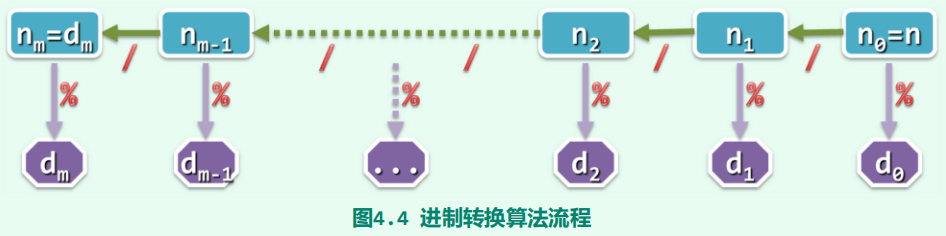
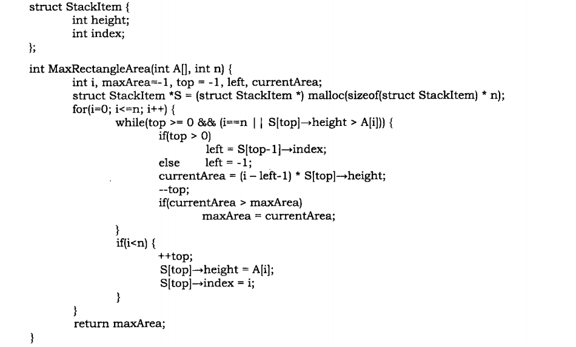

# 栈Stack、队列Queue

## 栈

LIFO结构，函数递归调用的底层实现

### 进制转换问题

$d_1$进制数$a$转为$d_2$进制数$b$



### 括号匹配问题

栈的简单应用，过程中与结束时检查是否为空栈

> 考虑文法
> $$
> S \rightarrow S(S)S \\ S \rightarrow \epsilon
> $$
> 括号匹配问题为其$LR(0)$文法分析过程。

若引入多种括号

- 左括号进栈
- 右括号与栈顶匹配则栈顶出栈
	- 继续识别
- 右括号与栈顶不匹配
	- 在当前左括号还未匹配时识别到其他类别的括号
	- 匹配失败

### 栈混洗问题

> 有三个栈A、B、C，A中有元素，B、C皆为空。只考虑下面两种操作：
>
> 1. A出栈，B压栈
> 2. B出栈，C压栈
>
> 把A、B中元素全部出栈，最终在C中得到的元素序列称为原序列的一个栈混洗。

栈混洗禁形：不失一般性，设A中元素为$1,2,\dots,n$，$a_1,a_2,\dots,a_n$为一个排列，易见上述排列是一个栈混洗当且仅当不存在$1\le i < j < k \le n, \dots ,k , \dots,i, \dots ,j,\dots$在上述排列中。

视操作1为括号匹配问题中识别到左括号的动作，操作2为括号匹配问题中识别到右括号的动作，那么

- 一个括号匹配的序列意味着在任何位置操作1次数不少于操作2次数，而总体操作1次数与操作2次数相同，这给出了一个栈混洗序列
- 一个栈混洗序列的产生意味着在任何位置操作1次数不少于操作2次数，而总体操作1次数与操作2次数相同，对应了一个括号匹配序列

这表明<font color=#956FE7>**A的栈混洗序列与n对括号的匹配序列构成双射**</font>，A的栈混洗数量与n对括号的匹配序列数量相同。

> **n对括号的匹配序列数量为$C_n$，其中$\displaystyle C_n =\frac{1}{n}\binom{2n}{n}$为第n个Catalan数。**

对于任何n对括号匹配的表达式$S_n$，有拆解$S_n = S_k(S_n - k - 1), 0 \le k < n$，从而记$S_n$有$P(n)$种可能，有递推关系$\displaystyle P(n) = \sum_{k=0}^{n}P(k) + P(n-k)$和边界条件$P(0)=0,P(1)=1$，对照Catalan数递推关系即得。

### 中缀表达式求值与中缀表达式转换为RPN

按运算符优先级计算中缀表达式

计算过程中按计算顺序追加RPN

> 通常计算规则下的语法制导翻译

```cpp
#define N_OPTR 9 // 运算符总数
typedef enum { ADD, SUB, MUL, DIV, POW, FAC, L_P, R_P, EOE } Operator; // 运算符集合
// 加、减、乘、除、乘方、阶乘、左括号、右括号、起始符与终止符
 
const char pri[N_OPTR][N_OPTR] = { // 运算符优先等级 [栈顶] [当前]
/* |-------------------- 当 前 运 算 符 --------------------| */
/* + - * / ^ ! ( ) \0 */
/* -- + */ '>', '>', '<', '<', '<', '<', '<', '>', '>',
/* | - */ '>', '>', '<', '<', '<', '<', '<', '>', '>',
/* 栈 * */ '>', '>', '>', '>', '<', '<', '<', '>', '>',
/* 顶 / */ '>', '>', '>', '>', '<', '<', '<', '>', '>',
/* 运 ^ */ '>', '>', '>', '>', '>', '<', '<', '>', '>',
/* 算 ! */ '>', '>', '>', '>', '>', '>', ' ', '>', '>',
/* 符 ( */ '<', '<', '<', '<', '<', '<', '<', '=', ' ', // 当栈顶运算符是左括号但已经扫描到终结符时，括号不匹配
/* | ) */ ' ', ' ', ' ', ' ', ' ', ' ', ' ', ' ', ' ', // 栈顶运算符不可能是右括号
/* -- \0 */ '<', '<', '<', '<', '<', '<', '<', ' ', '='
};
```

```cpp
float evaluate (char* S, char*& RPN) { //对（已剔除空格符）表达式S求值，并转换为逆波兰式RPN
    Stack<float> opnd; Stack<char> optr; //运算数栈、运算符栈
    optr.push ('\0'); //尾哨兵'\0'也作为头哨兵首先入栈
    while (!optr.empty()) { // 在运算符栈非空前，逐个处理表达式中各字符
        if (isdigit (*S)) { // 若当前字符为操作数，则
        	readNumber(S, opnd);
        	append(RPN, opnd.top()); // 读入操作数，并将其接至RPN末尾
    	}
        else { // 若当前字符为运算符，则
            switch (orderBetween(optr.top(), *S)) {
                case '<': { //栈顶运算符优先级更低时
                    optr.push(*S); // 计算推迟，当前运算符进栈
                    S++; 
                    break;
                }
                case '=': { // 优先级相等（当前运算符为右括号或者尾部哨兵'\0'）时
                    optr.pop(); // 脱括号并接收下一个字符
                    S++;
                    break;
                }
                case '>': { //栈顶运算符优先级更高时，可实施相应的计算，并将结果重新入栈
                    char op = optr.pop();
                    append(RPN, op); // 栈顶运算符出栈幵续接至RPN末尾
                    if ('!' == op) { // 若属于一元运算符
                        float pOpnd = opnd.pop(); // 取出一个操作数
                        opnd.push(calcu(op, pOpnd)); // 一元计算，结果入栈
                    }
                    else { // 对于其它（二元）运算符
                        float pOpnd2 = opnd.pop(), pOpnd1 = opnd.pop(); // 取出后、前操作数
                        opnd.push(calcu(pOpnd1, op, pOpnd2)); // 二元计算，结果入栈
                    }
                    break;
                }
                default: exit(-1); // 语法错误
            }
        }
    }
    return opnd.pop(); // 弹出并返回最后的计算结果
}
```

- 开头增加开始符哨兵，优先级低于常规运算符和左括号
- 栈顶为开始符时识别到常规运算符和左括号，操作符进栈
- 相同等级的运算符表项均记为>
	- 认为运算符均为左结合的
		- 特定运算符改为右结合，只需设为<
	- 出现此种情况即栈顶出栈计算
- 右括号永远不可能进栈

evaluate()函数对语法错误的表达式可能亦能给出结果，例如(12)3+!4*+5。

> 类比ANTLR 4优先级下降算法
>
> - 左结合运算符：栈顶大于栈外
> - 右结合运算符：栈外大于栈顶
> - 如果识别到的运算符优先级高于运算符栈顶元素
> 	- 入栈
> 	- 往后parser
> - 否则
> 	- 栈顶运算符出栈，对应运算数出栈
> 	- 计算结果进运算数栈

RPN求值从左向右执行即可

> infix为语法分析树的中序遍历，postfix为语法分析树的后序遍历

- 中缀表达式<font color=#BE191C>需要加括号以规定计算顺序</font>，但<font color=#1C7331>无需元字符分隔相邻操作数</font>
- RPN<font color=#1C7331>不需要加括号</font>，但<font color=#BE191C>需要元字符分隔相邻操作数</font>（11 2 +和1 12+）

### 利用栈判断回文串

找到中间位置，左侧入栈右侧出栈即可

### 一向量多栈

设置每个栈的sp，类比内存栈管理

### 倒置栈

利用递归机制存数据

<font color=#956FE7>时间复杂度$O(n^2)$</font>

<font color=#956FE7>空间复杂度为递归深度$O(n)$</font>

### 直方图中最大矩形问题

> 按照从左到右的顺序处理元素，并且维护一个包含<font color=#956FE7>已经开始但尚未结束</font>的子直方图信息的栈。

不妨认为相邻直方高度不同。

- 如果当前高度大于栈顶元素，这表明<font color=#956FE7>**栈顶元素**高度的直方可以延伸</font>，<font color=#4DA8EE>入栈</font>
- 如果当前高度小于栈顶元素，这表明<font color=#956FE7>**栈顶元素**高度的直方到此结束</font>
	- <font color=#4DA8EE>计算此时面积</font>
		- <font color=#956FE7>矩形的高是栈顶元素</font>
		- <font color=#956FE7>矩形的底是index(当前) - index(栈顶)</font>
	- <font color=#4DA8EE>更新最大值并出栈</font>，继续检查
- 结束时可增加哨兵，高度为0



<font color=#956FE7>分摊时间复杂度为$O(n)$</font>

<font color=#956FE7>空间复杂度为$O(n)$</font>（维护的栈）

## 队列

FIFO结构，出队端为队头，进队端为队尾

### 双栈当队

一个进一个出，用完一个就把另一个pop-push

### 双队当栈

确保至少一个队列始终为空

- push：哪个不空进哪个
	- 时间复杂度$O(1)$
- pop：把前面所有的移入另一空队列中，最后一个出队（现在这个队列是空的了）
	- 时间复杂度$O(n)$