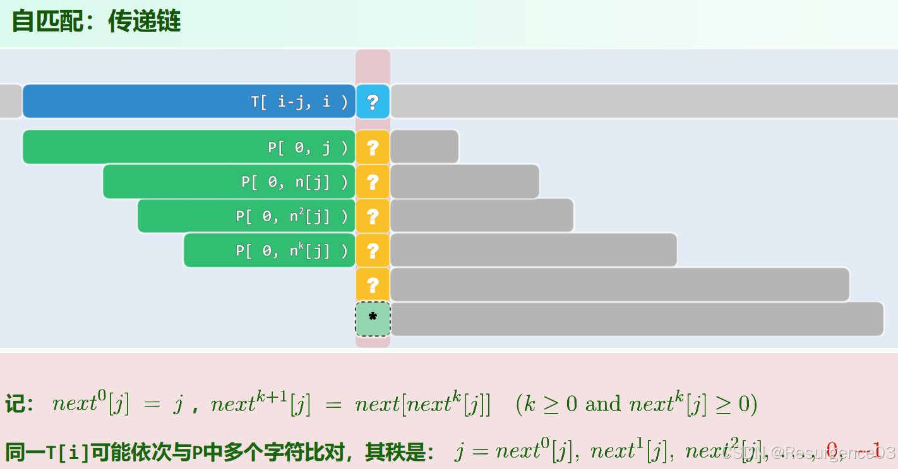
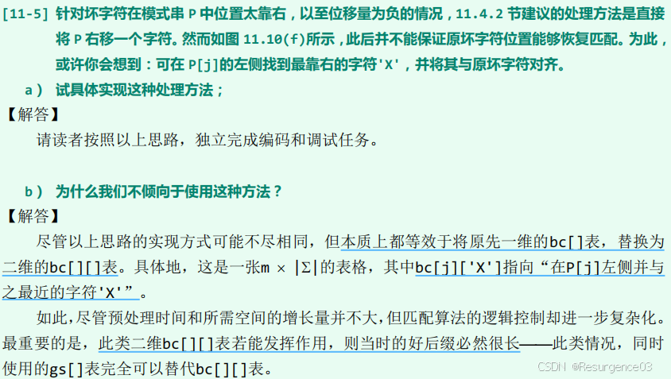
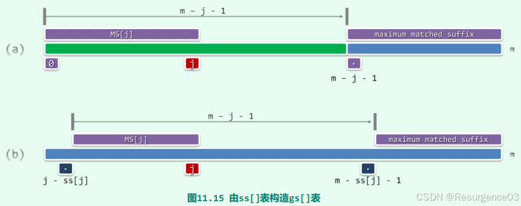
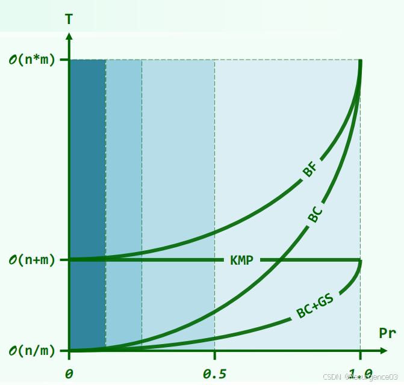
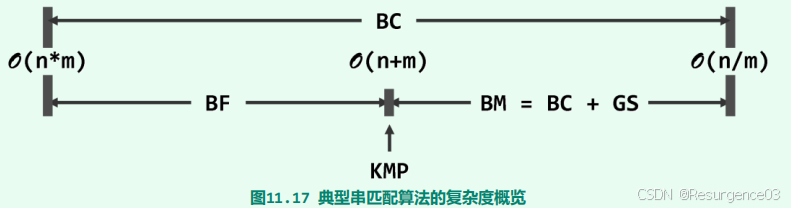
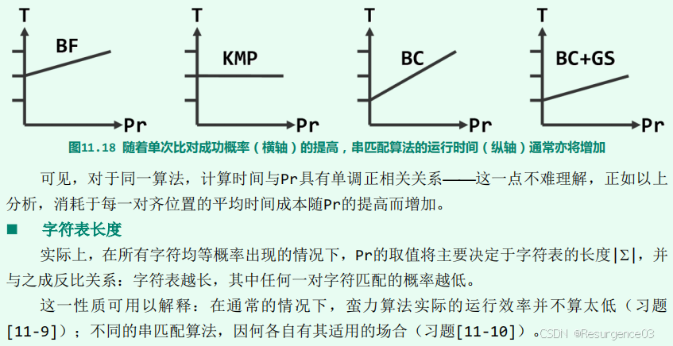

# 字符串匹配

## 朴素匹配算法（蛮力算法）

逐个匹配，失败就右移窗口

### 性能分析

- 时间复杂度 
  - <font color=#956FE7>最好情况：$O(n+m)，\Omega (n)$</font>
    - 每次匹配（$O(m)$）都是开始即失败，只在最后一次成功（$O(n)$）
  - <font color=#956FE7>最差情况：$O(nm)$</font>
    - 每次匹配都是到最后一个字符才失败，只在最后一次成功
- 空间复杂度
  - <font color=#956FE7>就地算法</font>

## Rabin-Karp算法

### 指纹映射

视字母表为$d$进制数位集合，$d$为字母表的势

- 往往采用<font color=#956FE7>$d+1$进制</font>，不使用0位
- 后续hash时不能区分最高位的0

按上述映射将长度为$m$的字符串变为数串

- $d>10$时，数串对应的数将会剧烈膨胀，存储与计算均难以接受
- <font color=#956FE7>时间复杂度为$O(nm)$</font>，退化为朴素算法

### 指纹哈希

记散列表长为$M$，将上述数**串**<font color=#4DA8EE>哈希</font>到存储与计算可接受的范围内

- 例如：求2025! % 61
- <font color=#956FE7>数串存储结构是**String**，（初始）计算哈希值过程成本**正比于$m$**（进制转换）</font>

P与T子串匹配，必有P的哈希值与T子串哈希值相同

- <font color=#4DA8EE>相同时才做进一步地逐位检验</font>

#### 哈希冲突

<font color=#956FE7>P与T子串**不匹配**，但P的哈希值与T子串**哈希值相同**</font>

若各字符独立均匀分布，对应指纹亦为均匀分布，<font color=#956FE7>**冲突率为$\dfrac{1}{M}$**，$M$为哈希表长度</font>

- <font color=#956FE7>散列表越长，冲突率越低</font>

#### 快速指纹计算

窗口移动思想

在P右移中，<font color=#4DA8EE>仅计算去除最高位、右移扩大d倍、加入最低位带来的hash值影响</font>，而不是逐位相加

- 去除最高位：最高位的对应d的数量级 % M
- 右移扩大d倍：当前hash值 × d % M
- 加入最低位：(新加入的最低位 + 当前hash值) % M

由$P.substring(j, j + m)$指纹计算$P.substring(j + 1, j + m + 1)$指纹只需**<font color=#956FE7>O(1)</font>**时间

## Knuth-Morris-Pratt算法

- P自左向右
- P内部从左到右

如果$P.substring(0, j)$与$T.substring(s, s + j)$匹配而$P[j]$与$T[s + j]$不匹配，那么下一个可能匹配的位置是$P.substring(0, j)$前缀与后缀相同的位置

### $next$映射与$next$表

<font color=#956FE7>$next[j]$是$P.substring(0, j)$的一个子串p的**长度**，p既是**最长的$P.substring(0, j)$真前缀**，也是**最长的$P.substring(0, j)$真后缀**</font>

- $next$映射是P串自身诱导的，与T串无关
- $next[j] = \max\{index: P.substring(0, index) == P.substring(j - index, j)\}$
- <font color=#956FE7>如果$P[j]$**失配**，尝试用$P[next[j]]$匹配</font>
  - 即下次匹配从$P.substring(0, j)$的最长前后缀的下一个字符开始比对

#### $next$映射迭代性

$next^k[j] := next[next[...next[next[j]]...]]$

- 如果$T[i]$与$P[j]$失配
- $P.substring(0, next[j]) == P.substring(j - next[j], j)$
- 尝试$T[i]$与$P[next[j]]$匹配 
  - 如果$T[i]$与$P[next[j]]$失配
  - $P.substring(0, next[next[j]]) == P.substring(next[j] - next[next[j]], next[j])$
  - ......
- $T[i]$会尝试与所有$P[next^k[j]]$匹配，直到匹配成功



- 局部地看 
  - $T[i]$与$P[j]$尝试匹配的迭代
- 整体地看 
  - 能与$T[i]$匹配的$j$一定满足相同前后缀关系
  - <font color=#956FE7>$next$映射将**从大到小遍历**所有的**dfrac{1}{M}相同前后缀长度**</font>

------

下次推进按$j - next[j]$步长推进

- <font color=#956FE7>最长前后缀越长</font>，$next[j]$越大，表明前后缀差距越小，<font color=#956FE7>越难推进</font>

#### $next$表构造

对于$0 \le j < m$，因$next$映射将从大到小遍历所有的$P.substring(0, j)$相同前后缀长度，只需找到可增长的位置即可

<font color=#956FE7>$next[j + 1] = next^k[j] + 1 \iff P[j] = P[next^k[j]]$，k取等式成立的最小者</font>

```java
void nextInit () {
    for (int j = 0; j < m; j++) {
        if (j == 0) {
            next[j] = -1;
        }
        else {
            int mayMatchPosition = next[j - 1];
            while (P[j - 1] != P[mayMatchPosition]) {
                mayMatchPosition = next[mayMatchPosition];
            }
            next[j] = next[mayMatchPosition] + 1;
        }
    }
}
```

真前后缀保证$next[j] < j$，算法必将终止

#### 改进$next$表

在原有$next$表基础上

- 如果回退一步，待比对字符仍相同，即$P[j] == P[next[j]]$

  - $j = next[j]$回退后，比对必然失败

- <font color=#4DA8EE>一直回退到**待比对字符不同**的位置，即$P[j] \neq P[next^k[j]]$，$k$取不等式成立的最小者</font>

```java
void improveNext () {
    // next[0]固定为-1
    for (int j = 1; j < m; j++) {
        while (P[j] == P[next[j]]) {
            next[j] = next[next[j]];
        }
    }
}
```

### 性能分析

- 时间复杂度
  - 建$next$表：$O(m)$
  - 整体复杂度为$O(n + m)$
    - P和T中每个字符只尝试一次
- 空间复杂度
  - $next$表：$O(m)$

## Boyer-Moore算法

- P自左向右
- P内部从右往左

坏字符策略：一旦失配，<font color=#4DA8EE>查BC表右移，优先匹配**T中的**这个**失配字符**</font>（坏字符）

好后缀策略：一旦失配，<font color=#4DA8EE>查GS表右移，优先匹配已经**匹配好的后缀部分**</font>（好后缀）

### BC表

$bc[ch]$是一个<font color=#956FE7>**数组下标**</font>，其<font color=#956FE7>给出P**最右边**ch字符的**下标**</font>

对于字母表中的每个元素，记录其在P中从右往左数第一次出现的位置

- $bc$表从左往右扫描P串构造

```java
void bcInit() {
    for (int j = 0; j < sizeof(alphabet); j++) {
        bc[j] = -1;
    }
    for (int j = 0; j < m; j++) {
        bc[P[j]] = j;
    }
}
```

假设$P[j]$失配，对应T字符为$b$

- $bc[b] < j $
  - 表明$P[j]$左边有$b$（或者P中根本没有$b$，此时指向通配符，相当于P整体移过$b$）
  - <font color=#4DA8EE>P向右平移$j - bc[b]$</font>
- $bc[b] > j$
  - 表明$P[j]$右边有$b$
  - <font color=#4DA8EE>P向右平移**1**跳过该字符</font>



### GS表

$gs[j]$是一个<font color=#956FE7>**移动步长**</font>，如果$P[j]$位置与$T[i]$失配，<font color=#956FE7>P向右移动$gs[j]$长度</font>，移动前后保持已经匹配的后缀部分，且<font color=#956FE7>移动前后尝试与$T[i]$匹配的P字符不同</font>

- 换言之，$T[i]$之后原来匹配的部分平移后一定也匹配
- <font color=#956FE7>自带改进</font>
- $gs[j]$的所有可能取值必然均满足上述性质
- $gs[j] \le \left| P \right| $
  - 如果P中没有好后缀，最多移过整个P串长度（最好情况）
- $gs[j] > 1$
  - 如果刚开始就失配，只能移动1步

#### SS表

$ss[j]$是一个<font color=#956FE7>**子串长度**</font>，从$P[j]$开始向前取长度为$ss[j]$的子串是P的长度为$ss[j]$的后缀

- $P.substring(j + 1 - ss[j], j + 1) == P.substring(m - ss[j], m)$
- $ss[m - 1] = m$
- $ss[j] \le j + 1$
  - $ss[j] = j + 1$，$P.substring(j + 1 - ss[j], j + 1)$既是前缀，也是后缀
  - $ss[j] < j + 1$，$P.substring(j + 1 - ss[j], j + 1)$是中段的后缀内容

#### 利用SS表构造GS表

##### 单个GS表元素刻画

假设在$P[m - (j + 1) - 1]$处失配，最后匹配位置为$P[m - (j + 1)]$

- 即P的长度为$j + 1$的后缀$P.substring(m - (j + 1), m)$已经和T匹配

- 根据ss表，可以知道$P.substring(m - (j + 1), m)$（或后面的一部分）在P中所有出现的位置 

  - 每个$ss[i] \neq 0$的$i$值引导一次$P.substring(m - ss[i], m)$出现

- $gs[m - (j + 1) - 1]$应当为：让最靠右的可能匹配位置对准现在位置的**步长最小值**

  - $P.substring(m - (j + 1), m)$局部如果在P头部出现，可以是<font color=#956FE7>**局部出现**</font>

  - $P.substring(m - (j + 1), m)$局部如果在P内部出现，那么必须<font color=#956FE7>**整个都出现**</font>

    - 否则必然不匹配
- 具有更短的偏移步长

##### 构造算法



- 对于在P头部出现的$P.substring(m - (j + 1), m) $
  - $ss[j] = j + 1$，$P.substring(0, j + 1)$既是前缀，也是后缀 	
    - 对应最后匹配位置$P[m - (j + 1)]$
    - 右移$m - (j + 1)$长度，前后缀将对齐，可以重新开始匹配
    - 对于$P[m - (j + 1)]$左侧的所有字符$P[i]$，右移$m - (j + 1)$长度就**有可能**匹配
    - $gs[i]$可取$m - (j + 1)$
- 对于在P内部出现的$P.substring(m - (j + 1), m) $
  - $ss[j] < j + 1$，$P.substring(j + 1 - ss[j], j + 1)$是中段的后缀内容 	
    - 这表明$P.substring(j + 1 - ss[j], j + 1)$的前一个字符就有可能匹配T的对应字符
    - 右移$m - (j + 1)$长度，公共部分将对齐，且公共部分前一个字符不同，可以重新开始匹配
    - $gs[m - (ss[j] + 1)] = m - (j + 1)$
- <font color=#4DA8EE>从左向右遍历</font>，让更小的步长覆盖更大的步长

```java
void gsInit() {
    for (int j = 0; j < m; j++) {
        gs[j] = m;
    }
    for(int j = 0; j < m - 1; j++){
        // j == m - 1时，gs[m - 1]为第一个字符即失配情形，直接移动m步
        if (ss[j] == j + 1) {
            for (int i = 0; i < m - (j + 1); i++) {
                gs[i] = m - (j + 1);
            }
        }
        else {
            gs[m - (ss[j] + 1)] = m - (j + 1);
        }
    }
}
```

### 性能分析

- <font color=#956FE7>时间复杂度</font>
  - 预处理：<font color=#956FE7>BC表建表时间和GS表建表时间均**正比于规模**$O(sizeof(alphabet) + m)$</font>
  - <font color=#956FE7>最好情况：$O\left(\dfrac{n}{m}\right)$</font>
  - <font color=#956FE7>最差情况：$O(n + m)$</font>
- <font color=#956FE7>空间复杂度</font>
  - <font color=#956FE7>BC表和GS表分别需要额外空间$O(sizeof(alphabet))$和$O(m)$</font>

## 匹配算法性能比较

Pr：Pairing rate，单次匹配率

- 与字符表规模成反比

- <font color=#956FE7>单次匹配率越高</font>，表明字符重合度越高，越难推进，<font color=#956FE7>时间复杂度一般越高</font>
- KMP无论Pr如何，<font color=#956FE7>始终为$O(n + m)$</font>



- KMP与BC的交点<font color=#956FE7>**大于0.5**</font>

------






- Pr大 
  - <font color=#1C7331>KMP算法</font>稳定线性$O(n + m)$
- Pr小 
  - <font color=#1C7331>含BC机制的BM算法</font>达到上限$O\left(\dfrac{n}{m}\right)$