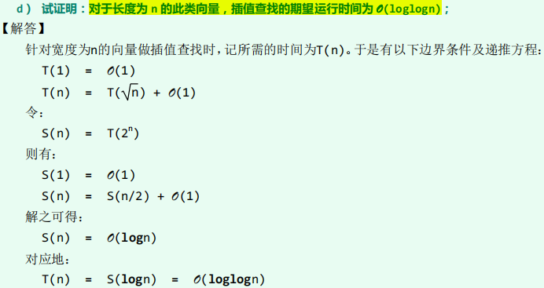

# 向量Vector

数组的泛化与封装，循秩Rank访问对应数组按下标访问

## 内存管理策略

### 扩容

在Vector装满的情形下<font color=#956FE7>倍增capacity</font>

```c++
template <typename T>
void Vector<T>::expand() { // 向量空间不足时扩容
    if (_size < _capacity) {
        return; // 尚未满员时，不必扩容
    }
    _capacity = max(_capacity, DEFAULT_CAPACITY); // 不低于最小容量
    T* oldElem = _elem;
    _elem = new T[_capacity <<= 1]; // 容量加倍
    for (Rank i = 0; i < _size; i++) { // 复制原向量内容
        _elem[i] = oldElem[i]; // T为基本类型，或已重载赋值操作符'='
    }
    delete[] oldElem; // 释放原空间
} // 得益于向量的封装，尽管扩容之后数据区的物理地址有所改变，却不致出现野指针
```

- 得益于Vector的封装，尽管扩容之后数据区的物理地址有所改变，却<font color=#1C7331>不致出现野指针</font>
	- 外部引用的是封装后的Vector对象
- 倍增策略使得<font color=#1C7331>分摊复杂度为$O(1)$</font>
	- 容量递增策略（每次扩容扩大一个常数）的分摊复杂度为$O(n)$
- <font color=#BE191C>装填因子较低</font>

### 缩容

与扩容对称的操作，防止装填因子过低

当装填因子小于某一阈值时，进行缩容

阈值越低越难缩容，阈值为0时即为不缩容

一般阈值选作<font color=#956FE7>25%或更低</font>

- 这个阈值显然不高于50%
	- 按上述扩容方法，扩容后得到的Vector装填因子即为50%
- 这个阈值不可以太高（例如50%）
	- 防止扩容后的向量连续几次remove动作使得Vector再次缩容，分摊复杂度上升

## 一般向量

### 查找

约定有多个命中时<font color=#956FE7>返回Rank较大者</font>

只能从后往前遍历

```c++
template <typename T>
Rank Vector<T>::find (T const& e, Rank lo, Rank hi) const { 
    // assert: 0 <= lo < hi <= _size
    while ((lo < hi--) && (e != _elem[hi])); //从后向前，顺序查找
    return hi; //若hi < lo，则意味着失败；否则hi即命中元素的秩
}
```

输入敏感性算法：时间复杂度与输入性质有关

<font color=#956FE7>时间复杂度</font>

- <font color=#956FE7>最好情况$O(1)$</font>
- <font color=#956FE7>最坏情况$O(n)$</font>
- <font color=#956FE7>平均概率情形下成功查找时间复杂度$O(n)$</font>

### 插入

检查是否需要扩容，<font color=#4DA8EE>将后续元素逐个后移</font>

- <font color=#956FE7>时间复杂度</font>
	- <font color=#956FE7>最好情况$O(1)$</font>
	- <font color=#956FE7>最坏情况$O(n)$</font>
	- <font color=#956FE7>平均概率情形下时间复杂度$O(n)$</font>

### 删除

#### 删除区间[lo, hi)的元素

hi及其以后的元素向前移动hi - lo个位置<font color=#4DA8EE>覆盖原数据</font>，修改size，<font color=#4DA8EE>检查是否需要缩容</font>

- 移动时<font color=#4DA8EE>从前往后移动</font>
- 从后往前移动可能覆盖数据

<font color=#956FE7>时间复杂度$O(n - hi)$</font>

#### 删除Rank为r的元素

注意到<font color=#4DA8EE>r = [r, r + 1)</font>

### 唯一化

<font color=#4DA8EE>从前向后遍历</font>，find自身<font color=#4DA8EE>前缀</font>是否有相同元素，<font color=#4DA8EE>有则remove自身</font>

<font color=#956FE7>时间复杂度$O(n^2)$</font>

> 利用复杂度为$O(n \log n)$的排序算法和有序向量唯一化可实现渐进$O(n \log n)$复杂度的唯一化
>
> <font color=#4DA8EE>考虑(data, rank)对</font>：
>
> 1. 对data排序（$O(n \log n)$）
> 2. 有序向量唯一化（$O(n)$）
> 3. 对rank排序（$O(n \log n)$）
>
> <font color=#956FE7>时间复杂度$O(n \log n)$</font>

## 有序向量

不失一般性，假设向量元素是单调增的

### 查找

度量查找算法优劣指标：查找长度，即所执行的元素**<font color=#4DA8EE>大小比较操作次数</font>**

- 两个字符串按字典序比较代价正比于长度

#### 二分查找

a. 版本A

```c++
// 二分查找算法（版本A）：在有序向量区间[lo, hi)内查找元素e，0 <= lo <= hi <= _size
template <typename T>
static Rank binSearch (T* A, T const& e, Rank lo, Rank hi) {
    while (lo < hi) {   
        // 每步迭代可能要做两次比较判断，有三个分支
        Rank mi = (lo + hi) >> 1; //以中点为轴点
        if (e < A[mi]) { // 深入前半[lo, mi)继续查找
            hi = mi;
        }
        else if (A[mi] < e) { // 深入后半(mi, hi)继续查找
            lo = mi + 1;
        }
        else { // 在mi处命中
            return mi; // 成功查找可以提前终止
        }
    }
    return -1; // 查找失败
}
```

- 有多个命中元素时，不能保证返回秩最大者

- 查找失败时，简单地返回-1，而不能指示失败的位置

- <font color=#956FE7>平均成功查找长度$O(1.5 \log n)$，平均失败查找长度$O(1.5 \log n)$</font>

	

b. 版本B

```c++
template <typename T>
static Rank binSearch(T* S, T const& e, Rank lo, Rank hi) {
    while (1 < hi - lo) { // 有效查找区间的宽度缩短至1时，算法才终止
        Rank mi = (lo + hi) >> 1; // 以中点为轴点，经比较后确定深入[lo, mi)或[mi, hi)
        e < S[mi] ? hi = mi : lo = mi;
    } // 出口时hi = lo + 1
    return e == S[lo] ? lo : -1;
}
```

- 即使轴点命中，仍会向右侧深入查找，进而有多个命中元素时<font color=#956FE7>能保证返回Rank最大者</font>

- 查找失败时，简单地返回-1，而不能指示失败的位置
- 性能更加均衡

c. 版本C

转化为<font color=#4DA8EE>查找**大于**关键码e的**Rank最小者**</font>，进而找到不小于关键码e的Rank最大者，达成语义约定

- <font color=#956FE7>**命中时**返回命中集合中**Rank最大者**</font>
- <font color=#956FE7>**未命中时**返回小于e的**Rank最大者**</font>

右移导致的向下取整使得大于e关键码的后缀序列中向左收敛于Rank最小者

```c++
template <typename T>
static Rank binSearch(T* S, T const& e, Rank lo, Rank hi) {
    while (lo < hi) { 
        // 不变性：A[0, lo) <= e < A[hi, n)
        Rank mi = (lo + hi) >> 1;
        e < S[mi] ? hi = mi : lo = mi + 1;
    } // 出口时，区间宽度缩短至0，且必有S[lo = hi] = M
    return lo - 1; // 至此，[lo]为大于e的最小者，故[lo-1] = m即为不大于e的最大者
}
```

- 右端深入查找向量取为(lo, hi)，使得查找结束时[lo]为大于e的Rank最小者，故[lo-1] = m即为不大于e的Rank最大者
	- 查找成功时，m是Rank最大的命中元素
	- 查找失败时，m是小于命中元素的Rank最大者
- 性能同版本B

#### Fibonacci查找：基于二分查找版本A的轴点修正

将向量size看作$fib(n) - 1$的形式

- 轴点<font color=#956FE7>Rank</font>取作<font color=#956FE7>不大于长度的最大Fibonacci数-1</font>
- $fib(n) - 1 = (fib(n - 1) - 1) + 1 + (fib(n - 2) - 1)$
- <font color=#956FE7>$fib(1) = fib(2) = 1$</font>

```c++
template <typename T> // 0 <= lo <= hi <= _size
static Rank fibSearch(T* S, T const & e, Rank lo, Rank hi) {
    for (Fib fib(hi - lo); lo < hi; ) { // Fib数列制表备查
        while (hi - lo < fib.get()) {
            fib.prev(); // 自后向前顺序查找轴点（分摊O(1)）
        }
        Rank mi = lo + fib.get() - 1; // 确定形如Fib(k)-1的轴点
        if (e < S[mi]) { // 深入前半段[lo, mi)
            hi = mi;
        }
        else if (S[mi] < e) { // 深入后半段(mi, hi)
            lo = mi + 1;
        }
        else { // 命中
            return mi;
        }
    }
    return -1; // 失败
}
```

- 有多个命中元素时，不能保证返回秩最大者
- 查找失败时，简单地返回-1，而不能指示失败的位置
- <font color=#956FE7>平均成功查找长度$O(1.44 \log n)$，平均失败查找长度$O(1.38\log n)$</font>
	- <font color=#956FE7>向左查找，比较次数+1</font>
	- <font color=#956FE7>向右查找，比较次数+2</font>

> 亦可按下面方法实现Fibonacci查找：
>
> 1. 按黄金分割比：$mi = \lfloor 0.382lo + 0.618 hi \rfloor$
> 2. 按近似黄金分割比：$mi = \dfrac{lo+2hi}{3}$
> 3. 按近似黄金分割比：`mi = (lo + (lo << 1) + hi + (hi << 2)) >> 3`

### 唯一化

双下标遍历推进

- <font color=#4DA8EE>i记录已经uniquify的元素</font>
- <font color=#4DA8EE>j遍历Vector</font>

```c++
template <typename T>
int Vector<T>::uniquify() {
    Rank i = 0, j = 0;
    while (++j < _size) {
        if (_elem[i] != _elem[j]) {
            _elem[++i] = _elem[j];
        }
    }
    _size = ++i;
    shrink();
    return j - i; // 返回删除元素总数
}
```

<font color=#956FE7>时间复杂度$O(n)$</font>

## 其他查找算法

### 马鞍查找

针对对于每一行每一列都严格递增的二维数组。

先对一个维度使用二分查找（$O(\log n)$），再根据严格单调性逐步收缩查找范围。

时间复杂度$O(r+s+\log n)$，r为第0行中不大于待查关键码的Rank最大者，s为第0列中不大于待查关键码的Rank最大者。

### 插值查找

针对大致呈线性的有序向量

按线性插值办法得出首次探查点位置，反复迭代查找

- 搜索区间长度<font color=#956FE7>以平方根速度递减</font>

	

	

期望运行时间复杂度为<font color=#956FE7>$O(\log \log n)$</font>

