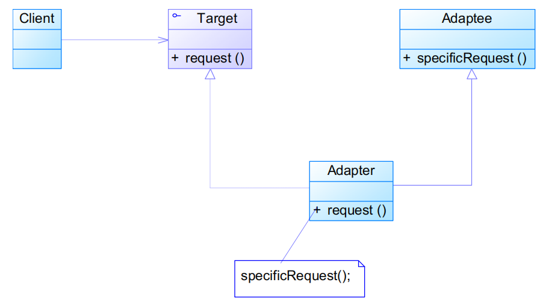

# 适配器模式Adapter Pattern

## 模式定义

将一个接口转换成客户希望的另一个接口，使接口不兼容的类可以一起工作

- 既可以作为<font color=#956FE7>**类结构型模式**</font>，也可以作为<font color=#956FE7>**对象结构型模式**</font>

## 模式结构

###  类适配器模式



###  对象适配器模式


- Target：目标抽象类
  - 是Adapter设计的工作目标
- Adapter：适配器类
- Adaptee：适配者类 
  - 是期望Target具有的类似动作来源
- Client：客户类

类适配器代码

```java
public class Adapter extends Adaptee implements Target {
    public void request() {
        specificRequest();
    }

}
```

对象适配器代码

```java
public class Adapter extends Target {
    private Adaptee adaptee;

    public Adapter(Adaptee adaptee) {
        this.adaptee = adaptee;
    }

    public void request() {
        adaptee.specificRequest();
    }

}
```

### 默认适配器模式（Default Adapter Pattern）

- 又称缺省适配器模式、单接口适配器模式

先设计一个抽象类实现接口，并为该接口中每个方法提供一个默认实现（空方法），该抽象类的子类可有选择地override父类的某些方法来实现需求

- 适用于不想使用一个接口所有的方法的情况

### 双向适配器

在**<font color=#FF9900>对象</font>适配器**的使用过程中，如果在Adapter中同时包含对Target类和Adaptee类的引用，那么该Adapter就是一个双向适配器

- Adaptee可以通过Adapter调用Target类中的方法
- Target类可以通过Adapter调用Adaptee类中的方法

## 实例

实例一：仿生机器人 

现需要设计一个可以模拟各种动物行为的机器人，在机器人中定义了一系列方法，如机器人叫喊方法cry()、机器人移动方法move()等。如果希望在不修改已有代码的基础上使得机器人能够像狗一样叫，像狗一样跑，使用适配器模式进行系统设计。

- Target是机器人（因为是机器人像狗一样，应是机器人适配狗）


实例二：加密适配器

某系统需要提供一个加密模块，将用户信息（如密码等机密信息）加密之后再存储在数据库中，系统已经定义好了数据库操作类。为了提高开发效率，现需要重用已有的加密算法，这些算法封装在一些由第三方提供的类中，有些甚至没有源代码。使用适配器模式设计该加密模块，实现在不修改现有类的基础上重用第三方加密方法。

- Target是数据库操作类，Adaptee是加密算法

## 模式分析

- <font color=#1C7331>优点</font>
  - 将Target类和Adaptee类解耦
    - 通过引入一个Adapter类来重用现有的Adaptee类，而无须修改原有代码
  - 增加了类的透明性和复用性
    - 将具体的实现封装在Adaptee类中，对于客户端类来说是透明的，而且提高了Adaptee的复用性
  - 灵活性和扩展性都非常好
    - 通过使用配置文件，可以很方便地更换Adapter，也可以在不修改原有代码的基础上增加新的Adapter类
    - 符合开闭原则

对于类适配器模式

- <font color=#1C7331>优点</font>

  - 由于Adapter类是Adaptee类的子类，因此可以在Adapter类中override一些Adaptee的方法，使得Adapter的灵活性更强

- <font color=#BE191C>缺点</font>

  - 使用有一定的局限性，不能将一个A

    daptee

    类和它的子类都适配到目标接口 	

    - 对于不支持多重继承的语言，一次最多只能适配一个Adaptee类

  - Target类只能为抽象类，不能为具体类

对于对象适配器模式

- <font color=#1C7331>优点</font>
  - 一个对象适配器可以把多个不同的Adaptee适配到同一个Target 	
    - 同一个Adapter可以把Adaptee类和它的子类都适配到目标接口
- <font color=#BE191C>缺点</font>
  - 置换Adaptee类的方法相对复杂 	
    - 先做一个Adaptee类的子类，将Adaptee类的方法置换掉
    - 把子类当做实际的Adaptee进行适配

## 适用环境

- 系统需要使用现有的类，而这些类的接口不符合系统的需要
- 想要建立一个可以重复使用的类，用于与一些彼此之间没有太大关联的一些类，包括一些可能在将来引进的类一起工作