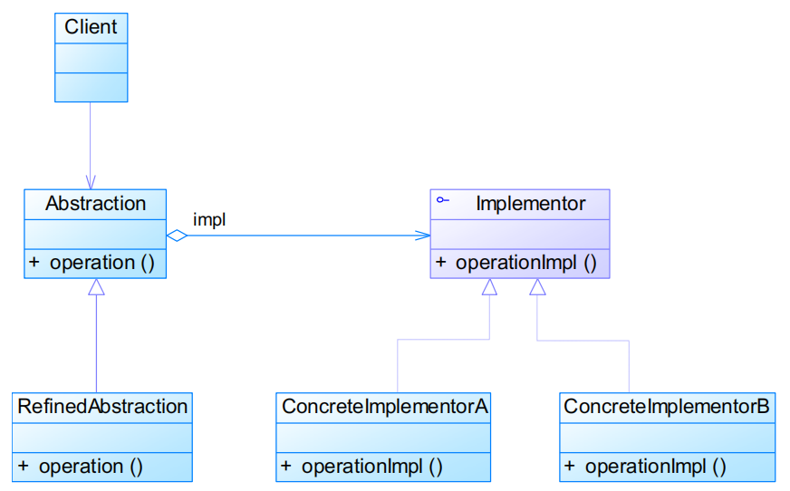
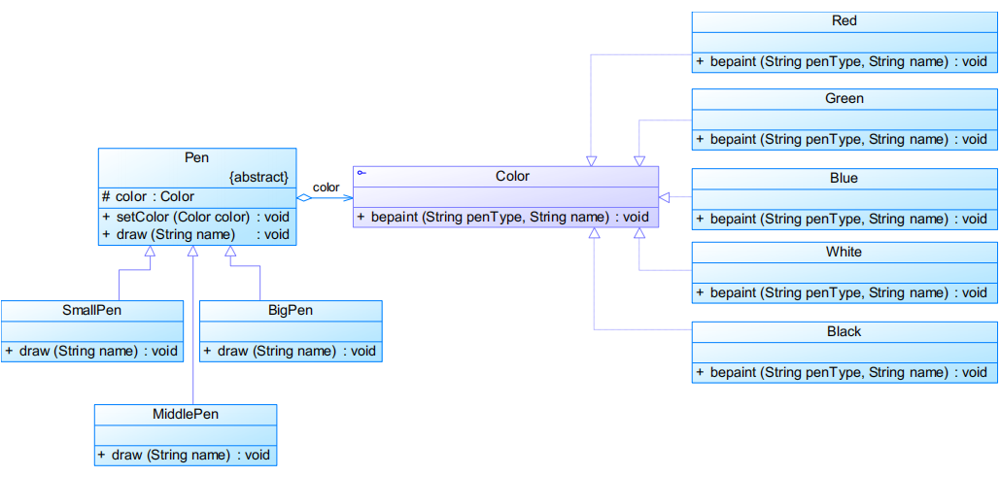
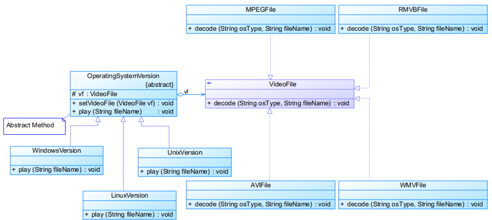

# 桥接模式Bridge Pattern

# 模式定义

**将抽象部分与它的实现部分分离**，使它们都可以独立地变化

- 又称为柄体（Handle and Body）模式、接口（Interface）模式
- **对象结构型模式**

# 模式结构

编辑

- Abstraction：抽象类
- RefinedAbstraction：扩充抽象类
- Implementor：实现类接口
- ConcreteImplementor：具体实现类

抽象化（Abstraction）与实现化（Implementation）脱耦

- 在面向对象中，将对象的共同性质抽取出来形成类的过程即为抽象化的过程
- 针对抽象化给出的具体实现就是实现化
- 脱耦就是将抽象化和实现化之间的耦合解脱开，或者说是**将它们之间的强关联改换成弱关联**，将**两个角色之间的继承关系改为关联关系**

实现类接口代码

```java
public interface Implementor {
    public void operationImpl();
}
```


抽象类代码

```java
public abstract class Abstraction {
    protected Implementor impl;

    public void setImpl(Implementor impl) {
        this.impl = impl;
    }

    public abstract void operation();
}
```


扩充抽象类代码

```java
public class RefinedAbstraction extends Abstraction {

    public void operation() {
        // do something
        impl.operationImpl();
        // do something
    }

}
```


# 实例

实例一：模拟毛笔
 现需要提供大中小3种型号的画笔，能够绘制5种不同颜色，如果使用蜡笔，我们需要准备3*5=15
 支蜡笔，也就是说必须准备15个具体的蜡笔类。而如果使用毛笔的话，只需要3种型号的毛笔，外
 加5个颜料盒，用3+5=8个类就可以实现15支蜡笔的功能。使用桥接模式模拟毛笔的使用过程。

编辑

实例二：跨平台视频播放器
 如果需要开发一个跨平台视频播放器，可以在不同操作系统平台（如Windows、Linux、Unix等）上播放多种格式的视频文件，常见的视频格式包括MPEG、RMVB、AVI、WMV等。使用桥接模式设计该播放器。

编辑

# 模式分析

- 优点 
  - 分离抽象接口及其实现部分
  - 桥接模式有时类似于多继承方案，但是多继承方案违背了类的单一职责原则（即一个类只有一个变化的原因），复用性比较差，而且多继承结构中类的个数非常庞大，桥接模式是比多继承方案更好的解决方法
  - 桥接模式提高了系统的可扩充性，在两个变化维度中任意扩展一个维度，都不需要修改原有系统
  - 实现细节对客户透明，可以对用户隐藏实现细节
- 缺点 
  - 桥接模式的引入会增加系统的理解与设计难度，由于聚合关联关系建立在抽象层，要求开发者针对抽象进行设计与编程
  - 桥接模式要求正确识别出系统中两个独立变化的维度，因此其使用范围具有一定的局限性

## 适用环境

- 系统需要在构件的抽象化角色和具体化角色之间增加更多的灵活性，避免在两个层次之间建立静态的继承联系
- 抽象化角色和实现化角色需要以继承的方式独立扩展而互不影响，在程序运行时可以动态将一个抽象化子类的对象和一个实现化子类的对象进行组合，即系统需要对抽象化角色和实现化角色进行动态耦合
- 一个类存在两个独立变化的维度，且这两个维度都需要进行扩展
- 不希望使用继承或因为多层次继承导致系统类的个数急剧增加的系统