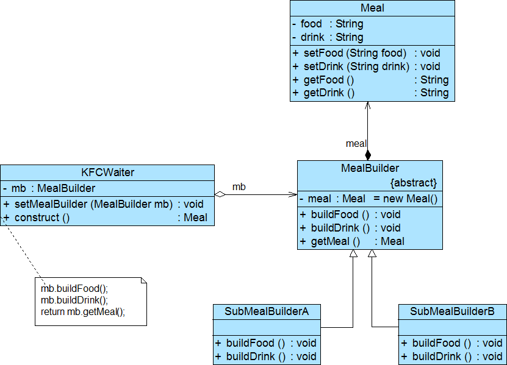

# 建造者模式Builder Pattern

# 模式定义

将一个复杂对象的构建与它的表示分离，一步一步创建一个复杂的对象，使得同样的构建过程可以创建不同的表示

- **对象创建型模式**

# 模式结构

编辑

- Builder：抽象建造者
- ConcreteBuilder：具体建造者 
  - 只负责实现产品的每个部分的建造，而不关心这些部分以何种方式组成最终产品
- Director：指挥者 
  - 隔离了客户与生产过程
  - **负责控制产品的生成过程**
  - 针对抽象建造者编程
  - 客户端通过指挥者类调用建造者的相关方法，返回一个完整的产品对象
- Product：产品角色

例如，产品角色类定义如下

```java
public class Product {
    private Object partA;
    private Object partB;
    private Object partC;

    // ignore Getter and Setter of partA
    // ignore Getter and Setter of partB
    // ignore Getter and Setter of partC
}
```


抽象建造者类代码

```java
public abstract class Builder {
    protected Product product = new Product();

    public abstract void buildPartA();

    public abstract void buildPartB();

    public abstract void buildPartC();

    public Product getResult() {
        return product;
    }
}
```


指挥者类的代码

```java
public class Director {
    private Builder builder;

    public Director(Builder builder) {
        this.builder = builder;
    }

    public void setBuilder(Builder builder) {
        this.builder = builer;
    }

    public Product construct() {
        builder.buildPartA();
        builder.buildPartB();
        builder.buildPartC();
        return builder.getResult();
    }

}
```


客户端类调用组装过程代码

```java
Builder builder = new ConcreteBuilder();
Director director = new Director(builder);
Product product = director.construct();
```


## 简化建造者模式

- 省略抽象建造者角色 
  - 如果系统中只需要一个具体建造者的话，可以省略掉抽象建造者
- 省略指挥者角色 
  - 在具体建造者只有一个的情况下，如果抽象建造者角色已经被省略掉，那么还可以省略指挥者角色，让Builder角色扮演指挥者与建造者双重角色

换言之，如果系统中只需要一个具体建造者的话，Builder可以同时承担ConcreteBuilder、Builder、Director的所有职责

# 实例

实例：KFC套餐
 建造者模式可以用于描述KFC如何创建套餐：套餐是一个复杂对象，它一般包含主食（如汉堡、鸡肉卷等）和饮料（如果汁、可乐等）等组成部分，不同的套餐有不同的组成部分，而KFC的服务员可以根据顾客的要求，一步一步装配这些组成部分，构造一份完整的套餐，然后返回给顾客。

编辑

# 模式分析

- 优点
  - 客户端不必知道产品内部组成的细节，将产品本身与产品的创建过程解耦，使得相同的创建过程可以创建不同的产品对象
  - 每一个具体建造者都相对独立，而与其他的具体建造者无关，因此可以很方便地替换具体建造者或增加新的具体建造者 	
    - 用户使用不同的具体建造者即可得到不同的产品对象
  - 可以更加精细地控制产品的创建过程
  - 增加新的具体建造者无须修改原有类库的代码，指挥者类针对抽象建造者类编程，系统扩展方便 	
    - **符合开闭原则**
- 缺点
  - 如果产品之间的差异性很大，则不适合使用建造者模式，其使用范围受到一定的限制
  - 如果产品的内部变化复杂，可能会导致需要定义很多具体建造者类来实现这种变化，导致系统变得很庞大

## 适用环境

- 需要生成的产品对象有复杂的内部结构，这些产品对象通常包含多个成员属性
- 需要生成的产品对象的属性相互依赖，需要指定其生成顺序。
- 对象的创建过程独立于创建该对象的类 
  - 在建造者模式中引入了指挥者类，将创建过程封装在指挥者类中，而不在建造者类中
- 隔离复杂对象的创建和使用，并使得相同的创建过程可以创建不同的产品