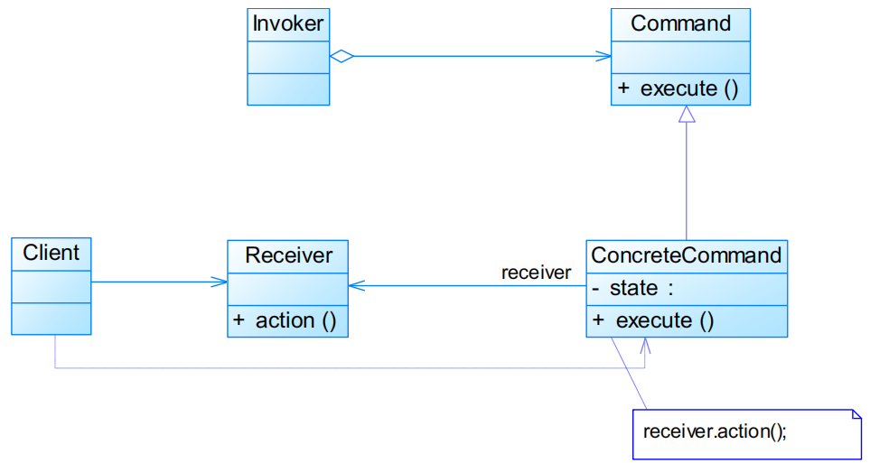
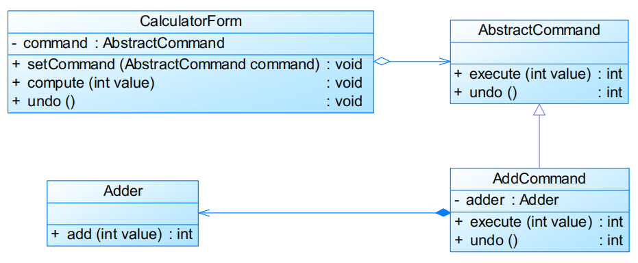
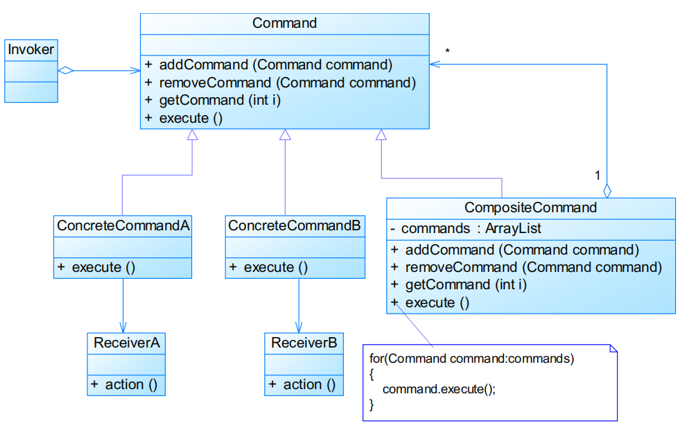
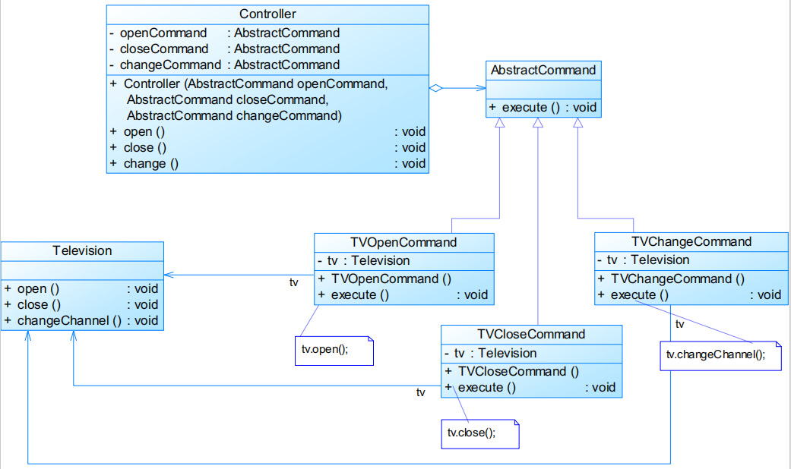
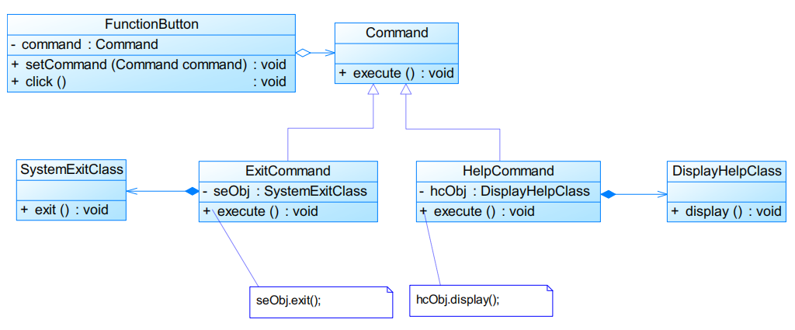

# 命令模式Command Pattern

# 模式定义

将一个请求封装为一个对象，从而可用不同的请求对客户进行参数化，对请求排队或者记录请求日志，以及支持撤销操作

- 又称动作（Action）模式、事务（Transaction）模式
- **对象行为型模式**

# 模式结构

编辑

- Command：抽象命令类
- ConcreteCommand：具体命令类
- Invoker：调用者
- Receiver：接收者
- Client：客户类

抽象命令类代码

```java
public abstract class Command {

    public abstract void execute();

}
```


调用者代码

```java
public class Invoker {
    private Command command;

    public Invoker(Command command) {
        this.command = command;
    }

    public void setCommand(Command command) {
        this.command = command;
    }

    // 业务方法，用于调用命令类的方法
    public void call() {
        command.execute();
    }

}
```


具体命令类代码

```java
public class ConcreteCommand extends Command {
    private Receiver receiver;

    public void execute() {
        receiver.action();
    }

}
```


请求接收者代码

```java
public class Receiver {

    public void action() {
        // do something
    }

}
```


## 撤销操作实现

编辑

## 宏命令实现

宏命令又称为组合命令，它是命令模式和组合模式联用的产物
 宏命令也是一个具体命令，包含了对其他命令对象的引用，在调用宏命令的execute()方法时，将递归调用它所包含的每个成员命令的execute()方法

编辑

# 实例

实例一：电视机遥控器
 电视机是请求的接收者，遥控器是请求的发送者，遥控器上有一些按钮，不同的按钮对应电视机的不同操作。抽象命令角色由一个命令接口来扮演，有三个具体的命令类实现了抽象命令接口，这三个具体命令类分别代表三种操作：打开电视机、关闭电视机和切换频道。显然，电视机遥控器就是一个典型的命令模式应用实例。

编辑

实例二：功能键设置
 为了用户使用方便，某系统提供了一系列功能键，用户可以自定义功能键的功能，如功能键FunctionButton可以用于退出系统（SystemExitClass），也可以用于打开帮助界面（DisplayHelpClass）。用户可以通过修改配置文件来改变功能键的用途，现使用命令模式来设计该系统，使得功能键类与功能类之间解耦，相同的功能键可以对应不同的功能。

编辑

# 模式分析

- 优点
  - 降低系统的耦合度
  - 新的命令可以很容易地加入到系统中 	
    - **符合开闭原则**
  - 可以比较容易地设计一个命令队列和宏命令（组合命令）
  - 可以方便地实现对请求的Undo和Redo
- 缺点
  - 可能会导致某些系统有过多的具体命令类

## 适用环境

- 系统需要将请求调用者和请求接收者解耦，使得调用者和接收者不直接交互
- 系统需要在不同的时间指定请求、将请求排队和执行请求
- 系统需要支持命令的撤销（Undo）操作和恢复（Redo）操作
- 系统需要将一组操作组合在一起，即支持宏命令