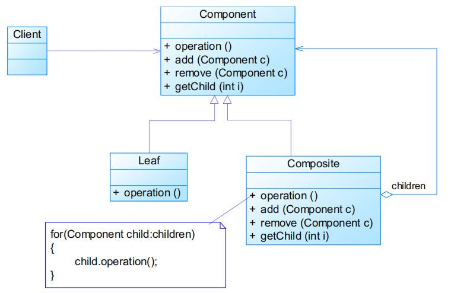
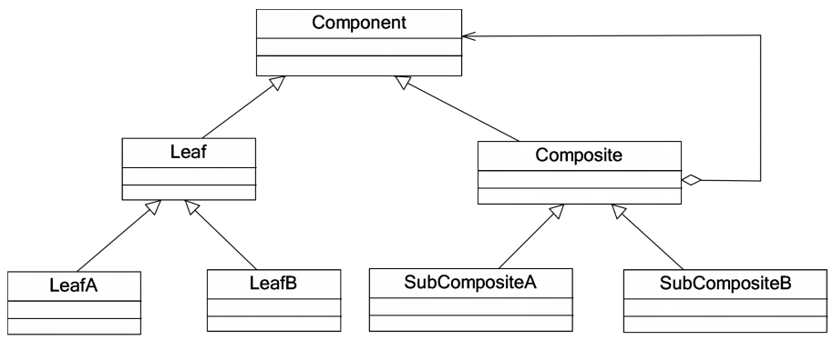
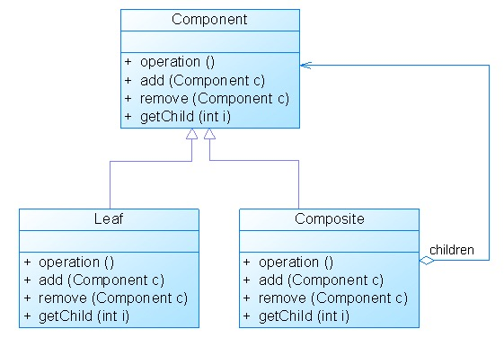
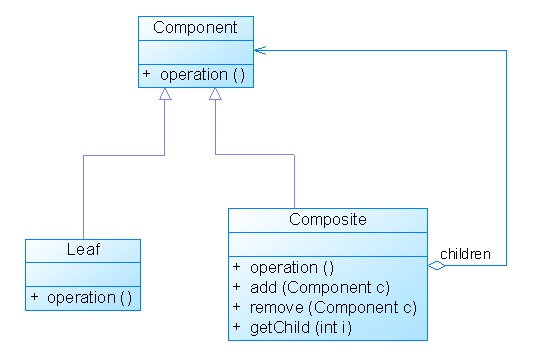
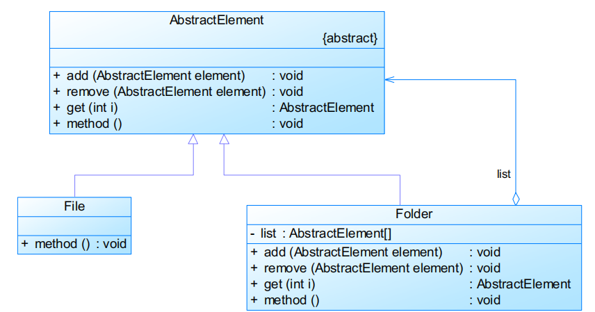
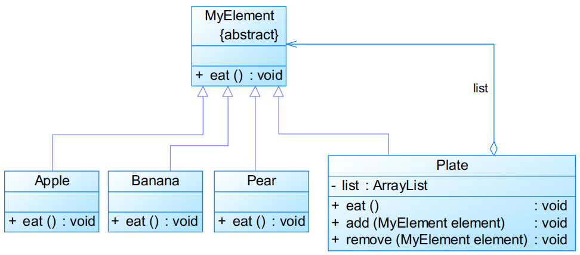

# 组合模式Composite Pattern

# 模式定义

- 又称整体-部分模式

组合多个对象形成**树形结构**以表示“整体-部分”的结构层次

- 组合模式对单个对象（即叶子对象）和组合对象（即容器对象）的使用具有一致性
- 对象结构型模式

# 模式结构

编辑

- Component：抽象构件
- Leaf：叶子构件
- Composite：容器构件
- Client：客户类

组合模式定义了一个抽象构件类，它既可以代表叶子，又可以代表容器

- 客户端针对该抽象构件类进行编程，无须知道它到底表示的是叶子还是容器，可以对其进行统一处理
- 容器对象与抽象构件类之间还建立一个聚合关联关系，在容器对象中既可以包含叶子，也可以包含容器，以此实现递归组合，形成一个树形结构
- Component定义如果只包含operation函数，则称为安全组合模式，否则称为透明组合模式

抽象构件角色代码

```java
public abstract class Component {

    public abstract void add(Component c);

    public abstract void remove(Component c);

    public abstract Component getChild(int i);

    public abstract void operation();

}
```


叶子构件角色代码

```java
public class Leaf extends Component {

    public void add(Component c) {
        //异常处理或错误提示
    }

    public void remove(Component c) {
        //异常处理或错误提示
    }

    public Component getChild(int i) {
        //异常处理或错误提示
    }

    public void operation() {
        //实现代码
    } 

}
```


容器构件角色代码

```java
public class Composite extends Component {
    private ArrayList list = new ArrayList();

    public void add(Component c) {
        list.add(c);
    }

    public void remove(Component c) {
        list.remove(c);
    }

    public Component getChild(int i) {
        (Component)list.get(i);
    }

    public void operation() {
        for(Object obj:list) {
            ((Component)obj).operation();
        }
    }
 
}
```


## 扩展组合模式

编辑

## 透明组合模式

编辑

Component定义包含operation函数和其他工具函数

## 安全组合模式

编辑

Component定义只包含operation函数

# 实例

实例一：文件系统

编辑

实例二：水果盘

在水果盘（Plate）中有一些水果，如苹果（Apple）、香蕉（Banana）、梨子（Pear），当然大水果盘中还可以有小水果盘，现需要对盘中的水果进行遍历（吃），当然如果对一个水果盘执行“吃”方法，实际上就是吃其中的水果。使用组合模式模拟该场景。

编辑

# 模式分析

- 优点 
  - 可以清楚地定义分层次的复杂对象，表示对象的全部或部分层次，使得增加新构件也更容易
  - 客户端调用简单，客户端可以一致的使用组合结构或其中单个对象
  - 定义了包含叶子对象和容器对象的类层次结构，叶子对象可以被组合成更复杂的容器对象，而这个容器对象又可以被组合，这样不断递归下去，可以形成复杂的树形结构
  - 更容易在组合体内加入对象构件，客户端不必因为加入了新的对象构件而更改原有代码
- 缺点
  - 使设计变得更加抽象，对象的业务规则如果很复杂，则实现组合模式具有很大挑战性，而且不是所有的方法都与叶子对象子类都有关联
  - 增加新构件时可能会产生一些问题，很难对容器中的构件类型进行限制

## 适用环境

- 需要表示一个对象整体或部分层次，在具有整体和部分的层次结构中，希望通过一种方式忽略整体与部分的差异，可以一致地对待它们
- 让客户能够忽略不同对象层次的变化，客户端可以针对抽象构件编程，无须关心对象层次结构的细节
- 对象的结构是动态的并且复杂程度不一样，但客户需要一致地处理它们