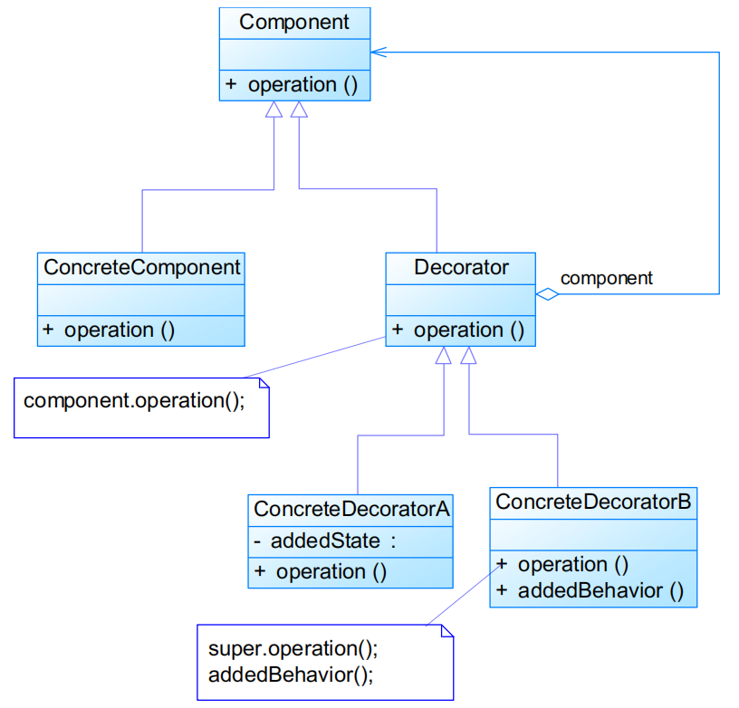
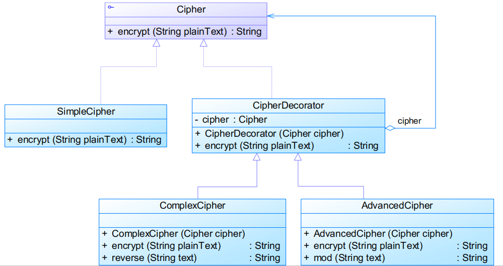

# 装饰模式Decorator Pattern

## 模式定义

动态地给对象增加额外的职责

- <font color=#956FE7>**对象结构型模式**</font>

## 模式结构



- Component：抽象构件
- ConcreteComponent：具体构件
- Decorator：抽象装饰类
- ConcreteDecorator：具体装饰类

抽象装饰类代码

```java
public class Decorator extends Component {
    private Component component;
    
    public Decorator(Component component) {
        this.component = component;
    }

    public void operation() {
        component.operation();
    }

}
```

具体装饰类代码

```java
public class ConcreteDecorator extends Decorator {
    Object addedState; // 新增属性

    public ConcreteDecorator(Component component) {
        super(component);
    }

    public void operation() {
        super.operation();
        addedBehavior();
    }

    // 新增方法
    public void addedBehavior() {
        // do something
    }

}
```

- 一个装饰类的接口必须与被装饰类的接口保持相同 
  - 对于客户端来说无论是装饰之前的对象还是装饰之后的对象都可以一致对待
- 尽量保持具体构件类Component作为一个“轻”类 
  - 不要把太多的逻辑和状态放在具体构件类中可以通过装饰类对其进行扩展

### 简化装饰模式

如果只有一个具体构件类而没有抽象构件类，那么抽象装饰类可以作为具体构件类的直接子类

### 透明装饰模式

客户端完全面向抽象编程

- 客户端不声明具体构件类型和具体装饰类型，而全部声明为抽象构件类型

### 半透明装饰模式

客户端面向**抽象构件类型**和**具体装饰类型**编程

- 客户端可以声明具体装饰者类型对象，调用具体装饰者中新增方法

## 实例

某系统提供了一个数据加密功能，可以对字符串进行加密。最简单的加密算法通过对字母进行移位来实现，同时还提供了稍复杂的逆向输出加密，还提供了更为高级的求模加密。用户先使用最简单的加密算法对字符串进行加密，如果觉得还不够可以对加密之后的结果使用其他加密算法进行二次加密，当然也可以进行第三次加密。现使用装饰模式设计该多重加密系统。



## 模式分析

- <font color=#1C7331>**优点**</font>
  - 提供比继承更多的灵活性以扩展对象功能
  - 通过配置文件在运行时选择不同的装饰器以动态扩展对象功能
  - 具体构件类和具体装饰类可以独立变化 	
    - <font color=#1C7331>**符合开闭原则**</font>
- <font color=#BE191C>**缺点**</font>
  - 增加系统的复杂度
  - 比继承更加易于出错，排错困难

### 适用环境

- 在不影响其他对象的情况下，以动态、透明的方式给单个对象添加职责
- 需要动态地给一个对象增加功能，这些功能也可以动态地被撤销
- 当不能采用继承的方式对系统进行扩充或者采用继承不利于系统扩展和维护时 
  - 系统中存在大量独立的扩展，为支持每一种组合将产生大量的子类，使得子类数目呈爆炸性增长
  - 不能继承的类定义（如final类）