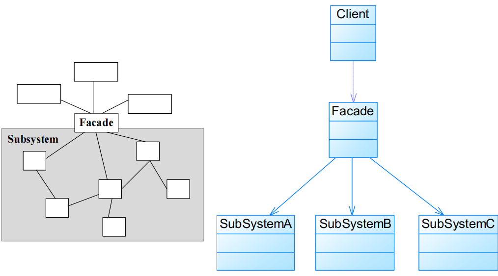

# 外观模式Facade Pattern

## 模式定义

外部与一个子系统的通信必须通过一个统一的外观对象进行，为子系统中的一组接口提供一个一致的界面

- 又称为门面模式
- <font color=#956FE7>**对象结构型模式**</font>

## 模式结构



- Facade：外观角色 
  - 在很多情况下为了节约系统资源，一般将外观类设计为单例类
- SubSystem：子系统角色

外观角色代码

```java
public class Facade {
    private SubSystemA obj1 = new SubSystemA();
    private SubSystemB obj2 = new SubSystemB();
    private SubSystemC obj3 = new SubSystemC();

    public void method() {
        obj1.method();
        obj2.method();
        obj3.method();
    }

}
```

### 引入抽象外观类

客户端针对抽象外观类进行编程

对于新的业务需求，不修改原有外观类，而对应增加一个新的具体外观类，由新的具体外观类来关联新的子系统对象，同时通过修改配置文件来达到不修改源代码并更换外观类的目的


## 模式分析

- <font color=#1C7331>优点</font>
  - 对客户屏蔽子系统组件，减少了客户处理的对象数目并使得子系统使用起来更加容易
  - 客户代码将变得很简单，与之关联的对象也很少
  - 实现了子系统与客户之间的松耦合关系，这使得子系统的组件变化不会影响到调用它的客户类，只需要调整外观类即可 	
    - <font color=#1C7331>**体现迪米特法则**</font>
  - 降低了大型软件系统中的编译依赖性，并简化了系统在不同平台之间的移植过程 	
    - 编译一个子系统一般不需要编译所有其他的子系统
    - 一个子系统的修改对其他子系统没有任何影响，而且子系统内部变化也不会影响到外观对象
  - 只是提供了一个访问子系统的统一入口，并不影响用户直接使用子系统类。
  
- <font color=#BE191C>缺点</font>
  - 不能很好地限制客户使用子系统类，如果对客户访问子系统类做太多的限制则减少了可变性和灵活性
  
  - **在不引入抽象外观类的情况下**，增加新的子系统可能需要修改外观类或客户端的源代码 	
  - <font color=#BE191C>**违背开闭原则**</font>

### 适用环境

- 当要为一个复杂子系统提供一个简单接口时可以使用外观模式。该接口可以满足大多数用户的需求，而且用户也可以越过外观类直接访问子系统。
- 客户程序与多个子系统之间存在很大的依赖性。引入外观类将子系统与客户以及其他子系统解耦，可以提高子系统的独立性和可移植性。
- 在层次化结构中，可以使用外观模式定义系统中每一层的入口，层与层之间不直接产生联系，而通过外观类建立联系，降低层之间的耦合度