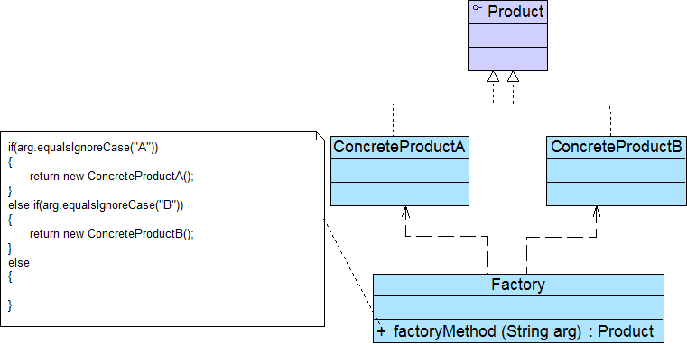
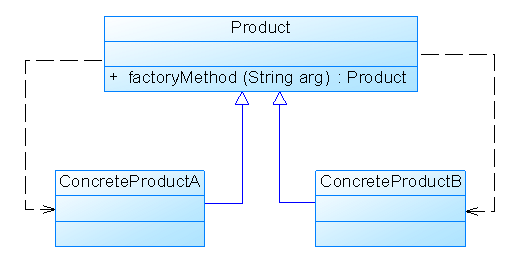
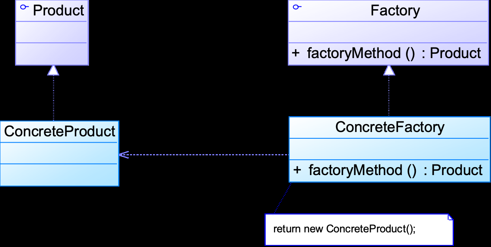
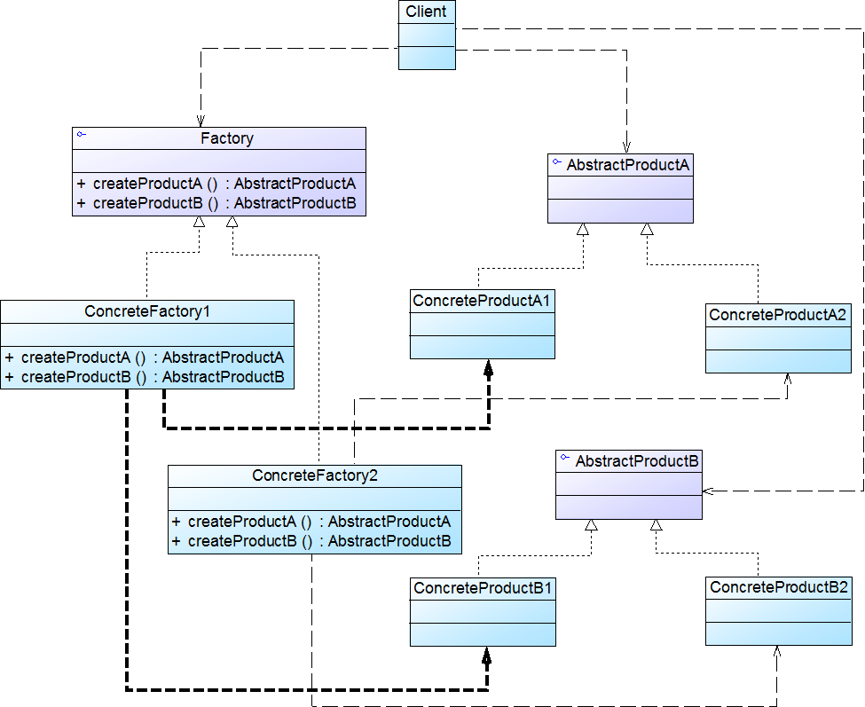

# 工厂模式Factory Pattern

## 简单工厂模式（Simple Factory Pattern）

- 又称为静态工厂方法模式（Static Factory Method Pattern）
- <font color=#956FE7>**类创建型模式**</font>

根据参数的不同返回不同类的实例

- <font color=#4DA8EE>**专门定义一个类来负责创建其他类的实例**</font>
- 被创建的实例通常都具有共同的父类

### 模式结构



- Factory：工厂角色

- Product：抽象产品角色

- ConcreteProduct：具体产品角色

- 简化简单工厂模式：工厂角色由抽象产品角色扮演，即把静态工厂方法写到抽象产品类中 

  

### 模式分析

- <font color=#1C7331>优点</font>
  - 将对象的创建和对象本身业务处理分离可以<font color=#1C7331>**降低系统的耦合度**</font>，使得两者修改起来都相对容易
  - 在调用工厂类的工厂方法时，由于工厂方法是静态方法，使用起来很方便，可通过类名直接调用，而且只需要传入一个简单的参数即可 	
    - 客户端无须知道所创建的具体产品类的类名，只需要知道具体产品类所对应的参数即可，对于一些复杂的类名，通过简单工厂模式可以减少使用者的记忆量
  - 在实际开发中，还可以在调用时将所传入的参数保存在XML等格式的配置文件中，修改参数时无须修改任何Java源代码 	
    - 通过引入配置文件，可以在不修改任何客户端代码的情况下更换和增加新的具体产品类，在一定程度上提高了系统的灵活性
  
- <font color=#BE191C>缺点</font>
  - 工厂类集中了所有产品创建逻辑，<font color=#BE191C>职责相对过重</font>
  
    - 增加新的产品需要修改工厂类的判断逻辑
    - 一旦不能正常工作，整个系统都要受到影响
    - <font color=#BE191C>**与开闭原则相违背**</font>
    
  - 由于使用了静态工厂方法，造成<font color=#BE191C>工厂角色无法形成基于继承的等级结构</font>

简单工厂模式的要点在于：当你需要什么，只需要传入一个正确的参数，就可以获取你所需要的对象，而无须知道其创建细节

### 适用环境

- 工厂类负责创建的对象比较少
- 客户端只知道传入工厂类的参数，对于如何创建对象不关心

## 工厂模式（Factory Pattern）

- 又称为工厂方法模式（Factory Method Pattern）、虚拟构造器模式（Virtual Constructor Pattern）、多态工厂模式（Polymorphic Factory Pattern）
- <font color=#956FE7>**类创建型模式**</font>

工厂<font color=#FF9900>**父类**</font>负责定义创建产品对象的公共<font color=#FF9900>**接口**</font>，而工厂<font color=#FF9900>**子类**</font>则负责生成具体的产品<font color=#FF9900>**对象**</font>

### **模式结构**



- 将产品类的实例化操作延迟到工厂子类中完成，即通过工厂子类来确定究竟应该实例化哪一个具体产品类
- <font color=#956FE7>**在定义工厂和产品时都必须使用抽象层**</font>，如果需要更换产品类，只需要更换对应的工厂即可

### 模式分析

- <font color=#1C7331>优点</font>
  - 核心的工厂类不再负责所有产品的创建，而是将具体创建工作交给子类去做 	
    - 用户只需要关心所需产品对应的工厂，无须关心创建细节，甚至无须知道具体产品类的类名
    - 工厂可以自主确定创建何种产品对象，而如何创建这个对象的细节则完全封装在具体工厂内部
  - 工厂方法模式可以允许系统在不修改工厂角色的情况下引进新产品 	
    - <font color=#1C7331>**符合开闭原则**</font>
  - 在实际的应用开发中，一般将具体工厂类的实例化过程进行改进，不直接使用new关键字来创建对象，而是将具体类的类名写入配置文件中，再通过Java的反射机制，读取XML格式的配置文件，根据存储在XML文件中的类名字符串生成对象
- <font color=#BE191C>缺点</font>
  - 在添加新产品时，需要编写新的具体产品类，而且还要提供与之对应的具体工厂类，系统中类的个数将成对增加，在一定程度上增加了系统的复杂度，会给系统带来一些额外的开销
  - 引入抽象层增加了系统的抽象性和理解难度
  - 在实现时可能需要用到DOM、反射等技术，增加了系统的实现难度

### 适用环境

- 一个类不知道它所需要的对象的类
- 一个类通过其子类来指定创建哪个对象
- 将创建对象的任务委托给多个工厂子类中的某一个，客户端在使用时可以无须关心是哪一个工厂子类创建产品子类，需要时再动态指定

**产品等级结构**

产品的继承结构

- 如一个抽象类是电视机，其子类有海尔电视机、海信电视机、TCL电视机，则抽象电视机与具体品牌的电视机之间构成了一个产品等级结构

**产品族**

由同一个工厂生产的，位于不同产品等级结构中的一组产品

- 如海尔电器工厂生产的海尔电视机、海尔电冰箱，海尔电视机位于电视机产品等级结构中，海尔电冰箱位于电冰箱产品等级结构中

## 抽象工厂模式（Abstract Factory Pattern）

- 又称为Kit模式
- <font color=#956FE7>**对象创建型模式**</font>

工厂所需生产的具体产品是多个位于不同产品等级结构中属于不同类型的具体产品

### 模式结构



- AbstractFactory：抽象工厂
- ConcreteFactory：具体工厂
- AbstractProduct：抽象产品
- Product：具体产品

抽象工厂类的典型代码如下

```java
public abstract class AbstractFactory {
    public abstract AbstractProductA createProductA();
    public abstract AbstractProductB createProductB();
}
```

具体工厂类的典型代码如下

```java
public class ConcreteFactory1 extends AbstractFactory {
    public AbstractProductA createProductA() {
        return new ConcreteProductA1();
    }

    public AbstractProductB createProductB() {
        return new ConcreteProductB1();
    } 
}
```

### 模式分析

- <font color=#1C7331>优点</font>
  - 抽象工厂模式隔离了具体类的生成，使得客户并不需要知道什么被创建、
  - 只需改变具体工厂的实例，就可以在某种程度上改变整个软件系统的行为
  - 可以实现高内聚低耦合的设计目的
  - 增加新的具体工厂和产品族很方便，无须修改已有系统
    - <font color=#1C7331>**符合开闭原则**</font>
- <font color=#BE191C>缺点</font>
  - 难以扩展抽象工厂来生产新种类的产品
  - <font color=#BE191C>开闭原则的倾斜性</font>
    - 增加新的工厂和产品族容易 		
      - 只需要对应增加一个新的具体工厂即可，对已有代码无须做任何修改
      - 符合开闭原则
    - 增加新的产品等级结构麻烦
      - 需要修改所有的工厂角色，包括抽象工厂类，在所有的工厂类中都需要增加生 产新产品的方法
      - 不符合开闭原则

### 适用环境

- 一个系统不应当依赖于产品类实例如何被创建、组合和表达的细节
- 系统中有多于一个的产品族，而每次只使用其中某一产品族
- 属于同一个产品族的产品将在一起使用
- 所有的产品以同样的接口出现，从而使客户端不依赖于具体实现