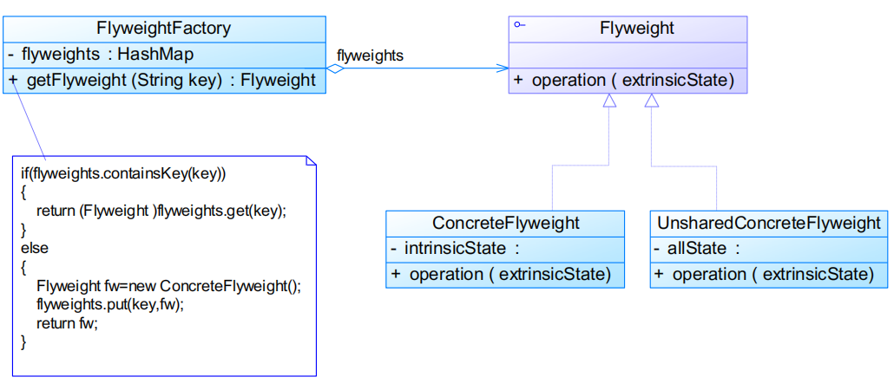
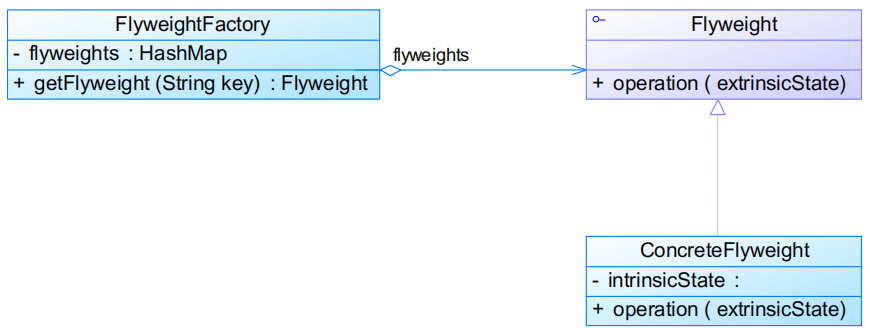
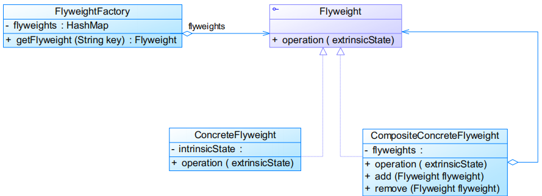

# 享元模式Flyweight Pattern

# 模式定义

运用共享技术有效地支持大量细粒度对象的复用，系统只使用少量的对象，而这些对象都很相似，状态变化很小，可以实现对象的多次复用

- 又称轻量级模式
- **对象结构型模式**

# 模式结构

编辑

- Flyweight：抽象享元类
- ConcreteFlyweight：具体享元类
- UnsharedConcreteFlyweight：非共享具体享元类
- FlyweightFactory：享元工厂类 
  - 提供一个用于存储享元对象的享元池
  - 用户需要对象时，首先从享元池中获取 	
    - 如果享元池中不存在，则创建一个新的享元对象返回给用户，并在享元池中保存该新增对象

享元类代码

```java
public class Flyweight {
    // 内部状态作为成员属性
    private String intrinsicState;

    public Flyweight(String intrinsicState) {
        this.intrinsicState = intrinsicState;
    }

    public void operation(String extrinsicState) {
        ......
    }

}
```


- 内部状态 
  - 存储在享元对象内部并且不会随环境改变而改变的状态
  - 可以共享
- 外部状态 
  - 随环境改变而改变的状态
  - 不可以共享
  - 必须由客户端保存，并在享元对象被创建之后，在需要使用的时候再传入到享元对象内部
  - 一个外部状态与另一个外部状态之间是相互独立的

享元工厂类代码

```java
public class FlyweightFactory {
    private HashMap flyweights = new HashMap();

    public Flyweight getFlyweight(String key) {
        if(flyweights.containsKey(key)) {
            return (Flyweight)flyweights.get(key);
        }
        else {
            Flyweight fw = new ConcreteFlyweight();
            flyweights.put(key,fw);
            return fw;
        }
    }

}
```


## 单纯享元模式

所有的享元对象都是可以共享的，即所有抽象享元类的子类都可共享，不存在非共享具体享元类

编辑

## 复合享元模式

将一些单纯享元使用组合模式加以组合形成复合享元对象

- 本身不能共享
- 可以分解成可以共享的单纯享元对象

编辑

## 与其他模式联用

- 在享元模式的享元工厂类中通常提供一个静态的工厂方法用于返回享元对象，使用简单工厂模式来生成享元对象
- 在一个系统中，通常只有唯一一个享元工厂，因此享元工厂类可以使用单例模式进行设计
- 享元模式可以结合组合模式形成复合享元模式，统一对享元对象设置外部状态

# 模式分析

- 优点
  - 极大减少内存中对象的数量，使得相同对象或相似对象在内存中只保存一份
  - 享元模式的外部状态相对独立，而且不会影响其内部状态，从而使得享元对象可以在不同的环境中被共享
- 缺点
  - 享元模式使得系统更加复杂，需要分离出内部状态和外部状态，这使得程序的逻辑复杂化
  - 为了使对象可以共享，享元模式需要将享元对象的状态外部化，而读取外部状态使得运行时间变长

## 适用环境

- 一个系统有大量相同或者相似的对象
- 对象的大部分状态都可以外部化
- 多次重复使用享元对象