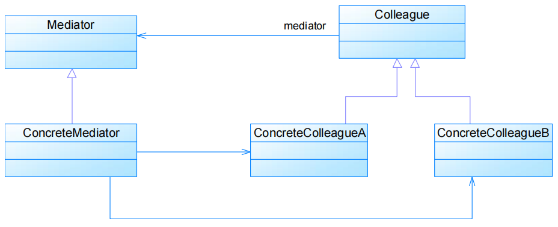
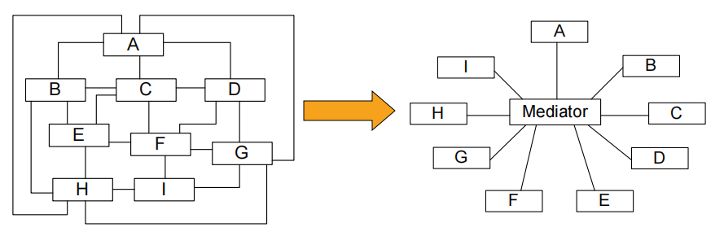
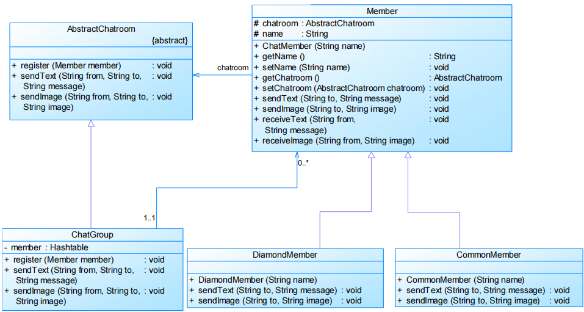

# 中介者模式Mediator Pattern

# 模式定义

- 又称为调停者模式

用一个**中介对象**来封装一系列的**对象交互**，中介者使各对象不需要显式地相互引用，从而使其耦合松散，而且可以独立地改变它们之间的交互

- 对象行为型模式

# 模式结构

编辑

- Mediator：抽象中介者
- ConcreteMediator：具体中介者
- Colleague：抽象同事类
- ConcreteColleague：具体同事类

中介者模式可以使对象之间的关系数量急剧减少

- 将系统的网状结构变成以中介者为中心的星形结构编辑
- **迪米特法则的典型应用**

中介者承担两方面的职责

- 中转作用（结构性）：通过中介者提供的中转作用，各个同事对象就不再需要显式引用其他同事 
  - 当需要和其他同事进行通信时，通过中介者即可
- 协调作用（行为性）：中介者可以更进一步的对同事之间的关系进行封装 
  - 同事可以一致地和中介者进行交互，而不需要指明中介者需要具体怎么做
  - 中介者根据封装在自身内部的协调逻辑，对同事的请求进行进一步处理，将同事成员之间的关系行为进行分离和封装

抽象中介者类代码

```java
public abstract class Mediator {
    protected ArrayList<> colleagues;

    public void register(Colleague colleague) {
        colleagues.add(colleague);
    }

    public abstract void operation();

}
```


具体中介者类代码

```java
public class ConcreteMediator extends Mediator {

    public void operation() {
        ......
        ((Colleague)(colleagues.get(0))).method1();
        ......
    }

}
```


抽象同事类代码

```java
public abstract class Colleague {
    protected Mediator mediator;

    public Colleague(Mediator mediator) {
        this.mediator = mediator;
    }

    public abstract void method1();

    public abstract void method2();

}
```


具体同事类代码

```java
public class ConcreteColleague extends Colleague {

    public ConcreteColleague(Mediator mediator) {
        super(mediator);
    }

    public void method1() {
        ......
    }

    public void method2() {
        mediator.operation1();
    }

}
```


# 实例

实例：虚拟聊天室
 某论坛系统欲增加一个虚拟聊天室，允许论坛会员通过该聊天室进行信息交流，普通会员（CommonMember）可以给其他会员发送文本信息，钻石会员（DiamondMember）既可以给其他会员发送文本信息，还可以发送图片信息。该聊天室可以对不雅字符进行过滤，如“日”等字符；还可以对发送的图片大小进行控制。用中介者模式设计该虚拟聊天室。

编辑

# 模式分析

- 优点
  - 简化了对象之间的交互
  - 将各同事解耦
  - 减少子类生成
  - 可以简化各同事类的设计和实现
- 缺点
  - 在具体中介者类中包含了同事之间的交互细节，**可能会导致具体中介者类非常复杂**，使得系统难以维护

## 适用环境

- 系统中对象之间存在复杂的引用关系，产生的相互依赖关系结构混乱且难以理解
- 一个对象由于引用了其他很多对象并且直接和这些对象通信，导致难以复用该对象
- 想通过一个中间类来封装多个类中的行为，而又不想生成太多的子类