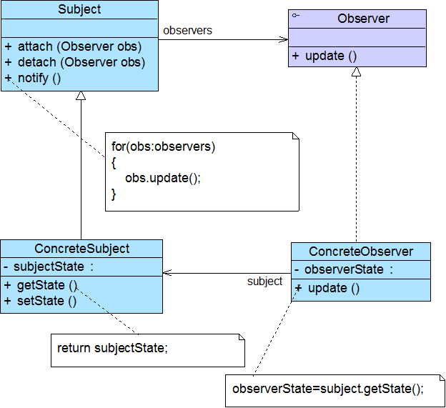
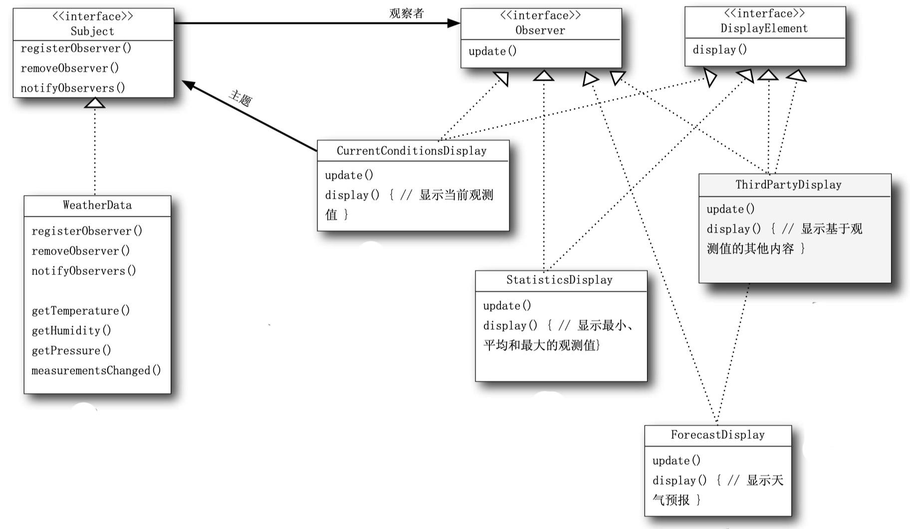

# 观察者模式Observer Pattern

# 模式定义

- 又叫发布-订阅（Publish/Subscribe）模式、模型-视图（Model/View）模式、源-监听器（Source/Listener）模式、从属者（Dependents）模式
- 是对象行为型模式

定义对象间的一种一对多依赖关系，使得每当一个对象（目标）状态发生改变时，其相关依赖对象（观察者）皆得到通知并自动更新状态

- **松耦合关系**

# 模式结构

编辑

# 实例

WeatherData类具有getter方法，可以取得三个测量值：温度、湿度与气压。当新的测量数据备妥时，measurementsChanged()方法就会被调用。需要实现三个使用天气数据的布告板：“目前状况” 

布告、 “气象统计”布告、 “天气预报”布告。 一旦WeatherData有新测量，这些布告必须马上更新。此系统必须可扩展，让其他开发人员建立定制的布告板，用户可以随心所欲地添加或删除任何布告板。

编辑

```java
public interface Subject {
    public void registerObserver(Observer o);

    public void removeObserver(Observer o);

    public void notifyObservers();
}
```


```java
public interface Observer {
    public void update(float temp, float humidity, float pressure);
}
```


```java
public interface DisplayElement {
    public void display();
}
```


```java
public class CurrentConditionsDisplay implements Observer, DisplayElement {
    private float temperature;
    private float humidity;
    private Subject weatherData;

    public CurrentConditionsDisplay(Subject weatherData) {
        this.weatherData = weatherData;
        weatherData.registerObserver(this);
    }

    public void update(float temperature, float humidity, float pressure) {
        this.temperature = temperature;
        this.humidity= humidity;
        display();
    }

    public void display() {
        System.out.println("Current conditions: " + temperature + "F degrees and" + humidity + "% humidity");
    }

}
```


# 模式分析

- 优点
  - 可以实现表示层和数据逻辑层的分离，并定义了稳定的消息更新传递机制，抽象了更新接口，使得可以有各种各样不同的表示层作为具体观察者角色
  - 在观察目标和观察者之间建立一个抽象的耦合
  - 支持广播通信
  - **符合开闭原则**
- 缺点
  - 如果一个观察目标对象有很多直接和间接的观察者的话，将所有的观察者都通知到会花费很多时间
  - 如果在观察者和观察目标之间有**循环依赖**的话，观察目标会触发它们之间进行循环调用，可能导致系统崩溃
  - 没有相应的机制让观察者知道所观察的目标对象是怎么发生变化的，而仅仅只是知道观察目标发生了变化

# 适用环境

- 一个抽象模型有两个方面，其中一个方面依赖于另一个方面
  - 将这些方面封装在独立的对象中使它们可以各自独立地改变和复用
- 一个对象的改变将导致其他一个或多个对象也发生改变，而不知道具体有多少对象将发生改变
  - 可以降低对象之间的耦合度
- 一个对象必须通知其他对象，而并不知道这些对象是谁