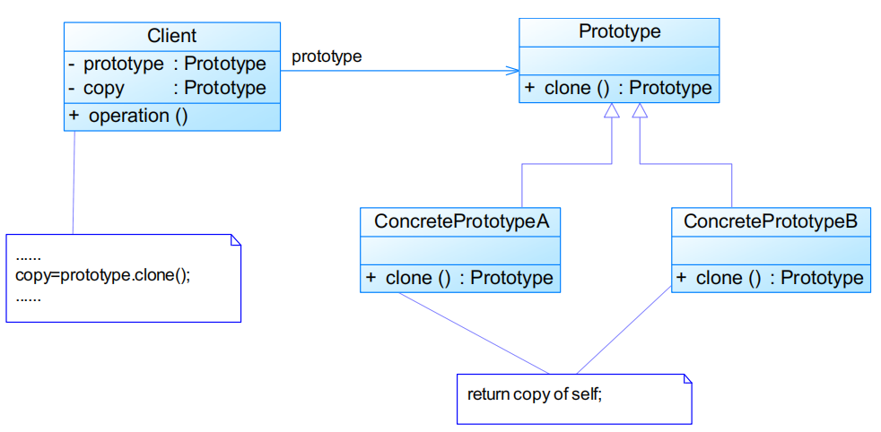
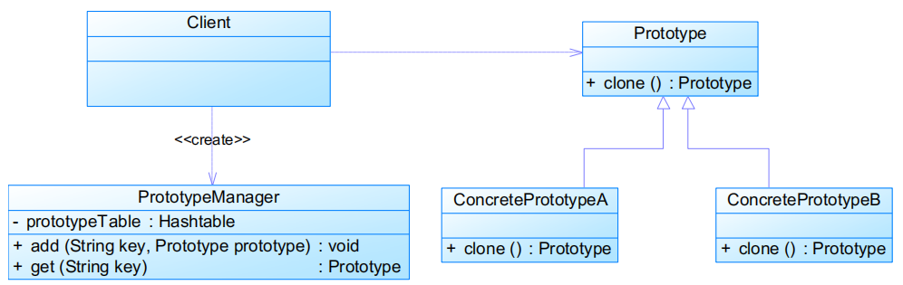

# 原型模式Prototype Pattern

# 模式定义

用原型实例指定创建对象的种类，并且**通过复制这些原型创建新的对象**，其允许一个对象再创建
 另外一个可定制的对象，无须知道任何创建的细节

- **对象创建型模式**

基本工作原理是通过将一个原型对象传给那个要发动创建的对象，这个要发动创建的对象通过请求原型对象拷贝原型自己来实现创建过程

# 模式结构

编辑

- Prototype：抽象原型类 
  - 在Java中可以直接使用Object，其提供clone()方法实现对象的克隆 	
    - 一般而言，clone()方法满足： 		
      - 对任何的对象x，都有x.clone() !=x，即克隆对象与原对象不是同一个对象
      - 对任何的对象x，都有x.clone().getClass() == x.getClass()，即克隆对象与原对象的类型一样
      - 如果对象x的equals()方法定义恰当，那么有x.clone().equals(x) == true
- ConcretePrototype：具体原型类 
  - 能够实现克隆的Java类必须实现一个标识接口Cloneable，表示这个Java类支持复制
  - 如果一个类没有实现这个接口但是调用了clone()方法，Java编译器将抛出一个CloneNotSupportedException异常
- Client：客户类

```java
public class PrototypeDemo implements Cloneable {
    ......
    public Object clone() {
        Object object = null;
        try {
            object = super.clone();
        } catch (CloneNotSupportedException exception) {
            System.err.println("Not support cloneable");
        }
        return object;
    }
    ......

}
```


- 深克隆 
  - 使用原型模式克隆对象时，其成员对象也克隆
- 浅克隆 
  - 使用原型模式克隆对象时，其成员对象不克隆

## 带原型管理器的原型模式

编辑

# 模式分析

- 优点
  - 当创建新的对象实例较为复杂时，使用原型模式可以简化对象的创建过程，通过一个已有实例可以提高新实例的创建效率
  - 可以动态增加或减少产品类
  - 原型模式提供了简化的创建结构
  - 可以使用深克隆的方式保存对象的状态
- 缺点
  - 需要为每一个类配备一个克隆方法，而且这个克隆方法需要对类的功能进行通盘考虑，对已有的类进行改造时可能修改其源代码 	
    - **违背开闭原则**
  - 在实现深克隆时需要编写较为复杂的代码

## 适用环境

- 创建新对象成本较大，新的对象可以通过原型模式对已有对象进行复制来获得 
  - 如果是相似对象，则可以对其属性稍作修改
- 如果系统要保存对象的状态，而对象的状态变化很小，或者对象本身占内存不大的时候，也可以使用原型模式配合备忘录模式来应用 
  - 相反，如果对象的状态变化很大，或者对象占用的内存很大，那么采用状态模式会比原型模式更好
- 需要避免使用分层次的工厂类来创建分层次的对象，并且类的实例对象只有一个或很少的几个组合状态，通过复制原型对象得到新实例可能比使用构造函数创建一个新实例更加方便。