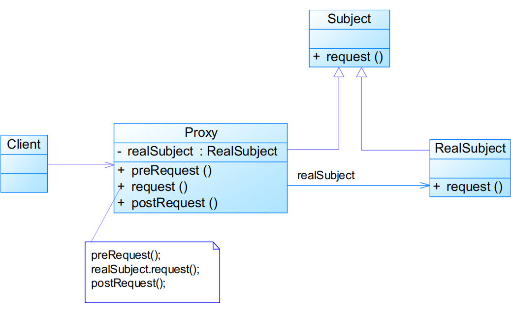

# 代理模式

#  模式定义

给某一个对象提供一个代理，并由代理对象控制对原对象的引用

- **对象结构型模式**

# 模式结构

编辑

- Subject：抽象主题角色
- Proxy：代理主题角色
- RealSubject：真实主题角色

代理类实现代码

```java
public class Proxy implements Subject {
    private RealSubject realSubject = new RealSubject();

    public void preRequest() {
        ...
    }

    public void request() {
        preRequest();
        realSubject.request();
        postRequest();
    }

    public void postRequest() {
        ...
    }

}
```

