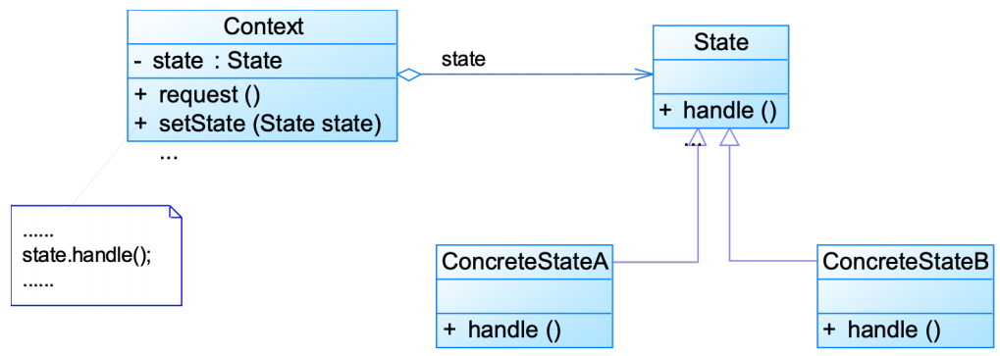

# 状态模式State Pattern

# 模式定义

允许一个对象在**其内部状态改变时改变它的行为**

- 又称状态对象（Objects for States）模式
- **对象行为型模式**

# 模式结构

编辑

- Context：环境类 
  - 拥有状态的对象，有时候可以充当状态管理器（State Manager）的角色，可以在环境中对状态进行切换操作
- State：抽象状态类
- ConcreteState：具体状态类 
  - 这些状态经常需要切换
  - 在不同的状态下对象的行为不同

在不同具体状态类中实现了不同状态的行为，包括各种状态之间的转换

# 模式分析

- 优点

  - 封装了转换规则
  - 枚举可能的状态 	
    - 在枚举状态之前需要确定状态种类
  - 将所有与某个状态有关的行为放到一个类中，并且可以方便地增加新的状态，只需要改变对象状态即可改变对象的行为
  - 允许状态转换逻辑与状态对象合成一体，而不是某一个巨大的条件语句块
  - 可以让多个环境对象共享一个状态对象，从而减少系统中对象的个数

- 缺点

  - 状态模式的使用必然会增加系统类和对象的个数

  - 状态模式的结构与实现都较为复杂，如果使用不当将导致程序结构和代码的混乱

  - 对于可以切换状态的状态模式，

    **增加新的状态类**

    需要修改那些负责状态转换的源代码，否则无法切换到新增状态，而且

    **修改某个状态类的行为**

    也需修改对应类的源代码 	

    - **违反开闭原则**

## 适用环境

- 对象的行为依赖于它的状态（属性）并且可以根据它的状态改变而改变它的相关行为
- 代码中包含大量与对象状态有关的条件语句，在这些条件语句中包含了对象的行为，而且这些条件对应于对象的各种状态 
  - 这些条件语句的出现，会导致代码的可维护性和灵活性变差，不能方便地增加和删除状态，使客户类与类库之间的耦合增强