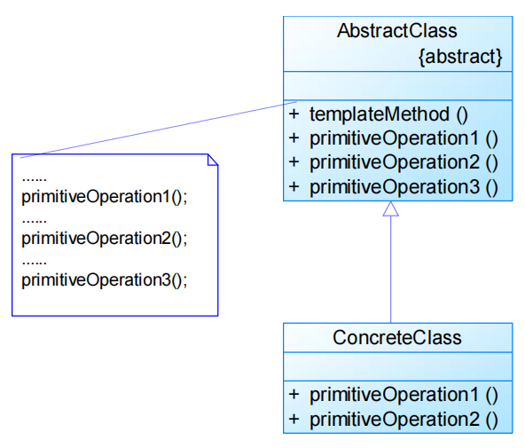
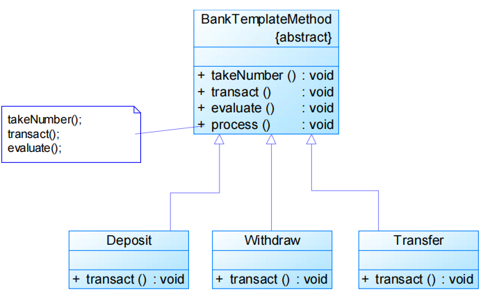
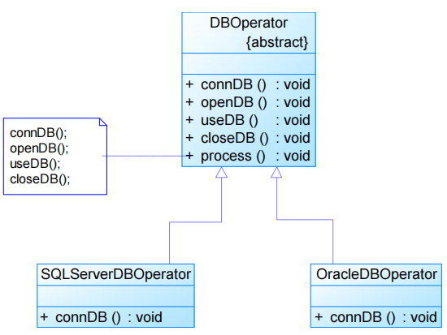

# 模板方法模式Template Method Pattern

# 模式定义

定义一个操作中算法的骨架，而将一些步骤延迟到子类中，模板方法使得子类可以不改变一个算法的结构即可重定义该算法的某些特定步骤

- **类行为型模式**

# 模式结构

编辑

- AbstractClass：抽象类
- ConcreteClass：具体子类

只有类之间的继承关系，没有对象关联关系

- 体现继承优势的模式之一

**好莱坞原则（Hollywood Principle）**

- Don‘t call us, we’ll call you.
- 子类不显式调用父类的方法，而是通过override父类的方法来实现某些具体的业务逻辑，**父类控制对子类的调用**

通过在子类中实现的**钩子方法**override父类钩子方法，对父类方法的执行进行约束，实现子类对父类行为的**反向控制**

- 基本方法（Primitive Method）：实现具体逻辑步骤的方法 

  - 抽象方法（Abstract Method）

  - 具体方法（Concrete Method）

  - **钩子方法**

    （Hook Method）：“挂钩”方法和空方法 	

    ```java
    ......
    
    public void template() {
        open();
        display();
        if(isPrint()) {
            print();
        }
    }
    
    // Hook Method
    public boolean isPrint() {
        return true;
    }
    
    ......
    ```

    

    - 钩子方法的引入使得子类可以控制父类的行为
    - 最简单的钩子方法就是空方法，也可以在钩子方法中定义一个默认的实现，如果子类不覆盖钩子方法，则执行父类的默认实现代码
    - 比较复杂一点的钩子方法可以对其他方法进行约束 		
      - 这种钩子方法通常返回一个boolean类型，即返回true或false，用来判断是否执行某一个基本方法

- 模板方法（Template Method）：汇总基本方法的方法

抽象类代码

```java
public abstract class AbstractClass {

    // 模板方法
    public void templateMethod() {
        primitiveOperation1();
        primitiveOperation2();
        primitiveOperation3();
    }

    // 基本方法—具体方法
    public void primitiveOperation1() {
        // do something
    }

    // 基本方法—抽象方法
    public abstract void primitiveOperation2();

    // 基本方法—钩子方法
    public void primitiveOperation3() {
        // do something
    }

}
```


具体子类代码

```java
public class ConcreteClass extends AbstractClass {

    public void primitiveOperation2() {
        // do something
    }

    public void primitiveOperation3() {
        // do something
    }

}
```


# 实例

实例一：银行业务办理流程
 在银行办理业务时，一般都包含几个基本步骤，首先需要取号排队，然后办理具体业务，最后需要对银行工作人员进行评分。无论具体业务是取款、存款还是转账，其基本流程都一样。用模板方法模式模拟银行业务办理流程。

编辑

实例二：数据库操作模板
 对数据库的操作一般包括连接、打开、使用、关闭等步骤，在数据库操作模板类中我们定义了connDB()、openDB()、useDB()、closeDB()四个方法分别对应这四个步骤。对于不同类型的数据库（如SQL Server和Oracle），其操作步骤都一致，只是连接数据库connDB()方法有所区别，使用模板方法模式对其进行设计。

编辑

# 模式分析

- 优点

  - 模板方法模式在一个类中抽象地定义算法，而由它的子类实现
     	细节的处理

  - 模板方法模式是一种代码复用的基本技术

  - 模板方法模式导致一种反向的控制结构（Hook Method），通过一个父类调用其

    ​		子类的操作，通过对子类的扩展增加新的行为 	

    - **符合开闭原则**

- 缺点

  - 每个不同的实现都需要定义一个子类，这会导致类的个数增加，系统更加庞大，设计也更加抽象 	
    - 但是更加符合“单一职责原则”，使得类的内聚性得以提高

## 适用环境

- 一次性实现一个算法的不变的部分，并将可变的行为留给子类来实现
- 各子类中公共的行为被提取出来并集中到一个公共父类中以避免代码重复
- 对一些复杂的算法进行分割，将其算法中固定不变的部分设计为模板方法和父类具体方法，而一些可以改变的细节由其子类来实现
- 控制子类的扩展