# 【操作系统笔记】CPU管理

 根本矛盾：CPU的高速计算与其他设备速度不匹配之间的矛盾

动机：CPU要等待时就去算其他事情，等完了再回来继续算

问题：CPU如何知道哪些事情是现在可算的？CPU如何知道等完了？CPU等完了怎么回来？所有需要做的事情都可以按上面办法组织吗？

# 进程

一个运行中的程序：进程 = 程序 + 执行状态 = 程序 + PCB

编辑

- 归根到底还是一个程序
- 是动态的程序 
  - CPU可以在进程间来回切换 	
    - 进程会开始、会暂停、会结束
    - 程序一般不会暂停
  - 为了切换出去后还能切换回来，能够接着刚刚的工作结果继续进行，需要保存离开的位置和离开的时候工作的环境 	
    - PCB进程控制块（Process Control Block）
    - 在OS眼中，进程就是PCB，OS只能通过PCB知道这里有一个进程
- 是资源分配的单元
- 特点 
  - 动态性
  - 并发性
  - 独立性

## 进程描述与组织

### PCB

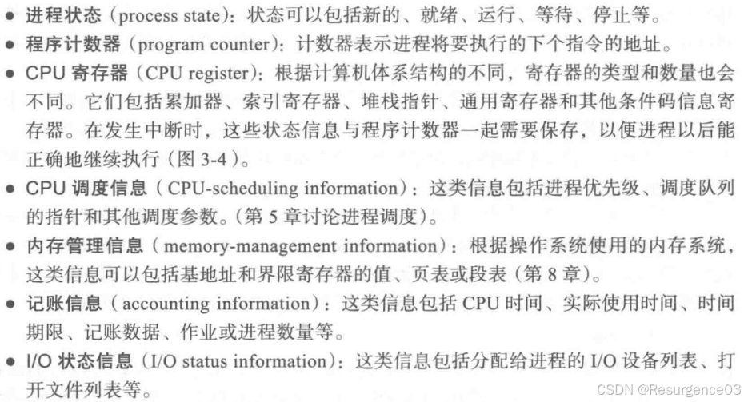编辑

### 进程状态

#### 进程状态图

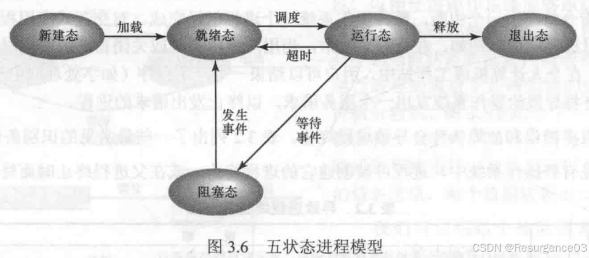编辑

#### 新建态

刚创建的进程

- 系统初始化
- 用户创建进程
- 父进程创建子进程

此时PCB已经创建（因此OS认为这是一个进程），但还未载入到内存中，不在可执行进程组中

#### 就绪态

进程获得了除CPU以外的所有执行所需资源

**→运行态**

- 调度进处理器，获得了CPU

#### 运行态

当前CPU运行的进程

**只有一个进程可以在运行态**

**→阻塞态**

- 等待请求的资源

**→就绪态**（被抢占CPU）

- 分配给该进程的时间片用完，调度出处理器
- 更高优先级进程就绪

#### 阻塞态

进程等待一个运行需要的事件

- 等待系统服务完成（如read()）
- 启动了一个不能马上完成的操作（如I/O）
- 需要的数据没有就绪（如I/O）

**→就绪态**

1. 等待的事件发生了
2. 与事件相关的另一进程或操作系统唤醒阻塞进程

换言之，阻塞的状态自己永远不会wakeup，只能通过其他进程或操作系统执行wakeup()

- sleep()：自身进入阻塞态
- wakeup(id）：PID为id的进程离开阻塞态

#### 退出态

OS从可执行组中释放的进程，可能自身运行完毕，也可能因其他原因被取消

- 执行完成
- 错误退出
- 严重的崩溃性错误（OS kill）
- 被其他进程kill 
  - 此时无所谓处于什么状态（阻塞/就绪）**都将转变为退出态**

#### 进程挂起

在内存中的进程被交换出内存，进入外存，减少内存占用

激活：挂起的反动作

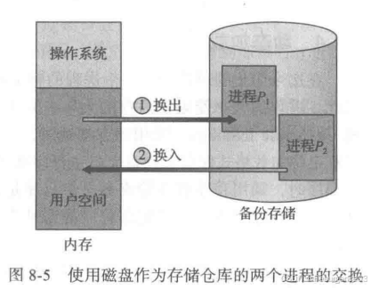编辑

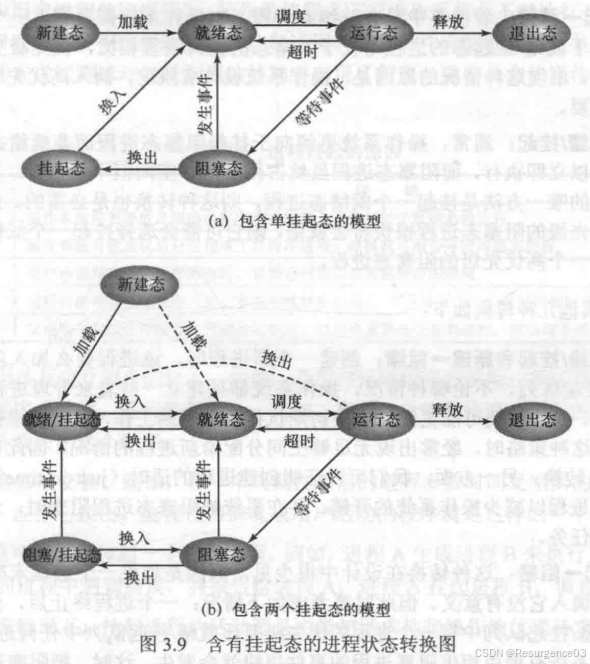编辑

##### 等待挂起态

进程在外存中等待一个运行需要的事件

**等待态→等待挂起态**

- 就绪进程需要更多内存

**等待挂起态→等待态**

- 内存有足够空间，且自身优先级足够高

##### 就绪挂起态

在外存中的进程获得了除CPU和内存以外的所有执行所需资源

**就绪态→就绪挂起态**

- 更高优先级等待（且OS认为无需进入等待队列，很快就可以就绪）进程

**就绪挂起态→就绪态**

- 当前没有就绪进程
- 进程优先级高于当前处于就绪态的进程

**运行态→就绪挂起态**

- 对于抢先式分时系统，出现更高优先级的就绪挂起态

**等待挂起态→就绪挂起态**

- 出现进程等待的事件

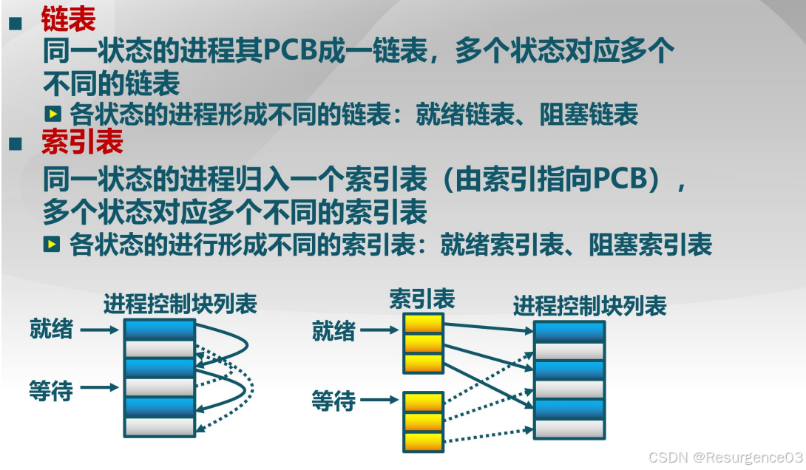编辑

### 状态队列

所有在一个状态中的进程按一个队列组织

- 就绪队列
- I/O阻塞队列

按某种调度顺序排列

一旦触发某事件，就从队列中取出一个线程切换状态

### 进程管理系统调用

#### fork()

```objectivec
int fork()
```


父进程调用fork()，把自身复制一份得到子进程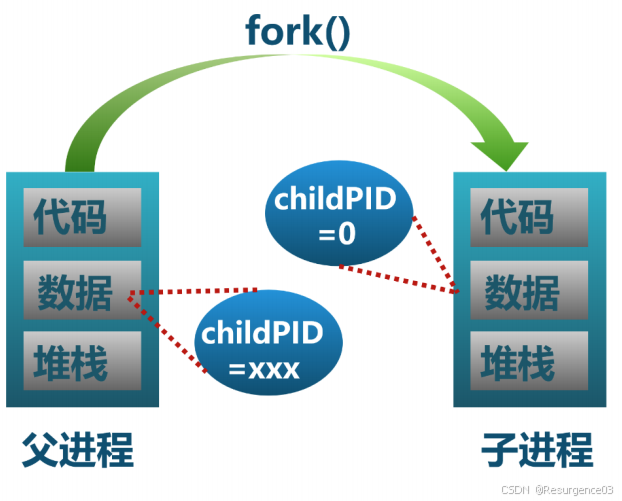编辑

- **复制父进程的所有变量和内存**

  - 父子进程间变量、内存、用户栈、映射表**内容均相同**，但**不是同一份**

- **复制除了系统调用返回值ax0外的所有寄存器**

  - 父子进程间

    **内核栈内容不同**

    - **PCB中PID、ax0不同**

- **父进程的fork()返回子进程的PID**

- **子进程的fork()返回0**

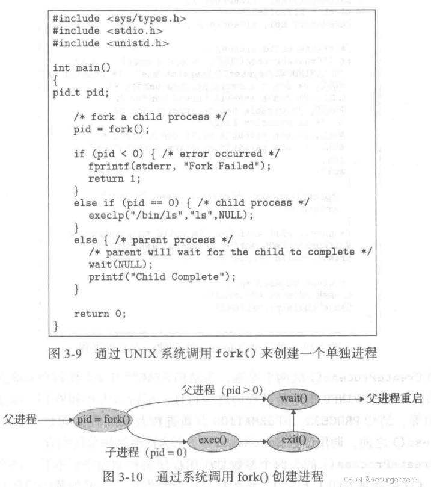编辑

##### 写时拷贝（copy-on-write）

一般调用fork()后立刻调用exec()，新建时对父进程的数据复制往往无用

COW策略：fork()时**只复制页表**，对数据都不复制

- 如果子进程试图修改页，此时才复制要修改的页

- 采用了COW策略的fork()开销

  只有两部分

  - 复制页表
  - 创建子进程的进程描述符

#### exec()

```objectivec
int exec(char* file) //用file重写当前进程
```


调用exec()的进程PID不会改变

#### exit()

终止当前进程

#### wait()

父进程等待子进程结束

- 如果其有子进程，就开始等待
- 一旦有子进程调用exit()，唤醒父进程，把exit()返回值作为wait()返回值

僵尸进程：已经执行exit()但父进程的wait()还没有返回的子进程

- 所有进程都将会处于暂时的僵尸进程中

孤儿进程：其父进程先于自身先exit()

- root进程会等待回收孤儿进程 
  - exit时检查父进程存活情况
  - 如果父进程已经没了，就置root为父进程

#### vfork()

直接挂起父进程，子进程接管父进程的地址空间

子进程exit()或exec()后回到父进程

## 进程调度

### 单CPU调度

- 协作式调度
  - 进程主动yield()放弃CPU使用权 	
    - 不需要操作系统的介入
  - 操作系统不会打断运行中的进程
- 抢占式调度
  - 进程被动放弃CPU使用权
  - 进程按时间片轮流使用CPU
  - 引入时间中断，操作系统可定时中断运行中的进程

**周转时间**：进程从创建初始化到运行结束的总时间

**就绪等待时间**：进程在就绪队列中的总时间

**响应时间**：提交请求到产生响应**（第一次进入CPU运行）**所花费的总时间

饥饿（无穷阻塞）：进程无法被调度进CPU执行（无限期等待）

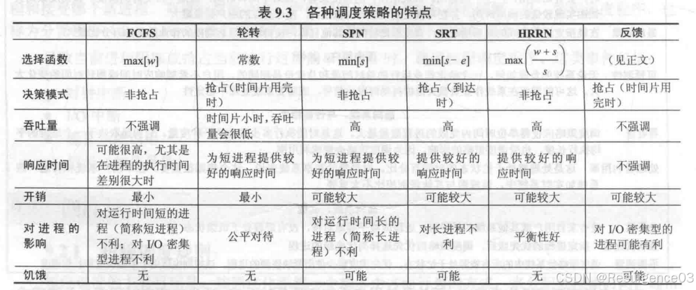编辑

#### 先来先服务FCFS算法

- 简单
- 平均等待时间波动大
  - 短作业可能排在长作业后面导致滞后执行
- I/O和CPU利用率低

#### 最短作业优先SJF算法

选择就绪队列中**（预期）执行时间最短**的进程先执行

- **不允许**抢占

- 当任务同时到达时

  ，

  平均周转时间最小

  （Greedy） 

  - 多处理器未必（小学奥数题的烙饼：两个锅烙三张饼的六个面，烙一面需要2分钟，最快6分钟烙完）
  - 不是同时到达的任务没有任何最优性

- 可能导致长进程饥饿

- 需要预测下一进程CPU运行时间

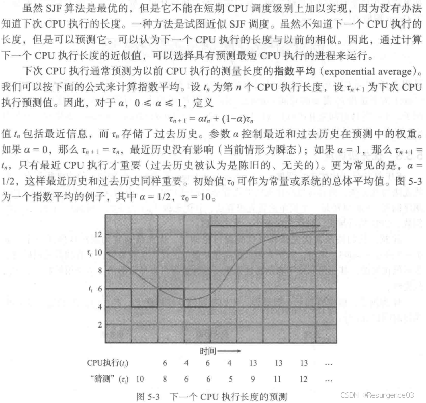编辑

#### 最短剩余时间算法SRT算法

- **允许**抢占
  - 如果有新的更短的进程就绪，就**转到这个更短的进程**执行
- 可能导致饥饿

#### 最高响应比优先HRRN算法

响应比**R = (w + s) / s** = w / s + 1

- w：就绪等待时间 
  - 在就绪队列中等的时间越长，R越大
- s：执行时间 
  - 作业越短，R越大

选择就绪队列中R最高的进程执行，**中途不切换**

#### 轮转调度RR算法

时间分片，使平均响应时间最小

时间片结束后按FCFS选择下一个就绪进程

- 如果运行n个进程，每个进程每隔n个时间片被调度运行1个时间片（假设没有进程结束）

时间片长度设置

- 时间片大：响应时间太长，极限情况退化为FCFS
- 时间片小：时间全部用于切换上下文，吞吐量小 
  - 认为应维持切换上下文开销占1%左右

#### 优先级调度算法

给进程规定优先级

#### 多级队列调度MQ算法

就绪队列被划分成若干个子队列，进程不能跨子队列

- 前台进程队列：交互
- 后台进程队列：批处理

不同的子队列内可以采用不同的调度策略

队列间固定优先级顺序或时间片轮转

#### 多级反馈队列调度MLFQ算法

- 进程**进入系统时置最高优先级**
- 如果没有在分配给的时间片内完成任务，就**降低优先级**
  - 进程主动放弃不降低优先级
- **优先级越低，时间片越长**
- 同一优先级内可以用其他算法

**降低I/O进程响应时间**

- CPU密集型进程优先级快速下降
- I/O密集型始终处于高优先级

#### 公平共享调度FSS算法

按用户优先级分配资源

#### Stride调度算法

每个进程具有属性Stride和pass

- Stride为任务完成程度
- pass为每个时间片任务完成程度进展

**调用Stride最小的进程**，调用后Stride += pass

- pass越大，相对优先级越低

Stride溢出问题

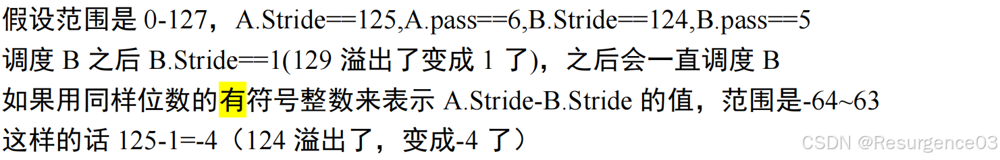编辑

### 多CPU调度

- 单核处理器

- 超线程处理器：利用CPU内部闲置的计算资源 

  - 寄存器、PC独立
  - ALU共用
  - **适合I/O密集型作业**

- 多核/众核处理器 

  - 对称多处理器SMP：所有CPU呈总线拓扑

  - 非一致内存访问系统NUMA：路由器控制CPU-内存间的数据通路

  - Cache一致性问题

    ：每个核内Cache内容可能不一样 	

    - 由于I/O低速，CPU1可能没来得及写回内存，在CPU2中就会命中Cache取出错误值

  - Cache亲和性问题

    ：进程更换CPU后

    Cache重新加载

    导致的性能下降 	

    - 调度时尽量让进程在一个CPU上运行

#### 单队列多处理器调度SQMS

所有CPU**共用一个**进程队列

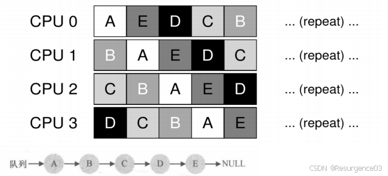编辑

- 缺乏可扩展性

- Cache亲和性弱

  - **负载均衡**

    改善Cache

    亲和度

    - 牺牲少部分进程的亲和度提升整体亲和度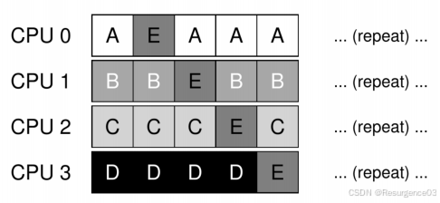编辑

#### 多队列多处理器调度MQMS

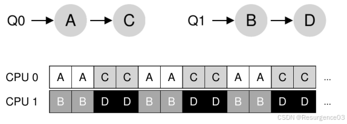编辑

**每个CPU有一个**调度队列，队列间调度规则可能不同

每个CPU调度互相独立（没有共同进程），避免数据共用和同步问题

- 具有可扩展性
- **Cache亲和度好**
- 负载不均问题
  - CPU0已经执行结束所有任务空闲，CPU1仍在执行任务，资源浪费一半
  - 进程迁移
    - 进程在CPU队列间不断切换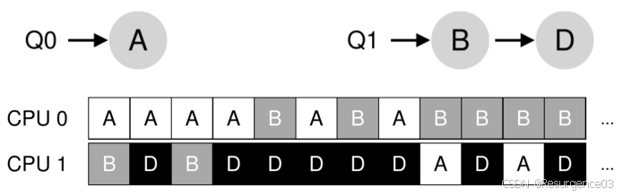编辑
  - 工作窃取
    - 如果目标队列显著地比自身队列进程多，就从目标队列窃取若干个进程
    - 队列检查间隔选择

### 实时CPU调度

- 实时操作系统 

  - 时间约束的及时性：按时完成任务 	
    - 速度和平均性能相对不重要
  - 时间约束的可预测性
  - 强实时操作系统 	
    - 指定时间内必须完成重要的任务
  - 弱实时操作系统 	
    - 重要任务具有高优先级，尽量非必须完成
  - 可调度操作系统 	
    - 实时操作系统能够满足任务时限要求

- 实时任务 

  - 任务所需资源
  - 定时参数
  - 硬时限 	
    - 必须按时完成的任务
    - 必须验证在最坏情况下满足
  - 软时限 	
    - 通常能够满足，如果不能满足就降低要求
    - 尽量完成

- 周期实时任务 

  - 任务有规律重复请求

  - 周期p = 任务请求时间间隔

  - 执行时间e = 最大执行时间 	

    - e < p

  - 使用率U = e / p < 1

  - 对于一族周期实时任务，

    可调度时**必**有所有任务使用率之和 <= 1

    - **不是充分条件**

#### 静态优先级调度

任务执行过程中不会改变任务的优先级

##### 速率单调RM算法

- 优先执行**周期最短**的任务
  - 仅适用于周期实时任务
- 抢占式调度
  - 周期更短的进程可以抢占CPU

#### 动态优先级调度

任务执行过程中会改变任务的优先级

##### 最早截止时间优先EDF算法

- 优先执行**截止时间最近**的任务
  - 进程开始运行时必须公布截止期限
- 抢占式调度
- 在动态范围内**理论最优**

##### 最低松弛度优先LLF算法

优先执行**松弛度最低**的任务

- 松弛度 = DDL - 当前时间 - 还需运行时间 = 如果现在开始做提前完成的时间

### 优先级反置

高优先级进程长时间等待低优先级进程现象

- T2抢占T3，但T3已经占用了T1需要的资源
- T3已经被挂起，不能释放资源
- T2抢占T3导致T1执行延后

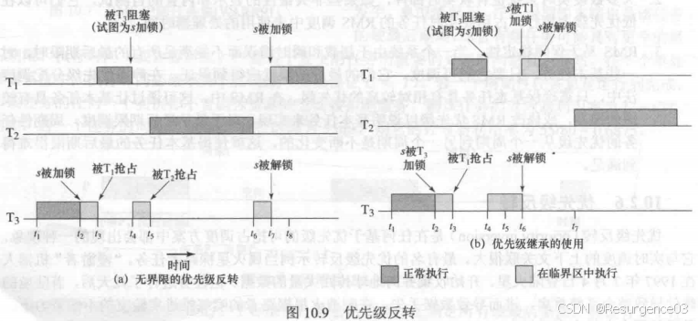编辑

#### 优先级继承

占用资源的低优先级进程继承申请资源的高优先级进程的优先级

- 当高优先级任务因**资源阻塞**时，更新占用资源的低优先级任务优先级
- 低优先级任务释放资源后，优先级还原

#### 优先级置顶

占用资源的进程优先级与可能申请该资源的进程的最高优先级相同

- **无论是否阻塞**，都提升占用资源的进程优先级

### Linux调度器

#### O(n)调度器

时间复杂度与**活跃进程数量**成正比


#### O(1)调度器


#### CFS调度器


#### BFS调度器


## 进程间通信IPC

进程间共享或传递数据

- 独立进程：与其他进程无交互
- 协作进程：两个或多个进程之间有交互 
  - 间接通信：通信需要OS周转 	
    - 消息传递机制
  - 直接通信：通信不需要OS周转 	
    - 共享内存机制

编辑

### 消息传递机制

#### 管道

##### 匿名管道

- 组织成**字节队列**

- 规定了读写端，只有一个读者一个写者

  - 读端关闭写描述符
  - 写端关闭读描述符

- 表示为：

  两个文件描述符 + 一段内存

  - 两端通过**不同**文件描述符表示

    - 读管道
    - 写管道
    - **不存在**对应的文件

  - **阻塞式读写**

    ：缓冲容量 	

    - 缓冲区空，读管道阻塞
    - 缓冲区满，写管道阻塞

- **仅支持父子进程间或兄弟进程间通信**

  - 父子进程间

    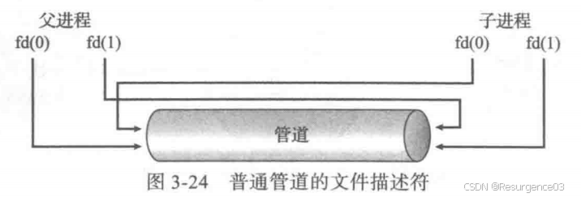编辑

    - 父进程创建管道
    - 父进程fork
    - 子进程继承父进程的管道

  - 兄弟进程间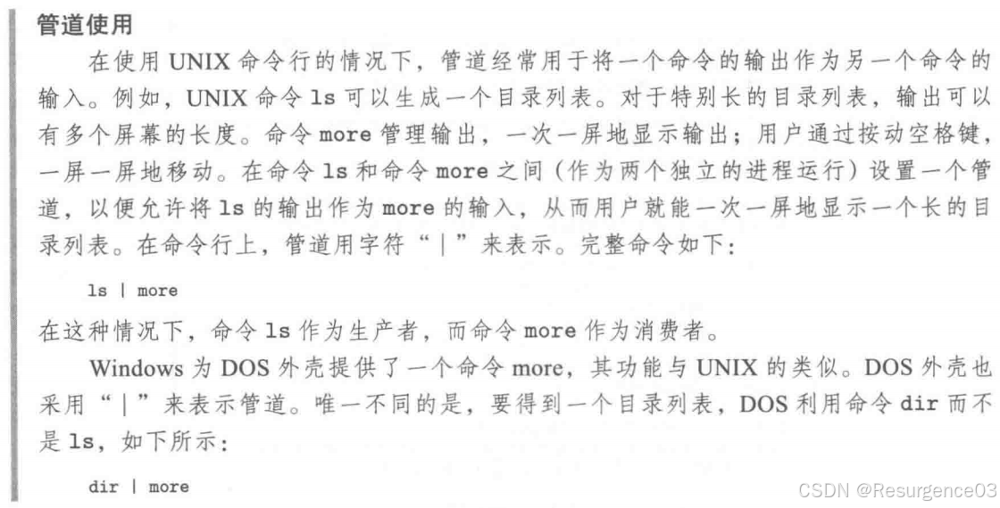编辑

- 一旦参与通信的进程被释放，匿名管道也随之释放

##### 命名管道

UNIX系统中称为FIFO管道

- 表示为：一个文件 
  - 进程使用管道即获得对应文件描述符
- **任何一方都可读或写**
  - 半双工通信
  - 不能双向通信
- **支持任何进程间通信**
  - **可以有多个写者或读者**
  - 读写端必须都已经被打开才能写入或读取
    - 否则SIGPIPE错误
- **阻塞式读写**
- 只有通过**显式删除**释放命名管道

#### 消息队列

把相同类型标识的消息组织为队列，通过OS中转发出给另一进程

- 消息类型标识符 
  - 用于同种消息的优先级**排序**
  - 便于选择性接收
  - 实现消息隔离
- 消息正文标识符 
  - 一个字节序列

```objectivec
struct msgbuf {
    long mtype; //消息类型
    char mtext[1]; //消息正文
}
```


#### 信号

- 标识事件发生
- 引发中断
- 异步通知机制

##### 信号命名

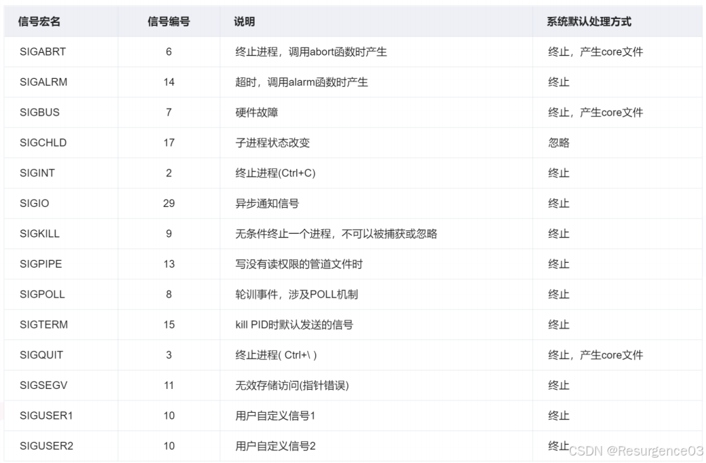编辑

##### 信号发送

- 进程通过OS给进程 
  - SIGKILL
- OS给进程发 
  - SIGSEGV
- 外设通过OS给进程 
  - SIGINT

##### 信号接收

- 忽略
- 捕获 
  - 调用对应信号处理函数
- 默认 
  - 忽略或杀死对应进程

### 共享内存机制

把同一块物理内存映射到多个进程的内存地址空间

- 进程的地址空间明确标识共享内存段 
  - 进程必须知道地址空间的哪些部分是共享的

## 进程同步

多个进程之间需要具有某种执行顺序（什么时候该停，什么时候该走）

每个进程有自己的私有数据，所有进程共享公共数据

核心：控制所有进程对公共数据访问的顺序

同步=等待+唤醒

### 临界区

竞争条件：和调度有关的共享数据语义错误

（不能靠拼CPU调度概率）

临界区：一次只允许一个进程进入的该进程的**一段代码**

- 这段代码具有互斥性：只能为至多一个进程持有
- 等待临界区的时间应尽量短
- 每个等待临界区的进程都能在有限时间内进入
- 读写信号量的代码一定是临界区

### 软件同步

#### 信号量

编辑

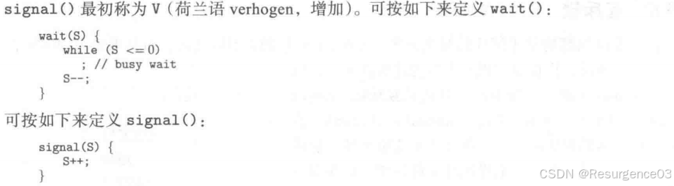编辑

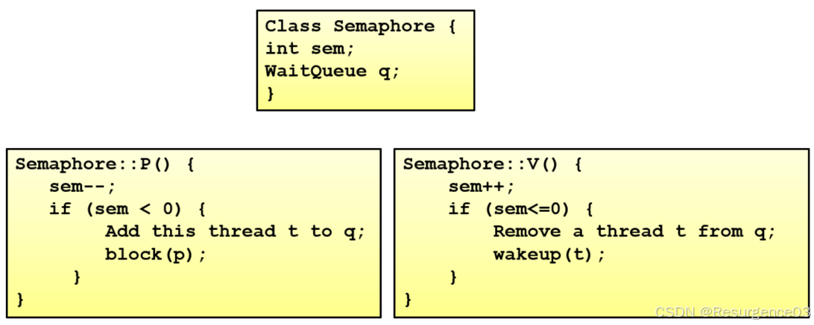编辑

- 信号量只能通过PV操作修改

- OS保证PV操作是原子操作

- 通常

  假定

  信号量是公平的 

  - 不会长时间饥饿
  - 先进先出

- S越小，资源越缺乏，消费者进程越需要等

- 所有进程共享数据，都能获得信号量状态 

  - 互斥访问 	
    - 每个临界区都有一个初值为1的信号量
    - 一旦进程准备进入临界区，就P()
    - 一旦进程离开临界区，就V()
  - 条件同步 	
    - 满足一定条件后才能进入临界区
    - 生产者-消费者问题

##### 计数信号量

取值范围为全体整数

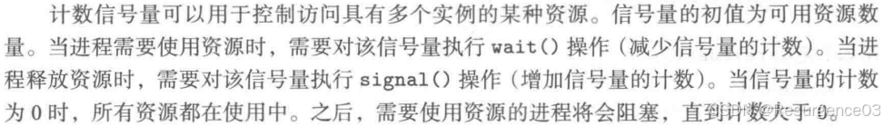编辑

##### 二进制信号量

只能取0或1

- 用于互斥锁mutex

##### AND型信号量集

编辑

#### Peterson算法

适用于两个进程的情形

**自旋锁spin lock**

标记flag+轮转true

- 标记：进程想进入临界区
- 轮转：哪个进程被允许进入临界区

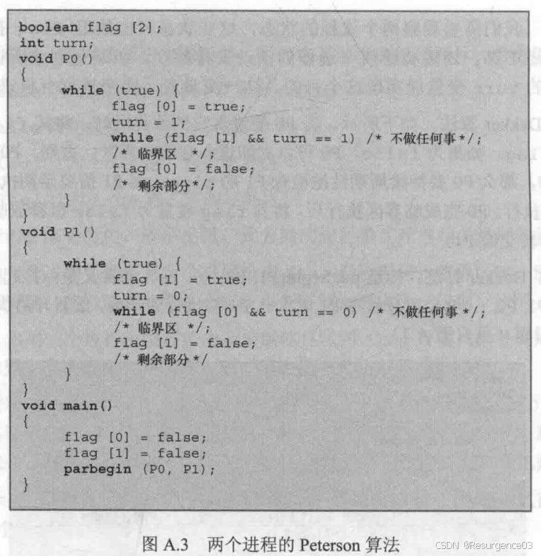编辑

while(flag[i] && turn == i)

- 如果对方想进入并且turn是对方 
  - 表明自身慢一步置turn 	
    - 对方可能已经进去过了
  - 自旋
- 反之 
  - 对方不想进入，放心进入临界区
  - 对方也想进入但是turn是自己 	
    - 自身先到一步，先进入临界区
    - 对方认为“对方可能已经进去过了” 		
      - 基于这个假设，自身放心进入临界区

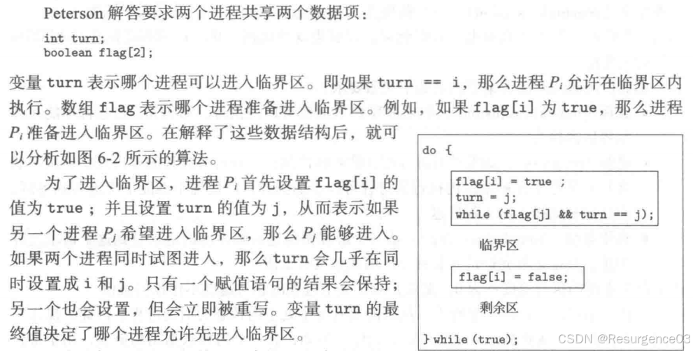编辑

- 自旋锁不一定保证先进先出（可能存在饥饿）

#### 面包店算法

对多个线程情形的推广

标记+轮转+FIFO

编辑

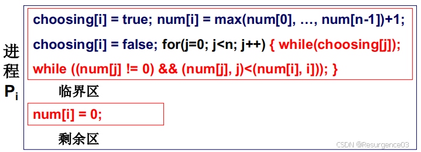编辑

#### Dekker算法

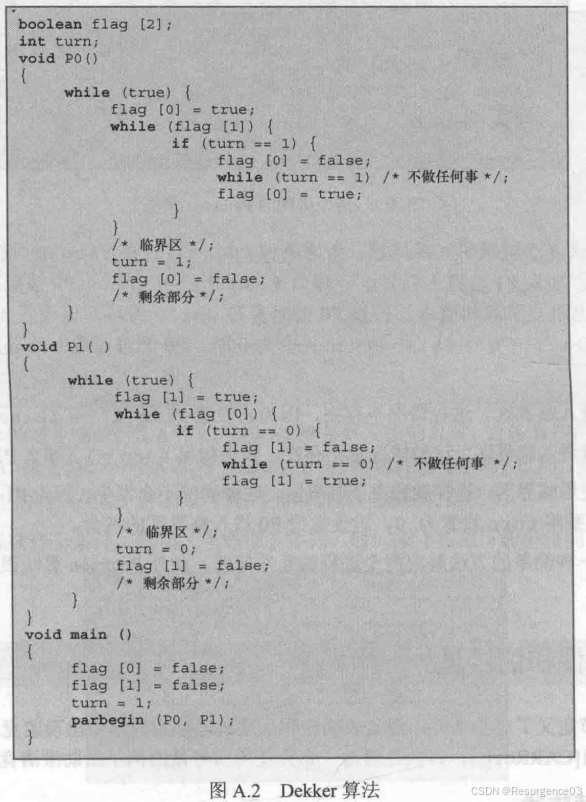编辑

```cpp
do{
    flag[0] = true; //首先P0举手示意我要访问
    while (flag[1]) { //看看P1是否也举手了
    if (turn == 1){ //如果P1也举手了，那么就看看到底轮到谁
        flag[0] = false; //如果确实轮到P1，那么P0先把手放下（让P1先）
        while (turn == 1); //只要还是P1的时间，P0就不举手，一直等
        flag[0] = true; //等到P1用完了（轮到P0了），P0再举手
    }
    flag[1] = false; //只要可以跳出循环，说明P1用完了，应该跳出最外圈的while
}
visit(); //访问临界区
turn = 1; //P0访问完了，把轮次交给P1，让P1可以访问
flag[0] = false; //P0放下手
```


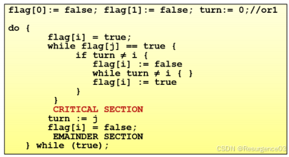编辑

如果load和store操作是原子操作，那么Dekker算法是正确的

#### 管程ADT

使用条件变量实现互斥访问

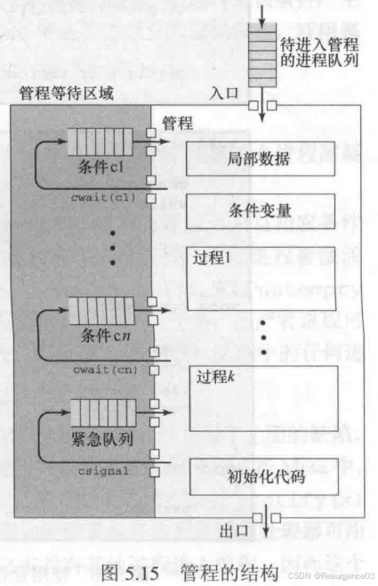编辑

- 互斥：任一时刻**最多有1个线程**执行管程代码
  - 线程可以主动放弃管程，等待事件发生
- 等待：**已经进入管程的线程**因资源被占用而等待
  - 每个条件变量代表一个等待原因，维护一个对应的等待序列
  - 等待进入管程的线程（还没有进入管程）由入口队列维护
- 唤醒：管程中等待的线程可以在其他线程释放资源时被唤醒

与信号量**等价**

- 信号量能做的事情，管程也能
- 管程能做的事情，信号量也能
- 信号量不能做的事情，管程也不能
- 管程不能做的事情，信号量也不能

##### 管程API

T.enter()：T申请获得进入管程的mutex

T.leave()：T离开管程，如果紧急队列不为空，就唤醒紧急队列的进程，否则唤醒入口队列的进程。无论唤醒谁，T都会把mutex给它

T.wait(condition c)：因条件变量c阻塞，释放mutex，挂起T自身，进入等待状态

T.signal(condition c)：T唤醒c对应等待队列里的一个线程

##### 条件变量

对应等待序列+操作函数

按signal()对唤醒线程的行为分类

- **Hoare管程**：mutex将给被signal()线程，随后执行signal()线程直接执行
- **MESA管程**：mutex将给执行signal()线程，随后被signal()线程与其他进程竞争mutex
- **Hansen管程**：mutex将给执行signal()线程，随后被signal()线程直接执行

##### 等待队列

- 入口等待队列
- 条件等待队列
- 紧急等待队列 
  - Hoare管程中因执行signal()而被挂起的线程进入这一队列
  - 优先级高于条件等待队列

#### 软件同步解决同步问题

##### 生产者-消费者问题

- 缓冲区大小有限

- 若干个生产者放数据在缓冲区里

- 缓冲区满时生产者阻塞

  ：

  emptyBuffers信号量控制

  - emptyBuffers == 0时生产者阻塞
  - emptyBuffers != 0时唤醒一个生产者

- 若干个消费者从缓冲区中取出数据

- 缓冲区空时消费者阻塞

  ：

  fullBuffers信号量控制

  - fullBuffers == 0时消费者阻塞
  - fullBuffers != 0时唤醒一个消费者

- 任何时刻只能有一个生产者或消费者访问缓冲区（mutex信号量控制）

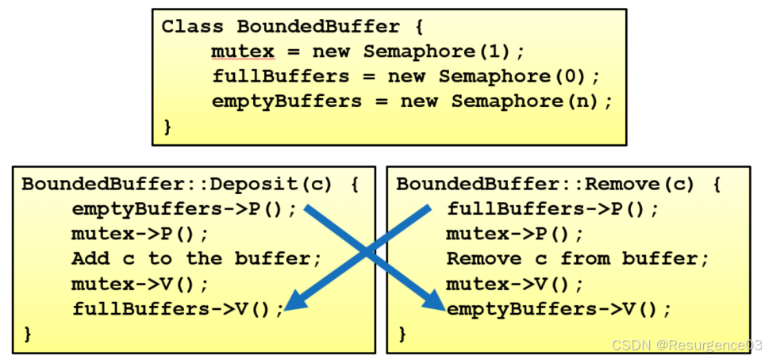编辑

- emptyBuffers和fullBuffers操作交叉成对出现
- 生产者对emptyBuffers应该**先P再V**
  - emptyBuffers->V()起到唤醒消费者的作用
- 生产者的emptyBuffers->P()和mutex->P()顺序**不能调换**
  - 缓冲区已满时，某个获得mutex的生产者在emptyBuffers->P()处阻塞
  - mutex始终不释放，缓冲区内资源也始终不消耗

------

- 容易出错
- 无论如何都不能避免死锁

##### 哲学家就餐问题


##### 读者写者问题

- 读-读：允许
- 读-写：互斥
- 写-写：互斥


### 硬件同步

#### 开关中断

**仅可用于单CPU**

- 不允许中断，进而不允许上下文切换，不允许并发

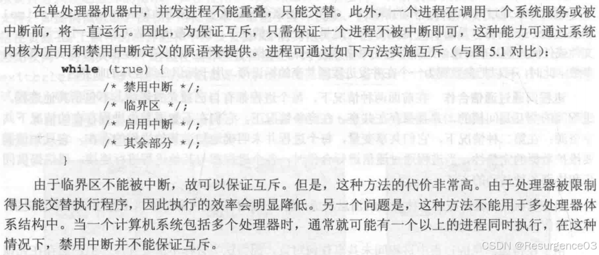编辑

- 性能影响极大

#### 硬件原子指令

编辑

## 进程死锁

多个进程由于互相等待对方持有的资源而导致的每个进程都不能执行的问题

### 形成死锁条件

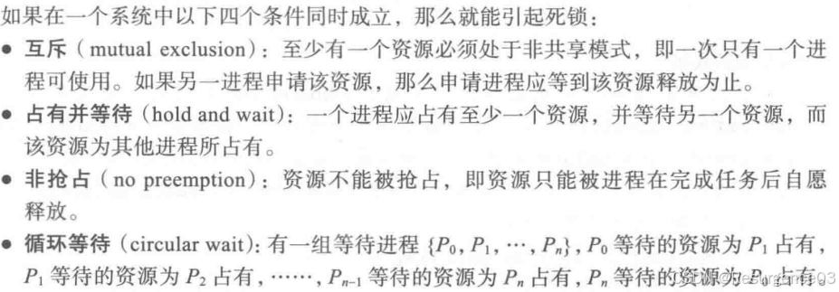编辑

### 解决死锁

#### 死锁预防

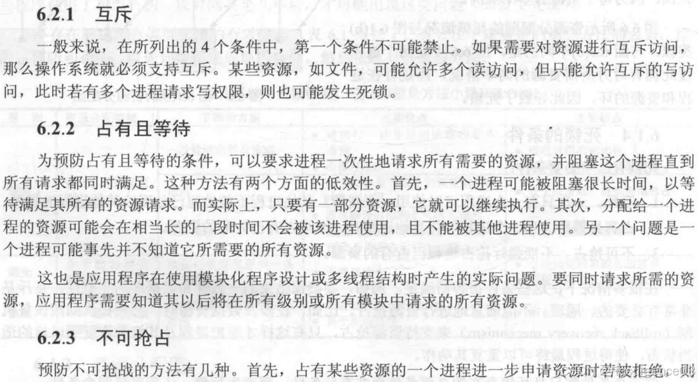编辑

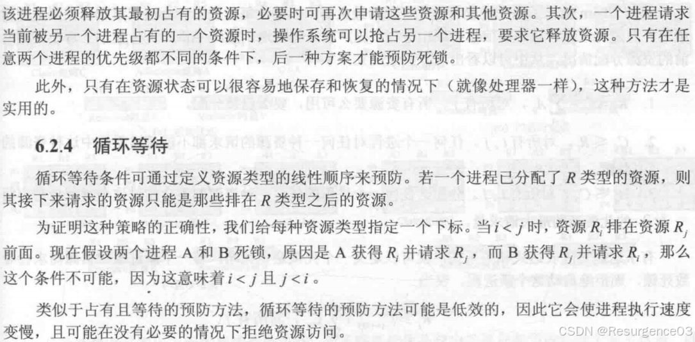编辑

只有死锁预防会定义**资源**的分配顺序

- 后续均为考虑**线程**的执行顺序

#### 死锁避免

在**分配资源前**进行判断，只允许给不会出现死锁的进程分配资源

##### 安全状态

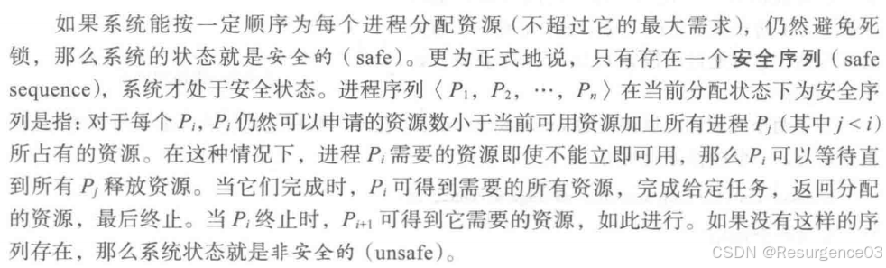编辑

- 处于安全状态，一定没有死锁
- 处于不安全状态，**可能**出现死锁

##### 银行家算法

规划型算法

- 考虑已经分配的资源
- 考虑后续还需要的资源

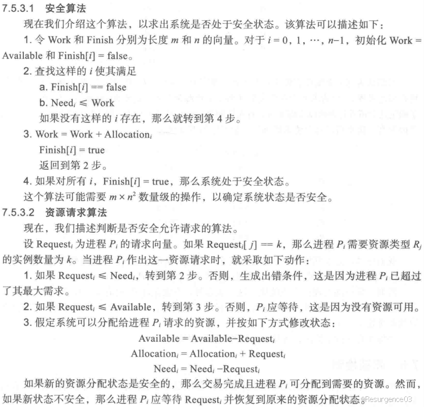编辑

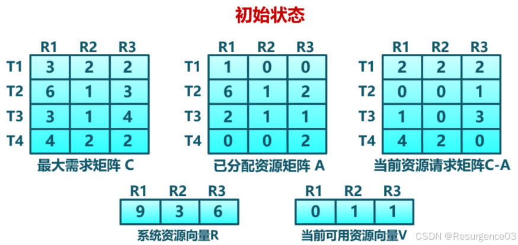编辑

#### 死锁检测

检查系统**是否进入死锁**

- 此时**资源已经分配**，**可能已经死锁**
- 后续算法只考虑**已经分配**的资源，不考虑还需要的资源

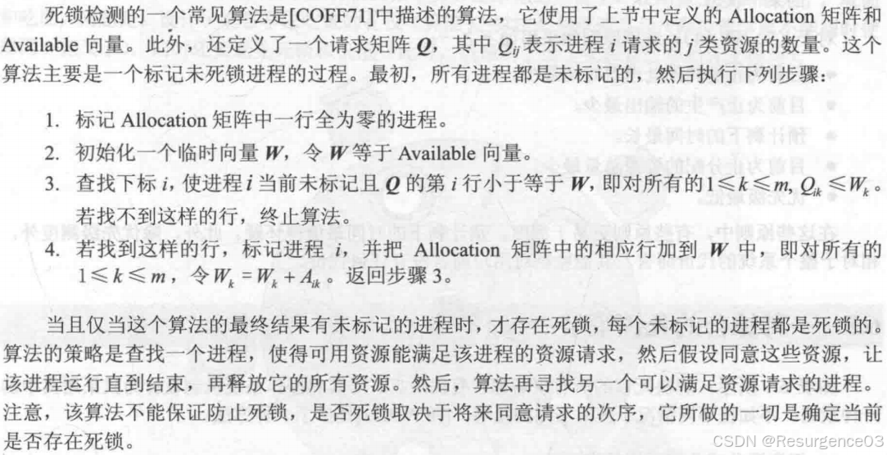编辑

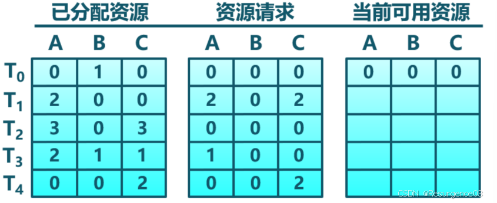编辑

实现难点 

- 死锁判断周期选取
- 找出死锁循环的关键进程

#### 死锁恢复

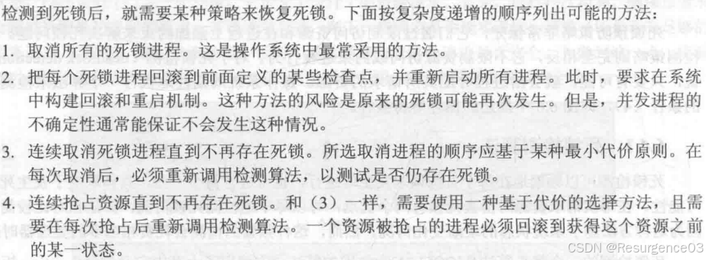编辑

最小代价选取

- 优先级
- 已运行时间和还需运行时间
- 已占用资源
- 完成需要的资源
- 需要终止进程的数量
- 交互进程/批处理进程

连续抢占策略可能出现饥饿

#### 死锁忽略

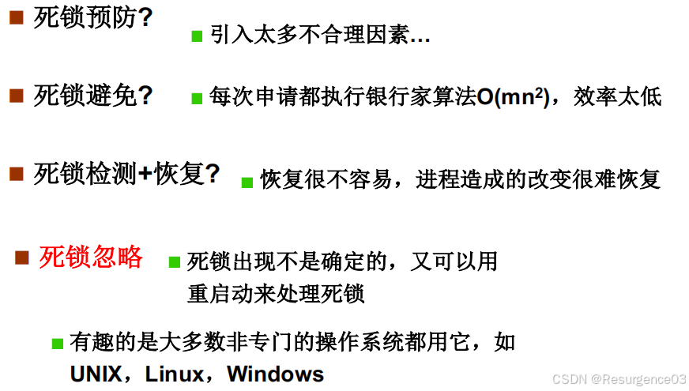编辑

# 线程

在一个进程内的多个并发指令执行序列

- 线程共用进程代码、进程数据、进程资源、地址空间、映射表 
  - 进程是资源分配的单元
  - 同一进程内的共用资源可用于线程间通信，无需借助OS
  - 进程内切换线程，内存映射表不变而PC变 	
    - 一个进程内的所有线程共享一个地址空间和变量
  - C/C++下的线程级并行程序的一个线程崩溃会导致所属进程的所有线程崩溃
- 线程只私有寄存器状态和线程栈
- CPU调度的单位 
  - CPU在一个时刻只能执行一个线程
- 进程的指令执行流单元
- 轻量级管理 
  - 就绪态、阻塞态、执行态
  - 切换线程只需换寄存器状态和线程栈，线程并发比进程并发高效

进程=多个执行序列+一个地址空间=多个线程+一个映射表

## TCB

线程控制块（Thread Control Block）

类似PCB，标识一个线程

每个进程都有一个线程表，管理下属所有线程TCB

线程表是所属进程**私有**的

- 用户级线程的线程表只有该用户级进程可访问
- 内核级线程的线程表只有OS可访问

线程间切换：Stack+yield()

## 线程层级与多线程模型

### 内核不可见的用户线程

- 用户态管理 
  - 用户维护对应TCB
- 用户态运行 
  - 在用户空间下运行

自身指令与配套用户栈，用于函数调用

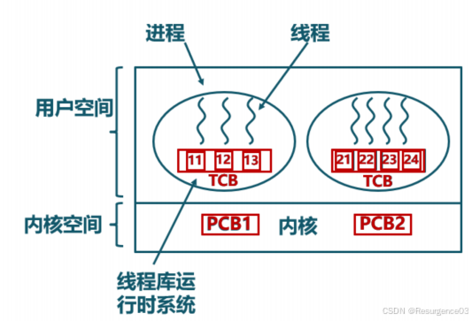编辑

ULT间切换：切换TCB，切换用户栈

```objectivec
void yield() {
    TCB1.esp = esp;
    esp = TCB2.esp;
}
```


```objectivec
void ThreadCreate(A) {
    TCB* tcb = malloc();
    Stack* stack = malloc();
    stack = A;
    tcb.esp = stack;
}
```


- OS不参与，控制简单
  - OS并不知道这个进程里还有线程，因为OS只维护了PCB，进程对OS隐藏了TCB
  - 即使OS不支持线程，自行实现即可
  - 线程创建销毁切换对OS无负担，代价低
- 进程内可自行选择线程调度策略
- 同一进程内只有一个线程进行，如果该线程阻塞，整个进程都被挂起
- 按进程分配给CPU时间片
- 不能多核分时复用
  - 操作系统看不见进程内的线程，不能把进程里的线程拆给不同的CPU

### 内核可见的用户线程

- 内核态管理 
  - OS维护对应TCB
- 用户态运行 
  - 在用户空间下运行

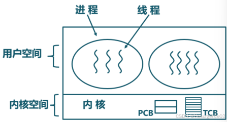编辑

- 线程被挂起不影响进程内其他线程
- 开销减小不明显
- 系统调用语义冲突

### 内核线程

- 内核态管理 
  - OS维护对应TCB
- 内核态运行 
  - 在内核空间下运行

通过中断进入内核

用户栈+内核栈

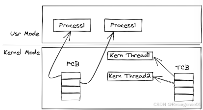编辑

### 混合线程

- 混合管理
- 混合运行

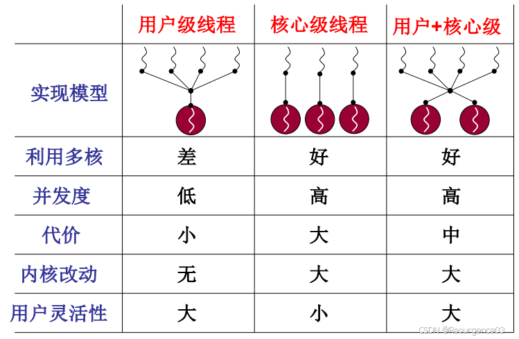编辑

### 轻量级进程

属于**内核可见的用户线程**

# 协程

有多个入口点，可在指定位置挂起和恢复的程序

- 子例程是协程的特例
- 控制流的主动让出和恢复
- 大规模异步操作 
  - 成本低，内存消耗小
  - （无栈）协程自身的调度器减少了上下文切换的代价 	
    - 仅切换寄存器，不换变量栈
  - 减少锁机制
  - 可按照同步思维写异步代码

## 控制传递机制

### 对称协程

每个协程地位平等，可以直接转移到其他任何协程

- 实现简单
- *如果某个协程阻塞或死循环，**整个进程都被挂起***

### 非对称协程

每个协程只能把控制权yield回启动自身的协程

- 高并发
- *实现复杂*
- *需要锁机制*

## 栈式构造

### 有栈协程

- 有独立的上下文栈
- 上下文切换代价是用户态线程切换开销

### 无栈协程

- 数据全部保存在堆上
- 上下文切换代价是函数调用开销

## 是否为第一类对象

### 第一类对象协程

可保存为数据结构，作为参数被传递

### 受限协程

限制为指定的代码结构