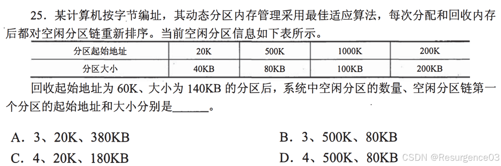
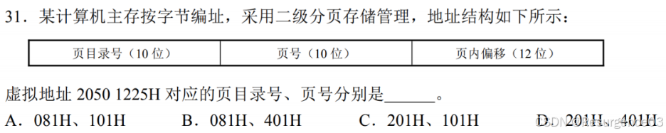
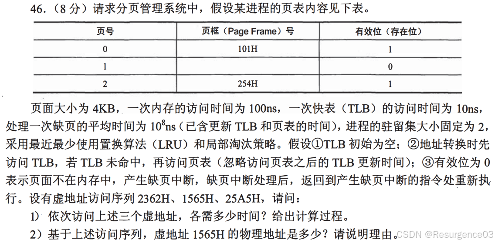

【操作系统笔记】习题

# 操作系统框架

> 【2017-408】执行系统调用的过程包括如下主要操作：
>
> ①返回用户态
>
> ②执行陷入(trap)指令
>  ③传递系统调用参数
>  ④执行相应的服务程序
>
> 正确的执行顺序是（C）
>
> A 2314
>
> B 2431
>
> C 3241
>
> D 3421

> 【2019-408】下列关于系统调用的叙述中，正确的是（C）
>
> I.在执行系统调用服务程序的过程中，CPU处于内核态
>
> II.操作系统通过提供系统调用避免用户程序直接访问外设
>
> III.不同的操作系统为应用程序提供了统一的系统调用接口
>
> IV.系统调用是操作系统内核为应用程序提供服务的接口
>  A.仅I、IV
>  B.仅II、III
>  C.仅I、II、IV
>  D.仅I、III、IV

> 【2023-912】下列组件不属于操作系统内核的是（A）
>  A JavaScript解释器
>  B 文件系统
>  C 中断处理例程
>
> D 进程调度器

> 【2023-912】qemu-system-riscv64可以模拟64位risc-v处理机并让操作系统在其上运行（√）

>  【2015-408】内部异常（内中断）可分为故障（fault）、陷阱（trap）和终止（abort）三类。下列有关内部异常的叙述中，错误的是（D）
>  A 内部异常的产生与当前执行指令相关
>  B 内部异常的检测由CPU内部逻辑实现
>  C 内部异常的响应发生在指令执行过程中
>  D 内部异常处理后返回到发生异常的指令继续执行

# CPU管理

> 【2016-912】程序和进程的区别是（ABC）
>
> A 进程是动态的，程序是静态的
>
> B 进程是暂时的，程序是永久的
>
> C 进程的组成包括程序，数据和进程控制块
>
> D 同一个程序的多次运行对应相同的进程

> 【2018-912】操作系统采用copy on write机制时，fork()函数不会复制进程的页目录表。（×） 

> 【2024-912】父进程先于子进程退出，导致子进程变成僵尸进程。（×） 

> 【2018-408】若x是管程内的条件变量，则当进程执行x.wait()时所做的工作是（D）
>  A. 实现对变量x的互斥访问
>  B. 唤醒一个在x上阻塞的进程
>  C. 根据x的值判断该进程是否进入阻塞状态
>
> D. 阻塞该进程，并将之插入x的阻塞队列中

> 【2015-408】若系统S1采用死锁避免方法，S2采用死锁检测方法。下列叙述中，正确的是（B）
>  I. S1会限制用户申请资源的顺序，而S2不会
>  II. S1需要进程运行所需的资源总量信息，而S2不需要
>  III. S1不会给可能导致死锁的进程分配资源，而S2会
>  A.仅I、II
>  B.仅II、III
>  C.仅I、III
>  D.I、II、III

# 内存管理

>  【2017-408】编辑
>
> 原来空闲是[20,60],[500,580],[1000,1100],[200,400]，释放后为[20,60],[60,200],[500,580],[1000,1100],[200,400]，合并得[500,580],[1000,1100],[20,400]，B

> 【2018-912】Buddy算法中，释放一个空间后可以根据起始长度和大小与相邻空闲空间合并（√）

> 【2023-THU-Mid】内存目前有5个空闲块，按地址从小到大排列，分别为16K，4K，10K，48K，12K。现有三个内存分配请求，要求按顺序分配4K，15K，40K三块内存。试分别描述在最先匹配（First-fit）、最佳匹配（Best-fit）、最差匹配（Worst-fit）三种策略下，每个分配请求是否成功，如成功，使用哪个空闲块进行分配。
>
> 最先匹配：
>
> 1. 12K，4K，10K，48K，12K
> 2. 12K，4K，10K，33K，12K
> 3. 分配失败
>
> 最佳匹配：
>
> 1. 16K，10K，48K，12K
> 2. 1K，10K，48K，12K
> 3. 1K，10K，8K，12K
>
> 最差匹配：
>
> 1. 16K，4K，10K，44K，12K
> 2. 16K，4K，10K，29K，12K
> 3. 分配失败

> 【2019-408】在分段存储管理系统中，用共享段表描述所有被共享的段。若进程P1和P2共享段S，下列叙述中，错误的是（B）
>  A 在物理内存中仅保存一份段S的内容
>  B 段S在P1和P2中应该具有相同的段号
>  C P1和P2共享段S在共享段表中的段表项
>  D P1和P2都不再使用段S时才回收段S所占的内存空间

>  【2014-408】下列选项中，属于多级页表优点的是（D）
>  A 加快地址变换速度
>
> B 减少缺页中断次数
>  C 减少页表项所占字节数
>  D 减少页表所占的连续内存空间

> 【2019-408】
>
> 编辑
>
> (0010)(0000)(0101)(0000)(0001)，页目录号000010000001=081H，页号000100000001=101H，选A

> 【2021-912】最优页面置换算法，可得到最少的缺页率，因此在操作系统中优先采用。（×） 

> 【2019-408】某系统采用LRU页置换算法和局部置换策略，若系统为进程P预分配了4个页框，进程P访问页号的序列为0,1,2,7,0,5,3,5,0,2,7,6，则进程访问上述页的过程中，产生页置换的总次数是（C）。
>  A 3
>  B 4
>  C 5
>  D 6
>
> 0 1 2 7 - 1 2 7 0 - 2 7 0 5 - 7 0 5 3 - 7 0 3 5 - 7 3 5 0 - 3 5 0 2 - 5 0 2 7 - 0 2 7 6，共5次

> 【2017-912】以下会发生belady异常的是（ACDE）
>
> A FIFO算法
>
> B LRU算法
>
> C CLOCK算法
>
> D LFU算法
>
> E 改进CLOCK算法

> 【2016-408】某进程访问页面的序列如下所示。
>  ​编辑
>  若工作集的窗口大小为6，则在t时刻的工作集为（A）
>  A {6,0,3,2}
>  B {2,3,0,4}
>
> C {0,4,3,2,9}
>  D {4,5,6,0,3,2}

> 【2009-408】
>
> 编辑

> 【2011-408】当系统发生抖动（thrashing）时，可以采取的有效措施是（A）
>  I.撤销部分进程
>
> II.增加磁盘交换区的容量
>  III.提高用户进程的优先级
>  A.仅I
>  B.仅II
>  C.仅III
>  D.仅I、II

# 文件管理

> 【2009-408】设文件F1的当前引用计数值为1，先建立F1的符号链接（软链接）文件F2，再建立F1的硬链接文件F3，然后删除F1。此时，F2和F3的引用计数值分别是（A）
>
> A 0、1
>
> B 1、1
>
> C 1、2
>  D 2、1
>
> 与F2无关
>
> F1、F3实际指向inode项现在F3指向，为1

> 【2017-408】若文件f1的硬链接为f2，两个进程分别打开f1和f2，获得对应的文件描述符为fd1和fd2，则下列叙述中，正确的是（B）
>  I.f1和f2的读写指针位置保持相同
>  II.f1和f2共享同一个内存索引结点
>  III.fd1和fd2分别指向各自的用户打开文件表中的一项
>  A.仅III
>  B.仅II、III
>  C.仅I、II
>  D.I、II和III
>
> 文件指针是进程级维护，I错
>
> f1、f2硬链接，有相同的inode，II对
>
> III对

> 【2020-912】file1引用计数为2，建立一个软链接file2，建立一个硬链接file3，file3建立一个硬链接file4，此时file3和file4的计数为（A）
>
> A 4，4
>
> B 3，4
>
> C 4，3
>
> D 2，4
>
> file3和file4指向同一个文件

> 【2010-408】设文件索引结点中有7个地址项，其中4个地址项是直接地址索引，2个地址项是一级间接地址索引，1个地址项是二级间接地址索引，每个地址项大小为4B。若磁盘索引块和磁盘数据块大小均为256B，则可表示的单个文件最大长度是（C）
>  A.33KB
>  B.519KB
>  C.1057KB
>
> D.16513KB
>
> 直接地址索引：4×256B=1KB
>
> 一个一级索引块有256/4=64个地址项，每个一级索引块：64×256B=16KB，共32KB
>
> 一个二级索引块有256/4=64个一级索引块，共1024KB
>
> 共计1057KB

> 【2013-408】若某文件系统索引结点（inode）中有直接地址项和间接地址项，则下列选项中，与单个文件长度无关的因素是（A）
>  A.索引结点的总数
>
> B.间接地址索引的级数
>  C.地址项的个数
>  D.文件块大小

> 【2016-912】一个文件系统采用索引结点方式存储文件，一个索引结点包括两个直接文件指针，一个一级间接文件指针表，一个存储块为8KB，一个指针4B，问理论上这个文件系统能存放的最大文件是多大？
>
> 8KB×2+8KB/4B×8KB=16KB+2048×8KB=16KB+16MB

# 设备管理

# 期中期末题

2022-S-Mid

操作系统是管理硬件资源、控制程序运行、改善人机界面和为应用软件提供支持的一种系统软件。（√）

Linux操作系统是宏（单体）内核操作系统。（√）

编译器生成的执行程序中的地址既可以是操作系统中的虚拟地址也可以是物理地址。（×）

操作系统需要自己来建立和设置好它正常运行所需要的栈空间。（√）

内存虚拟地址的页内偏移位数与物理地址的页内偏移位数是不相等的。（×）

CLOCK算法属于LRU类算法，不会有Belady异常现象。（×）

用户态应用程序的栈空间是由操作系统来分配的。（√）

在RISC-V CPU的用户态(U-Mode)执行的代码无法执行特权级指令，从而避免了操作系统的代码和数据被用户态代码直接访问到。（√）

在RISC-V CPU的用户态(U-Mode)执行的代码可以通过设置相关CSR寄存器来关闭(disable)中断。（×） 

一个计算机使用32位的虚拟地址，采用4B大小的页面。应用程序的代码和数据都位于从虚拟地址0开始的连续4096个页面，栈位于最高虚拟地址的一个页面，不使用堆。为了能够让应用程序不产生缺页异常并正常执行，如果使用一级分页，一个虚地址中，页表索引位占20位，页内偏移位占12位，页表中至少需要多少个有效表项?如果使用两级分页，一个虚地址中，页目录索引位占10位，页表索引位占10位，页内偏移位占12位，页表至少需要多少个有效页表项?请给出计算过程的描述。

在13个时间单位的时间段内，一个程序的虚拟页面访问顺序如下:

edaccdbcecead

操作系统给这个程序分配了5个物理页帧，初始物理页帧为空。

1.如采用工作集页面置换算法，工作集窗口的大小τ=4，请问在哪些时刻会产生缺页异常，缺页异常次数总共是多少？

2.如采用缺页率置换算法，容忍的缺页窗口T=2，请问在哪些时刻会产生缺页异常，缺页异常次数总共是多少？

2022-S-Fin

一个进程正确执行fork系统调用后，将创建(复制)一个子进程并返回子进程的PID。（√）

shell进程通过执行forktexec系统调用组合，可以创建一个子进程来执行与shell1不一样的新程序。（√）

进程是一个具有一定独立功能的程序在某数据集合上的一次执行和资源使用的动态过程。（√）

操作系统采用短作业优先算法可能会出现长作业无法获得CPU资源的饥饿现象。（√）

操作系统实现FCFS(First Come，First Served)调度算法不需要硬件时钟中断的支持。（√）

在实时系统中，如果实时进程之间没有需要互斥访问的共享资源，则不会存在优先级反置现象。（√）

在多核计算机系统中，采用单队列多处理器调度的操作系统在对单就绪队列进行读写操作时，需要采用原子操作或互斥机制确保对就绪队列这个临界共享资源的互斥访问。（√）

多个进程通过页表机制可共享同一块物理内存。对这块共享内存的读写访问不需要经过系统调用。（×） 

管道(pipe)是一种进程间基于字节流的单向通信机制，支持非阻塞的发送和接收数据操作。（×）

信号机制是一种进程间异步通知机制，支持一次传输4KB的字节流数据。（×）

在单核处理器计算机中，操作系统可通过禁止/使能中断来实现同步互斥机制。（√）

相对于进程，线程能减少创建/并发执行的时间和空间开销，但由于缺少地址空间隔离，所以多线程在安全性上不如多进程。（√）

在对共享资源进行分配中，如果系统处于安全状态，则一定没有死锁。（√）

管程中条件变量释放处理方式包括MESA方式、Hoare方式和Hansen方式。（√）

为支持多进程互斥访问文件而设计实现的文件锁，必须保存在持久化存储介质中。（类似为了实现硬链接引用计数而在inode中添加的nlinks字段，这些信息需保存在持久化存储介质中）（×）

2022-A-Mid

利用硬件中断机制，操作系统可以在内核态及时处理用户进程的异常行为。（×）

在覆盖技术中，不存在调用关系的模块可共用同一块内存区域。（√）

2022-A-Fin

进程执行系统调用后从内核返回用户态前，将检查所有进程是否有待处理信号。（√）

在多CPU环境下，正占用CPU在用户态运行中的进程会在每条指令执行结束后检查硬件中断请求。如果有硬件中断请求，则立即打断进程的执行，进入内核执行中断处理例程。（×）

处理硬件中断时，由操作系统软件保存程序计数器（PC）的内容。（×）

任何时候只能有一个进程在一个管程中执行。（√）

进程P时间片用完会导致进程P由运行态转为等待状态。（×）

银行家算法可以判断系统是否处于死锁状态。（×）

设置当前工作目录的目的是加快文件的检索速度。（√）

2023-S-Mid

面向手机的Android是一种微内核架构的操作系统内核。（×）

UNIX操作系统支持以抢占方式来分时复用。（√）

shell命令行程序是通过系统调用来获取用户敲击的字符命令。（×）

操作系统需要建立和设置好其正常运行所需的堆空间和栈空间。（√）

linker(链接器)的主要工作是把多个机器码目标文件合并为单个机器码执行文件。（√）

LFU和CLOCK算法都会有Belady异常现象。（√）

操作系统内核的BSS段是指用来存放未初始化的全局变量的一块内存区域，内核执行初始化时需要把BSS段清零。（√）

操作系统内核在内核态(S-Mode)处理中断、异常和系统调用。（√）

用户态(U-Mode)执行的应用无法执行特权级指令，从而避免了操作系统内核的代码和数据被应用直接访问到。（√）

用户态(U-Mode)执行的应用可以通过设置相关CSR寄存器来使能页机制。（×）

某进程执行exec系统调用时，会出现其执行状态从运行态转到创建态的情况。（×）

在没有页机制且支持多道程序的操作系统中，不同程序的入口地址要不同且有一定距离，以避免程序之间相互覆盖。（√）

运行的程序从用户态切换到内核态时，除了需要保存所有的通用寄存器外，还要保存部分CSR寄存器。（√）

2023-S-Fin

Linux操作系统内核在RISC-V的S-Mode特权模式下运行。（√）

Linux操作系统内核属于宏内核(Monolithic Kernel)架构。（√）

在用户态产生或发出中断/异常/系统调用后，处理器会进入内核态并跳转到操作系统预设的处理例程进行相应的处理。（√）

操作系统为进程建立的页表是保存在物理内存中的。（√）

在RISC-V中切换页表基址的机器指令是特权指令。（√）

实现协作式调度可以在用户态完成，不需要操作系统的介入。（√）

工作集是指一个进程在当前一段时间内正在访问的逻辑页面集合。（√）

Clock页面置换算法通过页表项的标志位来了解对应页的近期读写情况。（√）

Belady异常现象不会在最佳页面置换算法(OPT)中出现。（√）

处于运行态的进程在时钟中断产生后将立刻进入等待状态。（×）

实时系统中的速率单调调度算法(RM，Rate Monotonic)属于静态优先级调度。（√）

实时系统中，高优先级进程长时间等待低优先级进程所占用资源的现象是一种优先级反置现象(PriorityInversion)。（√）

UNIX/Linux操作系统中，目录和管道(pipe)都是文件。（√）

忙等的自旋锁机制可以用于多核架构下的互斥资源保护。（√）

UNIX/Linux操作系统中，如果父进程先于子进程退出，将导致子进程直接退出。（×）

对于磁盘文件，应用程序通过执行open系统调用获得的文件描述符存在于磁盘上。（×）

硬链接与软链接都能指向跨不同文件系统的文件。（×）

共享内存机制是一种把同一个物理内存区域同时映射到多个进程的内存地址空间的进程间通信机制。（√）

信号(signal)机制是一种进程间的异步通知机制，操作系统可通过信号机制来通知或终止进程。（√）

临界区(Critical Section)是需要互斥访问的共享数据。（×）（临界区是一段代码）