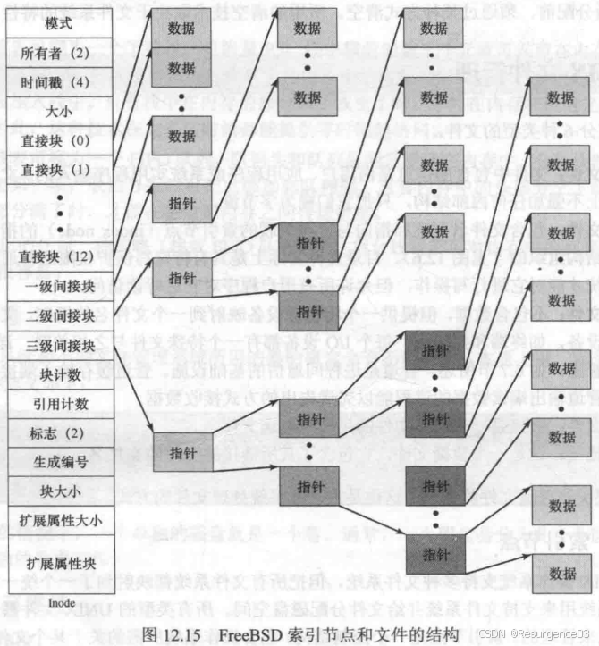
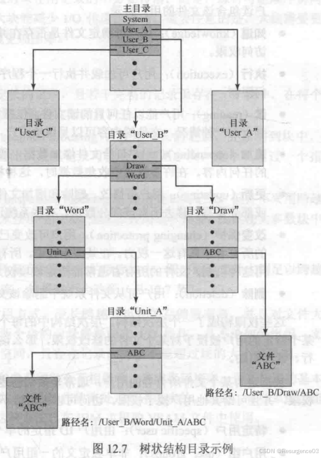
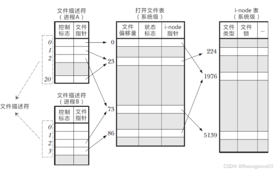
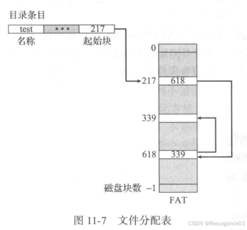
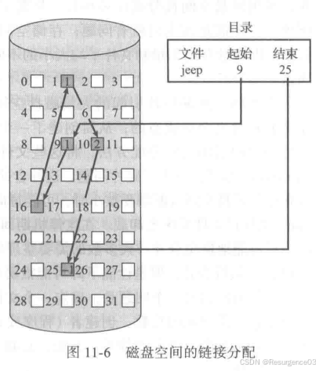
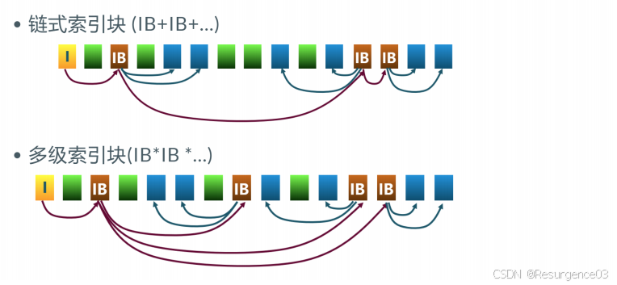
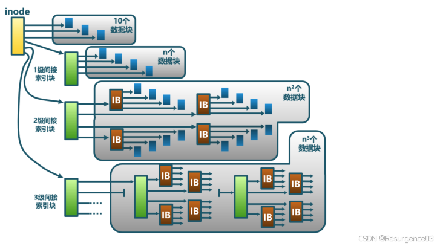

# 【操作系统笔记】文件管理

 

# 虚拟文件系统

文件系统进出接口

- 索引节点对象inode 
  - 一个单独的文件
- 文件对象file 
  - 一个已经打开的文件
- 超级块对象superblock 
  - 整个文件系统
- 目录条目对象dentry 
  - 单个目录条目

## 引导块

- 如果卷包含操作系统，存储引导操作系统的数据
- 如果卷不含操作系统，该块为空

## 文件卷控制块superblock

每个文件系统只有一个卷控制块

- 该系统的信息
- 该卷的块大小、总数量和空闲数量
- FCB总数量和空闲数量

## bitmap块

inode和dnode使用与未使用标记

## 文件控制块inode

index node

即FCB（File Control Block）

一般128B

每个文件对应一个inode

- 大小、存储的数据块位置
- 访问权限
- 拥有者
- 时间信息
- **硬**链接数（引用计数）
  - 引用计数**初始值为1**
  - 引用计数为0时才真正删除文件

## 数据块dnode

放置数据内容用

文件系统的基本操作对象

一般4KB

**目录和文件的内容都用dnode存储**

文件系统格式化时确定dnode的固定大小

每个dnode有编号，用于inode记录

## 目录项

将文件名转换为路径

# 目录实现

<关键字，存储位置>的键值对

- 以文件名作为关键字的线性表 
  - 往往顺序存储文件
- 以文件名作为hash值的散列表
- 树状结构 
  - 
  - 存储位置为路径

# 文件访问

## 访问模式

- 顺序访问
- 随机访问
- 索引访问 
  - 按数据特征

## inode表

存储各inode指向的具体文件

## 打开文件表

- 文件指针 

  - 最后一次读写位置
  - **进程级**维护

- 文件打开计数：系统级的打开文件表每个条目有一个打开计数，

  表明有多少进程打开了这个文件，打开计数为0时可删除这个条目

  - 当前文件被进程打开的次数
  - 打开计数为0时，从打开文件表中移除
  - **系统级**维护

- 文件的磁盘位置 

  - 数据访问信息

- 访问权限

## 文件描述符

即文件句柄

**进程级**的指向打开文件表条目的指针

- 当进程请求OS打开或新建一个文件时，OS返回一个文件描述符

- 形式上是一个非负整数

- 实际上为一个索引值，

  指向**该进程的打开文件表**中的该条目

  - 后续对该文件的操作均由此进行 

## 硬链接

多个文件项指向同一个**inode表**中文件项（即指向同一个文件）

## 软链接

即符号链接

新建一个文件**存储其他文件名或路径**来指向文件

# 文件分配

操作系统给文件分配dnode

## 连续分配

每个文件在磁盘上占有连续的块，文件头指定起始块和块数量

- 随机访问、顺序访问效率高
  - 寻道数量最小，寻道时间最小
- 碎片
- 文件内容增加代价高

## 链式分配

### 显式链接

文件分配表FAT

- 每个文件系统只有一个FAT
- 存放**在内存中**

### 隐式链接

数据块间以链表形式组织，每个块有指向下个块的指针

- 文件创建、修改成本低
- 无碎片
- 随机访问效率低（只能顺序访问）
- 可靠性差
  - 一个块坏了，后续块都会丢失

## 索引分配

文件头中有索引dnode指针，dnode中有指向各数据块的指针

- 文件创建、修改成本低
- 无碎片
- 可以直接访问
  - 索引dnode直接找对应块即可
- 文件较小时存储索引开销相对较大
  - 1个dnode需要一个dnode存储索引（4KB），16个dnode也需要一个dnode存储索引

## 多级索引分配

# 空闲空间管理

- 位图 
  - 0代表数据块空闲，1代表数据块占用
- 链表 
  - 同文件分配
- 索引 
  - 同文件分配